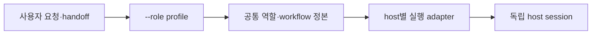
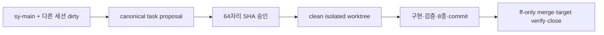
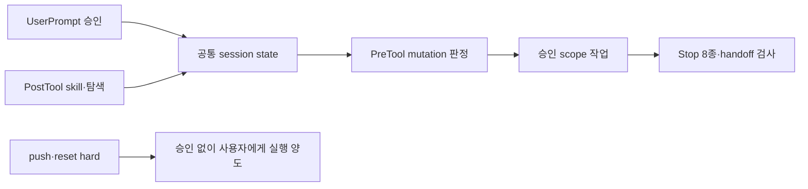

# 이력서·포트폴리오 기록

## 기록 원칙

- 이 문서는 실제 사용자 요구, repository diff, 실행한 테스트와 audit 결과만 사용한다.
- 실행하지 않은 consumer sync나 측정하지 않은 생산성·성능 수치를 성과로 쓰지 않는다.
- 결과는 중앙 원본 구현 완료와 소비자 배포 전 상태를 구분한다.
- 문제 상황 → 고민과 선택 → 적용 → 사용 기술과 목적 → 결과 순으로 기록한다.

## 사례 1 — 특정 도구에 종속되지 않는 멀티 호스트 역할 정책 재설계

- 작업 유형: 아키텍처 리팩터링 | AI 하네스 | 개발자 도구
- 관련 도메인/서비스: Claude Code, Codex, OpenCode, 중앙 system prompt, role-aware inject
- 문제 출처: 사용자 요구 | 운영 확장성 | 문서 구조 검토

### 문제 상황

- 사용자가 제시한 요구·문제·변경 이유:
  - 현재는 대략 Codex가 Logic, Claude가 UI를 맡고 있지만 이 배정은 영구 계약이 아니다.
  - 향후 역할이 역전되거나 Claude가 오케스트레이션·기획·Logic·UI 전체를 맡을 수 있다.
  - 각 host 문서가 다른 host, 특히 Codex 문서를 참조하면 해당 host adapter만 inject된 환경에서 필요한 내용을 읽을 수 없다.
  - 내용 중복을 무조건 없애는 것보다 각 host가 독립 실행되면서도 같은 common 정본을 따르는 것이 중요했다.
- 저장소에서 확인한 구조:
  - Claude multi-agent spec과 workflow에는 production UI 전담과 Logic Session 인계가 고정돼 있었다.
  - Codex 쪽 역할·workflow·template에도 비슷한 의미가 별도 사본으로 존재했다.
  - 일부 Codex 문서는 짧은 요약이었고 Claude 쪽 상세 role schema와 책임이 공통화 과정에서 사라질 가능성이 있었다.
- 필요한 구조가 없을 때 발생할 문제:
  - host를 바꿀 때마다 역할 문서와 금지 경계를 다시 작성해야 한다.
  - 같은 Planner/Watcher 역할이 host별로 다른 의미를 갖게 된다.
  - inject bundle에 존재하지 않는 다른 host 경로를 참조해 시작 단계부터 문서 탐색이 실패한다.
  - current host 이름이 실제 사용자 승인 없이 파일·Git 소유권으로 오해된다.

### 고민과 선택

- 사용자 제안:
  - 역할 판단은 사용자 prompt와 handoff를 기반으로 하고, inject 실행 시 `--role logic/ui/orchest/review/generate`로 지정한다.
  - common 문서는 Codex와 독립된 중앙 위치에 두고 모든 host가 직접 참조한다.
  - 역할 침범 hook은 지금 만들지 말고 system prompt로 먼저 운영한다.
- 에이전트 제안:
  - 정책을 공통 의미, runtime registry, host adapter의 세 계층으로 나눈다.
  - role별 references/skills/native agents를 profile로 선택해 inject context를 줄인다.
  - host 이름은 tool/event/path만 결정하고 role이나 파일 소유권을 결정하지 않게 한다.
- 검토한 대안:
  1. host별로 완전한 문서를 각각 복제한다.
  2. Claude가 Codex의 `AGENTS.md`를 계속 공통 진입점으로 사용한다.
  3. 기존 “Claude=UI, Codex=Logic”을 유지하고 예외만 추가한다.
  4. role별 경로를 즉시 Python hook으로 강제한다.
- 최종 선택:
  - `.agent-policy/common/**`를 유일한 의미 정본으로 만들고 각 host adapter가 직접 참조한다.
  - `--host`, `--model`, `--role`을 독립 인자로 둔다.
  - role은 `logic`, `ui`, `orchest`, `review`, `generate` 다섯 profile로 시작한다.
  - role 경계는 system prompt와 선택 문서로 운영하고 실제 침범 사례가 생긴 뒤 hook을 평가한다.
- 선택 이유와 제외한 방식의 이유:
  - 완전 복제는 독립성을 주지만 동일 의미의 drift를 다시 만든다.
  - Codex 경유는 Claude-only inject에서 의존 경로가 사라진다.
  - host 고정 역할은 사용자의 향후 운영 방향과 직접 충돌한다.
  - 즉시 semantic hook을 만들면 실제 데이터 없이 파일명 heuristic에 의존해 오탐이 커질 수 있다.

### 적용

- 변경 경로:
  - `policy/common/AGENT_POLICY.template.md`
  - `policy/common/contracts/runtime-policy.json`
  - `policy/common/skills/policy/task-role-routing/**`
  - `lib/agent_policy/role_profiles.py`
  - `lib/agent_policy/injection.py`
  - `lib/agent_policy/cli.py`
  - `adapters/{claude,codex,opencode}/**`
- 구현·수정·리팩터링 내용:
  - common 진입 문서를 root `AGENTS.md`와 `.agent-policy/common/AGENT_POLICY.md`에 동일 렌더하도록 했다.
  - Logic, UI, orchestration, pipeline roles, workflows, handoff/ownership을 common references로 분리했다.
  - `runtime-policy.json`에 CLI role과 canonical role을 기록했다.
  - role profile이 선택 role에 필요한 common skill/reference와 native agent만 bundle에 포함하도록 했다.
  - Claude `CLAUDE.md`와 각 native agent는 Codex 문서가 아니라 common 경로를 직접 가리키게 했다.
  - host 고정 역할 문구가 다시 나타나면 source audit가 실패하도록 했다.
- 핵심 동작:
  - inject 시작 시 `--role` 필수.
  - 같은 role 범위에서는 역할 확인을 반복하지 않음.
  - 다른 역할이 필요하면 현재 권한을 넓히지 않고 새 role session 요청.
  - handoff의 `next_role`은 제안이며 자동 권한이 아님.

### 사용 기술과 구체적 목적

| 기술·구조·패턴 | 해결하려는 구체적 문제 | 적용 위치와 방식 |
| --- | --- | --- |
| Single Source of Truth | host별 역할 문서 drift | `policy/common/**`를 역할·workflow 의미 정본으로 사용 |
| Adapter Pattern | host별 tool/event 형식과 공통 의미 혼합 | `adapters/**`에는 실행 형식만 유지 |
| Runtime Registry | Python·문서·host별 role 상수 중복 | JSON에 role/host/artifact/state를 정의 |
| Role Profile | 모든 skill을 inject해 context가 커지는 문제 | role별 references, skill prefix, native agent 선택 |
| Deterministic Rendering | host별 template 내용 불일치 | common source bytes를 세 native path에 동일 렌더 |
| Contract Audit | 고정 host 역할이나 누락 경로의 재등장 | `audit_source_contract()`에서 금지 문구·참조 확인 |

### 결과

- 적용 전:
  - host 이름이 작업 역할과 결합돼 있었다.
  - Claude-only bundle이 Codex 문서에 의존할 수 있었다.
  - 역할·workflow·schema가 여러 host 경로에 중복됐다.
- 적용 후:
  - 모든 host가 독립된 common 정본을 직접 읽는다.
  - 역할은 start의 명시적 profile로 선택된다.
  - 한 host가 UI, Logic, orchestration 또는 통합 구현을 맡을 수 있다.
  - host adapter는 native 형식만 담당한다.
- 검증 결과:
  - host-neutral 금지 문구 검사 PASS.
  - role별 inject bundle 차이 테스트 PASS.
  - 다른 host adapter 없이 common reference가 resolve되는 테스트 PASS.
  - 전체 89개 테스트 PASS.
- 사용자 후속 피드백:
  - “Claude가 공통 진입을 따르되 Codex에 의존하지 않아야 한다”는 정정 방향을 반영했다.
  - role은 실행문에서 지정하고 별도 role hook은 만들지 않는 결정을 반영했다.
- 추가 요청 및 남은 제한:
  - 실제 role 침범 사례가 축적되면 semantic hook 필요성을 다시 평가한다.
  - 소비자 sync 전에는 새 common 구조가 실제 consumer session에 활성화되지 않는다.

### 이력서·포트폴리오 문구

- 이력서 bullet: Claude Code·Codex·OpenCode에 분산된 역할·workflow 정책을 host-neutral 단일 정본과 role-aware inject 구조로 재설계해, host/model 교체와 역할 역전을 지원하는 확장 가능한 AI 작업 체계를 구축했다.
- 포트폴리오 서술: 현재 도구별 업무 분담이 미래의 영구 권한으로 굳어지는 문제를 발견했다. host별 문서를 복제하는 대신 공통 의미 정본, runtime registry, 얇은 adapter의 세 계층으로 의존 방향을 재구성했다. `--role` 기반으로 필요한 문서와 skill만 inject하고 모든 adapter가 common을 직접 참조하게 해 독립성과 일관성을 함께 확보했으며, 자동 audit로 host 고정 문구와 끊어진 참조의 재등장을 차단했다.

---

## 사례 2 — dirty 작업을 보존하는 immutable proposal 기반 Git worktree 전략

- 작업 유형: 개발 workflow 설계 | Git 안전성 개선 | 버그 수정
- 관련 도메인/서비스: Git branch, worktree, index, session assignment, merge lifecycle
- 문제 출처: 런타임 실패 | 사용자 운영 사례 | 데이터 손실 위험

### 문제 상황

- 사용자가 제시한 상황:
  - `sy-main`에 다른 Logic/UI 세션의 미커밋 파일이 남은 상태에서 독립적인 spinner/UI 작업 branch를 만들려고 했다.
  - branch guard는 dirty 상태의 direct branch 생성을 올바르게 막았지만, 기존 작업 전체를 먼저 commit/stash해야 새 작업을 시작할 수 있었다.
  - 현재 세션이 다른 세션 소유 파일을 commit·stash하는 것은 소유권 계약 위반이었다.
- 런타임에서 관찰한 오류:
  - inject `branch_workflow.py`가 stale consumer guard를 선택해 `FULL_SHA_PATTERN` AttributeError로 종료됐다.
  - proposal의 축약 SHA를 승인한 뒤 전체 SHA를 쓰면 승인 요청 식별자 불일치가 났다.
  - `git checkout -- path`가 branch 전환으로 오판됐다.
  - checkout+merge 복합 명령은 전환 전 branch 상태로 판정됐다.
  - 외부 worktree에서는 `${CLAUDE_PROJECT_DIR}/.claude/hooks/...` 상대 구조가 없어 승인된 commit도 실행하지 못했다.
- 필요한 구조가 없을 때 발생할 문제:
  - 서로 독립된 작업이 같은 dirty/index에 묶인다.
  - agent가 타 세션 파일을 정리하라는 압력을 받는다.
  - 승인된 branch 계약과 실제 생성 인자가 달라질 수 있다.
  - merge 실패 시 자동 rollback/rebase가 원래 상태를 더 복잡하게 만들 수 있다.

### 고민과 선택

- 사용자 제안:
  - 하나의 세션에서 여러 작업을 할 수는 있어야 하지만 미완료 작업이 뒤섞이지 않아야 한다.
  - 별도 folder/worktree를 사용하되 매 작업마다 무조건 새 session을 강제하는지는 명확히 해야 한다.
- 에이전트 제안:
  - static branch task contract와 dynamic session assignment를 분리한다.
  - 기준 folder가 dirty여도 독립 task는 승인 parent commit에서 외부 worktree를 만든다.
  - proposal 전체를 canonical JSON으로 기록하고 SHA-256 승인 뒤 파일 자체를 소비한다.
  - 완료도 source/target HEAD, verify argv, cleanup을 별도 finish proposal로 고정한다.
- 검토한 대안:
  1. sy-main dirty를 자동 stash한다.
  2. 모든 변경을 임시 commit한다.
  3. 현재 folder에서 `git switch -c`를 허용한다.
  4. 모든 작업마다 무조건 새 folder와 session을 만든다.
  5. raw merge 후 문제가 나면 자동 reset/rebase한다.
- 최종 선택:
  - 독립 작업이거나 기준 folder가 dirty/사용 중일 때만 isolated worktree를 사용한다.
  - parent의 미커밋 변경에 의존하는 child는 parent owner의 commit/handoff 전까지 만들지 않는다.
  - CLOSED+clean이면 같은 session에서 다음 task를 시작할 수 있다.
  - 미완료 task는 handoff 후 PRESERVED로 두며 병행하려면 별도 worktree/session을 사용한다.
  - merge는 direct parent target에 `--ff-only`, 사후 검증 뒤 close한다.
- 선택 이유와 제외한 방식의 이유:
  - stash/임시 commit은 소유권과 복원 시점을 숨긴다.
  - direct switch는 dirty/index를 새 branch로 끌고 간다.
  - 모든 작업의 무조건 격리는 불필요한 folder/session 비용을 만든다.
  - 자동 rollback은 실패 원인과 source state를 훼손할 수 있다.

### 적용

- 변경 경로:
  - `policy/common/skills/policy/git-branch-strategy/SKILL.md`
  - `policy/common/skills/policy/git-branch-strategy/scripts/branch_workflow.py`
  - `policy/guards/branch_guard.py`
  - `lib/agent_policy/cli.py`
  - `lib/agent_policy/injection.py`
  - `tests/test_branch_guard.py`
  - `tests/test_injection.py`
  - `docs/branch-worktree-session-strategy.md`
- 구현·수정·리팩터링 내용:
  - proposal에 purpose, roles, scopes, reason, integrator, worktree와 parent full SHA를 모두 포함했다.
  - Git common directory에 `<sha256>.json`으로 canonical proposal을 저장했다.
  - create는 file path와 전체 64자리 SHA만 받고 canonical bytes와 parent HEAD를 재검증한다.
  - V3 metadata와 ACTIVE/PRESERVED/READY_TO_MERGE/MERGED_VERIFIED/CLOSED lifecycle을 추가했다.
  - finish proposal에 source/target full HEAD, ff-only, validation argv와 cleanup 여부를 포함했다.
  - inject runtime은 stale consumer host hook으로 fallback하지 않는다.
  - launcher는 외부 worktree가 동일 Git repository인지 확인하고 실패 시 기본 folder로 fallback하지 않는다.
- 핵심 동작:
  - dirty sy-main은 그대로 유지된다.
  - isolated worktree는 clean index로 승인 parent commit에서 시작한다.
  - owner만 finish/verify/close한다.
  - verify는 등록된 lint/test/build argv만 shell 없이 실행한다.
  - 실패하면 source/worktree를 보존하고 자동 rollback하지 않는다.

### 사용 기술과 구체적 목적

| 기술·구조·패턴 | 해결하려는 구체적 문제 | 적용 위치와 방식 |
| --- | --- | --- |
| Git worktree | 다른 세션 dirty/index와 독립 작업 분리 | 저장소 밖 별도 working directory와 index 생성 |
| Canonical JSON | 승인 필드 순서·공백·재입력 차이 | 모든 계약 필드를 정렬·직렬화 |
| SHA-256 binding | 승인 후 purpose/scope/worktree 변조 | canonical bytes의 64자리 digest를 사용자 승인과 실행에 연결 |
| Full commit SHA | 축약 SHA 모호성 | parent/source/target를 40자리 SHA로 고정 |
| State Machine | 미완료·검증·종료 상태 혼동 | ACTIVE/PRESERVED/READY/MERGED/CLOSED 전이 제한 |
| Fast-forward-only merge | 예상하지 않은 merge topology | direct parent target에만 ff-only 허용 |
| Exec without shell | verify command에 wrapper/Git 숨김 | registry의 정확한 argv만 subprocess로 실행 |

### 결과

- 적용 전:
  - dirty 기준 folder가 독립 branch 생성까지 차단했다.
  - stale guard와 축약 SHA 때문에 승인된 workflow가 실행되지 않았다.
  - task와 session 산출물 책임이 branch metadata에 혼합됐다.
- 적용 후:
  - 다른 세션 파일을 건드리지 않고 독립 worktree에서 작업할 수 있다.
  - 승인된 proposal file과 전체 SHA가 실행 계약의 단일 입력이 됐다.
  - owner/contributor와 branch lifecycle이 분리됐다.
  - 같은 session에서 다음 작업은 기존 task가 CLOSED인 경우 가능하다.
- 검증 결과:
  - dirty repository에서 approved isolated worktree 생성 테스트 PASS.
  - proposal 모든 mutable field digest 테스트 PASS.
  - stale consumer guard 무시 테스트 PASS.
  - preserve/resume와 finish/verify/close lifecycle 테스트 PASS.
  - short parent SHA 거부 테스트 PASS.
- 사용자 후속 피드백:
  - “항상 새 폴더·세션이 필요한가”라는 질문에 미완료 병행/dirty일 때만 격리하는 정책으로 정리했다.
- 추가 요청 및 남은 제한:
  - CLOSED/PRESERVED worktree 목록을 보여주는 읽기 전용 status CLI는 후속 후보이다.
  - 현재 중앙 branch는 V3 이전 생성이라 metadata를 소급 적용하지 않았다.

### 이력서·포트폴리오 문구

- 이력서 bullet: 다른 세션의 dirty/index를 보존하면서 독립 작업을 수행할 수 있도록 canonical SHA-256 승인 계약과 Git worktree 기반 branch lifecycle을 설계하고, ff-only merge·target 검증·안전한 close까지 자동화했다.
- 포트폴리오 서술: dirty 기준 branch 때문에 독립 작업이 타 세션의 commit/stash에 종속되는 문제를 분석했다. branch task와 session assignment를 분리하고, parent full SHA에서 isolated worktree를 생성하도록 설계했다. purpose·scope·role·reason·worktree 전체를 canonical JSON과 SHA-256으로 고정해 승인 변조와 축약 SHA 오류를 제거했으며, preserve/resume과 finish/verify/close 상태 머신으로 실패 시 source를 보존하는 안전한 통합 절차를 구축했다.

---

## 사례 3 — 세 호스트 공통 guard와 산출물 소유권·위험 Git 차단 통합

- 작업 유형: 보안·품질 개선 | 정책 엔진 통합 | 회귀 테스트 구축
- 관련 도메인/서비스: PreTool/UserPrompt/PostTool/Stop hook, Git parser, session artifact governance
- 문제 출처: 런타임 실패 | 보안 검토 | 사용자 요구

### 문제 상황

- 사용자가 제시한 요구:
  - Codex legacy hook과 common guard를 비교해 common이 기능적으로 더 상위가 된 뒤 legacy를 제거해야 한다.
  - `git -C . reset --hard`와 push는 크리티컬하므로 승인 구조가 아니라 사용자 양도 구조여야 한다.
  - 다른 host·session 산출물은 읽되 쓸 수 없어야 한다.
  - 이름을 알 수 없는 문서는 `unknown/`에 남겨야 한다.
- 런타임에서 관찰한 문제:
  - legacy와 common hook이 중복 실행되며 서로 다른 state로 deny할 수 있었다.
  - global Git option을 처리하지 못하면 위험 subcommand가 `None` 판정으로 허용됐다.
  - Bash heredoc 산출물은 session binding이 남지 않았다.
  - `2>&1` 같은 stderr redirect는 파일 쓰기로 오탐됐다.
  - Stop은 현재 dirty만 보면 이미 commit된 source 변경을 놓쳤다.
  - `functions.exec` 같은 host별 shell alias가 guard 대상에서 빠질 수 있었다.
- 필요한 구조가 없을 때 발생할 문제:
  - 사용자가 승인하지 않은 source mutation이나 다른 세션 로그 변조가 가능하다.
  - 승인 문구로 push/hard reset이 풀려 원격 상태 또는 작업 파일을 되돌리기 어렵게 바꿀 수 있다.
  - hook마다 다른 승인 marker를 요구해 정상 작업이 교착된다.

### 고민과 선택

- 사용자 제안:
  - 공통 guard가 legacy 기능을 포함하고 중복 hook은 제거한다.
  - 위험 Git은 사용자에게 양도한다.
  - cross-host/session은 read-only로 둔다.
- 에이전트 제안:
  - UserPrompt, PreTool, PostTool, Stop의 공통 state machine을 한 guard에 구현한다.
  - implementation approval과 exact one-shot command approval, proposal SHA approval을 서로 분리한다.
  - Git parser는 global option과 nested/alias 문자열을 이중 검사하고 해석 실패를 차단한다.
  - artifact path뿐 아니라 Git stage/commit에도 session ownership을 적용한다.
- 검토한 대안:
  1. legacy hook을 남기고 common guard 우선순위만 높인다.
  2. 모든 Git 명령을 동일한 사용자 승인으로 해제한다.
  3. 다른 host 로그 접근을 전부 거부한다.
  4. 모든 shell redirect를 차단한다.
- 최종 선택:
  - legacy 기능을 common에 흡수하고 파일·등록을 제거한다.
  - push/reset hard/clean/update-ref는 어떤 승인으로도 풀지 않는다.
  - 다른 로그는 Read만 허용한다.
  - 실제 저장소 write와 진단 redirect를 구분한다.
  - 산출물은 structured Write/Edit/apply_patch로 최초 귀속을 만든다.
- 선택 이유와 제외한 방식의 이유:
  - hook 우선순위는 Codex 실행 모델에서 deny 중복을 없애지 못한다.
  - 범용 승인은 데이터 손실·원격 영향 명령까지 과도하게 확장된다.
  - 전면 접근 거부는 handoff 협업을 막는다.
  - 전면 redirect 차단은 일반적인 진단 명령을 불필요하게 막는다.

### 적용

- 변경 경로:
  - `policy/guards/managed_policy_guard.py`
  - `policy/guards/branch_guard.py`
  - `adapters/codex/hooks.base.json`
  - `adapters/codex/files/.codex/config.toml`
  - `adapters/claude/CLAUDE.template.md`
  - `adapters/opencode/files/.opencode/plugins/agent-policy.js`
  - `lib/agent_policy/core.py`
  - `lib/agent_policy/log_mirror.py`
  - `tests/test_guard.py`, `tests/test_rendering.py`, `tests/test_sync.py`, `tests/test_log_mirror.py`
- 구현·수정·리팩터링 내용:
  - 공통 guard에 `record_user_prompt`, `record_post_tool`, `implementation_gate_denial`을 구현했다.
  - 세 host의 UserPrompt/PreTool/PostTool/Stop event가 같은 runtime을 호출하게 했다.
  - Codex legacy Python hook 6개와 관련 등록·자체 테스트를 삭제했다.
  - tool name을 Bash/Shell/exec/exec_command/`functions.exec`로 정규화했다.
  - Git global option을 소비한 뒤 실제 subcommand를 분류하고 nested/alias 위험 문자열을 추가 검사했다.
  - cross-host/session artifact mutation과 stage/commit을 차단했다.
  - known artifact root와 unknown subdirectory 규칙을 구현했다.
  - Stop에서 parent HEAD 이후 committed diff와 dirty diff를 함께 확인했다.
- 핵심 동작:
  - source mutation은 구현 승인 + skill evidence + 역할별 인접 탐색이 모두 필요하다.
  - UI role은 `src/shared/ui` 또는 component reference 탐색도 필요하다.
  - proposal/finish는 output 후 승인된 전체 SHA가 실행 인자와 같아야 한다.
  - push/hard reset은 operation approval보다 먼저 사용자 전용 denial을 반환한다.
  - read-only stderr redirect는 허용하고 실제 repo redirect는 branch scope 검사를 받는다.

### 사용 기술과 구체적 목적

| 기술·구조·패턴 | 해결하려는 구체적 문제 | 적용 위치와 방식 |
| --- | --- | --- |
| Event-normalized State Machine | host별 승인·evidence 상태 불일치 | UserPrompt/PostTool/PreTool/Stop을 session state로 연결 |
| Fail-closed Parser | `git -C`·alias·wrapper에서 위험 명령 누락 | 실제 subcommand를 찾지 못하면 허용하지 않음 |
| Never-agent Registry | command approval가 위험 명령을 해제 | push/reset hard/clean/update-ref를 approval 전 차단 |
| Structured Path Ownership | shell 산출물의 session 귀속 상실 | Write/Edit/apply_patch target으로 host+session binding |
| Read/Write Capability Split | handoff 협업과 출처 변조 사이 충돌 | cross-session Read 허용, mutation·stage·commit 거부 |
| Committed+Dirty Diff | Stop이 commit된 source 변경을 놓침 | 승인 parent부터 HEAD와 worktree/index diff 합산 |
| Source Contract Audit | legacy hook 재등장과 기능 유실 | 함수 marker, event registration, file absence 검사 |

### 결과

- 적용 전:
  - Codex에 중복 Python hook 체계가 있었다.
  - 위험 Git global option 우회가 허용될 수 있었다.
  - 산출물 쓰기 소유권과 redirect 판정이 일관되지 않았다.
- 적용 후:
  - 세 host가 하나의 approval/evidence/artifact/Stop 계약을 사용한다.
  - Codex legacy 파일과 등록이 제거됐다.
  - push와 hard reset은 approval marker로 해제되지 않는다.
  - 다른 host/session handoff를 읽을 수 있지만 내용을 바꿀 수 없다.
  - unknown 문서가 출처를 유지한 채 별도 폴더에 보존된다.
- 검증 결과:
  - 세 host common readiness gate 테스트 PASS.
  - 세 host `functions.exec` reset/push 사용자 전용 테스트 PASS.
  - command approval 후에도 never-agent denial 유지 테스트 PASS.
  - cross-host/session read/write/stage 테스트 PASS.
  - harmless redirect와 actual write redirect 테스트 PASS.
  - committed source diff Stop 테스트 PASS.
  - 전체 89 tests와 중앙 audit PASS.
- 사용자 후속 피드백:
  - “승인 요청이 아니라 양도”라는 문구와 실행 경계를 never-agent denial에 반영했다.
  - 다른 host 로그의 read-only와 unknown 경로 요구를 반영했다.
- 추가 요청 및 남은 제한:
  - consumer sync와 실제 host smoke는 별도 승인 후 남아 있다.
  - role semantic 침범은 현재 공통 guard 범위가 아니다.

### 이력서·포트폴리오 문구

- 이력서 bullet: Codex 전용 승인·탐색·Stop hook을 세 호스트 공통 guard로 통합하고, Git global option·alias·nested shell을 fail-closed로 분석해 push와 hard reset을 승인 불가 사용자 전용 명령으로 차단하는 정책 엔진을 구축했다.
- 포트폴리오 서술: 중복 hook이 서로 다른 승인 상태로 정상 작업을 막고, 반대로 `git -C` global option이 위험 명령을 숨길 수 있는 문제를 발견했다. legacy 기능을 UserPrompt/PreTool/PostTool/Stop 공통 state machine으로 흡수하고 중복 파일·등록을 제거했다. structured path binding과 read/write capability 분리로 다른 세션 handoff는 읽되 수정할 수 없게 했으며, committed+dirty diff 기반 Stop 검증과 89개 회귀 테스트로 안전 경계를 확인했다.

## 사례 4 — cwd 추정형 Git guard를 실제 worktree 문맥 기반 정책 엔진으로 전환

- 작업 유형: 중앙 에이전트 정책 아키텍처 개선 및 Git 안전성 회귀 수정
- 관련 도메인/서비스: 다중 AI host 정책 하네스, Git worktree, session assignment, sync/inject runtime
- 문제 출처: 소비자 외부 worktree에서의 sync hook 실패와 `git -C` 오탐·미탐 재현

### 문제 상황

중앙 정책 V3는 dirty `sy-main`을 건드리지 않고 독립 task를 외부 worktree에서 수행하도록 설계됐지만, 실제 sync hook은 매 호출의 cwd에서 `.agent-policy/runtime`을 찾았다. 정책 폴더가 ignore된 worktree에는 runtime 사본이 없어 PreToolUse가 exit 2로 종료됐고, 안전한 격리 공간이 오히려 모든 작업을 막았다.

branch guard도 Git global option을 제거한 뒤 event cwd만 검사했다. 그 결과 primary에서 승인 task worktree로 실행한 `git -C <task> add`는 기준 branch 수정으로 오탐했고, task worktree에서 `git -C <primary> add`는 task scope 안으로 미탐해 실제 primary index를 stage할 수 있었다. 문서에는 CLOSED 후 같은 세션의 다음 작업이 가능하다고 되어 있었지만 일부 skill과 CLI 안내는 격리 worktree마다 무조건 새 세션을 요구해 운영 모델도 일관되지 않았다.

### 고민과 선택

모든 worktree에 runtime과 host 설정을 복제하거나 `git -C`를 전면 금지하면 구현은 단순하지만, 중앙 원본 단일성 또는 사용자가 원하는 동일 세션 순차 작업을 깨뜨린다. `${CLAUDE_PROJECT_DIR}`로 cwd 변수만 교체하는 방법도 세션 자체가 worktree에서 시작하면 같은 파일 부재가 반복된다.

정책 원본, session identity, ACTIVE task와 mutation target을 서로 다른 축으로 분리했다. sync 정책은 configured primary의 절대 runtime을 사용하고, 같은 session 여부는 worktree 경로가 아니라 Git common directory로 판정한다. Git 변경은 event cwd가 아니라 각 invocation의 실제 top-level과 Git directory를 분석해 허용 여부를 결정하도록 선택했다.

완전한 shell interpreter를 만드는 대신 tool workdir, `git -C`, 일치하는 `--git-dir/--work-tree`처럼 안전하게 증명 가능한 표현만 지원했다. `cd`, `env -C`, Git 환경 변수 override와 모호한 Git directory 조합은 명령 단순화를 요구하는 fail-closed 경계로 남겼다.

### 적용

- `ProjectConfig`가 실행 worktree와 별도로 sync policy anchor를 보존하도록 확장했다.
- Codex와 Claude sync hook을 primary `managed_policy_guard.py` 절대 경로로 렌더하고 shell command substitution을 제거했다.
- `GitInvocation` parser로 연속 `-C`, `--git-dir`, `--work-tree`, subcommand를 함께 해석했다.
- actual/expected `--absolute-git-dir`를 비교해 primary index와 task working tree를 섞는 우회를 차단했다.
- 각 Git mutation에서 target current branch, Git common repository, integrator, V3 state, metadata worktree, changed/staged paths와 scope를 다시 읽었다.
- session binding과 approval/readiness state key를 Git common directory + host + session id로 통합하고 binding record에 worktree를 저장했다.
- 구조화된 절대 Write/Edit/apply_patch 경로가 같은 저장소의 외부 worktree라면 그 target branch 기준으로 검증하고, unrelated repository와 `.git/**`는 차단했다.
- branch switch와 후속 Git mutation의 복합 명령, 승인 없는 scratch branch 전환, Git 환경 변수 및 cwd 은닉 표현을 차단했다.
- 공통 skill, README, policy template, 전략 문서와 create 출력에서 새 세션 조건을 ACTIVE/CLOSED/PRESERVED 상태 기준으로 통일했다.

구현 중 rendered guard의 동적 module loading과 `dataclass`가 충돌해 setup 전체가 실패했다. standalone 실행 계약을 유지하기 위해 immutable `NamedTuple`로 바꿨다. helper 삽입 과정에서 기존 상대 경로 함수 body가 밀린 회귀는 artifact binding tests가 즉시 포착했고 복원 뒤 관련 test를 먼저 재실행했다. 추가 위협 검토에서는 top-level만 맞고 Git directory가 다른 조합을 찾아 absolute Git directory invariant와 테스트를 한 번 더 보강했다.

### 사용 기술과 구체적 목적

- Python `shlex`: hook command와 Git shell argv를 quoting 손실 없이 분리하고 절대 경로를 안전하게 렌더링
- Git plumbing (`rev-parse --show-toplevel`, `--git-common-dir`, `--absolute-git-dir`, `symbolic-ref`): worktree path, 공유 repository identity, 실제 index/HEAD 문맥을 구분
- Git linked worktree: dirty primary의 working tree와 index를 보존하면서 task별 clean 실행 공간 제공
- SHA-256 session state key: 동일 repository·host·session의 state를 여러 worktree에서 안정적으로 공유
- immutable `NamedTuple`: 동적 exec로 로드되는 standalone guard에서 호출별 target context를 type-safe하게 전달
- Python `unittest` + 실제 임시 Git repositories: mock만으로 놓치기 쉬운 index staging, linked git-dir와 cross-worktree rebind를 subprocess로 검증
- fail-closed parser policy: shell 문맥을 증명할 수 없을 때 위험한 추측 대신 단순 명령을 요구

### 결과

runtime 사본이 없는 외부 worktree에서도 primary sync hook이 정상 실행된다. primary cwd에서 승인 task worktree를 대상으로 한 stage는 허용되고, 같은 command를 반대 방향으로 실행해 `sy-main` primary index를 바꾸려 하면 차단된다. tool workdir와 명시적 Git directory pair도 같은 기준으로 판정되며, Git directory/worktree 불일치와 환경 변수 우회는 거부된다.

같은 session id는 isolated task worktree에서 artifact binding과 readiness state를 유지하고, 첫 V3 task가 필수 8종·merge ancestry·CLOSED 조건을 충족한 뒤 다음 isolated worktree의 새 task로 rebind할 수 있다. PRESERVED 병행은 계속 별도 세션으로 격리된다. 결과적으로 사용자의 “한 세션에서 여러 독립 작업을 순차 수행” 요구와 “dirty primary/index 보호”를 동시에 자동 검증하는 정책이 됐다.

### 이력서·포트폴리오 문구

- 이력서 bullet: cwd 기반 Git guard를 호출별 worktree·Git directory·session assignment 기반 정책 엔진으로 재설계해 `git -C`의 정상 isolated-worktree 작업은 허용하고 primary `sy-main` index 우회는 차단했으며, sync 절대 runtime anchor와 Git common-directory session state로 동일 세션의 CLOSED 후 순차 작업을 지원했다.
- 포트폴리오 서술: Git worktree 환경에서 event cwd와 실제 mutation 대상이 다르다는 점을 재현해, primary→task 오탐과 task→primary 미탐이 동시에 존재하는 문제를 해결했다. `rev-parse` plumbing으로 top-level, common repository와 absolute Git directory를 분리하고, structured file target과 Git invocation을 같은 ACTIVE task 계약에 연결했다. 실제 임시 repository 기반 양방향 staging, Git directory mismatch, sync runtime 부재와 CLOSED cross-worktree rebind 테스트로 사용성과 안전성을 함께 입증했다.

## 사례 5 — 중앙 멀티 호스트 정책의 실행 중심 사용 가이드 구축

- 작업 유형: 운영 문서화·개발자 경험 개선
- 관련 도메인/서비스: 중앙 AI 정책, Codex, Claude Code, OpenCode, Git worktree
- 문제 출처: 사용자 질문, 기존 README·전략 문서와 실제 CLI 조사

### 문제 상황

중앙 정책은 host-role 분리, sync/inject, immutable branch proposal, worktree와 session assignment를 상세히 구현했지만 사용자가 실제 작업을 시작하려면 여러 정본 문서를 함께 해석해야 했다. 특히 inject 세션에도 sync가 필요한지, 기존 worktree로 직접 이동해야 하는지, 격리 worktree가 항상 새 세션을 뜻하는지 같은 운영 질문이 반복됐다.

README는 중앙 구조를 요약했고 branch 전략은 설계 근거와 상태 기계를 설명했지만, 처음부터 끝까지 따라가는 실행 절차와 과거 오류별 조치표는 없었다. 잘못된 요약은 inject에 불필요한 sync를 요구하거나 외부 worktree에 host 설정까지 자동 배치된다고 오해하게 할 위험이 있었다.

### 고민과 선택

README 하나를 대폭 확장하면 진입 문서가 지나치게 길어지고, 기존 전략 문서를 그대로 복제하면 정책 변경 때 drift가 생긴다. 따라서 README는 짧은 링크를 제공하고, 별도 usage-guide는 실행 선택과 명령 예시를 담당하며, 설계 의미는 기존 공통 skill과 전략 문서를 정본으로 유지했다.

가이드에는 이상적인 미래 동작만 쓰지 않고 현재 sync 경계도 기록했다. primary absolute runtime hook은 이미 로드된 sync 정책이 외부 worktree를 대상으로 동작하도록 하지만, 외부 worktree에 host 설정 파일을 자동 복제하지는 않는다. 외부 폴더 자체에서 새 세션이 필요하면 inject를 선택하도록 명확히 구분했다.

### 적용

- 중앙 저장소 구조, 등록 소비자와 핵심 용어를 표로 정리했다.
- sync/inject의 선택 기준, drift 처리와 중앙 변경 후 재적용 절차를 비교했다.
- logic, ui, orchest, review, generate를 host와 독립적인 role로 설명했다.
- clean sy-main과 dirty sy-main의 proposal/create 흐름을 실제 인자로 작성했다.
- 동일 세션 ACTIVE task, CLOSED 순차 전환과 PRESERVED 병행 규칙을 시나리오로 제시했다.
- 구조화된 Write, 64자리 SHA-256, git restore, 명령 분리와 사용자 전용 Git 명령을 장애 대응표에 연결했다.
- owner 8종, contributor handoff, cross-host read-only와 unknown 문서 위치를 정리했다.
- finish-proposal, finish, verify, close와 중앙 audit/diff/sync/check/log 수집 절차를 포함했다.
- README 최상단에 사용 가이드와 상세 전략 문서 링크를 추가했다.

### 사용 기술과 구체적 목적

- Markdown 표와 체크리스트: mode·상태·책임에 따른 선택을 빠르게 비교
- 실제 argparse help 대조: 문서 예시와 현재 CLI 계약의 불일치 방지
- 상대 링크: 중앙 저장소 위치가 이동해도 README와 docs 간 탐색 유지
- 시나리오 기반 문서화: dirty primary, inject 갱신, PRESERVED 병행처럼 추상 규칙을 실행 순서로 변환
- 장애 대응 매트릭스: 증상, 원인과 조치를 한 행에 연결해 반복 진단 비용 절감

### 결과

사용자는 이제 단일 문서에서 세션 mode 선택, role·responsibility 지정, branch/worktree 생성, 산출물 작성, 완료 workflow와 정책 갱신까지 확인할 수 있다. inject 정책 변경은 sync 없이 새 launcher 실행으로 반영된다는 점과 기존 worktree를 --worktree로 재사용할 수 있다는 점도 명시적으로 구분된다.

문서 추가는 guard 허용 범위나 런타임 성능을 변경하지 않는다. CLI help, Markdown fence, 상대 링크와 whitespace를 점검했고 고정 host-role 표현을 추가하지 않았다.

### 이력서·포트폴리오 문구

- 이력서 bullet: 멀티 호스트 AI 정책의 sync/inject, 역할, worktree와 immutable Git 생명주기를 실제 CLI 기반 단일 운영 가이드로 체계화해 정책 재적용과 장애 복구 절차의 오해 가능성을 줄였다.
- 포트폴리오 서술: 중앙 정책의 설계 문서와 실행 경험 사이의 간극을 분석하고, mode 선택표·상태별 시나리오·문제 해결 매트릭스·시작/종료 체크리스트를 구축했다. 특히 inject의 무배포 재시작과 sync의 primary runtime 경계를 분리해 실제 구현보다 과장되거나 축소된 운영 안내가 생기지 않도록 했다.
