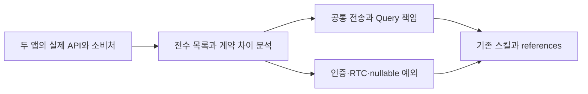
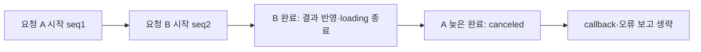

# API 연결 패턴 표준화·비동기 경합 수정·세션 기록 조사

이 문서는 2026-09-17 실제 코드 조사, 사용자 선택, 변경과 실행 결과를 기록한다. 기존 도메인 전체를 새로 구현했다거나 모든 API의 정상 동작을 확인했다는 뜻이 아니다. 사용자 후속 피드백은 결과 제출 전이므로 아래 사례 모두 아직 없다.

## 사례 1 — 두 프런트엔드의 API 연결을 조사해 공통 구현 스킬로 정리

- 작업 유형: 아키텍처 분석·리팩터링 지침·AI 하네스
- 관련 도메인/서비스: user-ui 시민참여·회의 예약·회의 진입·인증, admin-ui CP·일반 관리·영상·이벤트·DAO, 중앙 API 작성 스킬
- 문제 출처: 사용자의 전수조사·패턴 공통화 요구, 기존 코드·스킬 검토 결과

### 문제 상황

사용자는 두 프로젝트의 API 연결 패턴을 먼저 숙지하고, 일관성·기존 문제·개선 방향과 근거를 구체적인 문서로 남기도록 요청했다. 두 앱은 신규 코드에서 ApiClient·DTO/parser·TanStack Query를 공통으로 사용했지만 admin-ui의 직접 Axios 레거시, fetch 기반 회의 lifecycle, 일부 UI 미연결 신규 계층이 함께 존재했다.

기존 스킬은 특정 factory/메서드 명명과 위치를 강제하고, admin use-api 안내는 모든 화면 API를 useApi로 감싸도록 읽힐 수 있었다. 실제 Query 구조와 충돌하며 onError·reporter·조건부 반환 타입 설명도 오래된 상태였다. 전역 안내에는 현재 설치 스택과 다른 React 18·Jotai 가정이 남아 있었다. 이런 상태에서 파일 하나만 예시로 복사하면 검증·취소·캐시 책임을 잘못 배치할 위험이 있었다.

### 고민과 선택

사용자는 상세 조사와 근거를 요구했고, 레거시 스택 안내 제거를 명시했다. 에이전트는 새 범용 API registry를 만드는 대신 기존 공통 스킬을 확장하는 방식을 선택했다.

검토한 대안은 모든 API의 폴더·이름·반환 형식을 통일하는 방식과 책임·계약만 표준화하는 방식이었다. auth/RTC의 수명, 두 앱의 인증, nullable 응답·mutation body가 실제로 다르므로 전면 통일은 영향 범위가 크다. 최종 선택은 앱별 유효한 차이를 유지하면서 전송→검증→캐시의 책임, 신뢰 경계, 취소와 오류의 의미를 공통 지침으로 만드는 것이었다.

파일 존재와 실제 UI 연결도 분리했다. 도달 가능한 모듈을 서버 검증 완료로 표현하지 않고, 미연결 파일도 삭제 대상으로 단정하지 않았다.

### 적용

- 모든 API 고유 경로 60개(user 14, admin 기준본 44 + video worktree 2)를 조사하고, event worktree의 변경 버전 2개를 별도 기록해 62행의 목록을 만들었다. 조사 중 추가된 usage를 반영했다.
- `docs/api-pattern-audit-2026-09-17.md`에 도메인별 패턴과 API-01~13 문제·영향·개선 완료 기준을 기록했다. 예를 들어 CP 상세 setQueryData 앞의 취소 누락은 경합 위험, DAO POST config의 두 번째 인자 전달은 미연결 잠재 결함으로 구분했다.
- `policy/common/skills/recipe/api-authoring/SKILL.md`와 data-fetch/data-dto, admin use-api reference를 수정했다. transport-contracts와 query-mutation 참조를 추가해 unknown/parser·signal·인증·nullable·multipart·Query cache·명령형 요청을 구분했다.
- 전역 `/Users/okand/.codex/AGENTS.md`의 이전 스택 고정을 제거하고 현재 package/lockfile/source를 확인하도록 바꿨다. 기존 승인 및 코딩 지침은 보존했다.

### 사용 기술과 구체적 목적

| 기술·구조·패턴                       | 해결하려는 문제                                                | 적용 위치·방식                                                                    |
| ------------------------------------ | -------------------------------------------------------------- | --------------------------------------------------------------------------------- |
| TypeScript AST import graph          | 파일이 존재해도 화면에서 쓰이지 않는 상황 구분                 | index.html entry부터 값 import/export·literal dynamic import 추적; type-only 제외 |
| SHA-256·HEAD·worktree 기록           | 다른 세션이 계속 변경하는 소스의 조사 기준 고정                | 전수 inventory JSON에 snapshot과 파일 hash 보존                                   |
| ApiClient / ApiResult / parser 경계  | TS 타입 선언을 런타임 검증으로 오인하는 문제                   | unknown→parser 후 캐시/UI, 업무 실패와 HTTP reject 구분                           |
| TanStack Query key·cancel·invalidate | 오래된 조회가 mutation 결과를 덮거나 무효화 범위가 과도한 문제 | 영향 key별 cancel→갱신→invalidate 기준                                            |
| 스킬 references                      | 짧은 진입 안내에 도메인별 세부 규칙을 과도하게 적재하는 문제   | 전송 계약과 Query/명령형 요청을 필요할 때 읽도록 분리                             |

### 결과

적용 전에는 두 앱에 흩어진 패턴과 오래된 안내를 개발자가 각각 해석해야 했다. 적용 후에는 경로별 전수 목록, 예외·위험·우선순위 문서와 두 앱에 렌더되는 공통 참조가 생겼다. 기준본 entry 도달은 user 14/14, admin 16/44로 관찰했다. 이것은 도달성 수치이며 구현 성과율이나 API 성공률이 아니다.

중앙 기존 suite 344개와 audit가 통과했고, user-ui lint/build도 통과했다. 이 수치는 이번에 344개 테스트를 새로 작성했다는 뜻이 아니다. 사용자가 요청한 상세 근거를 남겼으나 API-02 이후의 모든 개선을 코드에 적용한 것은 아니다. 실 backend·성능 개선율·개발 시간 절감은 측정하지 않았다. 사용자 후속 피드백: 없음.

### 이력서·포트폴리오 문구

- 이력서 bullet: 두 React 프런트엔드의 API 고유 경로 60개와 별도 변경본을 조사하고, 런타임 응답 검증·취소·캐시 갱신·예외 처리 기준을 공통 구현 스킬로 정리했다.
- 포트폴리오 서술: 같은 프로젝트군에서도 신규 API와 미연결 레거시가 함께 남아 있어 예시 복사만으로 일관성을 유지하기 어려웠다. 파일·소비처·DTO·Query 흐름을 대조하고 정적 연결 여부를 별도로 검증했다. 이름을 일괄 통일하는 대신 앱별 인증과 lifecycle 차이를 보존하며 전송·검증·캐시의 책임을 명문화했다. 그 결과 문제별 근거와 후속 완료 기준을 가진 조사 문서, 재사용 가능한 공통 스킬 참조를 제공했다. 운영 성과나 시간 절감 수치는 측정하지 않았다.

## 사례 2 — useApi의 동시 요청을 최신 호출 기준으로 일치시킨 변경

- 작업 유형: 비동기 동작 변경·회귀 검증
- 관련 도메인/서비스: user-ui shared useApi, MeetingPage, useMeetingEntry
- 문제 출처: 사용자의 admin-ui 방향 채택 요구, 새 계약의 회귀 테스트 실패

### 문제 상황

user-ui는 active request count로 loading을 관리하고 모든 동시 호출의 결과를 반환했다. admin-ui는 마지막 호출만 반영했다. 사용자는 user-ui도 admin-ui의 동시 요청·loading 종료 방향을 따르도록 지정했다.

새 요구 관점에서 기존 구현에는 두 문제가 있었다. 최신 요청이 끝나도 오래된 요청이 남아 있으면 loading이 계속되었고, 오래된 응답과 오류가 callback·전역 reporter에 전달되었다. 이를 운영에서 관찰한 장애라고 주장하지 않고, 사용자가 선택한 새 의미와 기존 코드의 차이로 정의했다.

### 고민과 선택

사용자의 선택은 최신 호출 우선과 최신 요청 완료 시 loading 종료였다. 에이전트는 admin hook 전체 복사 대신 sequence 판정만 이식했다. admin의 ApiResult/raw/undefined 반환과 user의 completed/failed/canceled union은 달라 전체 복사는 기존 소비처와 오류 UX까지 변경할 수 있기 때문이다.

새 호출 시 이전 요청을 무조건 abort하는 방식은 채택하지 않았다. 최신 결과 선택과 실제 HTTP 중단은 다른 의미이며 서버 mutation은 이미 실행되었을 수도 있다. 기존 controller Set과 unmount abort를 유지하고, 한 인스턴스에 독립 명령을 섞을 때의 제한을 명시했다.

### 적용

`src/shared/lib/hooks/use-api.test.tsx`에 deferred promise로 응답 순서를 제어하는 검증을 먼저 적용했다. 기존 구현에서 새 5개 경우가 실패하는 것을 확인했다.

`src/shared/lib/hooks/use-api.tsx`는 요청마다 sequence를 증가시키고 success/catch에서 mounted·signal·최신 sequence를 확인한다. 이전 응답은 `{ status: "canceled" }`를 반환하고 callback과 오류 보고를 생략한다. finally는 현재 mounted이고 최신 요청인 경우에만 loading=false를 설정한다. 기존 반환 타입·옵션·보고 정책은 유지했다.

### 사용 기술과 구체적 목적

| 기술·구조·패턴                    | 해결하려는 문제                                | 적용 위치·방식                                               |
| --------------------------------- | ---------------------------------------------- | ------------------------------------------------------------ |
| useRef sequence                   | 늦게 끝난 이전 결과의 반영 방지                | execute 시작 시 증가, success/catch/finally에서 비교         |
| AbortController Set               | unmount 시 남아 있는 요청 수명 정리            | 기존 abort·clear 유지                                        |
| 판별 union                        | 취소를 실패·성공과 구분하면서 소비처 호환 보존 | completed/failed/canceled 반환 계약 유지                     |
| Vitest·React act·deferred promise | 네트워크 타이밍에 의존하지 않는 재현           | 이전/최신 완료 순서, stale result/throw, latest failure 검증 |

### 결과

변경 전 useApi 테스트는 5개 실패/14개 통과였다. 변경 후 useApi와 직접 소비처 useMeetingEntry·MeetingPage의 3개 파일 36개 테스트가 통과했다. lint·TypeScript/Vite build도 통과했다.

최신 요청이 먼저 끝나는 경우 loading은 즉시 종료되고 이전 요청의 늦은 완료는 화면/오류 callback을 바꾸지 않는다. 이전 요청이 먼저 끝나는 경우 최신 요청의 loading은 유지된다. 이것은 네트워크 요청 수 감소를 의미하지 않는다.

전체 user-ui suite는 758개 중 38개가 실패했다. API mock 경로 불일치와 화면 assertion·시간 초과가 포함되며 전체 통과로 표현하지 않는다. 다른 세션이 작업 중인 파일을 포함한 전체 상태였고, 변경 전 전체 suite와 동일 조건 비교는 하지 않았다. 사용자 후속 피드백: 없음. 실 브라우저·서버 동시 mutation 조합은 후속 검증 범위다.

### 이력서·포트폴리오 문구

- 이력서 bullet: 공유 API hook에 최신 요청 판정을 적용하고 역순 응답·오래된 오류·로딩 종료를 회귀 테스트로 검증했으며, 기존 반환 계약을 유지한 채 직접 소비처 포함 36개 테스트를 통과시켰다.
- 포트폴리오 서술: 두 앱에서 동일한 이름의 useApi가 서로 다른 동시 호출 의미를 가졌다. 사용자 결정에 따라 최신 요청 중심으로 맞추되 반환 타입과 오류 UX까지 바뀌지 않도록 변경 범위를 제한했다. 먼저 응답 순서를 통제하는 테스트로 5개 불일치를 재현하고 sequence 가드를 적용했다. 최신 요청 완료와 loading 종료가 일치하고 이전 응답·오류의 callback을 억제하는 동작을 hook·회의 진입 소비처에서 확인했다. 전체 프로젝트 테스트의 별도 실패는 숨기지 않고 후속 문제로 남겼다.

## 사례 3 — 활성 에이전트 세션의 포트폴리오 미생산 원인 확인

- 작업 유형: AI 하네스 운영 조사·문서 품질 관리
- 관련 도메인/서비스: user-ui/admin-ui의 Codex·Claude 세션, 중앙 artifact 정책
- 문제 출처: 사용자의 활성 세션 포트폴리오 생산 여부 확인 요구

### 문제 상황

사용자는 이번 작업의 필수 산출물과 포트폴리오를 명확하게 작성하고, 다른 프로젝트에서 현재 실행 중인 세션도 이를 생산하는지 조사하도록 요청했다. 중앙 로그 복사본이나 재개 가능한 세션 목록만으로는 현재 실행 상태와 실제 산출물 위치를 판단하기 어려웠다.

### 고민과 선택

에이전트는 모든 portfolio 부재를 즉시 위반으로 판정하는 대신 실제 실행 프로세스→assignment→session binding→원본 로그→주입 정책을 순서대로 대조했다. 현재 중앙 정책과 과거에 주입된 정책이 다를 수 있고, 진행 중인 세션의 최종 문서가 아직 없는 경우도 있기 때문이다.

다른 세션의 포트폴리오를 대신 채우는 대안은 제외했다. 그 작업의 사용자 선택과 실제 검증을 이번 세션이 추정하면 사실성이 깨진다. 사용자 요청은 이번 작업의 포트폴리오에 적용하고, 다른 세션은 생산 상태·원인·개선 절차를 문서화했다.

### 적용

`docs/session-portfolio-audit-2026-09-17.md`와 근거 JSON을 작성했다. 처음 확인한 프로세스 7개 중 정책 환경으로 소비자에 연결된 6개(user 2, admin 4)를 확정하고 중앙 작업 1개를 제외했다. 각 worktree/host의 실제 로그를 읽고 plan/final-summary/handoff/portfolio 존재와 내용 유무를 확인했다.

모든 주입 bundle이 required에 plan/final-summary, optional에 portfolio를 두고 있음을 확인했다. artifact_issues가 required만 읽어 optional portfolio의 구조 검사가 실행되지 않는 경로와, 현재 계약과 다른 “필수 8종” 안내 문자열도 개선 후보로 기록했다. runtime required 목록을 임의 변경하거나 다른 세션을 재시작하지 않았다.

### 사용 기술과 구체적 목적

| 기술·구조·패턴                | 해결하려는 문제                        | 적용 위치·방식                                    |
| ----------------------------- | -------------------------------------- | ------------------------------------------------- |
| PID + ASAN 정책 환경          | resumable 세션을 실행 중 세션으로 오인 | 실제 assignment/project만 추출해 연결 확인        |
| session binding·worktree 원본 | 중앙 복사 지연을 문서 누락으로 오인    | 소비자 host 로그의 실제 위치 확인                 |
| 주입 bundle 계약 비교         | 최신 정책을 과거 세션에 소급 적용      | 6개 세션별 required/optional 확인                 |
| 파일 hash·제목·크기 snapshot  | 조사 이후 변경되는 산출물의 기준 보존  | 시각이 있는 JSON 증거, 대화 원문·전체 환경 미저장 |

### 결과

최종 확인 시 6개 모두 plan/final-summary를 생산했지만 portfolio는 0/6개였다. 처음 plan만 있던 두 세션은 재확인 때 final-summary와 handoff가 생겼고 이를 최종 보고에 반영했다. 포트폴리오 내용이 없으므로 내용 품질을 평가했다고 주장하지 않는다.

미생산의 정책상 배경은 portfolio가 optional이라는 점이다. 사용자의 모든 작업에서 필수로 만들려면 계약·skill·guard·호스트 안내를 함께 바꿔야 한다는 방향을 제시했다. 이 정책 변경은 실행하지 않았다. 이번 작업의 portfolio는 실제 수행한 위 사례들로 생산했다. 기존 실행 세션에 최신 스킬이 자동 적용되지 않으므로 owner handoff와 새 inject 절차도 남겼다. 사용자 후속 피드백: 없음.

### 이력서·포트폴리오 문구

- 이력서 bullet: 두 프로젝트의 활성 에이전트 세션 6개를 실제 프로세스·주입 정책·원본 로그와 대조해 필수 문서와 포트폴리오 생산 상태를 분리하고, 기록 누락을 유발하는 optional 정책과 검사 범위를 구체화했다.
- 포트폴리오 서술: 포트폴리오가 자동으로 쌓일 것이라는 기대와 실제 정책이 일치하는지 확인하기 위해 실행 프로세스와 assignment를 연결했다. 중앙 복사본 대신 원본 로그를 검사하고 주입 당시 의무를 대조한 결과, 필수 문서 2종은 모두 존재하지만 portfolio는 6개 세션 모두 없었다. 이를 담당자의 위반으로 단정하지 않고 optional 정책과 검증 경로의 한계로 설명했으며, 강제 정책 변경 시 함께 수정해야 할 경계와 기존 세션의 인계 절차를 제시했다.
