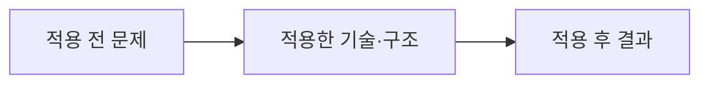

# 이력서·포트폴리오 기록

## 사례 1 — 문제 또는 요구사항 제목

- 작업 유형: 프로젝트 구현 | 버그 수정 | 기획 변경 | 리팩터링 | 보안·품질 개선 | AI 하네스
- 관련 도메인/서비스:
- 문제 출처: 사용자 요구 | 사용자 피드백 | 기획 변경 | 테스트·런타임 실패 | 구현 위험 | 검토 결과

### 문제 상황

- 사용자가 제시한 요구·문제·변경 이유:
- 테스트·런타임에서 관찰한 오류:
- 필요한 기술·구조·패턴이 없을 때 발생할 문제:

### 고민과 선택

- 사용자 제안:
- 에이전트 제안:
- 검토한 대안:
- 최종 선택:
- 선택 이유와 제외한 방식의 이유:

### 적용

- 변경 경로:
- 구현·수정·리팩터링 내용:
- 핵심 동작:

### 사용 기술과 구체적 목적

| 기술·구조·패턴 | 해결하려는 구체적 문제 | 적용 위치와 방식 |
| --- | --- | --- |

### 결과

- 적용 전:
- 적용 후:
- 검증 결과:
- 사용자 후속 피드백:
- 추가 요청 및 남은 제한:

### 이력서·포트폴리오 문구

- 이력서 bullet:
- 포트폴리오 서술: 문제 상황 → 고민과 선택 → 적용 → 결과 순서로 작성한다.
