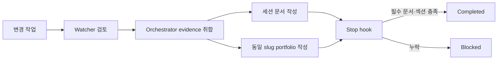

# 포트폴리오 경험 기록

## 작업 개요
- 기존 선택형 portfolio 문서를 구현·수정·리팩터링·설정/정책·AI 하네스 변경의 필수 완료 산출물로 전환했다.
- 정책 문서, 역할 계약, workflow, Python Stop hook과 회귀 테스트를 함께 변경해 문서 규칙과 실행 gate를 일치시켰다.

## 문제 상황
- **문제 출처: 사용자 요구** — 사용자는 작업 완료 후 구현 내용·이유·기술 목적을 문제 상황 → 고민 → 적용 → 결과 구조로 축적하도록 요청했다.
- **문제 출처: 구조적 위험** — 기존 `policy-portfolio`는 전용 경로와 5개 섹션이 있었지만 `AGENTS.md`, workflow, Stop hook의 완료 조건과 연결되지 않아 누락될 수 있었다.
- **문제 출처: 역할 충돌** — Generator/Refactorer는 portfolio를 직접 작성하도록 되어 있었지만 multi-agent spec은 모든 문서 작성을 orchestrator 책임으로 정의했다.
- **문제 출처: 테스트 발견** — 기존 Stop hook은 source 변경 후 portfolio가 없어도 통과했고, harness·untracked 변경도 완료 산출물 대상으로 인식하지 못했다.

## 요구사항 및 의사결정
- **사용자 요구**: 프로젝트 기능뿐 아니라 보안·버그·리팩터링·기획 변경·AI 하네스 추가/수정/삭제까지 대화와 구현 근거를 portfolio에 포함한다.
- **에이전트 제안**: 기존 `policy-portfolio`와 전용 경로를 유지하면서 template·role·workflow·Stop hook을 연결한다.
- **사용자 선택**: 계획을 보고 `진행해줘`로 제안안을 승인했다.

| 접근법 | 장점 | 단점 | 선택 여부와 이유 |
|---|---|---|---|
| `final-summary.md` 확장 | 파일 수가 늘지 않음 | 별도 필수 경험 기록 요구를 충족하지 못함 | 미채택 |
| session 폴더에 portfolio 중복 저장 | hook 연결이 단순함 | 기존 전용 경로와 내용 중복 | 미채택 |
| 기존 portfolio 경로 + 동일 session slug | 기존 자산 유지, 결정적 연결 | 두 디렉터리를 함께 관리해야 함 | 채택 |
| 정책 문서만 추가 | 변경량이 작음 | 누락을 실제 차단하지 못함 | 미채택 |
| Stop hook과 회귀 테스트 추가 | 누락을 실행 시점에 차단 | hook 유지보수 필요 | 채택 |

## 사용 기술과 구체적 목적

| 기술/패턴/아키텍처 | 해결하려는 문제 | 적용 위치와 목적 | 미채택 대안/이유 |
|---|---|---|---|
| Policy as Code | 문서와 실제 완료 조건 불일치 | AGENTS·skill·workflow·hook을 동일 규칙으로 정렬 | 자율 준수만 사용 — 누락 차단 불가 |
| Python Stop hook | portfolio 미작성 완료 | 동일 session slug의 파일·필수 섹션 검사 | 수동 체크 — 반복 누락 가능 |
| Git tracked/staged/untracked 합산 | 신규 파일과 staged 변경 누락 | `hook_common.changed_files()`의 변경 표면 확대 | `git diff` 단독 — untracked 누락 |
| active-session marker | session과 portfolio 연결 모호성 | PostToolUse가 기록한 현재 slug만 Stop에서 사용 | mtime 탐색 — 다른 작업 오인 가능 |
| 실행형 회귀 테스트 | hook 변경의 silent regression | 임시 Git 저장소에서 실제 Stop script 실행 | 함수 단위 mock — 실제 Git 경계 미검증 |

## 적용 내용
- `policy-portfolio`를 7개 필수 섹션과 사실성·AI 하네스 규칙으로 확장했다.
- agent는 evidence를 반환하고 orchestrator가 최종 문서를 작성하도록 역할 책임을 통일했다.
- feature/refactor/hybrid workflow에 portfolio 단계를 추가하고 변경 없는 audit-only는 제외했다.
- Stop hook이 application/tooling, root config, `public`, `scripts`, CI, `AGENTS.md`, `.agents`, `.codex`, `.harness`, `.opencode` 변경을 감지하도록 확장했다.
- untracked 파일을 포함하고 `.codex/logs/**`와 Python cache는 재귀 gate에서 제외했다.
- PostToolUse가 active session slug를 runtime marker에 기록하고 Stop hook의 mtime 선택을 제거했다.

## 결과 및 성과
- **Before**: source/package 변경만 감지하고 portfolio가 없어도 완료할 수 있었다.
- **After**: 구현·설정·정책·AI 하네스 변경은 동일 slug portfolio의 7개 섹션이 없으면 차단된다.
- source·harness·root config·untracked 누락, 이전 세션 portfolio 우회, PostToolUse marker, 필수 섹션, 정상 portfolio, log-only 변경의 9개 회귀 시나리오가 `python3`에서 통과했다.
- `uv`와 pytest는 환경에 없어 설치하지 않았고 외부 dependency 없는 실행형 테스트로 검증했다.
- 1차 Watcher가 root config 우회와 mtime 세션 재사용을 반려했고, active-session marker·설정 경로 확장·회귀 테스트 추가 후 fresh Watcher PASS를 받았다.
- 사용자 후속 피드백은 아직 확인되지 않았다.
- portfolio 내용의 사실성은 구조 검사만으로 증명할 수 없어 Watcher evidence 검토와 함께 강제한다.

## 회고
- 기존 policy를 재사용하면서 실행 가능한 gate까지 연결해 새 문서 체계를 중복 생성하지 않은 판단은 적절했다.
- 문서 책임을 orchestrator로 통일하면서 agent가 evidence를 반환하도록 만든 것이 사용자 대화와 구현 근거 보존에 유리하다.
- 동일 저장소에서 동시 작업을 지원해야 할 때는 active-session marker를 task ID별 namespace로 확장해야 한다.
