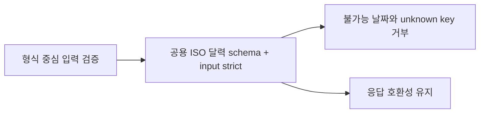

# 이력서·포트폴리오 기록

## 사례 1 — CP 입력 경계의 달력 날짜·unknown key 검증 정렬

- 작업 유형: 보안·품질 개선
- 관련 도메인/서비스: 시민토론, 투표, 댓글, 제안, 게시판, 신고 관리 API 입력
- 문제 출처: 구현 위험과 회귀 테스트 실패

### 문제 상황

- 사용자가 제시한 요구·문제·변경 이유: 반복된 CP 도메인 validation 패턴을 정렬하되 UI 수정은 Claude Code 범위로 남기도록 요청했다.
- 테스트·런타임에서 관찰한 오류: 기존 날짜 입력이 `2026-02-31`, `2025-02-29`, `2026-13-01`을 허용했고 지정 입력 schema가 extra key를 실패시키지 않았다.
- 필요한 기술·구조·패턴이 없을 때 발생할 문제: 형식만 맞는 불가능 날짜와 오타 필드가 API 요청 경계를 통과하고, 도메인별 검증 규칙이 달라질 수 있다.

### 고민과 선택

- 사용자 제안: non-UI logic만 구현하고 UI는 Claude Code 담당으로 분리.
- 에이전트 제안: 공용 실제 달력 날짜 schema를 지정 입력에만 적용하고 여섯 input schema만 strict 처리.
- 검토한 대안: 문자열 regex 유지, 각 DTO에 날짜 validator 중복, response schema까지 일괄 strict 처리.
- 최종 선택: `isoCalendarDateSchema` 공용화와 input-only `.strict()`.
- 선택 이유와 제외한 방식의 이유: 두 도메인이 같은 의미를 공유하며, response 일괄 strict는 기존 extra-key 호환성을 손상시킨다.

### 적용

- 변경 경로: `src/shared/lib/validation/index.ts`와 여섯 CP 도메인의 승인된 DTO.
- 구현·수정·리팩터링 내용: discussion/vote 날짜 입력을 실제 ISO 달력 날짜 parser로 교체하고 지정 query/process schema에 `.strict()`를 적용했다.
- 핵심 동작: 윤년 날짜는 허용하고 불가능·비표준 날짜와 unknown key는 거부하며 기존 response strictness는 유지한다.

### 사용 기술과 구체적 목적

| 기술·구조·패턴 | 해결하려는 구체적 문제 | 적용 위치와 방식 |
| --- | --- | --- |
| Zod ISO date schema | regex가 놓치는 달력 유효성 | 공용 validation boundary에서 parse |
| Zod `.strict()` | 요청 오타·unknown key의 조용한 제거 | 지정 input DTO에만 적용 |
| Vite `ssrLoadModule` + `node:test` | 실제 TS 모듈 계약 검증 | DTO response/input 회귀 테스트 3개 파일 |

### 결과

- 적용 전: 불가능 날짜와 지정 입력의 extra key가 성공했다.
- 적용 후: 실제 달력 날짜와 명시된 요청 shape만 허용하며 response 호환성은 유지한다.
- 검증 결과: 전체 13개 실제 모듈 테스트 중 관련 날짜·strictness·응답 계약 모두 통과했다.
- 사용자 후속 피드백: baseline-aware 검증 기준으로 계속하도록 승인했고, 최종 실행은 Claude Code 없이 GPT Sol로 수행하도록 요청했다.
- 추가 요청 및 남은 제한: 신규 DTO 자동 편입을 위한 parameterized matrix는 별도 제안이다.

### 이력서·포트폴리오 문구

- 이력서 bullet: Zod 입력 경계를 정렬해 CP 6개 도메인의 불가능 날짜·unknown key를 거부하고 실제 Vite 모듈 테스트 13개로 응답 호환성을 보존했습니다.
- 포트폴리오 서술: 분산된 요청 validation이 불가능 날짜와 오타 필드를 허용하는 문제를 확인하고, input/response 계약을 분리한 공용 schema와 strict parsing을 적용해 요청 정확성과 기존 응답 호환성을 함께 확보했다.

## 사례 2 — CP board bulk-hide 응답 parser의 API 경계 이동

- 작업 유형: 리팩터링
- 관련 도메인/서비스: CP 게시판 일괄 숨김 mutation
- 문제 출처: 구현 위험

### 문제 상황

- 사용자가 제시한 요구·문제·변경 이유: 도메인 parser 패턴을 정렬하면서 UI와 무관한 logic만 변경하도록 요청했다.
- 테스트·런타임에서 관찰한 오류: malformed 객체와 non-array 응답을 거부하는 공개 parser 계약이 없었다.
- 필요한 기술·구조·패턴이 없을 때 발생할 문제: hook이 transport 응답 파싱까지 소유해 다른 board API parser와 경계가 달라지고 재사용·검증이 어려워진다.

### 고민과 선택

- 사용자 제안: non-UI 범위 유지.
- 에이전트 제안: local Zod schema를 기존 `cp-board.parser.ts`로 이동하고 barrel에서 공개.
- 검토한 대안: hook local schema 유지, parser 이동과 함께 cache 로직 재작성.
- 최종 선택: parser만 API 경계로 이동하고 cache callback은 그대로 유지.
- 선택 이유와 제외한 방식의 이유: 가장 작은 변경으로 소유권을 정렬하고 이미 동작하는 cache 상태 전이의 회귀 위험을 피한다.

### 적용

- 변경 경로: `src/entities/cp-board/api/cp-board.parser.ts`, `api/index.ts`, `hook/use-cp-board-bulk-hide-mutation.ts`.
- 구현·수정·리팩터링 내용: `parseCpBoardBulkHide(response: unknown)`를 공개하고 mutation이 unwrap 후 호출하도록 했다.
- 핵심 동작: fixture 배열은 parse되고 incomplete/non-array 응답은 실패하며 detail cache update와 list invalidation은 유지된다.

### 사용 기술과 구체적 목적

| 기술·구조·패턴 | 해결하려는 구체적 문제 | 적용 위치와 방식 |
| --- | --- | --- |
| parse-don't-validate | 외부 응답의 신뢰 경계 명확화 | API parser에서 `unknown`을 typed output으로 변환 |
| API barrel | hook의 내부 파일 결합 방지 | `src/entities/cp-board/api/index.ts` 공개 export |
| TanStack Query mutation 불변성 | parser 이동 중 상태 회귀 방지 | 기존 detail update/list invalidation 보존 |

### 결과

- 적용 전: bulk-hide 응답 schema가 hook 내부에 있었다.
- 적용 후: API 계층이 응답 파싱을 소유하고 hook은 mutation 조율과 cache 동작에 집중한다.
- 검증 결과: 공개 parser 성공·실패 계약과 최신 diff를 Watcher가 검증해 PASS했다.
- 사용자 후속 피드백: 없음.
- 추가 요청 및 남은 제한: cache callback 실행 테스트는 P2 장기 제안으로 남겼다.

### 이력서·포트폴리오 문구

- 이력서 bullet: hook 내부 Zod 응답 schema를 API parser 경계로 이동해 타입 신뢰 경계를 명확히 하고 기존 React Query cache update/invalidation을 보존했습니다.
- 포트폴리오 서술: 상태 조율 hook이 응답 파싱까지 소유하던 결합을 확인하고, parser 공개 API로 책임을 이동하면서 mutation 순서와 cache 계약을 회귀 없이 유지했다.

## 사례 3 — 저장소 baseline과 branch 결함을 분리한 검증 gate 보정

- 작업 유형: AI 하네스
- 관련 도메인/서비스: branch 검증 및 병합 gate
- 문제 출처: 검토 결과

### 문제 상황

- 사용자가 제시한 요구·문제·변경 이유: 다음 단계가 명확하면 계속하고 불확실하면 질문하도록 요청했다.
- 테스트·런타임에서 관찰한 오류: 최초 Watcher는 full lint 73 errors·5 warnings와 존재하지 않는 `npm test` script 때문에 FAIL했다. 변경 행동·범위 검증은 모두 PASS였다.
- 필요한 기술·구조·패턴이 없을 때 발생할 문제: 기존 저장소 부채가 현 branch 결함으로 오분류되어 승인 범위를 벗어난 대규모 수정으로 번질 수 있다.

### 고민과 선택

- 사용자 제안: baseline-aware 기준으로 조정해 계속하는 안을 선택했다.
- 에이전트 제안: 13개 실제 모듈 테스트, build, 변경 파일 ESLint, diff-check를 필수 gate로 두고 full lint/test 한계를 잔여 위험으로 기록.
- 검토한 대안: package test script 추가와 기존 lint 73건 전체 수정.
- 최종 선택: 제품 범위를 유지한 baseline-aware 검증.
- 선택 이유와 제외한 방식의 이유: 변경 파일은 독립적으로 clean하며 대안은 package·UI를 포함한 별도 승인 범위가 필요했다.

### 적용

- 변경 경로: `.omo/plans/domain-pattern-alignment.md`, `.omo/start-work/ledger.jsonl`, `.omo/evidence/domain-pattern-alignment/watcher/`.
- 구현·수정·리팩터링 내용: Attempt 1 FAIL을 보존하고 사용자 승인 gate로 Attempt 2를 재판정했다.
- 핵심 동작: baseline 결과를 숨기지 않으면서 현 branch의 독립 품질을 판정한다.

### 사용 기술과 구체적 목적

| 기술·구조·패턴 | 해결하려는 구체적 문제 | 적용 위치와 방식 |
| --- | --- | --- |
| baseline-aware quality gate | 기존 결함과 신규 회귀 구분 | 변경 파일 ESLint와 실제 테스트/build 분리 |
| immutable evidence attempts | 실패 근거 소실 방지 | Watcher attempt-1/attempt-2 별도 보존 |
| explicit user approval | 검증 기준의 임의 완화 방지 | 사용자 선택 후 plan/ledger 갱신 |

### 결과

- 적용 전: branch 행동은 정상이어도 실행 불가능한 full-repo gate 때문에 FAIL이었다.
- 적용 후: 필수 gate가 모두 성공하고 baseline 위험을 별도 기록한 definitive PASS를 확보했다.
- 검증 결과: 13/13 tests, build, 변경 파일 ESLint, diff-check 성공; Watcher branch 결함 0건; `sy-main@5aa158a` ff-only merge와 동일 gate의 post-merge 재검증 완료.
- 사용자 후속 피드백: “기준 조정 후 계속”을 선택한 뒤 Claude를 사용하지 않고 GPT Sol로 수행하도록 요청했다.
- 추가 요청 및 남은 제한: 표준 `test` script와 full lint remediation은 별도 작업이다.

### 하네스 실행 경계

- linked worktree의 Bash `workdir`가 Claude Code 호환 hook에 전달되는 과정과 ignored `.claude` 배포 파일 경로 문제를 확인했다.
- `git -C`로 branch guard를 우회할 수 있는 대안은 사용하지 않고, 공식 `opencode-cc-plugin.json`에서 Claude 호환 command만 임시 비활성화한 뒤 cleanup 완료 시 제거했다.
- native OpenCode branch guard는 유지한 상태로 승인된 ff-only merge와 사후 검증을 완료하고 source branch와 두 linked worktree를 안전 제거했다.

### 이력서·포트폴리오 문구

- 이력서 bullet: 저장소 baseline 실패와 branch 회귀를 분리하는 승인형 quality gate를 설계해 실제 테스트 13개·build·변경 파일 lint 근거로 결함 0건을 독립 판정했습니다.
- 포트폴리오 서술: 기존 lint 부채와 test script 부재가 정상 branch를 차단하는 문제를 분석하고, 실패 evidence를 보존한 채 사용자 승인 baseline-aware gate로 재검증해 범위 확장 없이 신뢰 가능한 PASS를 만들었다.
