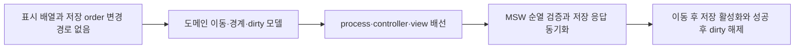

# 이력서·포트폴리오 기록

## 사례 1 — CP 메인 노출 순서 이동과 저장 상태 일관성 구현

- 작업 유형: 프로젝트 구현 | 품질 개선
- 관련 도메인/서비스: CP 관리자 메인 노출 관리
- 문제 출처: 사용자 요구 | 구현 위험

### 문제 상황

- 사용자가 제시한 요구·문제·변경 이유: 메인 노출 항목의 순서를 위·아래로 변경하고 변경된 순서를 저장 흐름까지 연결해야 했다.
- 테스트·런타임에서 관찰한 오류: 구현 후 전체 테스트나 브라우저 QA에서 기능 오류는 관찰되지 않았다. 전체 lint에는 변경 범위 밖 기존 오류 73건과 warning 5건이 있었다.
- 필요한 기술·구조·패턴이 없을 때 발생할 문제: 배열 표시 순서만 바뀌고 `order` 또는 저장 기준 상태가 동기화되지 않으면 저장 버튼 상태와 서버 응답이 화면과 불일치할 수 있다.

### 고민과 선택

- 사용자 제안: CP 메인 노출 순서 이동 기능을 실제 저장 가능한 상태로 연결한다.
- 에이전트 제안: 모델에서 이동·경계·dirty를 계산하고 process/controller를 통해 기존 화면과 저장 흐름에 연결하며 MSW handler에서 순열을 검증한다.
- 검토한 대안: 화면 컴포넌트 내부에서 배열만 직접 교환하는 방식, 순서 제어를 즉시 공용 컴포넌트로 추상화하는 방식.
- 최종 선택: 도메인 모델과 process에 상태 규칙을 두고 기존 view에 최소 제어만 추가했다.
- 선택 이유와 제외한 방식의 이유: 화면 내부 직접 변경은 저장·dirty 규칙을 분산시키며, 공용화는 현재 단일 사용처여서 근거가 부족했다.

### 적용

- 변경 경로: `src/pages/cp-main-display/{lib,model,hook,ui}`, `src/mocks/cp-main-display.handlers.ts`, `tests/cp-main-display-order-control.test.mjs`
- 구현·수정·리팩터링 내용: 인접 항목 이동, 경계 판단, 연속 `order` 재부여, dirty 비교, 저장 후 기준 상태 동기화, MSW 순열 검증을 구현했다.
- 핵심 동작: 사용자가 항목을 이동하면 저장 버튼이 활성화되고, 저장 응답에 변경 순서가 반영된 뒤 버튼이 다시 비활성화된다.

### 사용 기술과 구체적 목적

| 기술·구조·패턴 | 해결하려는 구체적 문제 | 적용 위치와 방식 |
| --- | --- | --- |
| TypeScript 폐쇄형 방향 타입 | 잘못된 이동 방향 전달 방지 | `CpMainDisplayOrderDirection`으로 위·아래만 허용 |
| 순수 도메인 모델 함수 | UI와 상태 규칙의 결합 방지 | 이동·경계·dirty 계산을 model에 배치 |
| React process/controller 분리 | 편집 상태와 화면 이벤트의 책임 분리 | process가 draft·저장을 관리하고 controller가 view 계약을 연결 |
| MSW 계약 검증 | 잘못된 순열의 성공 처리 방지 | ID·제목·순서 집합과 중복을 저장 handler에서 검증 |
| Node test runner | 핵심 상태 경계의 회귀 방지 | 이동·경계·dirty·round-trip·중복 order 테스트 |

### 결과

- 적용 전: 항목 배열을 렌더링했지만 사용자가 순서를 변경하고 저장 상태까지 연결할 계약이 없었다.
- 적용 후: 경계가 보호된 순서 이동과 dirty/save, 저장 응답 동기화가 하나의 흐름으로 연결됐다.
- 검증 결과: 전체 테스트 20/20, build, 변경 파일 ESLint, diff check가 통과했다. 브라우저에서 저장 HTTP 200, 변경된 order 응답, 저장 후 disabled 복귀, console error 0건을 확인했다.
- 사용자 후속 피드백: 없음.
- 추가 요청 및 남은 제한: 실제 백엔드 저장 환경은 검증하지 않았고, 배열 위치와 `order` 의미의 장기적 계약 명시는 후속 권고로 남았다.

### 이력서·포트폴리오 문구

- 이력서 bullet: TypeScript 도메인 모델과 React 상태 조율 계층을 연결해 CP 메인 노출 순서 이동·dirty/save 흐름을 구현하고, MSW 순열 검증과 20개 회귀 테스트 및 브라우저 QA로 저장 일관성을 검증했다.
- 포트폴리오 서술: 메인 노출 목록은 표시만 가능하고 순서 변경이 저장 상태와 연결되지 않아 화면 배열과 서버 `order`가 어긋날 위험이 있었다. 화면 내부에서 직접 배열을 변경하는 대신 이동·경계·dirty 규칙을 도메인 모델에 두고 process/controller로 기존 UI에 연결했다. 또한 MSW 저장 handler가 순서 집합과 중복을 검증하고 성공 응답을 기준 상태에 동기화하도록 구현했다. 그 결과 전체 테스트 20/20과 build·변경 파일 lint를 통과했고, 브라우저에서 변경 순서 저장과 저장 후 dirty 해제를 확인했다.
