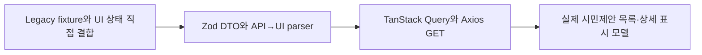
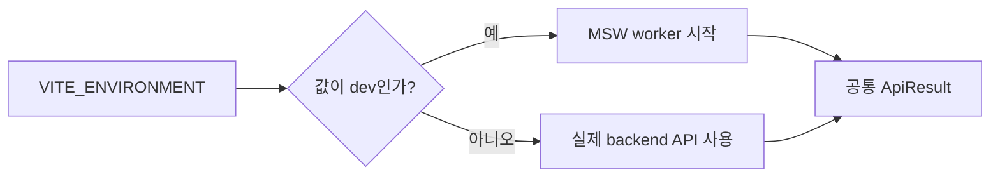

# 이력서·포트폴리오 기록

## 사례 1 — 시민참여 제안 목록·상세 실 API 계약 연결

- 작업 유형: 프로젝트 구현 | 기획 변경 | 품질 개선
- 관련 도메인/서비스: 시민참여 제안 관리, React Query, Axios API, MSW
- 문제 출처: 사용자 요구 | backend 계약 변경 | 구현 위험

### 문제 상황

- 사용자가 제시한 요구·문제·변경 이유: mock fixture 중심의 시민참여 제안 목록과 상세를 실제 `GET /citizen/proposals`, `GET /citizen/proposals/{proposalId}` 응답으로 확인할 수 있게 연결해야 했다.
- 테스트·런타임에서 관찰한 오류: 첫 `npm run build`에서 상세 process schema 누락 필드, readonly 목록 배열, 문자열 code와 숫자 오류 계약 충돌 등 5개의 TypeScript 오류가 발생했다.
- 필요한 기술·구조·패턴이 없을 때 발생할 문제: API와 UI 상태 vocabulary, nullable 작성자, pagination shape가 직접 섞이면 잘못된 필터 query와 런타임 표시 오류가 발생할 수 있었다.

### 고민과 선택

- 사용자 제안: 실제 backend endpoint와 제공된 목록·상세 응답 계약을 사용하고 QA는 테스트 코드로만 수행한다.
- 에이전트 제안: 외부 응답을 Zod DTO로 parse한 뒤 기존 표시 모델로 변환하고, API·UI 상태 차이는 transport 경계에서 명시적으로 매핑한다.
- 검토한 대안: UI 모델 전체를 신규 backend DTO에 맞춰 교체하는 방식, 상태별 KPI를 추가 호출로 추정하는 방식, legacy process endpoint까지 추정 이전하는 방식을 검토했다.
- 최종 선택: UI 계약은 유지하고 entity API·DTO·parser와 페이지 query 상태만 교체했으며, backend가 제공하지 않는 집계와 mutation 계약은 만들지 않았다.
- 선택 이유와 제외한 방식의 이유: 최소 변경으로 기존 UI를 보존하고, 확인되지 않은 endpoint나 데이터 의미를 추정하지 않기 위해서다.

### 적용

- 변경 경로: `src/entities/cp-proposal/**`, `src/pages/cp-proposal/**`, `src/mocks/cp-proposal.handlers.ts`, `tests/citizen-proposals-*.test.mjs`
- 구현·수정·리팩터링 내용: 목록·상세 Zod schema, 양의 정수 상세 ID, 반복 query 직렬화, API→UI parser, 실제 계약 기반 MSW 400·404 응답을 구현했다.
- 핵심 동작: `UNDER_REVIEW`를 `REVIEWING`, `REJECTED`를 `RETURNED`으로 변환하고 `author: null`을 `탈퇴한 회원`으로 표시하며 `{ total, page, size }`를 기존 pagination 모델로 변환한다.

### 사용 기술과 구체적 목적

| 기술·구조·패턴 | 해결하려는 구체적 문제 | 적용 위치와 방식 |
| --- | --- | --- |
| Zod strict schema | 외부 backend 응답과 query의 잘못된 shape 차단 | `cp-proposal.dto.ts`에서 목록·상세·query parse |
| DTO→UI parser | API와 UI 상태·필드 vocabulary 결합 방지 | `cp-proposal.parser.ts`에서 명시 매핑 |
| Axios `paramsSerializer` | 배열 query가 index 표기 없이 반복 key가 되도록 보장 | `cp-proposal.api.ts`의 `indexes: null` |
| TanStack Query | 기존 캐시·AbortSignal·화면 상태 계약 유지 | 목록·상세 query hook에서 typed API 호출 |
| MSW + `node:test` | 브라우저 없이 실제 HTTP query와 400·404 계약 검증 | `citizen-proposals-msw.test.mjs` |

### 결과

- 적용 전: 목록·상세가 legacy resource와 fixture shape에 결합되어 실제 시민 API 계약을 소비하지 못했다.
- 적용 후: 실제 endpoint, query, envelope, pagination, 상태, nullable author 계약이 타입 경계를 거쳐 기존 화면 모델로 전달된다.
- 검증 결과: `node --test tests/*.test.mjs` 34/34 통과, `npm run build` 통과, 변경 파일 ESLint 통과, Watcher PASS.
- 사용자 후속 피드백: 구현 진행 승인 외 결과에 대한 후속 피드백은 없음.
- 추가 요청 및 남은 제한: 실제 인증 backend live 호출과 브라우저 bootstrap은 수행하지 않았고, 상태별 KPI는 backend 집계 계약이 필요하다.

### 이력서·포트폴리오 문구

- 이력서 bullet: Zod 기반 DTO/parser와 TanStack Query·Axios 경계를 설계해 시민참여 제안 목록·상세를 실제 backend 계약에 연결하고, API/UI 상태 및 nullable 필드를 명시 변환하여 Node 계약 테스트 34건과 production build를 통과시켰습니다.
- 포트폴리오 서술: legacy fixture와 실제 backend의 endpoint, 상태, pagination 차이로 화면 데이터 연결이 불가능한 문제를 확인했습니다. UI 전체 교체 대신 transport 경계에서 Zod parse와 명시적 상태 매핑을 적용하고, 반복 query와 MSW 400·404 계약을 함께 맞췄습니다. 그 결과 기존 UI 계약을 보존하면서 실제 목록·상세 응답을 타입 안전하게 소비하도록 변경했고 34개 Node 테스트와 production build, 독립 Watcher 검토를 통과했습니다.

## 사례 2 — 실제 API 기본 실행과 dev-only mock 정책 분리

- 작업 유형: 프로젝트 구현 | 품질 개선
- 관련 도메인/서비스: 앱 bootstrap, 공통 API envelope, MSW 실행 정책
- 문제 출처: 사용자 요구 | 운영 환경 위험 | 구현 위험

### 문제 상황

- 사용자가 제시한 요구·문제·변경 이유: `.env`에 `dev` marker가 있을 때만 mock API를 사용하고 marker를 주석 처리해 실제 backend 데이터를 기본 확인 대상으로 만들어야 했다.
- 테스트·런타임에서 관찰한 오류: 기존 숫자 중심 `ApiResult` 경계는 문자열 `"SUCCESS"`와 문자열 오류 코드를 온전히 표현하지 못했다.
- 필요한 기술·구조·패턴이 없을 때 발생할 문제: mock이 일반 development mode에서 자동 실행되면 실제 backend 연결 실패를 fixture 성공으로 오인할 수 있고, 문자열 오류 코드가 숫자 계약에 섞이면 기존 오류 소비자가 깨질 수 있었다.

### 고민과 선택

- 사용자 제안: `.env`에 `dev` 값을 만들되 주석 처리하고, 값이 존재할 때만 mock을 사용한다.
- 에이전트 제안: 환경 판정을 순수 함수 `shouldStartMockApi`로 분리하고 정확히 `VITE_ENVIRONMENT === "dev"`인 경우에만 worker를 시작한다.
- 검토한 대안: `import.meta.env.DEV`만으로 mock을 자동 실행하는 방식, 문자열 code를 기존 숫자 `ApiError.code`에 강제로 저장하는 방식을 검토했다.
- 최종 선택: 명시 marker gate와 `ApiError.apiCode`를 도입하고 기존 숫자 `code` 계약은 유지했다.
- 선택 이유와 제외한 방식의 이유: 실제 API 확인 모드를 기본값으로 보장하고 공통 오류 소비자의 호환성을 지키기 위해서다.

### 적용

- 변경 경로: `src/app/index.tsx`, `src/app/mock-api-policy.ts`, `src/shared/api/common/api-result/**`, `.env`, `tests/mock-api-policy.test.mjs`, `tests/citizen-proposals-contract.test.mjs`
- 구현·수정·리팩터링 내용: mock 시작 조건과 미처리 요청 감시 범위를 순수 함수로 분리하고, `ServerResponse.code`를 `number | string`으로 정규화하며 문자열 오류를 별도 보존했다.
- 핵심 동작: marker가 없거나 `development` 등 다른 값이면 MSW를 시작하지 않고, 정확한 `dev`일 때만 worker를 시작한다. `"SUCCESS"`만 문자열 성공으로 판정한다.

### 사용 기술과 구체적 목적

| 기술·구조·패턴 | 해결하려는 구체적 문제 | 적용 위치와 방식 |
| --- | --- | --- |
| 순수 환경 정책 함수 | 브라우저 bootstrap 없이 mock gate 검증 | `mock-api-policy.ts`와 Node 테스트 |
| 공통 response normalization | 숫자·문자열 envelope를 하나의 `ApiResult` 표면으로 제공 | `server-response.ts`, `api-result.mapper.ts` |
| 분리된 `apiCode` | 기존 숫자 오류 계약과 backend 문자열 오류 코드 동시 보존 | `types.ts`, `api-error.mapper.ts` |
| MSW 미처리 요청 감시 | CP/citizen mock 누락을 개발 중 즉시 노출 | `app/index.tsx`, `isMockApiRequest` |

### 결과

- 적용 전: 개발 실행과 mock 사용 조건이 실제 API 확인 요구와 분리되지 않았고 문자열 envelope 지원 경계가 없었다.
- 적용 후: 실제 backend가 기본 실행 경로가 되고 명시적 `dev`에서만 mock을 사용하며, 문자열 성공·오류 코드를 기존 API 소비 표면에서 처리한다.
- 검증 결과: mock 정책 2건을 포함한 전체 Node 테스트 34/34 통과, 변경 파일 ESLint와 production build 통과.
- 사용자 후속 피드백: 없음.
- 추가 요청 및 남은 제한: `.env`는 Git ignore 대상이라 로컬 설정만 존재하며, mock 실행 방법의 저장소 문서화는 후속 후보이다.

### 이력서·포트폴리오 문구

- 이력서 bullet: 명시적 환경 marker 기반 MSW bootstrap 정책과 숫자·문자열 API envelope 정규화를 구현해 개발 mock과 실제 backend 실행 경로를 분리하고 기존 오류 계약의 호환성을 유지했습니다.
- 포트폴리오 서술: 개발 환경에서 mock이 자동 개입하면 실제 backend 연결 상태를 오인할 위험과 문자열 응답 코드가 기존 숫자 오류 계약을 깨는 문제를 함께 해결했습니다. 환경 판정을 순수 함수로 분리해 정확한 `dev` marker에서만 MSW를 시작하고 문자열 오류를 `apiCode`로 별도 보존했습니다. 이를 통해 실제 API가 기본 실행 경로가 되었고 mock gate와 envelope 동작을 브라우저 없이 Node 테스트로 검증했습니다.
