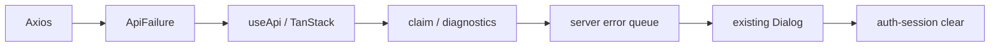
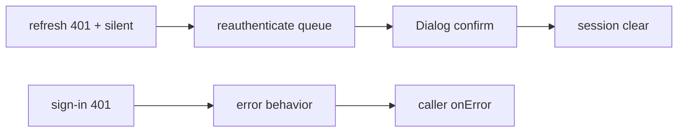

# 이력서·포트폴리오 기록

## 사례 1: 전역 API failure와 token-presence 인증 기반 통합

- 작업 유형: 프로젝트 구현 | 보안·품질 개선
- 관련 도메인/서비스: 관리자 API 오류 처리, 인증 세션 수명주기
- 문제 출처: 사용자 요구 | 구현 위험

### 문제 상황

- 사용자 요구: user-ui의 전역 API 오류 처리와 token-presence 인증 원칙을 현재 admin UI의 `ApiResult`, Zustand, Dialog, FSD 구조에 맞게 적용해야 했다.
- 관찰: 기존 Axios는 network/setup 오류를 raw console에 기록했고 QueryClient에는 terminal callback이 없었으며 `useApi` signal은 transport에 전달되지 않았다.
- 관찰: 인증 token과 Zustand 상태 갱신이 여러 위치에 흩어져 stale refresh가 최신 상태를 덮을 위험이 있었다.
- 미해결 위험: 중복 오류 표시, 민감 request 정보 노출, logout·token 교체 후 인증 상태 역행이 발생할 수 있다.

### 고민과 선택

- 사용자 제안: user-ui의 두 세션 산출물을 분석해 같은 동작을 현재 프로젝트에 적용한다.
- 에이전트 제안: taxonomy·reporter·queue 원칙만 재사용하고 기존 Zustand·Dialog·`ApiResult`를 정본으로 유지한다.
- 검토한 대안: interceptor 즉시 Dialog, 별도 인증 store, JWT expiry 선판정, 새 modal·toast.
- 최종 선택: Axios는 정규화만 수행하고 terminal 경계가 report하며 shared queue와 기존 Dialog를 app bridge에서 결합한다. localStorage와 Zustand는 `auth-session.ts`에서 함께 갱신한다.
- 제외 이유: transport의 선행 claim은 caller UX를 막고 별도 store·modal은 상태원과 표시 시스템을 중복시킨다.

### 적용

- 경로: `src/shared/api/error/**`, `src/shared/api/axios-instance.ts`, `src/shared/lib/hooks/use-api.tsx`, `src/app/providers/**`, `src/entities/auth/api/**`, `src/features/auth/**`, `src/app/index.tsx`.
- 구현: discriminated failure, diagnostics redaction, `WeakSet` claim, FIFO·dedupe queue, Query retry/report, Zod auth parser, signal, revision auth session, URL credential bootstrap.
- 동작: access 또는 refresh token 하나만 있어도 presence는 true이며 refresh는 revision과 refresh token이 모두 현재일 때만 commit한다.

### 사용 기술과 구체적 목적

| 기술·구조 | 구체적 목적 | 적용 |
| --- | --- | --- |
| TypeScript discriminated union | 오류 정책 누락 방지 | server·client-contract·transport·canceled 분류 |
| Zod v4 | 신뢰할 수 없는 auth 응답 parse | auth envelope·payload boundary |
| module-level `WeakSet` | terminal 경계 중복 처리 방지 | reporter의 오류 객체 claim |
| allowlist diagnostics | token·header·payload 유출 방지 | 익명화 issue와 닫힌 context만 기록 |
| Zustand revision snapshot | stale refresh overwrite 방지 | capture·commit guard |
| `AbortSignal` | unmount 이후 실제 요청 취소 | `useApi`에서 auth transport까지 전달 |
| `useSyncExternalStore` | shared queue와 React UI 결합 | app-level Dialog bridge |

### 결과

- 적용 전: 오류 정규화·표시·diagnostics와 token 상태 전이가 분산돼 있었다.
- 적용 후: Axios·`useApi`·TanStack Query가 공통 failure 정책으로 수렴하고 auth token·presence·revision·bootstrap이 단일 session 모듈에서 관리된다.
- 검증: 신규 25/25, 전체 73/73, build 성공, targeted ESLint 0 errors·기준선 warning 1건, Watcher PASS.
- Git: 13개 atomic commit을 `sy-main@25f41f2`에 fast-forward 병합했다.
- 사용자 후속 피드백: 기능 동작 피드백은 없음. scope 추가와 병합은 사용자가 승인했다.
- 남은 제한: production `/sign-in` UI와 보호 route는 후속 작업이다.

### 이력서·포트폴리오 문구

- 이력서 bullet: React·TypeScript 관리자 UI에서 Axios, TanStack Query, Zustand, Zod를 공통 failure·인증 세션 경계로 통합하고 25개 신규 회귀 테스트와 전체 73개 테스트로 중복 표시, 민감 정보 노출, stale refresh 상태 역행을 방지했다.
- 포트폴리오 서술: 기존 Dialog와 Zustand를 유지하면서 typed failure, redacted diagnostics, queue adapter, revision snapshot을 조립해 분산 오류·인증 상태를 한 흐름으로 수렴시켰고 build, 실행 테스트, 독립 Watcher PASS로 검증했다.

## 사례 2: Watcher 피드백으로 silent refresh 401 결함 수정

- 작업 유형: 버그 수정 | 보안·품질 개선
- 관련 도메인/서비스: refresh token, 재인증 오류 처리
- 문제 출처: 독립 검토 | failing-first 테스트

### 문제 상황

- 최초 Watcher는 refresh의 `silent: true`가 server 401을 presentation filter에서 소거해 재인증 queue와 session clear에 도달하지 않는다고 FAIL 판정했다.
- 미해결 위험: backend가 token 무효성을 확정한 뒤에도 localStorage와 Zustand presence가 남을 수 있다.

### 고민과 선택

- 에이전트 제안: 401 분기를 presentation filter보다 먼저 수행하고 sign-in만 caller-owned 401로 opt-out한다.
- 대안: refresh `silent: false`, 모든 refresh 오류 즉시 logout, `useAuth`의 별도 401 정규화.
- 최종 선택: refresh의 silent 5xx·transport UX는 유지하고 401만 재인증 queue로 보낸다. sign-in에는 typed `unauthorizedBehavior: "error"`를 전달한다.
- 제외 이유: 모든 refresh 오류 logout은 일시적 network 실패에도 세션을 지우고 `silent: false`는 5xx까지 사용자에게 노출한다.

### 적용

- 경로: `src/shared/api/error/api-failure-reporter.ts`, `src/shared/lib/hooks/use-api.tsx`, `src/features/auth/use-auth.ts`, `tests/api-failure-diagnostics.test.mjs`.
- 수정: silent 401 failing-first 테스트, reporter 분기 순서, typed behavior 전달.
- 동작: refresh 401은 queue와 Dialog 확인 후 session clear, sign-in 401은 caller `onError` 처리.

### 사용 기술과 구체적 목적

| 기술·구조 | 목적 | 적용 |
| --- | --- | --- |
| TDD RED→GREEN | 독립 finding 재현과 회귀 방지 | 실제 queue `[]` 실패 후 reporter 7/7 |
| typed behavior option | sign-in과 refresh 401 의미 분리 | `useApi`에서 reporter까지 전달 |
| 독립 Watcher 재검토 | 구현 담당자의 자체 승인 방지 | 최초 FAIL 수정 후 같은 Watcher PASS |
| runtime 조건 분리 | 앱 회귀와 test runner 불안정 구분 | no-cache·tsconfig·직렬 73/73 |

### 결과

- 적용 전: silent refresh 401은 queue event를 남기지 않았다.
- 적용 후: refresh 재인증과 sign-in caller-owned 오류가 서로 다른 typed 경로를 사용한다.
- 검증: RED 실패, reporter 7/7, 신규 25/25, 전체 73/73, build 성공, Watcher PASS.
- 사용자 후속 피드백: 없음.
- 남은 제한: Vite/Rolldown `SIGBUS`, no-excuse TypeScript 6 호환성, whole lint 기준선은 별도 부채다.

### 이력서·포트폴리오 문구

- 이력서 bullet: 독립 Watcher가 발견한 silent refresh 401 세션 잔존 결함을 failing-first 테스트로 재현하고 typed 401 behavior 분리로 refresh 재인증과 sign-in 오류 UX를 함께 보존했다.
- 포트폴리오 서술: backend 401이 silent presentation에서 소실되는 문제를 모든 refresh 오류 logout 같은 과잉 수정 없이 reporter 정책 순서와 sign-in opt-out만 변경해 해결하고, RED→GREEN과 전체 73개 테스트로 확인했다.
