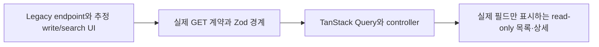
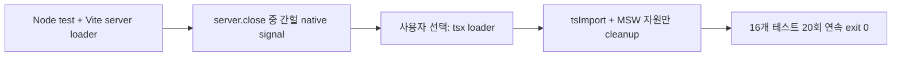

# 이력서·포트폴리오 기록

## 사례 1 — 실제 시민투표 조회 계약으로 관리자 목록·상세 재구성

- 작업 유형: 프로젝트 구현 | 기획 변경 | 리팩터링 | 품질 개선
- 관련 도메인/서비스: 관리자 시민투표 목록·상세, 시민참여 API
- 문제 출처: 사용자 요구 | 실제 API 계약 | 구현 위험

### 문제 상황

- 사용자가 제시한 요구·문제·변경 이유: `일단 목록/상세 연결만 해. 그리고 다른 부분들은 실제 조회를 기준으로 작업하면 돼`라고 요청했다.
- 테스트·런타임에서 관찰한 오류: 기존 UI와 테스트는 legacy `/v1/cp/votes`, 실제 계약에 없는 검색 조건, 상태·종료일·공개 처리 mutation과 placeholder 상세 필드를 참조했다. 로직 교체 후 stale 날짜 경계 테스트도 삭제된 mutation schema를 불러 실패했다.
- 필요한 기술·구조·패턴이 없을 때 발생할 문제: transport만 교체하면 UI가 backend가 지원하지 않는 동작을 노출하고, 응답에 없는 데이터를 도메인 사실처럼 표시하며, sort·ID·pagination 차이가 런타임 오류로 늦게 드러날 수 있었다.

### 고민과 선택

- 사용자 제안: 목록·상세 조회만 먼저 연결하고 나머지 기능은 실제 조회 계약에 맞춘다.
- 에이전트 제안: 외부 DTO·Zod parser·read model·TanStack Query·controller·UI 책임을 분리하고 unsupported mutation/search surface를 삭제한다.
- 검토한 대안: legacy 필드를 placeholder로 유지하는 방식, 검색 UI를 무동작으로 남기는 방식, 문서에 없는 mutation endpoint를 추정하는 방식, 실제 page 항목으로 상태별 전체 KPI를 계산하는 방식을 검토했다.
- 최종 선택: 실제 `GET /citizen/votes`, `GET /citizen/votes/{voteId}`를 정본으로 삼고 실제 응답·query에 없는 기능과 데이터를 제거했다.
- 선택 이유와 제외한 방식의 이유: 조회 계약보다 UI가 앞서 나가면 잘못된 관리 동작과 오해를 만든다. 실제 응답 경계에서 검증하고 없는 데이터를 만들지 않는 방식이 가장 작은 정확한 구현이었다.

### 적용

- 변경 경로: `src/entities/cp-vote/**`, `src/pages/cp-vote/**`, `src/mocks/cp-vote.handlers.ts`, 시민투표 contract·MSW 테스트, 날짜 경계 회귀 테스트.
- 구현·수정·리팩터링 내용: endpoint와 query serialization을 교체하고 Zod DTO·parser·read model을 실제 5개 상태와 응답 필드로 재정의했다. legacy mutation/search hook·controller·API·UI를 삭제하고 조회 controller와 production UI를 연결했다.
- 핵심 동작: 반복 sort, page 1-based, size 100 상한, 양의 정수 ID, AbortSignal, pageCount, 찬반 집계 불변식, loading·retry·pagination·상세 이동, 400·401·404 HTTP 오류 계약.

### 사용 기술과 구체적 목적

| 기술·구조·패턴 | 해결하려는 구체적 문제 | 적용 위치와 방식 |
| --- | --- | --- |
| Zod strict schema | 외부 query·응답 어휘와 집계 불일치를 runtime에서 차단 | `cp-vote.dto.ts`에서 page·size·sort·ID·목록·상세 schema 정의 |
| Parser 경계 | backend 응답을 화면 모델로 넘기기 전에 검증하고 pageCount 계산 | `cp-vote.parser.ts`에서 응답 보존과 파생값 계산 |
| TanStack Query | 서버 상태, 요청 취소, ID별 cache key와 활성화 조건 관리 | 목록·상세 query hook에서 `AbortSignal`과 검증된 ID 사용 |
| Axios params serializer | 배열 sort를 공개 반복 query 형식으로 직렬화 | `paramsSerializer: { indexes: null }` 적용 |
| Read-only controller/UI | 명세 없는 write와 unsupported filter 노출 방지 | page·sort·retry·navigation 계약만 유지하고 mutation/search 제거 |
| MSW observable contract test | mock 내부 구현이 아니라 HTTP status·body·query 동작 검증 | 실제 `fetch`로 pagination, size, sort, 400·401·404 확인 |

### 결과

- 적용 전: legacy endpoint, 세 개의 비실제 상태, unsupported 검색·mutation, placeholder 작성자·댓글·처리 이력·공개 정책이 목록·상세에 결합돼 있었다.
- 적용 후: 실제 GET 목록·상세 계약과 실제 응답 필드만 transport → schema → parser → query → controller → UI로 전달된다.
- 검증 결과: 시민투표 계약·MSW 14개와 날짜 경계 2개를 포함한 16/16 테스트, production build, 변경 파일 ESLint, npm clean-install dry-run, diff-check가 통과했다. Watcher는 승인 pathspec을 PASS로 판정했다.
- 사용자 후속 피드백: 구현 결과에 대한 별도 사용성 피드백은 없음.
- 추가 요청 및 남은 제한: 실제 backend·브라우저 검증은 사용자 지시로 수행하지 않았다. mutation 계약이 확정되면 controller 계약부터 별도 작업으로 정의해야 한다.

### 이력서·포트폴리오 문구

- 이력서 bullet: 실제 시민투표 GET 계약을 기준으로 Zod DTO·parser·TanStack Query·controller·MSW 계층을 재구성하고, 명세 없는 mutation/search 표면을 제거해 16개 계약·HTTP 회귀 테스트와 production build를 통과시켰다.
- 포트폴리오 서술: legacy endpoint와 추정 기능이 실제 backend 계약과 충돌하는 문제를 발견하고, placeholder 유지나 write endpoint 추정 대신 실제 조회 계약을 정본으로 선택했다. transport·runtime schema·parser·server state·UI 책임을 분리하고 observable MSW 테스트로 pagination·sort·오류 코드를 고정해 read-only 관리자 화면으로 정합화했다.

## 사례 2 — Node 22 Vite 테스트 종료 crash를 loader 경계 교체로 안정화

- 작업 유형: 버그 수정 | 테스트 안정성 | 개발 환경 개선
- 관련 도메인/서비스: Node 내 TypeScript contract·MSW 테스트
- 문제 출처: 테스트·런타임 실패 | 사용자 선택

### 문제 상황

- 사용자가 제시한 요구·문제·변경 이유: QA는 테스트 코드로만 수행하고 브라우저·캡처를 사용하지 말라고 지시했다. Node 22 안정화 대안 중 `tsx 로더로 교체`를 선택했다.
- 테스트·런타임에서 관찰한 오류: 시민투표 assertion 14개가 모두 성공한 뒤 Vite `server.close()` 내부에서 간헐적으로 `SIGTRAP`, `SIGSEGV`, `SIGBUS`가 발생했다. 포착된 stack에는 `GlobalHandles::NodeSpace::Release`, `DestroyParamCleanupHook`, `Environment::RunCleanup`이 포함됐다.
- 필요한 기술·구조·패턴이 없을 때 발생할 문제: assertion 성공과 process exit 실패가 섞여 CI가 비결정적으로 실패하며, 단순 재시도나 signal 무시는 실제 teardown 결함을 숨길 수 있었다.

### 고민과 선택

- 사용자 제안: Node 버전 고정보다 테스트 loader에서 Vite를 제거하고 `tsx`를 사용한다.
- 에이전트 제안: assertion은 그대로 두고 TypeScript 모듈 import 경계만 `tsx/esm/api`의 `tsImport`로 교체한다.
- 검토한 대안: MSW/Vite teardown 순서 변경, concurrency 제한, Vite watcher·HMR 비활성화, Node 20 고정을 시험·검토했다.
- 최종 선택: `tsx@4.23.13`을 devDependency로 추가하고 두 시민투표 테스트에서 Vite server 생성·`ssrLoadModule`·close를 제거했다.
- 선택 이유와 제외한 방식의 이유: teardown 순서와 watcher/HMR 토글은 반복 실행에서 실패를 제거하지 못했다. Node 20은 통과했지만 사용자가 loader 교체를 선택했고, `tsx`는 실제 TS 모듈과 tsconfig path alias를 유지하면서 native Vite lifecycle을 없앴다.

### 적용

- 변경 경로: `package.json`, `package-lock.json`, `tests/citizen-votes-contract.test.mjs`, `tests/citizen-votes-msw.test.mjs`.
- 구현·수정·리팩터링 내용: `tsx/esm/api`의 `tsImport`로 API·DTO·parser·MSW handler를 직접 로드하고 MSW test는 자신이 생성한 mock server만 종료하도록 했다. npm lockfile을 현재 manifest와 동기화해 clean install을 복구했다.
- 핵심 동작: 기존 14개 assertion을 보존한 채 Vite server lifecycle만 제거하고 Node test 명령을 그대로 사용한다.

### 사용 기술과 구체적 목적

| 기술·구조·패턴 | 해결하려는 구체적 문제 | 적용 위치와 방식 |
| --- | --- | --- |
| `tsx/esm/api` `tsImport` | Node에서 TypeScript와 tsconfig path alias를 Vite server 없이 로드 | 두 `.test.mjs`의 `before`에서 실제 `.ts` 모듈 import |
| Node built-in test runner | 브라우저 없이 contract와 HTTP 표면 검증 | `node --test`로 16개 테스트 실행 |
| MSW explicit cleanup | 테스트가 생성한 외부 자원만 명확히 종료 | `after(() => mockServer?.close())` 유지 |
| 반복 실행 검증 | 간헐 native signal이 사라졌는지 확률적 회귀 확인 | 동일 16-test 명령 20회 연속 실행 |
| npm lock 동기화 | 새 loader를 clean install에서 재현 | `package-lock.json` root와 dependency graph 갱신 |

### 결과

- 적용 전: assertion은 통과해도 Node 22 child process가 Vite close 중 native signal로 간헐 종료했다.
- 적용 후: 테스트가 Vite server를 생성하지 않고 실제 TypeScript 모듈을 직접 실행한다.
- 검증 결과: 최종 16/16 테스트 exit 0, 동일 명령 20/20 연속 exit 0, `npm ci` dry-run, build, 변경 파일 ESLint 통과.
- 사용자 후속 피드백: `tsx` 대안을 선택한 이후 별도 결과 피드백은 없음.
- 추가 요청 및 남은 제한: 표준 `npm run test` script와 다른 Vite 기반 Node 테스트의 공용 전환은 Evaluator가 후속 비차단 과제로 기록했다.

### 이력서·포트폴리오 문구

- 이력서 bullet: Node 22에서 assertion 완료 후 발생하던 Vite teardown native crash를 `tsx` 직접 TypeScript import로 제거하고, 기존 14개 계약 assertion을 보존한 채 16개 테스트를 20회 연속 안정 실행했다.
- 포트폴리오 서술: 간헐 signal을 재시도나 테스트 약화로 덮지 않고 teardown 순서·watcher·HMR·Node 버전을 대조했다. 사용자가 선택한 `tsx` loader로 module loading 경계를 교체해 Vite native lifecycle을 제거하고 clean-install·build·반복 테스트까지 검증했다.
