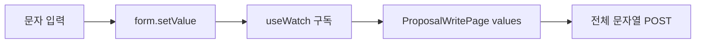

# 이력서·포트폴리오 기록

## 사례 1 — 제안 작성 controlled input 값 손실 방지

- 작업 유형: 버그 수정
- 관련 도메인/서비스: 시민참여 제안 작성
- 문제 출처: 사용자 피드백

### 문제 상황

사용자는 제안 작성 필드에 값을 입력해도 UI에 표시되지 않고, `qweetedf`처럼 여러 문자를 입력해 제출하면 마지막 문자 `f`만 저장되는 것으로 보인다고 제보했다. 기존 route 테스트는 완성 문자열을 한 번에 input event로 주입해 실제 문자 단위 입력과 controlled 렌더 구독을 검증하지 않았다. React Hook Form 값 변경을 외부 controlled UI에 전달할 때 명시적 구독이 없으면 브라우저 렌더 타이밍에 따라 stale value가 다시 주입될 위험이 있었다.

### 고민과 선택

- 사용자 제안: 입력값이 화면에 표시되고 전체 문자열이 생성 데이터에 들어가도록 수정한다.
- 에이전트 제안: production UI는 유지하고 route에서 React Hook Form의 `useWatch({ control })`로 렌더 구독을 명시하며 문자 단위 DOM·payload 테스트를 추가한다.
- 검토한 대안: HeroUI `onChange` adapter 변경, local `useState` 추가, `Controller`로 5개 필드 재작성.
- 최종 선택: 기존 controlled props 계약을 유지하고 `useWatch`만 route에 적용한다.
- 선택 이유와 제외한 방식의 이유: HeroUI v3 공식 문서와 테스트에서 `onChange`가 전체 event value를 전달했다. local state는 form 상태를 이중화하고, 5개 Controller 도입은 현재 callback 계약에 비해 과하다.

### 적용

- `CitizenAuxiliaryRoutes.tsx`에서 `form.watch()` snapshot을 `useWatch({ control: form.control })` 구독으로 교체했다.
- 초기 partial 반환을 완전한 `ProposalFormInput` 기본값으로 정규화했다.
- route test를 application과 같은 StrictMode로 감싸고 `qweetedf`를 문자 단위로 입력했다.
- DOM value와 실제 POST body의 전체 문자열을 함께 검증했다.

### 사용 기술과 구체적 목적

| 기술·구조·패턴 | 해결하려는 구체적 문제 | 적용 위치와 방식 |
| --- | --- | --- |
| React Hook Form `useWatch` | 외부 controlled UI의 stale form snapshot 위험 | route에서 control 구독 후 values prop 전달 |
| React StrictMode test | production root와 다른 렌더 생명주기 누락 | route harness를 StrictMode로 구성 |
| 문자 단위 interaction test | 완성 문자열 1회 주입이 놓치는 입력 누적 회귀 | 각 문자 후 controlled value 누적 |
| MSW request assertion | UI 표시와 실제 제출 상태가 다른 문제 | POST body의 전체 trim 문자열 검증 |

### 결과

- 적용 전: 사용자 브라우저에서 입력 미표시와 마지막 문자만 저장되는 증상이 있었다.
- 적용 후: route가 최신 form 값을 명시적으로 구독하고 테스트에서 `qweetedf` 전체 표시·제출이 확인됐다.
- 검증 결과: route 2 tests, focused 24 tests, lint, production build 통과.
- 사용자 후속 피드백: 없음.
- 추가 요청 및 남은 제한: 브라우저 자동화 금지로 실제 사용자 브라우저 재확인이 필요하다.

### 이력서·포트폴리오 문구

- 이력서 bullet: React Hook Form의 명시적 `useWatch` 구독과 StrictMode 문자 단위 회귀 테스트를 적용해 시민제안 controlled input의 값 손실 위험을 제거하고 전체 POST payload를 검증했다.
- 포트폴리오 서술: 제안 입력이 표시되지 않고 마지막 문자만 저장된다는 사용자 피드백을 분석했다. UI adapter 변경과 상태 이중화를 검토했지만 공식 HeroUI event 계약은 정상이고 local state는 중복을 만든다고 판단했다. route의 form snapshot을 `useWatch` 구독으로 교체하고 문자 단위 DOM·request 테스트를 적용해 전체 문자열이 표시·제출되는 흐름을 고정했다.

## 사례 2 — 고정 mock ID로 인한 잘못된 제안 상세 URL 수정

- 작업 유형: 버그 수정
- 관련 도메인/서비스: 시민참여 제안 생성·상세 이동
- 문제 출처: 사용자 피드백과 테스트 실패

### 문제 상황

사용자는 제안 생성 후 생성된 제안 ID의 상세 URL로 이동해야 하지만 항상 `proposal-created`로 이동한다고 제보했다. route는 mutation 응답 ID를 그대로 사용하고 있었고, MSW proposal POST가 모든 생성에 같은 literal ID를 반환·저장한 것이 원인이었다. 같은 ID를 재사용하면 연속 생성 데이터가 구분되지 않고 URL과 상세 상태의 현실성이 사라진다.

### 고민과 선택

- 사용자 제안: 생성된 해당 제안 ID로 이동한다.
- 에이전트 제안: route는 유지하고 MSW가 fixture와 충돌하지 않는 deterministic `proposal-N`을 생성하도록 한다.
- 검토한 대안: random UUID, timestamp ID, route에서 임의 ID 생성.
- 최종 선택: handler factory가 다음 빈 `proposal-N`을 찾아 생성마다 증가시킨다.
- 선택 이유와 제외한 방식의 이유: random/timestamp는 테스트 재현성이 낮고, route가 ID를 만들면 서버 응답을 신뢰하는 실제 아키텍처를 위반한다.

### 적용

- handler 초기화 시 fixture ID와 충돌하지 않는 다음 번호를 계산했다.
- POST마다 번호를 증가시키고 해당 ID로 `ContentDetailDto`를 저장·응답했다.
- 두 번 생성해 서로 다른 ID, 각 상세 조회, 최신순 목록을 검증했다.
- route test에서 custom 응답 `proposal-typed`가 pathname에 그대로 사용되는지 검증했다.

### 사용 기술과 구체적 목적

| 기술·구조·패턴 | 해결하려는 구체적 문제 | 적용 위치와 방식 |
| --- | --- | --- |
| Stateful MSW | mutation 성공 응답과 후속 조회 불일치 | 동일 `contentItems` store에 생성 detail 저장 |
| Deterministic sequence | 고정 ID 충돌과 random test 불안정성 | 다음 빈 `proposal-N` 발급 |
| API-level integration test | response ID·detail·list 단절 | 연속 POST 후 각 GET 검증 |
| Response-driven navigation | URL을 client가 임의 생성하는 문제 | mutation response ID를 route에 그대로 전달 |

### 결과

- 적용 전: 모든 제안 URL과 저장 ID가 `proposal-created`였다.
- 적용 후: 각 생성은 충돌 없는 ID를 받고 해당 ID로 상세 조회·navigation된다.
- 검증 결과: 동적 ID 테스트 RED에서 동일 ID를 확인한 뒤 GREEN, handler 전체 포함 focused 24 tests 통과.
- 사용자 후속 피드백: 없음.
- 추가 요청 및 남은 제한: 실제 backend 환경에서는 backend가 반환한 ID를 그대로 사용한다.

### 이력서·포트폴리오 문구

- 이력서 bullet: 고정 성공 ID를 반환하던 MSW를 deterministic stateful mock으로 개선해 연속 시민제안 생성의 ID 유일성, 상세 persistence, response 기반 navigation을 통합 검증했다.
- 포트폴리오 서술: 생성 route는 응답 ID를 정상 사용했지만 mock server가 항상 같은 ID를 반환해 잘못된 상세 URL이 만들어졌다. random ID와 client 생성 방식을 제외하고 테스트 재현성과 서버 책임을 모두 지키는 증가형 mock ID를 선택했다. 연속 생성·각 상세·목록·navigation 테스트를 통해 생성부터 조회까지 일관된 흐름으로 변경했다.

## 사례 3 — mutation 구문 오류로 중단된 제안 회귀 테스트 복구

- 작업 유형: 버그 수정
- 관련 도메인/서비스: 시민참여 mutation·테스트 인프라
- 문제 출처: 테스트·런타임 실패

### 문제 상황

제안 route 테스트를 실행하자 `useCitizenParticipationMutations.ts:95`에서 Vite parse error가 발생해 suite가 0 tests로 중단됐다. discussion mutation의 두 번째 cache invalidation이 arrow callback 밖에 배치돼 객체 문법을 깨뜨렸다. 이 오류를 남기면 제안 버그의 RED/GREEN 검증 자체가 불가능했다.

### 고민과 선택

- 사용자 제안: 직접 제시된 내용은 없으며 제안 생성 버그 수정이 요청됐다.
- 에이전트 제안: 범위를 확장하지 않고 두 invalidation을 기존 패턴의 `Promise.all`로 묶는 prerequisite 수정.
- 검토한 대안: 두 번째 invalidation 제거, 순차 await block, discussion mutation 전체 리팩터링.
- 최종 선택: detail/list invalidation 의도를 보존하는 `Promise.all` 최소 수정.
- 선택 이유와 제외한 방식의 이유: 제거는 기존 의도를 잃고 전체 리팩터링은 제안 버그 범위를 벗어난다.

### 적용

- discussion `onSuccess`가 detail과 list invalidation promise를 함께 반환하도록 구문을 수정했다.
- 수정 직후 proposal route test 2개가 다시 로드·통과하는지 확인했다.

### 사용 기술과 구체적 목적

| 기술·구조·패턴 | 해결하려는 구체적 문제 | 적용 위치와 방식 |
| --- | --- | --- |
| `Promise.all` | 두 cache invalidation의 유효한 callback 반환과 병렬 실행 | discussion mutation `onSuccess` |
| Vitest parser repro | 테스트가 로직 전에 중단되는 문제 분리 | proposal route suite 직접 실행 |

### 결과

- 적용 전: Vite parser error로 proposal route suite 0 tests.
- 적용 후: route suite가 정상 로드되고 2 tests 통과.
- 검증 결과: lint, TypeScript/Vite build, focused tests 통과.
- 사용자 후속 피드백: 없음.
- 추가 요청 및 남은 제한: 해당 구문 오류가 생긴 원래 변경 세션은 이번 대화에서 확인되지 않았다.

### 이력서·포트폴리오 문구

- 이력서 bullet: 기능 회귀 테스트를 중단시키던 mutation callback 구문 오류를 실행 근거로 분리하고, cache invalidation 의도를 보존하는 `Promise.all` 최소 수정으로 테스트·빌드 경로를 복구했다.
- 포트폴리오 서술: 제안 버그 재현 중 feature mutation의 parse error로 테스트가 로직에 도달하지 못했다. invalidation 제거나 광범위 리팩터링 대신 기존 detail/list 갱신 의도를 유지하는 최소 `Promise.all` 수정으로 parser를 복구했고, focused tests와 production build를 통해 제안 수정 검증을 재개했다.
