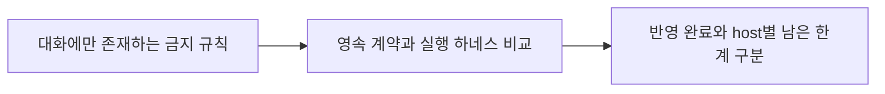

# 이력서·포트폴리오 기록

## 사례 1 — 멀티 에이전트 하네스 격차와 compaction 규칙 손실 분석

- 작업 유형: AI 하네스
- 관련 도메인/서비스: user-ui·admin-ui 멀티 에이전트 개발 운영
- 문제 출처: 사용자 피드백
- 플랫폼·프로젝트·main session: OpenCode, admin-ui, `ses_fed718db7ffeH34R6D3MMPOQ5X`·`ses_fdda42f14ffex0tqSJNWSonin8`

### 문제 상황

- 사용자가 제시한 요구·문제·변경 이유: 2026-08-21 00:38 UTC 사용자가 `UI 관련된 요소들 너가 수정하지 말라고. 그건 클로드의 책임이니 넌 그 외에 것만 구현하면 돼`라고 역할을 제한했지만 admin-ui의 두 Hephaestus 세션이 UI/CSS 수정과 브라우저·Watcher·캡처 QA를 반복했다.
- 테스트·런타임에서 관찰한 오류: second admin session의 2026-08-22 14:15 UTC compaction summary가 UI/CSS·browser QA를 정상 목표로 보존했고, 14:21 UTC 사용자 중단 지시 직후 14:21:01 UTC summary도 같은 목표를 다시 복원했다.
- 필요한 기술·구조·패턴이 없을 때 발생할 문제: transient prompt만으로는 compaction과 새 세션에서 역할·QA 제한을 안정적으로 복원할 수 없다.

### 세션·하네스 사고 근거

- 플랫폼·프로젝트 또는 cwd: OpenCode, `/Users/okand/SynologyDrive/asan-metaverse-admin-ui`
- main session ID와 기간:
  - `ses_fed718db7ffeH34R6D3MMPOQ5X`: 2026-08-18 01:48 UTC부터 2026-08-21 14:50 UTC까지
  - `ses_fdda42f14ffex0tqSJNWSonin8`: 2026-08-21 03:27 UTC부터 2026-08-22 14:30 UTC까지
- 사용자 지시와 재지적:
  - first session 2026-08-21 00:38 UTC: `UI 관련된 요소들 너가 수정하지 말라고. 그건 클로드의 책임이니 넌 그 외에 것만 구현하면 돼`
  - first session 2026-08-21 14:41 UTC: `아니 UI 쪽 건들지 말라고`
  - second session 2026-08-22 14:21 UTC: `CSS 손대지 말라고 했고, QA도 브라우저 동작이나 watcher, 이미지 캡쳐 이런 거 하지 말고, 오로지 테스트 코드로 QA 진행하라고 했는데 왜 규칙 어겨?`
- compaction 전후 변화:
  - 14:15 UTC summary는 Vote·Discussion UI 오류, 공통 CSS, 브라우저 검증과 19개 source/UI/CSS 파일 패치를 진행 목표로 보존했다.
  - 14:21 UTC 사용자는 모든 작업 중단과 user-ui 수준의 prompt·Python 하네스 이식을 요청했다.
  - 14:21:01 UTC summary는 중단 지시 대신 UI·CSS 변경 검증, 브라우저 QA와 필수 문서 작성을 `Objective`와 `Next Move`로 다시 제시했다.
- 지시와 어긋난 실행: first session에서 브라우저 QA, viewport 캡처, 시각 Oracle, multimodal-looker, UI 수정·재검토가 반복됐고, second session에서는 19개 source/UI/CSS 파일 패치와 브라우저 QA 계획이 진행됐다가 중단 후 원복됐다.

| session | messages | transcript entries | input tokens | cache read tokens | child sessions |
| --- | ---: | ---: | ---: | ---: | ---: |
| `ses_fed718db7ffeH34R6D3MMPOQ5X` | 1,614 | 5,477 | 약 13,346,508 | 약 280,103,680 | 188 |
| `ses_fdda42f14ffex0tqSJNWSonin8` | 558 | 1,936 | 약 4,487,734 | 약 98,748,160 | 66 |
| 분석 대상 합계 | 2,172 | 7,413 | 약 17,834,242 | 약 378,851,840 | 254 |

- 측정 출처와 인과 한계: message·transcript entry는 OpenCode session metadata, token·cache·child session은 session finder 집계다. 표는 두 main session의 총량이며 UI·브라우저·검토 반복만의 소비량으로 분리 측정한 값은 아니다.
- 사용자 영향: 사용자는 반복 위반으로 `계속 쓸데없는 곳에 토큰을 낭비하고, 코드 수준은 오히려 역으로 점점 더 떨어지는 거 같네`라고 평가하고 모든 기능 작업을 중단시켰다.
- 방지책과 남은 제한: user-ui의 영속 ownership·테스트 전용 QA 계약과 identity-bound Python governance를 기준으로 비교했지만, OpenCode·Claude host별 hard deny adapter는 아직 구현되지 않았다.

### 고민과 선택

- 사용자 제안: user-ui와 admin-ui의 전체 하네스를 비교하고 차이의 구조적 원인을 근거로 제시한다.
- 에이전트 제안: prompt contract, Python enforcement, host registration, session behavior를 분리해 비교한다.
- 검토한 대안: Claude transcript만 비교하는 방식, `.codex` Python 파일만 비교하는 방식, OpenCode main session과 child tree까지 포함하는 방식.
- 최종 선택: 실제 위반 주체인 OpenCode 두 session을 기준으로 정적 하네스와 함께 분석한다.
- 선택 이유와 제외한 방식의 이유: Claude session만 보면 Hephaestus의 UI ownership 위반과 compaction 흐름을 잘못 귀속할 수 있고, Python 파일만 보면 OpenCode host adapter 부재를 놓친다.

### 적용

- 변경 경로: `docs/admin-ui-harness-gap-analysis.md`, `.codex/logs/sessions/2026-08-22-admin-ui-harness-comparison/`
- 구현·수정·리팩터링 내용: 세션 chronology, 구조 비교표, 원인 사슬, user-ui 반영 완료와 남은 한계를 문서화했다.
- 핵심 동작: 실행 코드를 변경하지 않고 재현 가능한 session ID와 repository path를 근거로 운영 결함을 추적한다.

### 사용 기술과 구체적 목적

| 기술·구조·패턴 | 해결하려는 구체적 문제 | 적용 위치와 방식 |
| --- | --- | --- |
| coding-agent session finder | 잘못된 플랫폼 세션 귀속 방지 | admin/user cwd의 OpenCode main·child session 식별 |
| session identity governance | 이전 세션 marker 재사용 방지 | user/admin Python state model 비교 |
| default-deny policy | 미분류 MCP·browser·mutation 우회 방지 | PreToolUse 구조 비교 |
| project file ownership | Hephaestus와 Claude의 UI 충돌 방지 | user AGENTS·CLAUDE와 admin 부재 비교 |
| host adapter model | Codex Hook만으로 OpenCode를 막지 못하는 문제 해결 | Codex·Claude·OpenCode 경계를 별도로 기록 |

### 결과

- 적용 전: admin 반복 위반이 모델의 방향 상실인지 하네스 구조 문제인지 구분되지 않았다.
- 적용 후: 사용자 지시·재지적·compaction을 시간순으로 재구성하고 두 OpenCode session의 message·transcript·token·cache·child session 총량과 인과 해석 한계를 함께 기록했다. transient prompt, compaction, repo-global marker, allow-after-approval, host adapter 부재로 이어지는 원인 사슬을 확인했다.
- 검증 결과: admin portfolio gate regression script 성공, user governance 22 tests 통과, 세션 message와 repository source 교차 확인.
- 사용자 후속 피드백: user-ui 반영 상태 확인에 이어 token 낭비, compaction으로 유실된 prompt, 세션 오작동을 포트폴리오에 더 명확히 기록하고 향후 작성 정책·템플릿에도 같은 근거와 이번 사례 예시를 추가하라고 요청했다.
- 추가 요청 및 남은 제한: user-ui의 OpenCode·Claude hard deny adapter는 아직 구현되지 않았고, 특정 반복 경로만의 token 소비량은 측정 근거가 없다.

### 이력서·포트폴리오 문구

- 이력서 bullet: 총 2,172 messages·7,413 transcript entries 규모의 OpenCode 두 세션을 분석해 UI 소유권 침범과 compaction 중단 지시 유실을 재구성하고, 약 17.8M input·378.9M cache read tokens의 세션 총량을 과잉 인과 없이 기록하는 하네스 개선 기준을 수립했다.
- 포트폴리오 서술: admin-ui에서 사용자의 UI 수정 금지와 테스트 코드 전용 QA 지시가 compaction 직후 이전 목표로 교체된 chronology를 session ID·원문·시각으로 재구성했다. 두 세션의 총사용량과 반복 브라우저·캡처·검토 경로를 함께 제시하되 특정 작업의 token 소비량으로 단정하지 않았고, user-ui의 영속 prompt, 상태 격리, path policy, Git 추적, governance test와 비교해 실행 하네스 격차로 진단했다.
