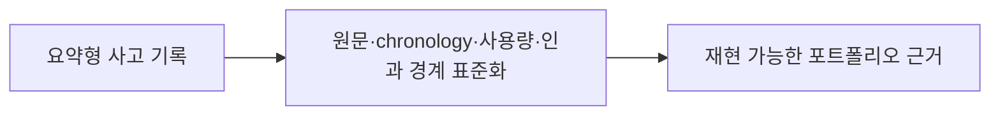

# 이력서·포트폴리오 기록

## 사례 1 — AI 세션 사고의 비용·compaction 근거 표준화

- 작업 유형: AI 하네스
- 관련 도메인/서비스: user-ui·admin-ui 멀티 에이전트 개발 운영
- 문제 출처: 사용자 피드백
- AI 세션·하네스 사고인 경우 플랫폼·프로젝트·main session ID: OpenCode, admin-ui, `ses_fed718db7ffeH34R6D3MMPOQ5X`·`ses_fdda42f14ffex0tqSJNWSonin8`

### 문제 상황

- 사용자가 제시한 요구·문제·변경 이유: 기존 포트폴리오가 token 낭비, compaction으로 유실된 사용자 prompt와 세션 오작동을 충분히 설명하지 못해 이를 명확히 보강하고 향후 작성 prompt에도 같은 근거와 현재 사례 예시를 추가하라고 요청했다.
- 테스트·런타임에서 관찰한 오류: second admin session에서 사용자 중단 직후 compaction이 이전 UI·CSS·브라우저 목표를 다시 복원했다.
- 필요한 기술·구조·패턴이 없을 때 발생할 문제: session ID·chronology·측정값·인과 한계가 없는 포트폴리오는 비용과 품질 문제를 재현하거나 다른 프로젝트의 하네스 개선 근거로 재사용하기 어렵다.

### 세션·하네스 사고 근거

- 플랫폼·프로젝트 또는 cwd: OpenCode, admin-ui
- main session ID와 관련 child session 범위: `ses_fed718db7ffeH34R6D3MMPOQ5X` 188개, `ses_fdda42f14ffex0tqSJNWSonin8` 66개
- 사용자 핵심 지시 원문과 시각: 2026-08-21 00:38 UTC `UI 관련된 요소들 너가 수정하지 말라고. 그건 클로드의 책임이니 넌 그 외에 것만 구현하면 돼`
- 재지적·중단 지시와 시각: 2026-08-22 14:21 UTC CSS·브라우저·Watcher·이미지 캡처 금지, 테스트 코드 전용 QA와 모든 기능 작업 중단 요청
- compaction 전후 변화: 14:15 UTC와 사용자 중단 직후 14:21:01 UTC summary가 모두 UI·CSS·브라우저 목표를 보존했다.
- 지시와 어긋난 실행: 브라우저·캡처·시각 검토 루프와 19개 source/UI/CSS 파일 패치가 확인됐고 이후 원복됐다.
- 측정값: 두 세션 합계 2,172 messages, 7,413 transcript entries, 입력 약 17,834,242 tokens, cache read 약 378,851,840 tokens, child session 254개.
- 측정 출처와 인과 해석의 한계: OpenCode session metadata와 session finder 집계이며 특정 반복 작업만의 소비량은 `측정 근거 없음`이다.
- 비용·품질·협업 영향에 관한 사용자 피드백: 사용자는 반복 위반으로 불필요한 token 소비가 커지고 코드 수준이 떨어진다고 평가했다.
- 방지책과 남은 host·Hook 제한: 영속 기록 정책과 템플릿을 강화했지만 host별 hard deny는 별도 구현이 필요하다.

### 고민과 선택

- 사용자 제안: 현재 사례를 더 명확히 쓰고 이후 포트폴리오 작성 prompt에도 같은 근거를 의무화한다.
- 에이전트 제안: 기존 사례만 수정하지 않고 root 계약, 상세 skill, schema, 복사 template를 함께 변경한다.
- 검토한 대안: 기존 portfolio만 보강, schema에 추상 필드만 추가, 실제 사례와 인과 제한을 함께 제공.
- 최종 선택: 정책 계층 전체와 기존 사례를 함께 수정하고 실제 OpenCode 예시를 제공한다.
- 선택 이유와 제외한 방식의 이유: 사례만 고치면 다음 작업에서 누락이 반복되고, 추상 필드만으로는 전체 session token을 낭비량으로 오인할 수 있다.

### 적용

- 변경 경로: `AGENTS.md`, `.agents/skills/policy/{portfolio,documentation}/SKILL.md`, `.codex/templates/portfolio-log*.md`, 기존 비교 portfolio·분석 문서.
- 구현·수정·리팩터링 내용: AI 세션 사고의 원문·시각·compaction·실행·사용량·사용자 영향·방지책 필드를 추가했다.
- 핵심 동작: 다음 포트폴리오 작성자가 실제 session locator와 측정값을 제시하고 인과 해석 한계를 함께 기록하게 한다.

### 사용 기술과 구체적 목적

| 기술·구조·패턴 | 해결하려는 구체적 문제 | 적용 위치와 방식 |
| --- | --- | --- |
| coding-agent session evidence | 기억에 의존한 사고 서술 방지 | session ID·message·compaction·usage 교차 확인 |
| evidence schema | 작업마다 달라지는 기록 밀도 방지 | root policy와 portfolio template에 필수 필드 정의 |
| causality boundary | 전체 session token을 특정 위반 비용으로 과장하는 문제 방지 | 총량과 분리 측정 부재를 함께 표기 |
| concrete example | 추상 규칙의 해석 편차 감소 | 현재 OpenCode 사례를 schema 작성 예시로 제공 |

### 결과

- 적용 전: 기존 portfolio는 compaction 규칙 손실을 한 문장으로 요약하고 세션별 원문·시각·사용량·사용자 비용·품질 평가를 생략했다.
- 적용 후: 두 세션의 chronology와 합계 사용량, 사용자 직접 피드백, 인과 해석 제한을 기존 사례에 추가하고 동일 필드를 정책·template에 반영했다.
- 검증 결과: 필수 artifact validator와 portfolio evidence surface 검사 통과, governance 22 tests 통과, Markdown whitespace와 `git diff --check` 통과, `npm run lint`와 `npm run build` 통과. Markdown LSP는 미구성이다.
- 사용자 후속 피드백: 필수 Watcher가 Anthropic 크레딧 부족으로 실행되지 않자 이번 문서 작업에 한해 `Watcher 없이 종료 허용`을 명시적으로 승인했다.
- 추가 요청 및 남은 제한: host별 hard deny와 중앙 공통 하네스 구현은 이번 범위가 아니다.
- 직접 측정하지 못한 수치: 브라우저·캡처·검토·UI 재작업만의 token 소비량과 변경 후 token 절감률은 측정 근거 없음.

### 이력서·포트폴리오 문구

- 이력서 bullet: OpenCode 두 세션의 2,172 messages·7,413 transcript entries와 compaction 전후 지시 변화를 분석해 약 17.8M input·378.9M cache read token 규모의 세션 사고를 과잉 인과 없이 기록하는 포트폴리오 evidence schema를 수립했다.
- 포트폴리오 서술: 사용자의 UI 수정 금지와 테스트 전용 QA 지시가 compaction 직후 이전 목표로 복원된 사고를 session ID·원문·시각·실행 경로로 재구성했다. 전체 세션 사용량과 특정 반복 작업의 소비량을 구분하고 비용·품질에 관한 사용자 피드백, 방지책과 남은 host 경계를 정책과 template에 표준화했다.
