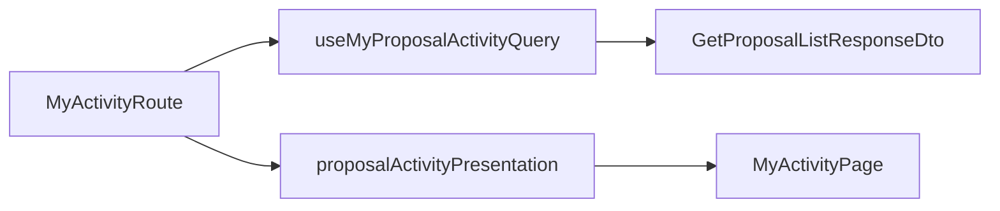

# 이력서·포트폴리오 기록

## 사례 1 — 오류 유형으로 오염된 React Query 훅을 import 경계에서 복구

- 작업 유형: 버그 수정
- 관련 도메인/서비스: 시민참여 내 활동·제안 목록
- 문제 출처: 사용자 요구
- AI 세션·하네스 사고인 경우 플랫폼·프로젝트·main session ID: 해당 없음

### 문제 상황

- 사용자가 제시한 요구·문제·변경 이유: `CitizenAuxiliaryRoutes.tsx` 67–70행의 `Unsafe assignment of an error typed value`를 고치고 검증한 뒤 짧게 설명하라
- 테스트·런타임에서 관찰한 오류: CLI `tsc`/`eslint`는 통과했으나 ReadLints는 `useMyProposalActivityQuery` 호출과 `.data` 할당을 오류 유형으로 표시했다. 훅 파일에서는 `citizenParticipationKeys.proposalList(query)`가 해결되지 않았고, `ProposalListRoute`도 동일 훅에서 22개 오류가 났다
- 필요한 기술·구조·패턴이 없을 때 발생할 문제: 편집기/CI projectService가 훅을 오류 유형으로 보면 이후 `.items`/`.map`까지 `no-unsafe-*`로 막혀 제안 내 활동 화면을 타입 안전하게 유지할 수 없다

### 세션·하네스 사고 근거

해당 없음

### 고민과 선택

- 사용자 제안: 해당 코드를 고친다 (`Fix it`)
- 에이전트 제안: eslint-disable/`as any`가 아니라 DTO·`useQuery` 제네릭·barrel 순환·presentation↔페이지 순환을 끊는다
- 검토한 대안: 훅에 `UseQueryResult`만 명시, query key 인라인, presentation의 ActivityItem import 유지, 매퍼를 JSX `items={array.map(fn)}`에 직접 전달
- 최종 선택과 제외 이유: 수동 `GetProposalListResponseDto`, `useQuery<..., QueryKey>`, pages의 깊은 경로 import, `proposalActivityPresentation.ts` 분리를 선택했다. disable과 `any`는 규약 위반이고, barrel 재export를 남기면 ListRoutes에서 훅이 다시 오류 유형이 되었다

### 적용

- `proposal.dto.ts`의 목록 item/response를 `z.infer` 대신 수동 `type`으로 고정했다
- `useProposalListQuery`/`useMyProposalActivityQuery`에 `QueryKey` 제네릭을 넣고 query key는 기존 `list("proposal", query)`를 쓴다
- `useCitizenRouteState`와 `CitizenListRoutes`가 feature barrel 대신 훅·상수·페이지 모듈을 직접 import한다
- `toActivityItemFromProposalList`를 `proposalActivityPresentation.ts`로 옮기고, AuxiliaryRoutes는 JSX 밖에서 매핑한다

### 사용 기술과 구체적 목적

| 기술 | 목적 | 위치 |
| --- | --- | --- |
| 수동 DTO `type` | Zod infer가 훅 data를 오류 유형으로 만들지 않게 | `proposal.dto.ts` |
| TanStack Query `QueryKey` 제네릭 | `as const` queryKey 추론을 끊고 data를 `GetProposalListResponseDto`로 고정 | `useCitizenParticipationQueries.ts` |
| 깊은 경로 import | feature barrel 재export가 훅 바인딩을 불완전하게 만들지 않게 | `CitizenListRoutes.tsx`, `useCitizenRouteState.ts` |
| 매퍼 모듈 분리 | presentation이 MyActivityPage 타입을 다시 끌어 순환하지 않게 | `proposalActivityPresentation.ts` |

### 결과

- 적용 전: `proposalResponse = proposalActivityQuery.data`가 오류 유형 할당. ListRoutes도 동일
- 적용 후: 해당 할당과 ReadLints 대상 파일 오류 없음. 요청/응답 런타임 계약은 유지
- 검증: vitest 12 files / 56 tests passed, `npm run lint` exit 0, `npm run build` exit 0
- 사용자 후속 피드백: 없음

### 이력서·포트폴리오 문구

- 이력서 bullet: React Query 훅이 Zod infer·barrel 재export 순환으로 오류 유형이 되어 내 활동 라우트 할당이 막히자, 수동 DTO와 `QueryKey` 제네릭·깊은 import로 타입을 복구하고 lint/build를 통과시켰다
- 포트폴리오 서술: 편집기는 `useMyProposalActivityQuery`를 오류 유형으로 보고 CLI tsc는 통과하는 불일치가 있었다. 훅 반환을 명시하고 pages가 feature 인덱스에 의존하지 않게 바꾸자, `.data` 할당과 목록 매핑이 다시 타입 검사되었다
