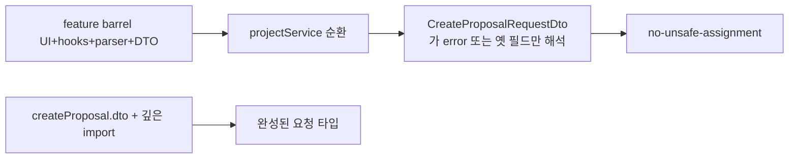

# 이력서·포트폴리오 기록

## 사례 1 — 제안 생성 API의 typescript-eslint error 유형 할당 제거

- 작업 유형: 버그 수정
- 관련 도메인/서비스: 시민참여 proposal create
- 문제 출처: 사용자 요구

### 문제 상황

- 사용자가 제시한 요구·문제·변경 이유: `proposal.api.ts` 29–32행 `Unsafe assignment of an error typed value`를 고치고, 같은 오류가 반복되는 근본 원인을 설명하라고 했다.
- 테스트·런타임에서 관찰한 오류: ReadLints가 `background`/`content`/`expectedEffect`/`referenceCase` 할당만 오류로 보고 `title`은 통과했다. CLI eslint는 같은 파일이 통과했다.
- 필요한 기술·구조·패턴이 없을 때 발생할 문제: TypeScript `error` 유형이 요청 DTO에 들어가면 새 필드 접근이 전부 unsafe 할당이 되고, 생성 body가 타입 검사에서 빠져나간다.

### 세션·하네스 사고 근거

해당 없음

- 플랫폼·프로젝트 또는 cwd: Cursor, asan-metaverse-user-ui
- main session ID와 관련 child session 범위: 측정 근거 없음
- 사용자 핵심 지시 원문과 시각: 2026-08-25 22:45 KST에 해당 코드의 오류를 고치고 반복 원인을 물었다.
- 재지적·중단 지시와 시각: 없음
- compaction 전후 `Objective`·제한·`Next Move` 변화: 해당 없음
- 지시와 어긋난 파일 수정·도구·검토·캡처·재작업: 없음. `ProposalWritePage`는 수정하지 않았다.
- message·transcript entry·input token·cache read·child session 측정값: 측정 근거 없음
- 측정 출처와 인과 해석의 한계: 전체 세션 token을 이 작업 소비량으로 단정하지 않는다.
- 비용·품질·협업 영향에 관한 사용자 피드백: 없음
- 방지책과 남은 host·Hook 제한: 시민참여 pages/테스트는 feature barrel이 아니라 `hook/`·`api/`·`ui/`에서 가져온다.

### 고민과 선택

- 사용자 제안: 오류를 고치고 반복 원인을 설명한다.
- 에이전트 제안: 29–32행 단언이 아니라 barrel 순환과 생성 DTO 모듈 경계가 원인이다.
- 검토한 대체안: (1) 할당에 단언 (2) 객체 리터럴을 로컬 변수로만 이동 (3) 생성 DTO 분리 + barrel 소비 제거
- 최종 선택: (3)
- 선택 이유와 제외한 방식의 이유: `title`만 통과한 것은 옛 DTO로 읽힌 증상이다. 단언은 `error` 유형을 남긴다. 직전 vote detail도 barrel import를 끊어서 해결했다.

### 적용

- 변경 경로: `createProposal.dto.ts`, `proposal.api.ts`, `index.ts`, `CitizenMainRoute.tsx`, `CitizenReadDetailRoutes.tsx`, `CitizenCommentReportPopup.tsx`, presentation 테스트
- 구현·수정·리팩터링 내용: 생성 요청 타입을 목록 DTO 파일에서 분리하고, Location 파싱을 `postProposal`이 수행한다. pages와 테스트는 barrel 대신 깊은 경로를 쓴다.
- 핵심 동작: 생성 POST body와 201 Location→id 변환은 그대로다.

### 사용 기술과 구체적 목적

| 기술·구조·패턴 | 해결하려는 구체적 문제 | 적용 위치와 방식 |
| --- | --- | --- |
| DTO 모듈 분리 | 한 파일의 미완성 심볼이 생성 요청 타입을 `error`로 만듦 | `createProposal.dto.ts` |
| FSD 깊은 import | barrel이 훅·parser·DTO를 한 그래프에 묶어 projectService가 `error`를 넣음 | pages 라우트와 presentation 테스트 |

### 결과

- 적용 전: `proposal.api.ts` 생성 body 할당이 IDE에서 error 유형이었다.
- 적용 후: `proposal.api.ts` ReadLints 오류가 없다.
- 검증 결과: 관련 vitest 12 files / 71 tests passed, 변경 경로 eslint 성공.
- 사용자 후속 피드백: 없음
- 추가 요청 및 남은 제한: `parseVoteResponse`를 mutations에서 쓰면 IDE에 같은 메시지가 남을 수 있다.
- 직접 측정하지 못한 수치: 측정 근거 없음

### 이력서·포트폴리오 문구

- 이력서 bullet: 제안 생성 API에서 typescript-eslint `error` 유형 할당을, feature barrel 순환을 끊고 생성 DTO를 별도 모듈로 분리해 제거했다.
- 포트폴리오 서술: CLI eslint는 통과하고 IDE만 실패하는 패턴이었다. `title`만 유효한 것은 옛 요청 DTO로 읽힌 증거였다. 생성 계약을 목록 DTO와 분리하고 pages가 barrel을 쓰지 않게 바꿔 관련 테스트 71건이 통과했다.
