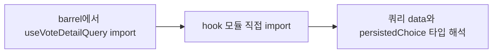

# 이력서·포트폴리오 기록

## 사례 1 — 투표 상세 라우트의 barrel 순환 타입 오류 제거

- 작업 유형: 버그 수정
- 관련 도메인/서비스: 시민참여 vote detail route
- 문제 출처: 사용자 요구, 검토 결과

### 문제 상황

- 사용자가 제시한 요구·문제·변경 이유: `CitizenParticipationDetailRoutes.tsx` 68–71행 `persistedChoice` 할당에서 `Unsafe assignment of an error typed value`가 난다. 고치고 검증한 뒤 짧게 설명하라고 했다.
- 테스트·런타임에서 관찰한 오류: ReadLints 13건. L50 `useVoteDetailQuery`가 `Unsafe call of a type that could not be resolved`였고, `.data`/`myChoice`/`persistedChoice` 할당은 그 후속 오류였다.
- 필요한 기술·구조·패턴이 없을 때 발생할 문제: feature barrel이 훅 반환 타입을 순환 참조로 깨면 typescript-eslint가 쿼리 결과를 오류 유형으로 보고, `myChoice === null` 분기가 타입 검사를 통과하지 못한다.

### 세션·하네스 사고 근거

해당 없음

- 플랫폼·프로젝트 또는 cwd: Cursor, asan-metaverse-user-ui
- main session ID와 관련 child session 범위: 측정 근거 없음
- 사용자 핵심 지시 원문과 시각: 2026-08-25 20:23에 해당 코드의 eslint 오류를 고치라고 했다.
- 재지적·중단 지시와 시각: 없음
- compaction 전후 `Objective`·제한·`Next Move` 변화: 해당 없음
- 지시와 어긋난 파일 수정·도구·검토·캡처·재작업: 없음. `VoteDetailPage`는 수정하지 않았다.
- message·transcript entry·input token·cache read·child session 측정값: 측정 근거 없음
- 측정 출처와 인과 해석의 한계: 전체 세션 token을 이 작업 소비량으로 단정하지 않는다.
- 비용·품질·협업 영향에 관한 사용자 피드백: 없음
- 방지책과 남은 host·Hook 제한: pages 라우트는 시민참여 훅을 barrel이 아니라 `hook/` 경로에서 가져온다.

### 고민과 선택

- 사용자 제안: 해당 할당 오류를 고친다.
- 에이전트 제안: 68–71행 값이 아니라 `useVoteDetailQuery` import가 오류 유형의 원인이다. 목록 라우트와 같이 깊은 경로로 바꾼다.
- 검토한 대체안: (1) `persistedChoice`에 단언 추가 (2) 훅 반환 타입을 사용처에서 재선언 (3) barrel 대신 깊은 import
- 최종 선택: (3)
- 선택 이유와 제외한 방식의 이유: L50부터 훅 호출이 해석되지 않는다. 단언은 순환을 남긴다. 같은 패턴이 `CitizenListRoutes`에서 이미 통과했다.

### 적용

- 변경 경로: `src/pages/citizen-participation/ui/CitizenParticipationDetailRoutes.tsx`
- 구현·수정·리팩터링 내용: `useVoteDetailQuery` 등 훅과 `VoteDetailPage`를 `~/features/citizen-participation` barrel이 아니라 `hook/`·`ui/` 경로에서 가져온다. `persistedChoice` 로직은 그대로다.
- 핵심 동작: 쿼리 `data.myChoice`와 mutation `choice` 병합 동작은 변하지 않고, 타입이 해석된다.

### 사용 기술과 구체적 목적

| 기술·구조·패턴 | 해결하려는 구체적 문제 | 적용 위치와 방식 |
| --- | --- | --- |
| FSD 깊은 import | feature barrel 순환이 훅 반환 타입을 오류 유형으로 만듦 | `useCitizenParticipationQueries`에서 `useVoteDetailQuery`를 직접 import |

### 결과

- 적용 전: `useVoteDetailQuery`와 `persistedChoice`가 eslint 오류 유형이었다.
- 적용 후: 대상 파일 ReadLints·eslint 오류가 없다.
- 검증 결과: 파일 eslint 성공, 관련 vitest 10 passed.
- 사용자 후속 피드백: 없음
- 추가 요청 및 남은 제한: 다른 barrel 사용 pages 라우트는 같은 오류가 날 수 있다.
- 직접 측정하지 못한 수치: 측정 근거 없음

### 이력서·포트폴리오 문구

- 이력서 bullet: 투표 상세 라우트에서 feature barrel 순환으로 깨진 TanStack Query 타입을 훅 모듈 직접 import로 복구해, `myChoice` null 병합 할당의 typescript-eslint 오류를 제거했다.
- 포트폴리오 서술: 할당문 단언으로는 훅 호출부터 해석되지 않는 오류가 남는다. 목록 라우트와 같은 깊은 import로 바꿔 상세 라우트 테스트 10건과 파일 eslint가 통과했다.
