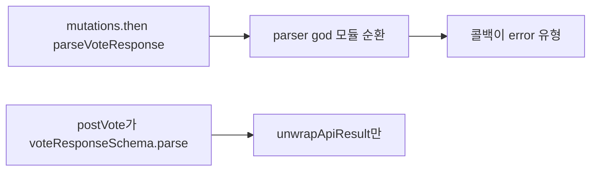

# 이력서·포트폴리오 기록

## 사례 1 — 투표 mutation parser `.then`의 error 유형 인자 제거

- 작업 유형: 버그 수정
- 관련 도메인/서비스: 시민참여 vote submit
- 문제 출처: 사용자 요구

### 문제 상황

- 사용자가 제시한 요구·문제·변경 이유: `useCitizenParticipationMutations.ts` 51–54행 `Unsafe argument of type error typed`를 고치고 검증한 뒤 짧게 설명하라고 했다.
- 테스트·런타임에서 관찰한 오류: ReadLints L51 `.then(parseVoteResponse)`가 error 유형 함수를 Promise 콜백에 넘긴다.
- 필요한 기술·구조·패턴이 없을 때 발생할 문제: parser 순환으로 투표 성공 콜백 타입이 깨지면 `choice` 무효화·캐시 갱신 타입이 검사되지 않는다.

### 세션·하네스 사고 근거

해당 없음

- 플랫폼·프로젝트 또는 cwd: Cursor, asan-metaverse-user-ui
- main session ID와 관련 child session 범위: 측정 근거 없음
- 사용자 핵심 지시 원문과 시각: 2026-08-25 23:19 KST에 해당 코드의 오류를 고치라고 했다.
- 재지적·중단 지시와 시각: 없음
- compaction 전후 `Objective`·제한·`Next Move` 변화: 해당 없음
- 지시와 어긋난 파일 수정·도구·검토·캡처·재작업: 없음
- message·transcript entry·input token·cache read·child session 측정값: 측정 근거 없음
- 측정 출처와 인과 해석의 한계: 전체 세션 token을 이 작업 소비량으로 단정하지 않는다.
- 비용·품질·협업 영향에 관한 사용자 피드백: 없음
- 방지책과 남은 host·Hook 제한: mutation 응답 파싱은 `citizenParticipation.parser`가 아니라 feature API/DTO에서 한다.

### 고민과 선택

- 사용자 제안: 해당 `.then` 오류를 고친다.
- 에이전트 제안: `parseVoteResponse`가 parser 순환으로 `error` 유형이다. 생성 POST처럼 `postVote`가 파싱한다.
- 검토한 대체안: (1) `.then` 단언 (2) mutations에서 `voteResponseSchema.parse` (3) `vote.api.ts`에서 파싱
- 최종 선택: (3)
- 선택 이유와 제외한 방식의 이유: 단언은 순환을 남긴다. 생성 POST와 같은 API 파싱이 훅을 parser 그래프에서 빼낸다.

### 적용

- 변경 경로: `vote.api.ts`, `useCitizenParticipationMutations.ts`, `citizenParticipation.api.test.ts`
- 구현·수정·리팩터링 내용: `postVote`가 `voteResponseSchema.parse`로 성공 data를 좁힌다. 훅은 `unwrapApiResult`만 한다.
- 핵심 동작: POST body `{ choice }`와 성공 `{ id, completed, choice }`는 그대로다.

### 사용 기술과 구체적 목적

| 기술·구조·패턴 | 해결하려는 구체적 문제 | 적용 위치와 방식 |
| --- | --- | --- |
| Feature API 파싱 | mutations→parser 순환이 `parseVoteResponse`를 `error`로 만듦 | `vote.api.ts`의 `toVoteResponseResult` |

### 결과

- 적용 전: `.then(parseVoteResponse)`가 IDE eslint 오류였다.
- 적용 후: 대상 훅 ReadLints 오류가 없다.
- 검증 결과: 관련 vitest 12 files / 71 tests passed, 변경 파일 eslint 성공.
- 사용자 후속 피드백: 없음
- 추가 요청 및 남은 제한: 훅이 다시 parser를 `.then`하면 같은 오류가 난다.
- 직접 측정하지 못한 수치: 측정 근거 없음

### 이력서·포트폴리오 문구

- 이력서 bullet: 투표 mutation에서 parser 순환으로 깨진 typescript-eslint 콜백 타입을, 응답 파싱을 `vote.api`로 옮겨 제거했다.
- 포트폴리오 서술: `.then(parseVoteResponse)` 단언으로는 parser가 `error` 유형인 상태가 남는다. 생성 POST와 같이 API가 스키마로 좁히게 바꿔 관련 테스트 71건이 통과했다.
