# 이력서·포트폴리오 기록

## 사례 1 — 제안 생성 POST를 확정 body·201 Location 계약에 맞춤

- 작업 유형: API 계약 수정
- 관련 도메인/서비스: 시민참여 proposal create
- 문제 출처: 사용자 요구

### 문제 상황

- 사용자가 제시한 요구·문제·변경 이유: 제안하기 버튼의 요청 body는 `title`/`background`/`content`/`expectedEffect`와 선택 `referenceCase`다. 성공하면 201과 `Location: /citizen/proposals/{id}`를 준다. `referenceCase`만 선택이며 생략하면 `null`로 저장된다. 기존 API를 이 구조에 맞게 수정하라고 했다.
- 테스트·런타임에서 관찰한 오류: 기존 테스트는 `{ title, body, detail, effect }`와 `{ id, completed }` envelope를 단언했다. Axios interceptor는 `response.data`만 남겨 Location을 읽지 못했다.
- 필요한 기술·구조·패턴이 없을 때 발생할 문제: 옛 필드명으로내면 서버 검증이 실패한다. Location을 버리고 `{ id, completed }`만 기대하면 201 빈 본문에서 `toApiResult`가 실패하고 상세 이동 id가 없다.

### 세션·하네스 사고 근거

해당 없음. compaction 요약은 구현 목표(생성 POST 계약 수정)를 유지했고, `ProposalWritePage` 마크업은 수정하지 않았다.

- 플랫폼·프로젝트 또는 cwd: Cursor, asan-metaverse-user-ui
- main session ID와 관련 child session 범위: main `05e51fb4-da33-4830-9865-1201ca868135`. Watcher child `6141f965-7963-4ba5-b843-4a1a17eb22eb`
- 사용자 핵심 지시 원문과 시각: 2026-08-25 22:06 KST에 생성 POST 예시 JSON과 `성공하면 201과 함께 Location: /citizen/proposals/{id}`, `referenceCase만 선택 입력이며, 생략하면 null로 저장된다`, `기존에 있는 API 내용 이 구조에 맞게 수정해`를 지시했다.
- 재지적·중단 지시와 시각: 없음
- compaction 전후 `Objective`·제한·`Next Move` 변화: 요약 후 목표도 생성 POST 계약 수정, UI 마크업 미변경, 201 JSON 미발명이다.
- 지시와 어긋난 파일 수정·도구·검토·캡처·재작업: `ProposalWritePage`는 수정하지 않았다. `CitizenAuxiliaryRoutes.tsx`는 `String(id)` 연결만 수정했다.
- message·transcript entry·input token·cache read·child session 측정값: 측정 근거 없음
- 측정 출처와 인과 해석의 한계: 전체 세션 token을 이 작업 소비량으로 단정하지 않는다.
- 비용·품질·협업 영향에 관한 사용자 피드백: 없음
- 방지책과 남은 host·Hook 제한: 확정되지 않은 201 JSON 필드를 만들지 않고 Location에서 id를 파싱한다.

### 고민과 선택

- 사용자 제안: 기존 생성 API를 예시 body와 201 Location에 맞게 수정한다.
- 에이전트 제안: 요청 5필드를 명시 복사하고, 빈 참고는 `null`로 보내며, 201 Location을 unwrap 단계에서 보존한 뒤 `{ id }`로 파싱한다. 폼 UI 필드명은 유지한다.
- 검토한 대체안: (1) 201 JSON `{ id }`를 만들어 interceptor를 그대로 둔다 (2) Location만 읽고 빈 201을 SUCCESS로 복원한다 (3) 폼 필드명을 API 키로 바꾼다
- 최종 선택: (2)와 UI 매퍼 유지. 클라이언트가 `referenceCase: null`을 보낸다.
- 선택 이유와 제외한 방식의 이유: 사용자는 201 JSON body를 주지 않았다. `{ id, completed }`를 유지하면 확정 계약과 어긋난다. 작성 페이지 마크업은 Claude Code 소유라 필드명을 바꾸지 않는다.

### 적용

- 변경 경로: `proposal.dto.ts`, `proposal.api.ts`, `citizenParticipation.parser.ts`, `proposalForm.ts`, `useCitizenParticipationMutations.ts`, `unwrap-axios-response.ts`, `axios-instance.ts`, `handlers.ts`, `CitizenAuxiliaryRoutes.tsx`, 관련 테스트
- 구현·수정·리팩터링 내용: 요청 DTO를 예시 필드명으로 바꾸고 `postProposal`가 그 필드만 전송한다. 201 Location은 공유 unwrap이 `data.location`으로 옮기고 `parseCreateProposalResponse`가 `/citizen/proposals/{id}`에서 숫자 id를 읽는다. MSW는 201과 Location을 주고, 상세 fixture에는 옛 `body`/`detail`/`effect`로 저장한다.
- 핵심 동작: 작성 제출 body가 새 필드명을 쓰고, 성공 후 `goToDetail("proposal", String(id))`로 이동한다.

```mermaid
flowchart LR
  Form[작성 폼 detail/effect/reference] --> Mapper[toCreateProposalRequest]
  Mapper --> Post["POST title/background/content/expectedEffect/referenceCase"]
  Post --> Created["201 Location /citizen/proposals/{id}"]
  Created --> Unwrap[unwrapAxiosResponse data.location]
  Unwrap --> Parse["parseCreateProposalResponse { id }"]
  Parse --> Route["goToDetail proposal String(id)"]
```

### 사용 기술과 구체적 목적

| 기술·구조·패턴 | 해결하려는 구체적 문제 | 적용 위치와 방식 |
| --- | --- | --- |
| 손글씨 요청 DTO와 필드 복사 | 옛 `body`/`detail`가 실리면 서버 계약과 불일치 | `postProposal`가 5필드를 명시 할당 |
| 201 Location unwrap | interceptor가 헤더를 버려 생성 id를 잃음 | `unwrap-axios-response.ts`가 Location을 SUCCESS data에 넣음 |
| Zod Location 파서 | 임의의 JSON `{ id }`를 성공으로 받아들이지 않음 | `createProposalResponseSchema`가 `/citizen/proposals/{id}`만 허용 |
| 폼-요청 매퍼 | UI 필드명과 API 필드명이 다름 | `toCreateProposalRequest`, 빈 참고는 `null` |

### 결과

- 적용 전: 생성 POST가 `body`/`detail`/`effect`를 보내고 `{ id, completed }`를 기대했다.
- 적용 후: 예시와 같은 5필드를 보내며 201 Location에서 id를 읽는다. 빈 참고는 `null`이다.
- 검증 결과: 관련 vitest 12 files / 71 tests passed, `npm run lint` exit 0, `npm run build` 성공. Watcher PASS.
- 사용자 후속 피드백: 없음
- 추가 요청 및 남은 제한: 상세 GET은 여전히 `ContentDetailDto` 필드명을 쓴다.
- 직접 측정하지 못한 수치: 측정 근거 없음

### 이력서·포트폴리오 문구

- 이력서 bullet: 시민 제안 생성 API를 확정된 JSON 필드와 201 Location 계약으로 바꿔, Axios unwrap이 버린 헤더에서 리소스 id를 복원하고 빈 참고 사례를 `null`로 저장하게 했다.
- 포트폴리오 서술: 성공 본문 예시가 없어 `{ id, completed }`를 유지하면 서버 계약과 어긋난다. Location path만 id 출처로 두고 작성 UI 필드명은 매퍼에서 번역했다. 관련 테스트 71건과 lint·build가 통과했다.
