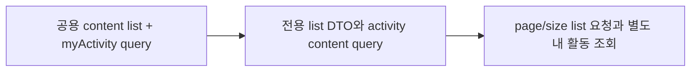

# 이력서·포트폴리오 기록

## 사례 1 — 시민 제안 목록 API 계약 분리와 내 활동 요청 분기

- 작업 유형: 프로젝트 구현
- 관련 도메인/서비스: 시민참여 proposal list, me/activity
- 문제 출처: 사용자 요구, 기획 변경

### 문제 상황

- 사용자가 제시한 요구·문제·변경 이유: 백엔드 proposal list 응답이 `{ items: [{ id, title, status, author.nickname, createdAt }], total, page, size }`로 확정됐다. 이후 기획이 바뀌어 list 요청에는 `page`/`size`만 두고, 내 활동 필터는 `content`·`page`·`size`를 가진 별도 API로 받기로 했다.
- 테스트·런타임에서 관찰한 오류: 초기 `toApiResult`에 `unknown`을 `ServerResponse<TData>`로 넘기면 `tsc -b`가 TS2345로 실패했다. `toServerResponse(response)`로 바꿔 해결했다.
- 필요한 기술·구조·패턴이 없을 때 발생할 문제: 공용 `ContentListQueryDto`에 `myActivity`/`status`를 남겨 두면 확정되지 않은 쿼리가 list URL에 실리고, 백엔드가 모르는 값이면 `INVALID_REQUEST`가 난다. 응답을 옛 `pageSize`/`itemCount` 형태로 가정하면 확정 JSON 파싱이 실패한다.

### 세션·하네스 사고 근거

해당 없음

- 플랫폼·프로젝트 또는 cwd: Cursor, asan-metaverse-user-ui
- main session ID와 관련 child session 범위: 측정 근거 없음
- 사용자 핵심 지시 원문과 시각: 2026-08-25에 proposal list 확정 응답 반영을 요청했고, 이후 `API 요청단에는 page/size만 추가`, 내 활동은 `?content='proposal' or ?content='vote'` 별도 API, `이렇게 수정 작업 진행해`로 승인했다.
- 재지적·중단 지시와 시각: 없음
- compaction 전후 `Objective`·제한·`Next Move` 변화: 해당 없음
- 지시와 어긋난 파일 수정·도구·검토·캡처·재작업: 없음. 구현 중 feature barrel `index.ts`에 라우트 파일을 잘못 쓴 뒤 즉시 복구했다.
- message·transcript entry·input token·cache read·child session 측정값: 측정 근거 없음
- 측정 출처와 인과 해석의 한계: 전체 세션 token을 이 작업 소비량으로 단정하지 않는다.
- 비용·품질·협업 영향에 관한 사용자 피드백: 없음
- 방지책과 남은 host·Hook 제한: 사용처 파일과 barrel 경로를 분리해 기록했다.

### 고민과 선택

- 사용자 제안: 확정 응답 구조를 유지하고, list 요청은 `page`/`size`만, 내 활동은 `content`로 출처를 구분하는 별도 API를 쓴다. DTO 사용처도 새 계약으로 바꾼다.
- 에이전트 제안: 처음에는 list에 `status`/`sort`까지 넣고 응답을 옛 `ContentListResponseDto`로 되돌리는 호환 레이어를 검토했다.
- 검토한 대안: (1) 공용 content list DTO 유지 후 필드 매핑 (2) proposal list 전용 DTO를 사용처까지 관통 (3) 내 활동을 클라이언트에서 `mine` 필터
- 최종 선택: (2). list는 전용 DTO, 내 활동은 `/me/activity` 요청 변경. 클라이언트 필터는 사용하지 않음.
- 선택 이유와 제외한 방식의 이유: 사용자가 호환 레이어를 거부했고, 확정되지 않은 `status`/`sort`/`myActivity`를 list에 남기면 400 위험이 있다. 클라이언트 `mine` 필터는 확정 API가 아니다.

### 적용

- 변경 경로: `proposal.dto.ts`, `proposal.api.ts`, `me.dto.ts`, parser, query keys, `useProposalListQuery`/`useMyActivityQuery`, MSW handlers/fixtures, `CitizenListRoutes.tsx`, presentation mapper, `toApiResult`
- 구현·수정·리팩터링 내용: `getProposalList` params를 `{ page, size }`로 고정했다. activity query에서 `type`을 제거하고 타입 필터일 때만 `content`를 붙였다. 목록 화면은 `myActivityOnly`이면 activity query, 아니면 proposal list query를 `enabled`로 전환한다.
- 핵심 동작: 확정 envelope `code: "SUCCESS"`와 숫자 id 목록 아이템을 파싱하고, 내 활동 토글은 list endpoint가 아니라 `/me/activity`를 친다.

### 사용 기술과 구체적 목적

| 기술·구조·패턴 | 해결하려는 구체적 문제 | 적용 위치와 방식 |
| --- | --- | --- |
| Zod response schema | 확정되지 않은 목록 필드를 UI로 흘리지 않기 | `getProposalListResponseSchema` / `parseProposalList` |
| 전용 Query DTO | list URL에 미확정 필터가 실리는 것 방지 | `GetProposalListQueryDto`, API params 명시 복사 |
| TanStack Query `enabled` | 같은 화면에서 list/activity를 조건부 훅 호출로 깨지 않기 | `useProposalListQuery`, `useMyActivityQuery` |
| MSW SUCCESS envelope | 로컬이 옛 `{ success: true }`만 재현하면 실서버와 어긋남 | proposal list handler만 `{ code: "SUCCESS", data }` |

### 결과

- 적용 전: proposal list가 공용 content list 계약과 `myActivity` query를 썼다.
- 적용 후: list는 확정 응답 DTO와 `page`/`size`만 보내고, 내 활동은 `content`로 페이지를 구분한다.
- 검증 결과: 관련 vitest 43 passed, `npm run build` 성공, `npm run lint` 성공. 전체 vitest의 auth/meeting 3실패는 이번 파일 밖이다.
- 사용자 후속 피드백: 없음
- 추가 요청 및 남은 제한: activity 응답 본문·proposal 상세·목록 summary UI는 미확정. 목록 카드 summary는 빈 문자열이다.
- 직접 측정하지 못한 수치: 측정 근거 없음

### 이력서·포트폴리오 문구

- 이력서 bullet: 시민 제안 목록을 확정 백엔드 계약(`items`/`total`/`page`/`size`)으로 분리하고, 내 활동 필터를 `content`·페이지 파라미터를 가진 별도 API 요청으로 옮겨 미확정 쿼리가 목록 URL에 실리지 않게 했다.
- 포트폴리오 서술: 공용 목록 DTO에 필터를 얹으면 확정되지 않은 query가 그대로 전송되고 새 응답은 파싱에 실패한다. 호환 매핑과 전용 DTO를 비교한 뒤, 사용자가 선택한 전용 계약을 사용처까지 적용하고 내 활동은 `/me/activity`로 분리했다. 관련 테스트 43건과 빌드·린트가 통과했다.
