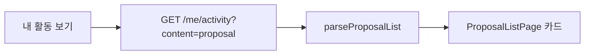

# 이력서·포트폴리오 기록

## 사례 1 — 제안 목록 내 활동 토글의 별도 API 표출

- 작업 유형: 프로젝트 구현
- 관련 도메인/서비스: 시민참여 제안 목록, me/activity
- 문제 출처: 사용자 요구

### 문제 상황

- 사용자가 제시한 요구·문제·변경 이유: 「내 활동 보기」버튼에서 말한 activity API(`content`·`page`·`size`)를 요청하고 응답을 받아 표출하는 흐름까지 구현하라고 했다.
- 테스트·런타임에서 관찰한 오류: 없음. 기존 토글 경로는 옛 activity 목록 스키마를 파싱해 확정 목록 아이템(`author.nickname`, 숫자 `id`)을 화면에 못 맞출 수 있었다.
- 필요한 기술·구조·패턴이 없을 때 발생할 문제: 토글이 켜져도 파싱이 실패하면 카드가 비고, list endpoint에 필터를 다시 붙이면 확정 요청과 어긋난다.

### 세션·하네스 사고 근거

해당 없음

- 플랫폼·프로젝트 또는 cwd: Cursor, asan-metaverse-user-ui
- main session ID와 관련 child session 범위: 측정 근거 없음
- 사용자 핵심 지시 원문과 시각: 2026-08-25 `해당 "내 활동 보기" 버튼에 내가 말한 API를 요청/응답 받아 표출하는 거까지의 흐름을 구현해봐.`
- 재지적·중단 지시와 시각: 없음
- compaction 전후 `Objective`·제한·`Next Move` 변화: 해당 없음
- 지시와 어긋난 파일 수정·도구·검토·캡처·재작업: 없음
- message·transcript entry·input token·cache read·child session 측정값: 측정 근거 없음
- 측정 출처와 인과 해석의 한계: 이 작업의 단독 token 소비량은 측정하지 않았다.
- 비용·품질·협업 영향에 관한 사용자 피드백: 없음
- 방지책과 남은 host·Hook 제한: activity 응답은 확정 목록 DTO 재사용으로 명시했다.

### 고민과 선택

- 사용자 제안: 토글에서 별도 API를 치고 응답을 화면에 보여 준다.
- 에이전트 제안: `content=proposal` 응답을 확정 proposal list `data`와 같게 파싱해 기존 카드에 넣는다.
- 검토한 대안: (1) 옛 `ActivityListResponseDto` 유지 (2) 확정 목록 DTO 재사용 (3) activity 전용 필드를 임의로 만듦
- 최종 선택: (2)
- 선택 이유와 제외한 방식의 이유: 사용자는 목록 응답 구조를 유지한다고 했고, 같은 `ProposalListPage`에 그린다. 옛 스키마는 `author.nickname`이 없고, 임의 필드는 미확정 발명이다.

### 적용

- 변경 경로: `useMyProposalActivityQuery`, `me.api.ts` params, MSW `content=proposal` 분기, `ProposalListRoute`, 내 활동 제안 필터 매퍼, 라우트 테스트
- 구현·수정·리팩터링 내용: 토글 on이면 list query를 끄고 activity query만 켜서 `parseProposalList` 결과를 `toProposalListItem`으로 카드에 넣었다.
- 핵심 동작: `?myActivity=true`일 때 query key에 `content: "proposal"`이 들어가고 제안 제목/작성자가 렌더된다.

### 사용 기술과 구체적 목적

| 기술·구조·패턴 | 해결하려는 구체적 문제 | 적용 위치와 방식 |
| --- | --- | --- |
| TanStack Query `enabled` | 토글 상태에 따라 list/activity를 동시에 호출하지 않기 | `ProposalListRoute` |
| `parseProposalList` | 확정되지 않은 activity 필드를 화면에 넣지 않기 | `useMyProposalActivityQuery` |
| 라우트 테스트 | 토글 경로가 실제 제목을 그리는지 확인 | `CitizenDataRoutes.test.tsx` |

### 결과

- 적용 전: 토글이 activity를 쳐도 옛 목록 스키마를 기대했다.
- 적용 후: `content=proposal` 응답을 확정 목록 DTO로 읽어 제목/상태/작성자/날짜를 표시한다.
- 검증 결과: 관련 vitest 56 passed, `npm run build` 성공, `npm run lint` 성공
- 사용자 후속 피드백: 없음
- 추가 요청 및 남은 제한: activity 전용 응답 스펙 없음. 카드 요약은 빈 값.
- 직접 측정하지 못한 수치: 측정 근거 없음

### 이력서·포트폴리오 문구

- 이력서 bullet: 시민 제안 목록의 내 활동 토글을 별도 activity API(`content`·`page`·`size`)에 연결하고, 확정 목록 응답을 파싱해 같은 카드 UI에 표출했다.
- 포트폴리오 서술: 토글이 켜져도 응답 스키마가 목록과 다르면 카드가 비게 된다. 미확정 activity 본문을 만들지 않고 확정된 proposal list `data`를 재사용해 요청 분리와 화면 표출을 맞췄고, 라우트 테스트로 query key와 제목 렌더를 확인했다.
