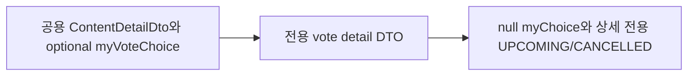

# 이력서·포트폴리오 기록

## 사례 1 — 시민 투표 상세 API 계약 분리와 myChoice null 처리

- 작업 유형: 프로젝트 구현
- 관련 도메인/서비스: 시민참여 vote detail
- 문제 출처: 사용자 요구, 기획 변경

### 문제 상황

- 사용자가 제시한 요구·문제·변경 이유: 투표 상세는 인증 없이 조회하고, 관리자 임시저장은 404다. 목록과 달리 시작 전·중단된 투표도 조회되어 직접 링크를 연 사용자에게 투표 불가 이유를 보여줘야 한다. `myChoice`는 이미 던진 표이며 토큰이 없거나 아직 투표하지 않았으면 `null`이다. 다시 투표하면 409 `ALREADY_VOTED`다. 찬반 수는 `CLOSED`에만 있고 중단된 집계는 가린다. 의견 목록은 상세 응답에 없고 comments API로 따로 조회한다.
- 테스트·런타임에서 관찰한 오류: 시작 전·중단 fixture를 공용 `contentFixtures`에 넣자 내 활동 화면이 `전체 8건` 대신 `전체 10건`을 표시했다.
- 필요한 기술·구조·패턴이 없을 때 발생할 문제: 공용 `ContentDetailDto`의 `myVoteChoice?`는 `null`과 생략을 구분하지 못해 미투표를 제출 완료로 렌더할 수 있다. 목록 enum만 있으면 시작 전·중단 상세 파싱이 실패한다. 댓글을 상세에 섞으면 확정 계약과 어긋난다.

### 세션·하네스 사고 근거

해당 없음

- 플랫폼·프로젝트 또는 cwd: Cursor, asan-metaverse-user-ui
- main session ID와 관련 child session 범위: `05e51fb4-da33-4830-9865-1201ca868135`. child session 측정 근거 없음
- 사용자 핵심 지시 원문과 시각: 2026-08-25 17:57에 투표 상세 요청/응답 DTO와 `작업 진행`을 함께 제시했다.
- 재지적·중단 지시와 시각: 없음
- compaction 전후 `Objective`·제한·`Next Move` 변화: 해당 없음
- 지시와 어긋난 파일 수정·도구·검토·캡처·재작업: `VoteDetailPage` 마크업은 수정하지 않았다. 이미지 캡처 QA는 하지 않았다.
- message·transcript entry·input token·cache read·child session 측정값: 측정 근거 없음
- 측정 출처와 인과 해석의 한계: 전체 세션 token을 이 작업 소비량으로 단정하지 않는다.
- 비용·품질·협업 영향에 관한 사용자 피드백: 없음
- 방지책과 남은 host·Hook 제한: 시작 전·중단 fixture를 상세 전용으로 분리해 목록·내 활동 건수를 보존했다.

### 고민과 선택

- 사용자 제안: 확정 상세 JSON, 무인증 조회, 임시저장 404, 시작 전·중단 상세 조회, `myChoice` null, 재투표 409, CLOSED만 찬반 수, 댓글 분리.
- 에이전트 제안: 상세 전용 DTO와 `useVoteDetailQuery`. 목록 필터는 `IN_PROGRESS`/`CLOSED` 유지. 시작 전·중단 enum은 이전 목록 400 값 `UPCOMING`/`CANCELLED`를 사용.
- 검토한 대안: (1) 공용 `ContentDetailDto`에 필드만 추가 (2) 상세 전용 DTO를 사용처까지 관통 (3) 시작 전·중단을 파싱하지 않고 `IN_PROGRESS`/`CLOSED`만 허용
- 최종 선택: (2). 상세 status는 4값, 목록 필터는 2값.
- 선택 이유와 제외한 방식의 이유: 확정 JSON에 `agenda`/`myChoice`/`updatedAt`이 있고 `commentCount`가 없다. (3)은 사용자가 상세에서 시작 전·중단을 조회한다고 한 이유와 어긋난다. `VoteDetailPage` 상태 확장은 Claude Code 소유라 presentation `period`로 불가 이유를 넣었다.

### 적용

- 변경 경로: `constants.ts`, `vote.dto.ts`, `vote.api.ts`, parser, `useVoteDetailQuery`, presentation 매퍼, `CitizenParticipationDetailRoutes.tsx`, MSW fixtures/handlers, barrel, 관련 테스트
- 구현·수정·리팩터링 내용: `myChoice === null`이면 미투표로 본다. MSW는 draft id `99`에 404, 동일 투표 재제출에 409를 준다. 시작 전·중단은 `voteDetailOnlyFixtures`로만 상세에 노출한다.
- 핵심 동작: 확정 envelope와 nullable `myChoice`를 파싱하고, 목록에는 시작 전·중단을 넣지 않으며, 직접 연 상세에서는 투표 불가 사유를 기간 문구로 보여 준다.

### 사용 기술과 구체적 목적

| 기술·구조·패턴 | 해결하려는 구체적 문제 | 적용 위치와 방식 |
| --- | --- | --- |
| Zod response schema + handwritten DTO | 공용 content detail 필드가 확정 JSON과 어긋남 | `getVoteDetailResponseSchema` / `GetVoteDetailResponseDto` |
| `VOTE_LIST_STATUS` vs `VOTE_STATUS` | 목록 필터에 상세 전용 status가 실리면 400 | 목록 schema는 2값, 상세 schema는 4값 |
| TanStack Query 전용 훅 | 공용 detail parser가 투표 JSON을 거절함 | `useVoteDetailQuery` |
| null-preserving choice 분기 | `undefined` 검사가 `null`을 제출 완료로 오인 | `VoteDetailRoute` `persistedChoice ?? null` |
| MSW 상태 코드 | 임시저장·재투표 계약을 로컬에서 재현하지 못함 | 404 draft, 409 `ALREADY_VOTED` |

### 결과

- 적용 전: 투표 상세가 공용 `ContentDetailDto`와 optional `myVoteChoice`를 썼다.
- 적용 후: 상세는 확정 DTO와 `myChoice: null`을 쓰고, 시작 전·중단은 상세에서만 조회된다.
- 검증 결과: 관련 vitest 12 files / 66 passed, `npm run lint` 성공, `npm run build` 성공.
- 사용자 후속 피드백: 없음
- 추가 요청 및 남은 제한: `VoteDetailPage` 예정/중단 뱃지, 댓글 URL 표기, POST 응답 id 타입은 미확정.
- 직접 측정하지 못한 수치: 측정 근거 없음

### 이력서·포트폴리오 문구

- 이력서 bullet: 시민 투표 상세를 확정 백엔드 계약(`agenda`, nullable `myChoice`, CLOSED만 찬반 수)으로 분리하고, 미투표 `null`과 임시저장 404·재투표 409를 목록 필터 enum과 섞이지 않게 맞췄다.
- 포트폴리오 서술: 공용 상세 DTO의 optional 선택값은 `null` 미투표를 제출 완료로 오인하고, 목록에 없는 시작 전·중단 상태를 거절하면 직접 링크 안내가 실패한다. 전용 DTO와 상세 전용 fixture를 적용한 뒤 관련 테스트 66건과 빌드·린트가 통과했다.
