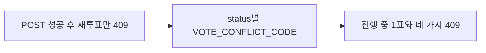

# 이력서·포트폴리오 기록

## 사례 1 — 시민 투표 POST 요청 고정과 409 충돌 코드 분리

- 작업 유형: 프로젝트 구현
- 관련 도메인/서비스: 시민참여 vote submit
- 문제 출처: 사용자 요구

### 문제 상황

- 사용자가 제시한 요구·문제·변경 이유: 진행 중인 투표에만 참여할 수 있고 1인 1표이며 던진 표는 바꿀 수 없다. 불가 시 409 코드가 `ALREADY_VOTED`·`VOTE_NOT_STARTED`·`VOTE_CLOSED`·`VOTE_CANCELLED`로 갈린다. 요청 body는 `{ "choice": "AGREE" }`다. `얘도 연결해줘`로 연결을 요청했다.
- 테스트·런타임에서 관찰한 오류: handlers.test에서 Axios 409 `data.code`를 `any`로 읽어 eslint `no-unsafe-member-access` 4건이 났다. `isRecord`로 좁혀 해결했다.
- 필요한 기술·구조·패턴이 없을 때 발생할 문제: 요청에 `choice` 외 필드가 실리면 확정 계약과 어긋난다. 재투표만 막으면 종료·시작 전·중단 POST가 성공한다. 공용 `code`를 숫자로만 파싱하면 문자열 409가 0이 되어 원인을 가릴 수 없다.

### 세션·하네스 사고 근거

해당 없음

- 플랫폼·프로젝트 또는 cwd: Cursor, asan-metaverse-user-ui
- main session ID와 관련 child session 범위: 측정 근거 없음
- 사용자 핵심 지시 원문과 시각: 2026-08-25 20:56에 투표 POST 스펙과 `얘도 연결해줘`를 제시했다.
- 재지적·중단 지시와 시각: 없음
- compaction 전후 `Objective`·제한·`Next Move` 변화: 해당 없음
- 지시와 어긋난 파일 수정·도구·검토·캡처·재작업: `VoteDetailPage` 마크업은 수정하지 않았다.
- message·transcript entry·input token·cache read·child session 측정값: 측정 근거 없음
- 측정 출처와 인과 해석의 한계: 전체 세션 token을 이 작업 소비량으로 단정하지 않는다.
- 비용·품질·협업 영향에 관한 사용자 피드백: 없음
- 방지책과 남은 host·Hook 제한: POST body는 `choice`만 명시 복사하고, 409 코드는 도메인 상수로 둔다.

### 고민과 선택

- 사용자 제안: `{ choice }` POST와 409 코드 네 가지로 불참 이유를 가른다.
- 에이전트 제안: 요청은 `choice`만 보내고, MSW가 status·재투표로 409를 가른다. 200 JSON이 없어 기존 submit 응답을 유지한다. 문자열 `code`를 공용 오류 타입에 보존한다.
- 검토한 대안: (1) 200 응답을 상세 DTO로 맞춤 (2) 기존 `{ id, completed, choice }` 유지 (3) 409 코드를 숫자로 매핑
- 최종 선택: (2)와 문자열 코드 보존. (3)은 사용자가 준 코드 문자열과 다르다.
- 선택 이유와 제외한 방식의 이유: 200 예시는 없어서 발명하지 않는다. 숫자 매핑은 확정 코드와 어긋난다. `VoteDetailPage` 오류 UI는 Claude Code 소유라 넣지 않았다.

### 적용

- 변경 경로: `constants.ts`, `vote.dto.ts`, `vote.api.ts`, parser, `useVoteMutation`, `toServerResponse`/`ApiError`/`CustomException`, MSW handlers, 관련 테스트
- 구현·수정·리팩터링 내용: `postVote`가 `{ choice }`만 보낸다. 시작 전·종료·중단·재투표는 각각 409 코드다. 진행 중 첫 투표는 SUCCESS envelope다.
- 핵심 동작: 진행 중 1회만 성공하고, 불가 이유는 409 `code`로 구분된다.

### 사용 기술과 구체적 목적

| 기술·구조·패턴 | 해결하려는 구체적 문제 | 적용 위치와 방식 |
| --- | --- | --- |
| 명시 필드 복사 | 요청 객체 전체가 URL body로 실림 | `vote.api.ts` `{ choice: request.choice }` |
| `VOTE_CONFLICT_CODE` | 409 문자열을 흩어진 리터럴로 쓰기 | constants + MSW |
| `code: number \| string` | `toNumber`가 `ALREADY_VOTED`를 버림 | `toServerResponse`, `ApiError` |
| Zod + handwritten DTO | submit 응답 `z.infer` 순환 | `VoteResponseDto`, `parseVoteResponse` |

### 결과

- 적용 전: POST는 choice를 보냈지만 종료·시작 전·중단도 성공할 수 있었고, 재투표 409만 있었다.
- 적용 후: 진행 중 1회만 성공하고 409가 네 코드로 갈린다. 요청 body는 `{ choice }`다.
- 검증 결과: 관련 vitest 12 files / 69 passed, `npm run lint` 성공, `npm run build` 성공.
- 사용자 후속 피드백: 없음
- 추가 요청 및 남은 제한: 200 응답 재설계와 409 화면 문구는 미확정.
- 직접 측정하지 못한 수치: 측정 근거 없음

### 이력서·포트폴리오 문구

- 이력서 bullet: 시민 투표 제출을 `{ choice }` 요청과 409 코드(`ALREADY_VOTED`·시작 전·종료·중단)로 연결해 진행 중 1인 1표를 서버 계약과 같게 막았다.
- 포트폴리오 서술: 재투표만 거절하면 종료된 투표 POST가 성공하고, 숫자 `code` 파서는 문자열 409를 지운다. 요청 필드를 명시 복사하고 오류 코드를 보존한 뒤 관련 테스트 69건과 빌드·린트가 통과했다.
