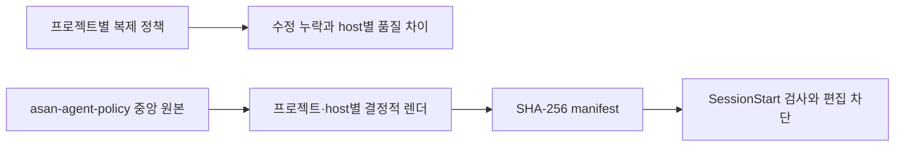

# 이력서·포트폴리오 기록

## 사례 1 — 멀티 호스트 AI 정책 중앙화

- 작업 유형: AI 하네스
- 관련 도메인/서비스: user-ui/admin-ui 개발 에이전트 운영
- 문제 출처: 사용자 요구

### 문제 상황

- 사용자가 제시한 요구·문제·변경 이유: 두 프로젝트에 Codex·Claude Code·OpenCode 정책을 각각 복제해 한쪽 수정이 다른 쪽에 반영되지 않고 skill, hook, agents, AGENTS/CLAUDE 내용과 품질이 달라졌다.
- 테스트·런타임에서 관찰한 오류: user-ui 현재 AI 파일에 기존 중앙화 산출물 흔적이 있었고, user-ui 기준 문서에는 실제 stack과 다른 외부 지시 및 Claude 산출물 경로 모순이 있었다.
- 필요한 기술·구조·패턴이 없을 때 발생할 문제: 정책 drift, 서로 다른 승인·검증 절차, 오래된 세션 context와 소비자 프로젝트의 직접 수정이 반복된다.

### 고민과 선택

- 사용자 제안: user-ui를 기준으로 새 중앙 프로젝트를 만들고 소비자에서는 수정하지 않으며 세션을 재시작한다.
- 에이전트 제안: Git HEAD 고정, 공통 정책/host adapter 분리, source digest와 manifest, 별도 배포 승인 게이트를 사용한다.
- 검토한 대안: 기존 `asan-prompt-core` 또는 `asan-harness` 재사용, 변경 log를 각 세션이 판단, symlink, 프로젝트별 복제 유지.
- 최종 선택: 독립 `asan-agent-policy`와 결정적 sync CLI.
- 선택 이유와 제외한 방식의 이유: 사용자가 기존 시스템을 이해·유지하기 어렵다고 했고, 세션별 log 해석은 결정성과 enforcement가 약하다. symlink는 host trust와 설정 형식 차이를 해결하지 못한다.

### 적용

- 변경 경로: `/Users/okand/SynologyDrive/asan-agent-policy/{policy,adapters,projects,lib,bin,tests}`.
- 구현·수정·리팩터링 내용: 공통 AGENTS/skills, 세 host adapter, managed guard, manifest 기반 CLI, legacy hash snapshot, test/smoke suite를 구현했다.
- 핵심 동작: 중앙 source 또는 소비자 파일이 바뀌면 check가 실패하고, 소비자 managed edit는 host hook/plugin에서 차단한다. sync는 중앙 Git이 clean하고 안전 삭제 hash가 맞을 때만 동작한다.

### 사용 기술과 구체적 목적

| 기술·구조·패턴 | 해결하려는 구체적 문제 | 적용 위치와 방식 |
| --- | --- | --- |
| Python 표준 라이브러리 CLI | 의존성 없이 audit/diff/sync/start 제공 | `lib/agent_policy/`, `bin/agent-policy` |
| SHA-256 manifest/source digest | 중앙 변경과 소비자 mutation 탐지 | `.agent-policy/manifest.json` 계약 |
| Codex/Claude lifecycle hook | 세션 시작 drift 안내와 사전 편집 차단 | 생성 `.codex/hooks.json`, `.claude/settings.json` |
| OpenCode local plugin | OpenCode tool input의 동일한 차단 | `.opencode/plugins/agent-policy.js` |
| adapter 분리 | host 스키마 차이를 공통 정책에서 격리 | `adapters/{codex,claude,opencode}` |
| Git commit 고정 | 오염된 working tree 대신 재현 가능한 baseline 확보 | `policy/baseline-user-ui-head.json` |

### 결과

- 적용 전: 두 프로젝트에 복제된 AI 정책과 기존 중앙화 산출물이 서로 다른 변경 압력을 가졌다.
- 적용 후: commit `1fc8070`의 단일 중앙 원본에서 프로젝트당 127개 managed output을 결정적으로 렌더링하고 세 host를 선택할 수 있다.
- 검증 결과: 중앙 단위 테스트 18개 OK, 두 프로젝트 audit PASS, OpenCode 1.18.19 실제 local plugin load PASS. dry-run은 대상 차이를 탐지했고 실제 sync는 수행하지 않았다.
- 사용자 후속 피드백: 커밋 메시지는 영어 type과 한글 요약 형식을 사용하도록 요청했다.
- 추가 요청 및 남은 제한: 동시 변경된 legacy 파일의 폐기 승인, 첫 sync/check, handoff/restart가 남아 있다.

### 이력서·포트폴리오 문구

- 이력서 bullet: Codex·Claude Code·OpenCode 정책을 단일 Git 원본과 host adapter로 중앙화하고, SHA-256 manifest 및 lifecycle guard로 정책 drift와 소비자 직접 수정을 검증하는 CLI를 구축했다.
- 포트폴리오 서술: 프로젝트마다 복제된 AI 정책의 수정 누락 문제를 Git HEAD 기준과 공통 정책/host adapter 구조로 재설계했다. 중앙·소비자 변경을 구분하기 위해 source digest와 파일별 manifest를 적용하고, 세 host의 lifecycle hook/plugin에서 관리 파일 편집을 차단했다. 18개 단위 테스트와 실제 OpenCode plugin load로 중앙 구현을 검증했으며, 동시 변경된 legacy 파일은 자동 삭제하지 않고 사용자 승인 게이트로 보존했다.
