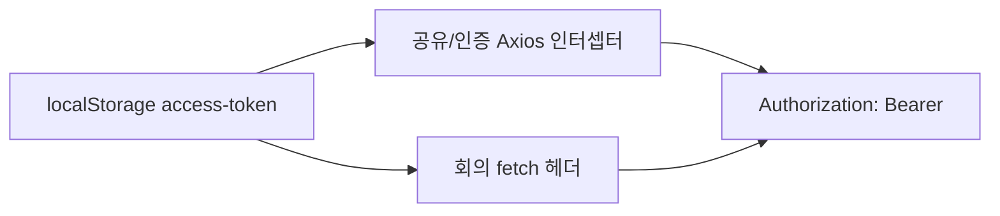

# 이력서·포트폴리오 기록

## 사례 1 — API 요청 기본 인증 헤더

- 작업 유형: 프로젝트 구현
- 관련 도메인/서비스: 공유 Axios, 인증 API, 회의 API
- 문제 출처: 사용자 요구

### 문제 상황

- 사용자가 제시한 요구·문제·변경 이유: 모든 API 요청에 액세스 토큰이 반영되어야 하므로 인증 헤더를 전부 추가하라고 했다.
- 테스트·런타임에서 관찰한 오류: attach 테스트에서 헤더 부재 시 `get`이 `null`이 아니라 `undefined`를 반환했다. 기댓값을 `undefined`로 맞춰 통과했다.
- 필요한 기술·구조·패턴이 없을 때 발생할 문제: `authRequired` 옵트인에 의존하면 목록/상세 GET처럼 `customConfig`를 안 넣은 요청이 토큰 없이 나간다. 엔드포인트마다 헤더를 붙이면 새 API에서 다시 빠진다.

### 세션·하네스 사고 근거

해당 없음

- 플랫폼·프로젝트 또는 cwd: Cursor, asan-metaverse-user-ui
- main session ID와 관련 child session 범위: 측정 근거 없음
- 사용자 핵심 지시 원문과 시각: 2026-08-26에 `모든 API 요청에 엑세스 토큰이 반영되어 있어야 한다는 거 기준으로 API 요청에 인증 헤더 전부 추가해`라고 지시했다.
- 재지적·중단 지시와 시각: 없음
- compaction 전후 `Objective`·제한·`Next Move` 변화: 해당 없음
- 지시와 어긋난 파일 수정·도구·검토·캡처·재작업: 없음
- message·transcript entry·input token·cache read·child session 측정값: 측정 근거 없음
- 측정 출처와 인과 해석의 한계: 전체 세션 token을 이 작업 소비량으로 단정하지 않는다.
- 비용·품질·협업 영향에 관한 사용자 피드백: 없음
- 방지책과 남은 host·Hook 제한: 토큰 부재 시 요청 실패는 지시되지 않아 구현하지 않았다.

### 고민과 선택

- 사용자 제안: 모든 API 요청에 인증 헤더를 추가한다.
- 에이전트 제안: 요청 파일마다 `customConfig`를 더하지 않고, 전송 인터셉터에서 토큰이 있으면 항상 Bearer를 붙인다.
- 검토한 대안: (1) 모든 API 메서드에 `customConfig` 추가 (2) `createApiClient`가 기본으로 `authRequired`를 넣음 (3) 인터셉터가 토큰이 있으면 항상 부착
- 최종 선택: (3). 인증 Axios에도 같은 함수를 붙이고, 회의 fetch는 인자 토큰이 비면 storage 토큰을 쓴다.
- 선택 이유와 제외한 방식의 이유: (1)은 GET 누락이 재발한다. (2)는 공유 인스턴스를 안 쓰는 로그인을 빠뜨린다. (3)은 새 엔드포인트에도 적용된다.

### 적용

- 변경 경로: `attach-access-token.ts`, `axios-instance.ts`, `auth.api.ts`, `meeting.api.ts`, 관련 테스트
- 구현·수정·리팩터링 내용: `authRequired` 가드를 제거했다. `attachAccessTokenHeader`가 `localStorage`의 `access-token`을 읽어 `Authorization`을 설정한다.
- 핵심 동작: 토큰이 있으면 시민참여 GET 포함 모든 공유 Axios 요청과 로그인 인스턴스, 회의 fetch가 Bearer를 보낸다.

### 사용 기술과 구체적 목적

| 기술·구조·패턴 | 해결하려는 구체적 문제 | 적용 위치와 방식 |
| --- | --- | --- |
| Axios request interceptor | GET마다 `customConfig`를 빠뜨려 토큰이 안 나가는 것 | `axios-instance.ts`, `createAuthAxiosInstance` |
| 공유 attach 함수 | 인스턴스마다 헤더 로직이 달라지는 것 | `attach-access-token.ts` |
| localStorage 토큰 키 | 로그인 후 저장한 값을 요청에 반영 | `ACCESS_TOKEN_STORAGE_KEY` |

### 결과

- 적용 전: `authRequired`인 요청만 Bearer를 붙였다. 목록/상세 GET은 토큰이 있어도 헤더가 없었다.
- 적용 후: 저장된 토큰이 있으면 공유 Axios·인증 Axios·회의 fetch가 Bearer를 붙인다.
- 검증 결과: attach/auth 테스트 4 passed, `npm run build` 성공, `npm run lint` 성공.
- 사용자 후속 피드백: 없음
- 추가 요청 및 남은 제한: 토큰이 없으면 헤더를 붙이지 않는다. API 파일의 `customConfig`는 남아 있다.
- 직접 측정하지 못한 수치: 측정 근거 없음

### 이력서·포트폴리오 문구

- 이력서 bullet: API 인증을 요청 단위 `authRequired` 옵트인에서 Axios 인터셉터 기본 동작으로 옮겨, 목록 GET을 포함한 모든 공유 HTTP 요청에 저장된 액세스 토큰 Bearer 헤더가 붙게 했다.
- 포트폴리오 서술: 쓰기 요청에만 `customConfig`를 넣으면 조회 API가 토큰 없이 나간다. 사용자가 모든 요청에 토큰 반영을 지시한 뒤, 전송 계층에서 토큰이 있으면 항상 헤더를 붙이도록 바꿨다. 관련 테스트 4건과 빌드·린트가 통과했다.
