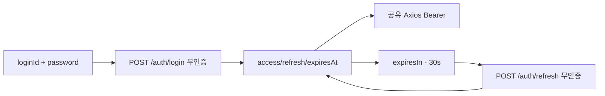

# 이력서·포트폴리오 기록

## 사례 1 — loginId 로그인과 만료 전 토큰 갱신

- 작업 유형: 프로젝트 구현
- 관련 도메인/서비스: 인증 API, 로그인 페이지, 세션 갱신
- 문제 출처: 사용자 요구

### 문제 상황

- 사용자가 제시한 요구·문제·변경 이유: 로그인 값은 이메일이 아닌 일반 문자열이다. 아이디와 비밀번호로 인증 없이 `POST /auth/login`을 호출해 액세스·리프레시 토큰을 받고, `expiresIn`이 지나기 전에 `POST /auth/refresh`로 갱신한다. 아이디 없음과 비밀번호 틀림의 응답은 같다.
- 테스트·런타임에서 관찰한 오류: 기존 로그인 테스트는 `/auth/sign-in`과 이메일 본문, 로그인 Bearer 부착을 기대했다. 새 계약으로 바꿨더니 auth 테스트 7건이 통과했다.
- 필요한 기술·구조·패턴이 없을 때 발생할 문제: 이메일 검증을 남기면 `user01` 같은 아이디가 제출되지 않는다. 로그인에 Bearer를 붙이면 인증 없이 호출하라는 스펙과 어긋난다. `expiresIn`을 무시하면 액세스 토큰이 만료된 뒤 보호 API가 실패한다.

### 세션·하네스 사고 근거

해당 없음

- 플랫폼·프로젝트 또는 cwd: Cursor, asan-metaverse-user-ui
- main session ID와 관련 child session 범위: 측정 근거 없음
- 사용자 핵심 지시 원문과 시각: 2026-08-26에 로그인 페이지 값은 이메일이 아닌 일반 문자열이며 `이를 반영해`라고 지시했고, `/auth/login` 요청·응답 스펙을 제공했다.
- 재지적·중단 지시와 시각: 없음
- compaction 전후 `Objective`·제한·`Next Move` 변화: 해당 없음
- 지시와 어긋난 파일 수정·도구·검토·캡처·재작업: 없음
- message·transcript entry·input token·cache read·child session 측정값: 측정 근거 없음
- 측정 출처와 인과 해석의 한계: 전체 세션 token을 이 작업 소비량으로 단정하지 않는다.
- 비용·품질·협업 영향에 관한 사용자 피드백: 없음
- 방지책과 남은 host·Hook 제한: refresh 본문 스키마는 사용자가 주지 않아 `{ refreshToken }`으로 가정했다.

### 고민과 선택

- 사용자 제안: `loginId`/`password`로 무인증 로그인하고, Bearer 액세스 토큰과 `expiresIn` 전 refresh를 적용한다.
- 에이전트 제안: 인증 Axios에서 인터셉터를 제거하고, `expiresIn`으로 만료 시각을 저장한 뒤 30초 전에 refresh한다. JWT `exp`는 예시 토큰에 없어 쓰지 않는다.
- 검토한 대안: (1) 이메일 필드를 유지하고 값만 문자열로 받음 (2) JWT `exp`로 만료 계산 (3) 응답 `expiresIn`으로 스케줄
- 최종 선택: (3). UI 라벨도 아이디로 바꾸고, refresh 본문은 `{ refreshToken }`으로 둔다.
- 선택 이유와 제외한 방식의 이유: (1)은 사용자가 이메일이 아니라고 못 박았다. (2)는 예시 JWT에 `exp`가 없다. refresh 본문은 미제공이라 토큰을 보낼 수 있는 `{ refreshToken }`만 채택했다.

### 적용

- 변경 경로: `auth.dto.ts`, `auth.api.ts`, `client.ts`, `authSession.ts`, `useSignInMutation.ts`, `LoginPage.tsx`, `LoginTestPage.tsx`, `constants.ts`, `main.tsx`, 관련 테스트
- 구현·수정·리프레시 내용: `/auth/sign-in`과 이메일·language/platform을 제거했다. 로그인 성공 시 토큰과 만료 시각을 저장하고, 부팅 시에도 같은 스케줄러를 돌린다.
- 핵심 동작: 무인증 `POST /auth/login` → localStorage 세션 → 만료 30초 전 무인증 `POST /auth/refresh`. 이후 공유 Axios는 기존처럼 액세스 토큰 Bearer를 붙인다.

### 사용 기술과 구체적 목적

| 기술·구조·패턴 | 해결하려는 구체적 문제 | 적용 위치와 방식 |
| --- | --- | --- |
| Zod DTO | 이메일 검증이 `user01`을 거절하는 것 | `auth.dto.ts`의 `loginId` min(1) |
| 인터셉터 없는 Axios | 로그인·리프레시에 이전 토큰이 붙는 것 | `createAuthAxiosInstance` |
| `expiresIn` 스케줄 | JWT `exp` 없는 토큰의 만료 시점 | `authSession.ts` |
| 공통 실패 문구 | 아이디 없음과 비밀번호 틀림을 구분하는 것 | `LoginTestPage` fallback |

### 결과

- 적용 전: `POST /auth/sign-in`에 이메일을 보내고 프로필 포함 응답을 파싱했다. 로그인 UI도 이메일이었다.
- 적용 후: `POST /auth/login`에 `loginId`를 보내고 토큰만 파싱한다. 만료 전에 refresh하고, 로그인·리프레시에는 Authorization이 없다.
- 검증 결과: `npx vitest run src/features/auth` 7 passed, `npm run build` 성공, `npm run lint` 성공.
- 사용자 후속 피드백: 없음
- 추가 요청 및 남은 제한: refresh 본문은 `{ refreshToken }` 가정이다. 리프레시 실패 시 세션을 지우지 않는다.
- 직접 측정하지 못한 수치: 측정 근거 없음

### 이력서·포트폴리오 문구

- 이력서 bullet: 이메일 로그인 계약을 `loginId` 무인증 `POST /auth/login`으로 바꾸고, 응답 `expiresIn` 기준으로 만료 전에 `POST /auth/refresh`가 돌도록 세션 스케줄러를 붙였다.
- 포트폴리오 서술: 기존 로그인은 이메일 검증과 `/auth/sign-in`에 묶여 있어 아이디 문자열을 받을 수 없었다. 사용자 스펙에 맞춰 요청·응답 DTO와 UI를 바꾸고, 예시 JWT에 `exp`가 없어 `expiresIn`으로 갱신 시점을 계산했다. auth 테스트 7건과 빌드·린트가 통과했다.
