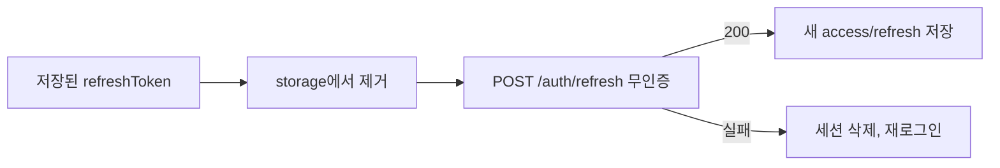

# 이력서·포트폴리오 기록

## 사례 1 — 1회용 리프레시 토큰 회전

- 작업 유형: 프로젝트 구현
- 관련 도메인/서비스: 인증 세션, `POST /auth/refresh`
- 문제 출처: 사용자 요구

### 문제 상황

- 사용자가 제시한 요구·문제·변경 이유: 리프레시 토큰으로 새 액세스·리프레시 토큰을 받으며 인증 없이 호출한다. 리프레시 토큰은 1회용이라 응답 토큰으로 갈아끼워야 하고, 이미 쓴 토큰을 다시 보내면 그 계정의 리프레시 토큰이 전부 폐기되어 재로그인이 필요하다.
- 테스트·런타임에서 관찰한 오류: 없음. 기존 성공 경로 테스트는 유지되었고, 단일 전송·실패 시 세션 삭제 테스트를 추가해 9건이 통과했다.
- 필요한 기술·구조·패턴이 없을 때 발생할 문제: 같은 refresh를 두 번 보내면 서버가 계정 토큰을 전부 폐기한다. 실패 후에도 옛 토큰을 남기면 스케줄러가 재사용해 로그아웃이 강제된다.

### 세션·하네스 사고 근거

해당 없음

- 플랫폼·프로젝트 또는 cwd: Cursor, asan-metaverse-user-ui
- main session ID와 관련 child session 범위: 측정 근거 없음
- 사용자 핵심 지시 원문과 시각: 2026-08-26에 `POST /auth/refresh` 스펙을 제공하며 리프레시 토큰은 1회용이고 재사용 시 전부 폐기된다고 했다.
- 재지적·중단 지시와 시각: 없음
- compaction 전후 `Objective`·제한·`Next Move` 변화: 해당 없음
- 지시와 어긋난 파일 수정·도구·검토·캡처·재작업: 없음
- message·transcript entry·input token·cache read·child session 측정값: 측정 근거 없음
- 측정 출처와 인과 해석의 한계: 전체 세션 token을 이 작업 소비량으로 단정하지 않는다.
- 비용·품질·협업 영향에 관한 사용자 피드백: 없음
- 방지책과 남은 host·Hook 제한: 탭 간 잠금과 실패 후 로그인 라우팅은 지시되지 않아 구현하지 않았다.

### 고민과 선택

- 사용자 제안: `{ refreshToken }`으로 무인증 refresh하고, 응답 토큰으로 교체하며, 재사용을 피한다.
- 에이전트 제안: 요청·응답 DTO는 이미 스펙과 같으니 세션 계층에서 전송 전 저장값을 제거하고 in-flight를 하나로 제한하며, 실패 시 세션을 지운다.
- 검토한 대안: (1) 성공 시에만 저장값 교체 (2) 전송 전 claim + 실패 시 세션 삭제 (3) 네트워크 실패 시 옛 토큰 재시도
- 최종 선택: (2)
- 선택 이유와 제외한 방식의 이유: (1)은 겹친 호출이 같은 토큰을 두 번 보낸다. (3)은 서버가 이미 소비한 토큰을 재전송할 수 있다.

### 적용

- 변경 경로: `src/features/auth/model/authSession.ts`, `src/features/auth/model/authSession.test.ts`
- 구현·수정·리팩터링 내용: refresh 호출 전에 storage의 refresh 값을 제거하고, 진행 중이면 같은 Promise를 재사용한다. 성공하면 새 토큰을 저장하고 다시 스케줄한다. 실패하면 access/refresh/만료를 모두 지운다.
- 핵심 동작: 한 번의 `POST /auth/refresh` → 새 토큰 저장. 실패하면 빈 세션.

### 사용 기술과 구체적 목적

| 기술·구조·패턴 | 해결하려는 구체적 문제 | 적용 위치와 방식 |
| --- | --- | --- |
| in-flight Promise | 같은 탭에서 refresh가 겹쳐 1회용 토큰을 두 번 보내는 것 | `authSession.ts`의 `refreshInFlight` |
| 전송 전 claim | 스케줄이 같은 저장값을 다시 읽는 것 | `localStorage.removeItem(REFRESH_TOKEN_STORAGE_KEY)` |
| 실패 시 `clearAuthSession` | 폐기된 토큰을 붙잡고 재호출하는 것 | `rotateAuthSession`의 catch |

### 결과

- 적용 전: 성공 시 새 토큰을 저장했지만, 실패해도 옛 refresh가 남았고 겹친 호출을 막지 않았다.
- 적용 후: refresh는 한 번만 보내지고, 성공하면 교체되며, 실패하면 세션이 비어 재로그인해야 한다.
- 검증 결과: `npx vitest run src/features/auth` 9 passed, 변경 파일 eslint 성공.
- 사용자 후속 피드백: 없음
- 추가 요청 및 남은 제한: 탭 간 잠금과 실패 후 `/login` 이동은 없다.
- 직접 측정하지 못한 수치: 측정 근거 없음

### 이력서·포트폴리오 문구

- 이력서 bullet: 1회용 리프레시 토큰 계약에 맞춰 `POST /auth/refresh`가 같은 토큰을 재전송하지 않게 하고, 실패 시 세션을 지워 재로그인을 강제했다.
- 포트폴리오 서술: 리프레시 토큰을 다시 보내면 서버가 계정 토큰을 전부 폐기한다. 요청 JSON은 이미 맞았고, 세션 계층에서 전송 전 claim과 단일 in-flight, 실패 시 삭제를 넣었다. auth 테스트 9건이 통과했다.
