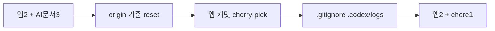

# 이력서·포트폴리오 기록

## 사례 1 — AI 세션 산출물을 브랜치 히스토리에서 분리한다

- 작업 유형: AI 하네스
- 관련 도메인/서비스: asan-metaverse-user-ui git 히스토리, Codex 세션 산출물
- 문제 출처: 사용자 요구

### 문제 상황

- 사용자가 제시한 요구·문제·변경 이유: 커밋된 AI 관련 내용은 `.gitignore`하고, 해당 커밋은 브랜치에서 제외하고 싶다고 요청했다.
- 테스트·런타임에서 관찰한 오류: 없음. 히스토리 재작성은 `reset --hard` + cherry-pick으로 충돌 없이 완료됐다.
- 필요한 기술·구조·패턴이 없을 때 발생할 문제: 세션 마크다운이 앱 커밋과 섞이면 리뷰·푸시 범위가 커지고, gitignore 없이 같은 산출물이 다시 커밋된다.

### 고민과 선택

- 사용자 제안: AI 관련 커밋 내용을 gitignore하고 그 커밋을 브랜치에서 제외
- 에이전트 제안: 미푸시이므로 `origin/sy-main`으로 hard reset 후 앱 커밋만 cherry-pick하고, 세션 폴더는 로컬 복원 후 비추적
- 검토한 대안: 대화형 rebase, origin 추적 로그까지 `git rm --cached`
- 최종 선택: reset + cherry-pick, `.codex/logs/`와 갭 분석 문서만 gitignore. origin의 기존 추적 로그는 건드리지 않음
- 선택 이유와 제외한 방식의 이유: 대화형 rebase는 환경에서 금지됨. origin 언트래킹은 사용자가 이번 요청에서 명시하지 않았고 이미 origin에 있는 파일을 바꾸므로 보류

### 적용

- 변경 경로: `.gitignore`; 브랜치 팁 `3e13111`
- 구현·수정·리팩터링 내용: `fb9d501`, `d100961`, `0876905` 제외. `397f7b6`→`1edafac`, `0102a4d`→`4721e10` 유지. 세션 폴더는 워킹트리에만 복원
- 핵심 동작: `origin/sy-main..HEAD`는 날짜 픽커 수정, 시민참여 API 계약, gitignore chore 세 커밋만 남음

### 사용 기술과 구체적 목적

| 기술·구조·패턴 | 해결하려는 구체적 문제 | 적용 위치와 방식 |
| --- | --- | --- |
| `git reset --hard` + cherry-pick | 대화형 rebase 없이 미푸시 커밋을 선택 유지 | `sy-main`을 `origin/sy-main` 기준으로 재작성 |
| `.gitignore` | 이후 세션 산출물·갭 분석 문서 재커밋 방지 | `.codex/logs/`, `docs/admin-ui-harness-gap-analysis.md` |

### 결과

- 적용 전: origin보다 5커밋 앞섬(앱 2 + AI 문서 3)
- 적용 후: origin보다 3커밋 앞섬(앱 2 + gitignore 1). 제외 세션은 로컬 파일로만 존재
- 검증 결과: `git log --oneline origin/sy-main..HEAD`가 `3e13111`, `4721e10`, `1edafac`. `git status`에 세션 폴더 untracked 없음
- 사용자 후속 피드백: 없음
- 추가 요청 및 남은 제한: origin 추적 `.codex/logs` 122파일은 gitignore만으로 빠지지 않음. 강제 푸시는 하지 않음

### 이력서·포트폴리오 문구

- 이력서 bullet: 미푸시 브랜치에서 AI 세션 문서 커밋 3개를 제외하고 앱 커밋만 남긴 뒤, `.codex/logs`를 gitignore로 분리했다.
- 포트폴리오 서술: 앱 변경과 세션 산출물이 한 브랜치에 섞여 리뷰 범위가 커지는 문제를, hard reset과 cherry-pick으로 앱 커밋만 재적용하고 세션 경로는 gitignore에 넣어 이후 커밋에서 제외하는 방식으로 해결했다. origin에 이미 있는 세션 로그 언트래킹은 범위 밖으로 남겼다.
