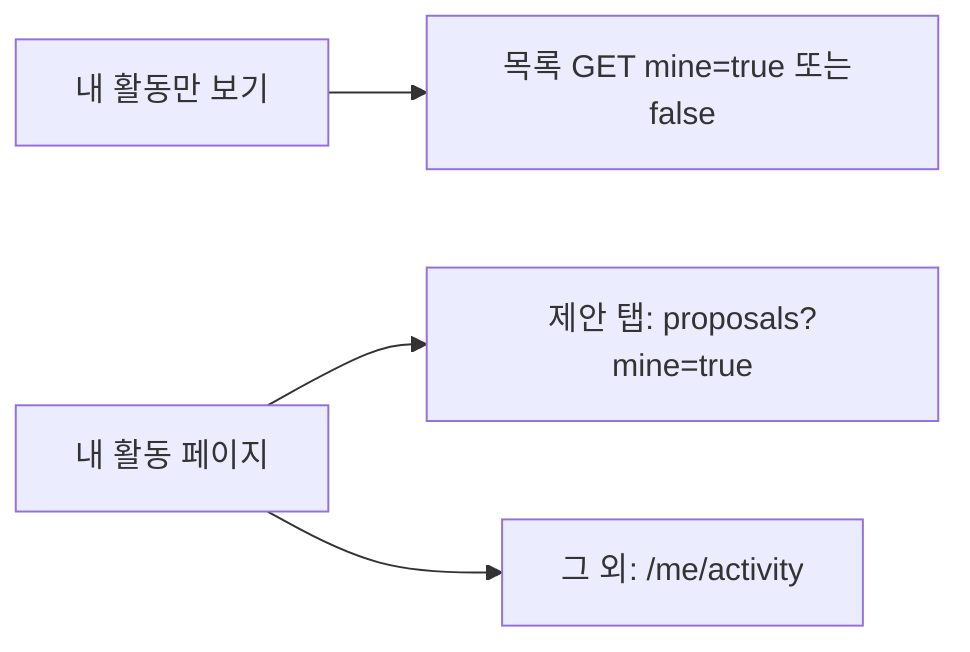

# 이력서·포트폴리오 기록

## 사례 1 — 목록 「내 활동만 보기」를 별도 API에서 `mine` query로 되돌림

- 작업 유형: 프로젝트 구현, 기획 변경
- 관련 도메인/서비스: 시민참여 제안·투표·토론·정책 목록
- 문제 출처: 사용자 요구, 기획 변경

### 문제 상황

- 사용자가 제시한 요구·문제·변경 이유: 이전에 목록 「내 활동만 보기」를 `/me/activity?content=` 별도 API로 받기로 했다가, 제안 목록은 `mine` query로 바뀌었다. 사용자는 그 별도 API 구성을 지우고, 제안과 같이 query `true`/`false`로 요청하라고 했다.
- 테스트·런타임에서 관찰한 오류: 구현 중 실패한 테스트는 없었다. 관련 vitest 66건, `npm run build`, `npm run lint`가 통과했다.
- 필요한 기술·구조·패턴이 없을 때 발생할 문제: 목록 토글이 `/me/activity`를 치면 확정된 `mine` query와 어긋난다. `mine`을 생략하면 기본값 false를 서버가 추론해야 하고, 클라이언트가 true/false를 보내지 않는다는 새 지시와도 어긋난다. 제안만 `mine`이고 투표·토론·정책은 activity면 같은 토글이 다른 endpoint를 친다.

### 세션·하네스 사고 근거

해당 없음

- 플랫폼·프로젝트 또는 cwd: Cursor, asan-metaverse-user-ui
- main session ID와 관련 child session 범위: 측정 근거 없음
- 사용자 핵심 지시 원문과 시각: 2026-08-26에 `별도 API 구성으로 "내 활동만 보기"를 한다는 내용을 지워주고`, `쿼리에 true/false로 요청하는 방식으로 변경해`라고 지시했다.
- 재지적·중단 지시와 시각: 없음
- compaction 전후 `Objective`·제한·`Next Move` 변화: 해당 없음
- 지시와 어긋난 파일 수정·도구·검토·캡처·재작업: 없음
- message·transcript entry·input token·cache read·child session 측정값: 측정 근거 없음
- 측정 출처와 인과 해석의 한계: 전체 세션 token을 이 작업 소비량으로 단정하지 않는다.
- 비용·품질·협업 영향에 관한 사용자 피드백: 없음
- 방지책과 남은 host·Hook 제한: 내 활동 페이지의 비제안 조회는 `/me/activity`로 남겨 범위 밖으로 표시했다.

### 고민과 선택

- 사용자 제안: 별도 activity API로 목록 필터를 하던 내용을 지우고, 제안처럼 `mine` query true/false를 보낸다.
- 에이전트 제안: 제안·투표·토론·정책 목록은 항상 `mine=true|false`를 보내고, `mine===true`일 때만 인증 설정을 붙인다. 내 활동 페이지 전체 조회는 `/me/activity`로 둔다.
- 검토한 대안: (1) 목록 필터만 `mine`으로 바꾸고 `useMyProposalActivityQuery`는 내 활동 페이지에 유지 (2) 목록과 내 활동 페이지 제안 탭까지 목록 API `mine`으로 통일 (3) `mine=true`일 때만 파라미터를 붙이고 false는 생략
- 최종 선택: (2) + 항상 true/false 전송. `useMyProposalActivityQuery` 삭제.
- 선택 이유와 제외한 방식의 이유: 사용자가 true/false 전송을 지시했고, 제안 activity 훅은 목록 필터용 별도 API의 잔재다. (3)은 직전 구현이며 이번 지시와 어긋난다. 설문 목록은 토글이 없어 `mine`을 넣지 않았다.

### 적용

- 변경 경로: proposal/vote/discussion/policy API, `ContentListQueryDto`, query keys, 목록 훅, `CitizenListRoutes.tsx`, `CitizenAuxiliaryRoutes.tsx`, MSW, 관련 테스트
- 구현·수정·리팩터링 내용: 목록 라우트가 `myActivityOnly`를 `mine` boolean으로 넘긴다. activity 분기를 지웠다. MSW는 `mine=true`일 때 `item.mine === true`만 남긴다.
- 핵심 동작: 토글 OFF는 `GET ...?mine=false`, ON은 `GET ...?mine=true`다. 목록은 `/me/activity`를 치지 않는다.

### 사용 기술과 구체적 목적

| 기술·구조·패턴 | 해결하려는 구체적 문제 | 적용 위치와 방식 |
| --- | --- | --- |
| 명시 `mine` params | true/false를 보내지 않거나 옛 `content` query가 실리는 것 방지 | proposal/vote/discussion/policy `to*ListParams` |
| 단일 list query 훅 | 같은 화면에서 list/activity를 갈아끼워 응답 형태가 갈리는 것 방지 | `CitizenListRoutes` |
| 훅 삭제 | 목록 필터용 별도 API 잔재를 남기지 않기 | `useMyProposalActivityQuery` 제거 |

### 결과

- 적용 전: 제안만 `mine`(true일 때만 전송), 투표·토론·정책 목록 필터는 `/me/activity`였다.
- 적용 후: 네 목록 모두 `mine=true|false`를 보내고, 목록 토글은 같은 목록 API를 친다.
- 검증 결과: 관련 vitest 66 passed, `npm run build` 성공, `npm run lint` 성공.
- 사용자 후속 피드백: 없음
- 추가 요청 및 남은 제한: 내 활동 페이지 비제안 필터는 `/me/activity`. 설문 목록에는 `mine`이 없다.
- 직접 측정하지 못한 수치: 측정 근거 없음

### 이력서·포트폴리오 문구

- 이력서 bullet: 시민참여 목록 「내 활동만 보기」를 별도 `/me/activity` 조회에서 각 목록 API의 `mine=true|false` query로 되돌려, 같은 토글이 콘텐츠 타입마다 다른 endpoint를 치지 않게 했다.
- 포트폴리오 서술: 목록 필터를 activity API로 분리하면 제안 `mine` 계약과 어긋나고, 같은 UI가 응답 형태가 다른 두 경로를 탄다. 사용자가 별도 API 구성을 지우라고 한 뒤, 네 목록에 `mine` boolean을 항상 보내고 제안 전용 activity 훅을 삭제했다. 관련 테스트 66건과 빌드·린트가 통과했다.
