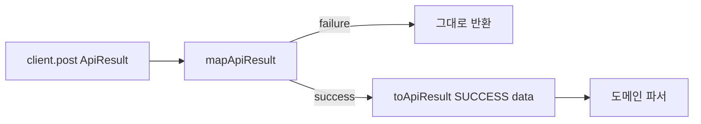

# 이력서·포트폴리오 기록

## 사례 1 — 성공 ApiResult 매핑을 공용 함수로 모은다

- 작업 유형: 리팩터링
- 관련 도메인/서비스: 시민참여 제안 생성·투표 제출 API, 공용 `ApiResult`
- 문제 출처: 사용자 요구

### 문제 상황

- 사용자가 제시한 요구·문제·변경 이유: `toCreatedProposalResult`와 같은 역할의 코드가 전역에 있으니 그걸 가져다 쓰는 패턴으로 전체를 수정하라고 했다.
- 테스트·런타임에서 관찰한 오류: 변경 후 API·페이지 테스트 33건과 `tsc -b`는 통과했다. MSW handlers 테스트는 샌드박스에서 `Invalid URL`이 났고 `all` 권한에서는 18건 통과했다.
- 필요한 기술·구조·패턴이 없을 때 발생할 문제: 도메인 API마다 실패 통과와 `{ success: true, data, error: null }`를 복제하면 envelope 형태가 어긋날 수 있다.

### 고민과 선택

- 사용자 제안: 전역 헬퍼를 재사용하는 패턴으로 전체 수정
- 에이전트 제안: 실패를 유지하는 매핑은 `unwrapApiResult`(throw)와 다르므로, 기존 `toApiResult`로 성공 envelope를 만드는 `mapApiResult`를 공용으로 두고 제안·투표 POST가 쓴다
- 검토한 대안: (1) 훅에서 `unwrapApiResult` 후 parse (2) `toApiResult` 오버로드 (3) 로컬 헬퍼 유지
- 최종 선택: `mapApiResult` + 도메인 변환 함수만 API에 남김
- 선택 이유와 제외한 방식의 이유: API 테스트가 `result.success`/`result.data`를 단언하므로 throw형 unwrap은 계약을 바꾼다. 동일 이름 기존 함수는 없었다.

### 적용

- 변경 경로: `api-result.mapper.ts`, `api-result.ts`, `proposal.api.ts`, `vote.api.ts`
- 구현·수정·리팩터링 내용: 로컬 `toCreatedProposalResult`·`toVoteResponseResult`를 제거하고 `mapApiResult(result, mapData)`를 호출한다
- 핵심 동작: 실패 `ApiResult`는 그대로, 성공 시 제안은 Location→`{ id }`, 투표는 `voteResponseSchema.parse`

### 사용 기술과 구체적 목적

| 기술·구조·패턴 | 해결하려는 구체적 문제 | 적용 위치와 방식 |
| --- | --- | --- |
| `mapApiResult` | 도메인마다 성공 envelope를 다시 조립함 | `api-result.mapper.ts`가 실패 통과 후 `toApiResult` 호출 |
| 도메인 파서 유지 | 공용 매퍼가 Location 정규식·vote schema를 모르게 함 | `parseCreatedProposalLocation`, `voteResponseSchema.parse` |

### 결과

- 적용 전: 제안·투표 API가 같은 `if (!result.success) return result` 블록을 각각 가짐
- 적용 후: 두 POST가 `mapApiResult`를 쓰고 변환 함수만 넘김
- 검증 결과: eslint 변경 파일 성공, `tsc -b` 성공, API·페이지 33 passed, handlers 18 passed(비샌드박스)
- 사용자 후속 피드백: 없음
- 추가 요청 및 남은 제한: 토론·댓글 like는 훅 unwrap+parse를 유지

### 이력서·포트폴리오 문구

- 이력서 bullet: 시민참여 생성·투표 POST의 성공 `ApiResult` 매핑을 공용 `mapApiResult`로 모아, 실패 통과와 SUCCESS envelope 조립을 `toApiResult` 한 곳에서 재사용하게 했다.
- 포트폴리오 서술: 도메인 API가 실패 분기와 성공 객체 조립을 복제하고 있었다. 공용 매퍼는 envelope만 다루고 Location·zod 변환은 각 API에 남겨 계약을 유지한 채 중복을 제거했다.
