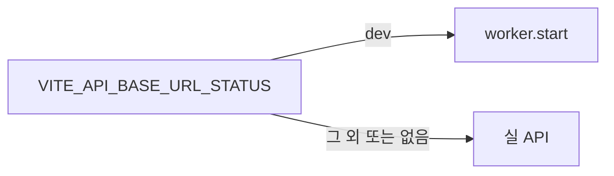

# 이력서·포트폴리오 기록

## 사례 1 — 모의 서버를 API status env로만 켜기

- 작업 유형: 프로젝트 구현
- 관련 도메인/서비스: 앱 진입점 MSW
- 문제 출처: 사용자 요구

### 문제 상황

- 사용자가 제시한 요구·문제·변경 이유: 모의 서버는 `.env`의 `VITE_API_BASE_URL_STATUS`가 `dev`일 때만 써야 한다.
- 테스트·런타임에서 관찰한 오류: 구현 중 실패한 테스트는 없었다. startMocks 테스트 4건, `npm run build`, `npm run lint`가 통과했다.
- 필요한 기술·구조·패턴이 없을 때 발생할 문제: 개발 모드 기본 켜짐을 두면 status가 `dev`가 아닌데도 MSW가 실 API를 가로챈다. `VITE_ENABLE_MSW`와 새 변수가 같이 있으면 어느 쪽이 우선인지 알 수 없다.

### 세션·하네스 사고 근거

해당 없음

- 플랫폼·프로젝트 또는 cwd: Cursor, asan-metaverse-user-ui
- main session ID와 관련 child session 범위: 측정 근거 없음
- 사용자 핵심 지시 원문과 시각: 2026-08-26에 `mock 서버 사용 여부는 .env에 VITE_API_BASE_URL_STATUS가 dev일 때만 사용하도록 하는 기능 추가해줘`라고 지시했다.
- 재지적·중단 지시와 시각: 없음
- compaction 전후 `Objective`·제한·`Next Move` 변화: 해당 없음
- 지시와 어긋난 파일 수정·도구·검토·캡처·재작업: 없음
- message·transcript entry·input token·cache read·child session 측정값: 측정 근거 없음
- 측정 출처와 인과 해석의 한계: 전체 세션 token을 이 작업 소비량으로 단정하지 않는다.
- 비용·품질·협업 영향에 관한 사용자 피드백: 없음
- 방지책과 남은 host·Hook 제한: 테스트용 node MSW는 범위 밖으로 남겼다.

### 고민과 선택

- 사용자 제안: `VITE_API_BASE_URL_STATUS=dev`일 때만 모의 서버를 사용한다.
- 에이전트 제안: 기존 `VITE_ENABLE_MSW`와 Vite `DEV` 기본 켜짐을 제거하고, trim한 status가 `dev`일 때만 worker를 시작한다.
- 검토한 대안: (1) `DEV && status===dev` (2) status만 본다 (3) `VITE_ENABLE_MSW`와 status를 둘 다 본다
- 최종 선택: (2)
- 선택 이유와 제외한 방식의 이유: 사용자가 지정한 스위치는 status 하나다. (1)은 Vite 개발 모드가 아니면 `dev`여도 모의가 꺼진다. (3)은 우선순위가 모호하다.

### 적용

- 변경 경로: `src/app/mocks/startMocks.ts`, `startMocks.test.ts`, `vite-env.d.ts`, 로컬 `.env`
- 구현·수정·리팩터링 내용: `VITE_API_BASE_URL_STATUS?.trim() !== "dev"`이면 return한다. env 타입에서 `VITE_ENABLE_MSW`를 뺐다.
- 핵심 동작: `.env`에 `VITE_API_BASE_URL_STATUS=dev`가 있을 때만 브라우저 MSW가 뜬다.

### 사용 기술과 구체적 목적

| 기술·구조·패턴 | 해결하려는 구체적 문제 | 적용 위치와 방식 |
| --- | --- | --- |
| Vite `import.meta.env` | 빌드 타임 스위치 없이 로컬 env로 모의를 켜고 끄기 | `startMocks.ts` |
| 지연 import `./browser` | 모의가 꺼져 있을 때 worker 번들을 타지 않기 | 기존 dynamic import 유지 |
| env trim | `.env`의 `= value` 공백 때문에 `dev` 비교가 실패하는 것 방지 | `?.trim()` |

### 결과

- 적용 전: 개발 모드면 MSW가 기본으로 켜졌고 `VITE_ENABLE_MSW`로 끌 수 있었다.
- 적용 후: `VITE_API_BASE_URL_STATUS=dev`일 때만 브라우저 MSW가 시작된다.
- 검증 결과: startMocks 테스트 4 passed, `npm run build` 성공, `npm run lint` 성공.
- 사용자 후속 피드백: 없음
- 추가 요청 및 남은 제한: 배포 env에 `dev`를 넣으면 프로덕션에서도 MSW가 뜰 수 있다. `.env`는 gitignore라 저장소에는 코드와 타입만 남는다.
- 직접 측정하지 못한 수치: 측정 근거 없음

### 이력서·포트폴리오 문구

- 이력서 bullet: 브라우저 MSW 시작 조건을 Vite 개발 모드 기본값에서 `VITE_API_BASE_URL_STATUS=dev` 단일 스위치로 바꿔, 개발 서버에서도 실 API와 모의를 환경 변수로 고르게 했다.
- 포트폴리오 서술: 개발 모드 기본 켜짐은 status가 `dev`가 아닌데도 요청을 가로챈다. 사용자가 지정한 env만 보도록 `startMocks`를 바꾸고 기존 `VITE_ENABLE_MSW`를 제거했다. 관련 테스트 4건과 빌드·린트가 통과했다.
