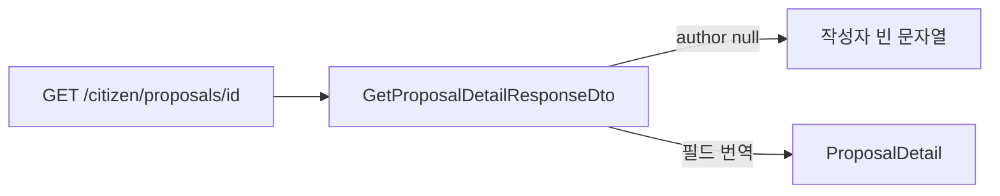

# 이력서·포트폴리오 기록

## 사례 1 — 제안 상세 GET을 확정 DTO와 /citizen 경로에 맞춘다

- 작업 유형: 프로젝트 구현
- 관련 도메인/서비스: 시민참여 제안 상세 조회
- 문제 출처: 사용자 요구

### 문제 상황

- 사용자가 제시한 요구·문제·변경 이유: `GET /citizen/proposals/{proposalId}` 성공 본문과 탈퇴 시 `author: null`을 DTO로 설정하고, 시민참여 path 접두사는 `/citizen`이며 `v1`/`api`를 넣지 말라고 했다.
- 테스트·런타임에서 관찰한 오류: `tsc -b`와 관련 테스트는 통과했다. handlers 테스트는 샌드박스에서 `Invalid URL`이 났고 비샌드박스에서 18건 통과했다.
- 필요한 기술·구조·패턴이 없을 때 발생할 문제: `ContentDetailDto`의 body/detail/effect로 파싱하면 서버 JSON이 거부되고, `/v1/api/citizen-participation`으로내면 404가 난다. author를 필수로 두면 탈퇴 작성자 상세가 실패한다.

### 고민과 선택

- 사용자 제안: 예시 JSON으로 상세 DTO를 설정하고 path는 `/citizen/proposals` 또는 `/citizen/votes`
- 에이전트 제안: 투표 상세와 같이 전용 스키마·훅을 두고, 화면 필드는 presentation에서 번역한다. 시민참여 전송 모듈 접두사를 `/citizen`으로 통일한다
- 검토한 대안: (1) ContentDetailDto에 새 필드를 섞음 (2) 제안·투표만 path 변경 (3) author null을 빈 객체로 치환
- 최종 선택: `GetProposalDetailResponseDto` + `useProposalDetailQuery`, author null 유지, 전 시민참여 API `/citizen`
- 선택 이유와 제외한 방식의 이유: 사용자 예시와 path 지시를 그대로 따른다. 공용 상세 훅에 섞으면 토론 파서가 깨진다

### 적용

- 변경 경로: proposal.dto/api, parser, queries, presentation, ReadDetailRoutes, 시민참여 `*.api.ts`, MSW, 테스트
- 구현·수정·리팩터링 내용: 상세 스키마에 nullable author와 referenceCase를 두고 GET 경로를 `/citizen/proposals/{id}`로 바꿨다
- 핵심 동작: 200 SUCCESS data를 파싱하고, 탈퇴 시 author null, 화면 작성자 문자열은 빈 값

### 사용 기술과 구체적 목적

| 기술·구조·패턴 | 해결하려는 구체적 문제 | 적용 위치와 방식 |
| --- | --- | --- |
| Zod 상세 스키마 | 옛 body/detail 필드를 성공으로 받지 않음 | `getProposalDetailResponseSchema` |
| 전용 query hook | 공용 ContentDetail 파서와 섞여 error 타입이 됨 | `useProposalDetailQuery` |
| `/citizen` RESOURCE | v1/api 접두사로 백엔드와 어긋남 | 시민참여 API·MSW |

### 결과

- 적용 전: GET이 ContentDetailDto와 `/v1/api/citizen-participation/proposals/{id}`를 씀
- 적용 후: 예시 필드와 `/citizen/proposals/{id}`를 쓰고 author null을 허용
- 검증 결과: `tsc -b` 성공, API·presentation·handlers 테스트 통과
- 사용자 후속 피드백: 없음
- 추가 요청 및 남은 제한: 목록 author null, 토론 등 상세 재계약은 없음

### 이력서·포트폴리오 문구

- 이력서 bullet: 시민 제안 상세 API를 확정 JSON과 `/citizen/proposals/{id}`에 맞추고, 탈퇴 작성자의 `author: null`을 깨지지 않게 파싱했다.
- 포트폴리오 서술: 공용 ContentDetailDto로 읽으면 서버 필드명과 탈퇴 계약이 어긋난다. 전용 DTO와 훅으로 분리하고 화면 매퍼만 남겨 목록·생성 계약은 유지했다.
