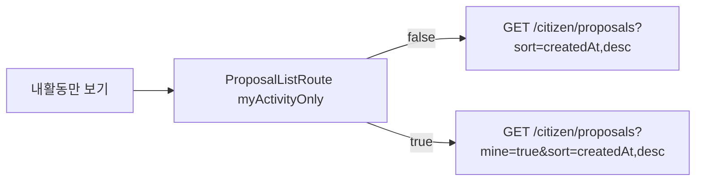

# 이력서·포트폴리오 기록

## 사례 1 — 제안 목록 `mine` 필터와 허용 sort 계약

- 작업 유형: 프로젝트 구현
- 관련 도메인/서비스: 시민참여 proposal list
- 문제 출처: 사용자 요구, 기획 변경

### 문제 상황

- 사용자가 제시한 요구·문제·변경 이유: `GET /citizen/proposals`에서 `mine=true`면 토큰 사용자가 등록한 제안만 내려간다. 목록에는 본문 4필드가 없고 상세에서만 내려간다. `sort`는 `createdAt`·`id`만 허용하고 기본값은 `createdAt,desc`다. 제안 목록에 「내활동만 보기」 필터를 넣으라고 했다.
- 테스트·런타임에서 관찰한 오류: 구현 중 실패한 테스트는 없었다. 관련 vitest 62건, `npm run build`, `npm run lint`가 통과했다.
- 필요한 기술·구조·패턴이 없을 때 발생할 문제: 목록이 `/me/activity`를 치면 확정 list `mine`과 어긋난다. `mine=false`를 보내면 기본값 계약과 다르다. 임의 문자열 sort를 보내면 서버가 거부할 수 있다. 목록 DTO에 본문 4필드를 넣으면 목록 응답 파싱이 실패하거나 상세 전용 값을 목록에 기대해 화면이 깨진다.

### 세션·하네스 사고 근거

해당 없음

- 플랫폼·프로젝트 또는 cwd: Cursor, asan-metaverse-user-ui
- main session ID와 관련 child session 범위: 측정 근거 없음
- 사용자 핵심 지시 원문과 시각: 2026-08-26에 `GET /citizen/proposals`의 `mine`·본문 4필드 부재·허용 `sort`를 제시하고, 제안 목록에 「내활동만 보기」를 `추가해`로 승인했다.
- 재지적·중단 지시와 시각: 없음
- compaction 전후 `Objective`·제한·`Next Move` 변화: 해당 없음
- 지시와 어긋난 파일 수정·도구·검토·캡처·재작업: 없음
- message·transcript entry·input token·cache read·child session 측정값: 측정 근거 없음
- 측정 출처와 인과 해석의 한계: 전체 세션 token을 이 작업 소비량으로 단정하지 않는다.
- 비용·품질·협업 영향에 관한 사용자 피드백: 없음
- 방지책과 남은 host·Hook 제한: 투표 목록 activity 분기와 내 활동 페이지는 범위 밖으로 남겼다.

### 고민과 선택

- 사용자 제안: 목록 API에 `mine=true`를 쓰고, 제안 목록에 「내활동만 보기」 필터를 추가한다.
- 에이전트 제안: 기존 `?myActivity=true` 화면 상태를 유지한 채 전송만 `mine=true`로 옮긴다. `mine=false`는 query에 넣지 않고, `sort` 기본값을 전송 계층에서 붙인다.
- 검토한 대안: (1) `/me/activity`를 유지하고 클라이언트에서 `mine` 표시만 변경 (2) 제안 목록을 `GET /citizen/proposals?mine=true`로 통일 (3) `mine=false`를 항상 전송
- 최종 선택: (2). `mine===true`일 때만 파라미터와 인증 설정을 붙인다.
- 선택 이유와 제외한 방식의 이유: 사용자가 list `mine`을 확정했다. (1)은 다른 endpoint를 치므로 계약과 어긋난다. (3)은 기본값 false를 명시적으로 보낼 필요가 없다.

### 적용

- 변경 경로: `proposal.dto.ts`, `proposal.api.ts`, `queryKeys.ts`, `useProposalListQuery`, `CitizenListRoutes.tsx`, `MyActivityToggle.tsx`, `ProposalListPage.tsx`, MSW handlers, 관련 테스트, feature barrel
- 구현·수정·리팩터링 내용: `PROPOSAL_LIST_SORT`로 허용 sort를 좁히고 `toProposalListParams`가 `page`/`size`/`sort`와 조건부 `mine`만 복사한다. `ProposalListRoute`는 `myActivityOnly`이면 `{ mine: true }`를 같은 목록 훅에 넘긴다. 토글 라벨은 「내활동만 보기」다.
- 핵심 동작: 기본 목록 요청은 `sort=createdAt,desc`이고 `mine`이 없다. 필터를 켜면 `mine=true`가 붙고 MSW는 fixture 59만 반환한다.

### 사용 기술과 구체적 목적

| 기술·구조·패턴 | 해결하려는 구체적 문제 | 적용 위치와 방식 |
| --- | --- | --- |
| 허용 sort 상수 | 임의 문자열이 list URL에 실리는 것 방지 | `PROPOSAL_LIST_SORT` / `ProposalListSort` |
| 명시 params 복사 | `mine=false`나 옛 `myActivity`가 전송되는 것 방지 | `toProposalListParams` |
| TanStack Query key | `mine`/`sort`가 달라도 같은 캐시를 쓰는 것 방지 | `citizenParticipationKeys.proposalList` |
| Zod list schema | 목록에 본문 4필드가 들어오는 것을 계약에서 제외 | `proposalListItemSchema` vs 상세 스키마 |

### 결과

- 적용 전: 제안 목록의 내 활동이 `/me/activity?content=proposal`를 쳤고, list 요청에는 `sort`/`mine`이 없었다.
- 적용 후: 같은 `GET /citizen/proposals`가 기본 `createdAt,desc`를 보내고, 필터가 켜지면 `mine=true`만 추가한다. 목록 라벨은 「내활동만 보기」다.
- 검증 결과: 관련 vitest 62 passed, `npm run build` 성공, `npm run lint` 성공.
- 사용자 후속 피드백: 없음
- 추가 요청 및 남은 제한: 투표 목록은 `/me/activity`를 유지한다. 정렬 UI는 없다. 목록 카드 summary는 빈 문자열이다.
- 직접 측정하지 못한 수치: 측정 근거 없음

### 이력서·포트폴리오 문구

- 이력서 bullet: 시민 제안 목록을 `GET /citizen/proposals`의 `mine`·허용 `sort` 계약에 맞추고, 「내활동만 보기」가 별도 activity API가 아니라 같은 목록 요청의 `mine=true`를 쓰도록 옮겼다.
- 포트폴리오 서술: 목록 필터가 `/me/activity`를 치면 확정된 `mine` query와 어긋나고, 허용되지 않은 sort는 서버가 거부할 수 있다. 화면 URL `myActivity`는 유지한 채 전송만 `mine`/`sort`로 옮기고, 목록 스키마에는 상세 전용 본문 4필드를 넣지 않았다. 관련 테스트 62건과 빌드·린트가 통과했다.
