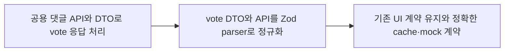

# 이력서·포트폴리오 기록

## 사례 1 — 시민 투표 댓글 API 계약 전환

- 작업 유형: 기획 변경 | 버그 수정 | 품질 개선
- 관련 도메인/서비스: 시민참여 투표 댓글 조회
- 문제 출처: 사용자 요구

### 문제 상황

- 사용자가 제시한 요구·문제·변경 이유: `/citizen/votes/{voteId}/comments`는 투표 상태와 무관하게 조회되고 임시저장 투표만 404이며, 작성자는 `authorName`만 제공한다. page·size·sort query와 `items/total/page/size` 응답 계약을 적용해야 했다.
- 테스트·런타임에서 관찰한 오류: 신규 테스트 최초 실행에서 `getVoteCommentList is not a function`이 발생했다. 기존 공용 댓글 DTO는 numeric ID와 좋아요 필드 부재, pagination shape를 파싱할 수 없었다.
- 필요한 기술·구조·패턴이 없을 때 발생할 문제: 공용 DTO를 서버 응답으로 오인하면 Zod parse 실패, cache key 충돌, 가짜 좋아요 표시 또는 undefined 산술이 발생할 수 있다.

### 고민과 선택

- 사용자 제안: 제공된 backend DTO에 맞춰 관련 도메인을 수정한다.
- 에이전트 제안: vote 전용 transport DTO·API를 두고 parser에서 기존 화면 모델로 정규화한다.
- 검토한 대안: 공용 댓글 DTO를 vote 응답으로 직접 교체하거나 누락된 좋아요 필드에 0/false를 합성하는 방식.
- 최종 선택: 원본 vote 계약을 별도로 검증하고 숫자 ID와 pagination만 화면 모델로 변환하며, 좋아요 필드는 생성하지 않는다.
- 선택 이유와 제외한 방식의 이유: 공용 DTO 직접 교체는 일반 댓글 좋아요·신고 흐름을 깨고, 0/false 합성은 backend가 제공하지 않은 기능 상태를 UI에 노출한다.

### 적용

- 변경 경로: `src/features/citizen-participation/api/`, `hook/`, `model/`, `mocks/`, `index.ts`, `src/pages/citizen-participation/model/presentation.ts`
- 구현·수정·리팩터링 내용: 폐쇄형 sort DTO, Axios params, Zod parser, query dispatch와 key, 선택형 좋아요 cache 처리, vote 전용 mock store·fixture·tests를 적용했다.
- 핵심 동작: `GET /citizen/votes/{id}/comments?page=1&size=20&sort=createdAt,desc` 응답을 검증한 뒤 기존 댓글 목록 계약으로 제공한다.

### 사용 기술과 구체적 목적

| 기술·구조·패턴 | 해결하려는 구체적 문제 | 적용 위치와 방식 |
| --- | --- | --- |
| TypeScript literal union | 허용되지 않은 sort 차단 | `VOTE_COMMENT_SORT`, `VoteCommentSort` |
| Zod | 외부 응답 shape 런타임 검증 | vote comment item·response schema |
| Adapter parser | transport와 화면 pagination·ID 계약 분리 | `parseVoteCommentList` |
| TanStack Query key | page·size·sort cache 충돌 방지 | `citizenParticipationKeys.comments` |
| MSW | 실제 endpoint와 상태·draft·pagination 계약 재현 | vote comment fixture/store/handler |
| Vitest + Axios | 실제 API client 표면의 요청·응답 회귀 고정 | 신규 API·handler tests |

### 결과

- 적용 전: vote 댓글 조회가 공용 댓글 endpoint·DTO를 사용해 신규 backend 응답과 불일치했다.
- 적용 후: vote 전용 요청·응답 계약을 사용하면서 기존 UI hook과 CommentItem 계약은 유지된다.
- 검증 결과: 대상 36 tests, build, lint 통과. Watcher PASS. 전체 테스트는 변경과 무관한 meeting API 기존 실패 2건이 남았다.
- 사용자 후속 피드백: 없음
- 추가 요청 및 남은 제한: 실제 backend 인증 환경 검증은 수행하지 않았다.

### 이력서·포트폴리오 문구

- 이력서 bullet: TypeScript·Zod·TanStack Query·MSW를 사용해 시민 투표 댓글의 numeric ID와 신규 pagination 계약을 기존 UI 모델에 안전하게 통합하고 대상 36개 회귀 테스트와 build·lint를 통과시켰다.
- 포트폴리오 서술: 공용 댓글 DTO와 신규 vote 댓글 응답의 ID·좋아요·pagination 불일치를 분석하고, transport DTO와 화면 모델을 분리하는 adapter parser 및 query key·MSW 계약을 적용해 UI 변경 없이 API 전환을 완료했다.

## 사례 2 — nullable 작성자로 인한 제안 목록 전체 손실 복구

- 작업 유형: 버그 수정 | API 계약 정합성 | 품질 개선
- 관련 도메인/서비스: 시민참여 제안 목록
- 문제 출처: 사용자 제공 실제 API 응답과 화면 미표시 현상

### 문제 상황

- 네트워크와 콘솔에는 제안 목록 성공 응답이 도착했지만 화면에는 항목이 표시되지 않았다.
- 실제 응답의 `REJECTED` 항목은 `author: null`이었고, 목록 Zod schema는 작성자 객체를 필수로 요구했다.
- 배열 전체 parse 방식 때문에 한 항목의 계약 불일치가 정상 상태 제안까지 모두 제거됐으며 query error는 UI에서 빈 결과로 보였다.

### 고민과 선택

- 검토한 대안: null 항목만 parser에서 제거, 가짜 작성자 객체 합성, production UI error 처리까지 동시 수정.
- 최종 선택: 실제 nullability를 schema·DTO에 보존하고 presentation에서 기존 상세 화면과 같은 빈 문자열 fallback을 적용했다.
- 선택 이유: 부분 데이터를 임의 제거하거나 외부 데이터를 왜곡하지 않고, production UI 소유권과 승인 범위를 지키는 최소 root fix이기 때문이다.

### 적용

- `proposal.dto.ts`: 목록 작성자 schema와 DTO를 nullable로 변경했다.
- `presentation.ts`: null 작성자를 빈 문자열로 안전하게 매핑했다.
- parser와 presentation에 실제 장애 shape 회귀 테스트를 각각 추가했다.
- dirty 원 worktree를 보존하기 위해 승인된 linked worktree 브랜치에서 구현했다.

### 사용 기술과 구체적 목적

| 기술·구조·패턴 | 해결하려는 구체적 문제 | 적용 위치와 방식 |
| --- | --- | --- |
| Zod nullable schema | 실제 API null 응답의 전체 parse 실패 방지 | `proposalListItemSchema.author` |
| TypeScript nullable union | 런타임 계약과 정적 타입 일치 | `GetProposalListItemDto.author` |
| Presentation adapter | API null을 UI 문자열 계약으로 변환 | `toProposalListItem` |
| Vitest TDD | parser 실패와 null 접근 예외를 경계별 고정 | 두 회귀 테스트 파일 |
| linked worktree | 기존 dirty 작업을 보존하고 작업 브랜치 격리 | `task/fix-proposal-list-null-author` |

### 결과

- 적용 전: `author:null` 한 건이 목록 전체 Zod parse를 실패시켰다.
- 적용 후: backend 형태 4건이 모두 파싱되고 현재 UI 지원 상태 3건이 카드 모델로 유지된다.
- 검증 결과: 대상 18 tests, build, lint 통과. 직접 module driver에서 4건 parse·3건 매핑 확인. Watcher PASS.
- 전체 테스트: 211건 통과, 변경과 무관한 meeting API 기존 실패 2건.
- 사용자 후속 피드백: 없음.

### 이력서·포트폴리오 문구

- 이력서 bullet: 실제 API의 nullable 작성자 한 건이 제안 목록 전체를 무효화하던 Zod 계약 불일치를 TypeScript nullable DTO와 presentation adapter로 복구하고, 대상 18개 테스트·build·lint 및 4건 종단 driver를 검증했다.
- 포트폴리오 서술: 성공 응답이 화면에서 빈 결과로 보이는 현상을 API envelope부터 Zod parser, React Query, presentation까지 추적해 nullable 계약 불일치와 오류 은닉 경로를 분리했다. 외부 nullability를 경계 타입에 보존하고 UI fallback을 presentation에 한정해 최소 수정으로 정상 상태 제안 표시를 복구했다.
