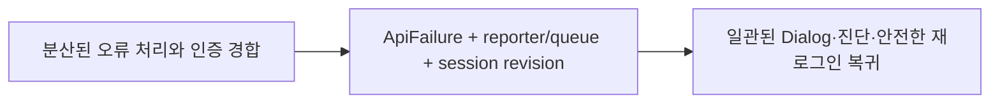

# 이력서·포트폴리오 기록

## 사례 1 — 전역 API 오류와 재인증 흐름 통합

- 작업 유형: 프로젝트 구현 | 버그 수정 | 보안·품질 개선 | 리팩터링
- 관련 도메인/서비스: React 사용자 앱, API 오류 처리, 인증·회의
- 문제 출처: 사용자 요구 | 테스트·런타임 실패 | 구현 위험 | 검토 결과

### 문제 상황

- 사용자가 제시한 요구·문제·변경 이유: 서버 오류는 기존 Dialog로 안내하고 contract/network 오류는 화면을 막지 않으며, 401 이후 안전한 내부 경로로 복귀해야 했다.
- 테스트·런타임에서 관찰한 오류: contradictory ApiResult marker, RTC token/UID 누락, nested encoded returnTo, active 401 중 expiry redirect 누락이 독립 검증에서 발견됐다.
- 필요한 기술·구조·패턴이 없을 때 발생할 문제: transport마다 분류·표시가 달라지고, stale refresh가 새 session을 덮거나 민감 URL·payload가 노출될 수 있었다.

### 고민과 선택

- 사용자 제안: 전역 오류 처리와 route 보호를 기존 UI 계약 안에서 통합한다.
- 에이전트 제안: typed union, 단일 reporter, 외부 store queue, session revision, strict returnTo parser를 계층별로 적용한다.
- 검토한 대안: feature별 inline modal/logger와 새 UI 컴포넌트는 중복·scope 확장 때문에 제외했다.
- 최종 선택: 기존 Dialog를 bridge로 재사용하고 transport/domain/state/UI 책임을 분리했다.
- 선택 이유와 제외한 방식의 이유: 민감정보 경계를 중앙화하고 기존 UI·public API·native callback을 보존하기 위해서다.

### 적용

- 변경 경로: `src/shared/api`, `src/shared/lib/hooks/use-api.tsx`, `src/app/providers`, `src/app/routing.ts`, Auth 비-UI 계층, Meeting API.
- 구현·수정·리팩터링 내용: ApiFailure/diagnostics/reporter/queue, adapters, retry, session revision, returnTo, route guard, Dialog bridge를 구현했다.
- 핵심 동작: server만 modal, contract/transport는 development 진단, canceled 무동작, 401 확인 전 session 유지와 확인 후 안전 복귀다.

### 사용 기술과 구체적 목적

| 기술·구조·패턴 | 해결하려는 구체적 문제 | 적용 위치와 방식 |
| --- | --- | --- |
| TypeScript discriminated union | 오류 종류의 누락·문자열 추측 방지 | `ApiFailure`와 exhaustive switch |
| Zod | 외부 응답·returnTo 경계 검증 | Auth/Meeting parser와 strict shape |
| `useSyncExternalStore` | session·queue 변화에 route 즉시 반응 | `AuthRouteBoundary` |
| WeakSet + FIFO queue | 중복 reporting·Dialog 경합 방지 | reporter와 server error queue |
| TanStack Query cache callbacks | retry 종료 시점의 단일 reporting | app query client |

### 결과

- 적용 전: 오류 처리와 표시가 Axios/fetch/Query/hook에 분산되고 route는 token expiry·401 경합을 다루지 못했다.
- 적용 후: 공통 typed failure 흐름과 단일 Dialog queue, stale-safe session, strict returnTo가 연결됐다.
- 검증 결과: `npm run lint`, `npm run build`, `npm run test` exit 0; Vitest 452개와 governance 20개 통과; F1 APPROVE, F4 PASS; Chromium F3 통과.
- 사용자 후속 피드백: 없음.
- 추가 요청 및 남은 제한: 실제 회사 API·native protocol 환경은 미제공이며 기존 HeroUI warning은 범위 밖이다.

### 이력서·포트폴리오 문구

- 이력서 bullet: React·TypeScript 앱의 Axios/fetch/TanStack Query 오류를 discriminated union과 단일 reporter/FIFO queue로 통합하고, session revision·strict returnTo 기반 재인증 흐름을 구현해 Vitest 452개와 실제 Chromium 시나리오를 통과시켰다.
- 포트폴리오 서술: 분산된 오류 분류와 401·만료 경합 문제를 분석하고, 기존 Dialog를 유지하면서 typed failure·redacted diagnostics·외부 store queue·session revision을 적용해 일관된 오류 안내와 안전한 로그인 복귀를 완성했다.
