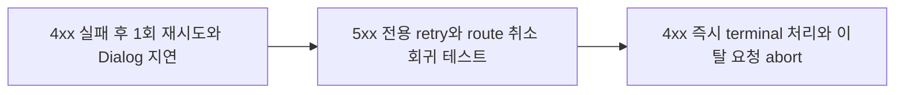

# 이력서·포트폴리오 기록

## 사례 1 — 4xx 재시도로 지연되던 전역 오류 Dialog 개선

- 작업 유형: 버그 수정
- 관련 도메인/서비스: 시민참여, TanStack Query, 전역 API 오류 처리
- 문제 출처: 사용자 피드백 및 런타임 재현

### 문제 상황

- 사용자가 제시한 요구·문제·변경 이유: 페이지 이동 뒤 `/citizen/main` 로딩이 남고 404 Dialog가 누락되거나 다른 화면에서 늦게 보이는 원인을 조사하고 수정한다.
- 테스트·런타임에서 관찰한 오류: 수정 전 404는 약 1초 간격으로 두 번 요청된 뒤 Dialog가 표시됐고, RED 테스트는 기대 1회 대비 실제 2회를 기록했다.
- 필요한 기술·구조·패턴이 없을 때 발생할 문제: 영구적인 4xx를 재시도하면 사용자가 대응할 수 있는 오류 피드백이 지연되고 route 전환과 겹쳐 출처가 불명확해진다.

### 고민과 선택

- 사용자 제안: 조사 결과에 따른 4xx retry 제거와 route 이탈 회귀 검증 계획을 승인했다.
- 에이전트 제안: transport·5xx만 retry하고 404는 즉시 terminal 처리하며, route 취소는 별도 상태·브라우저 검증으로 보존한다.
- 검토한 대안: 시민참여 main query에만 `retry: false` 지정, Dialog queue 변경, 전역 status 기반 retry 분류.
- 최종 선택: 전역 `shouldRetryQuery`에서 5xx만 server retry 대상으로 유지한다.
- 선택 이유와 제외한 방식의 이유: production query별 override가 없어 공통 seam이 root fix이며, queue/UI 변경은 직접 원인과 무관하고 범위를 넓힌다.

### 적용

- 변경 경로: `src/app/providers/queryClient.ts`, `src/app/providers/queryClient.test.ts`, `src/pages/citizen-participation/ui/CitizenDataRoutes.test.tsx`
- 구현·수정·리팩터링 내용: server retry 조건을 500~599로 제한하고 404 시도 횟수와 route 이탈 query 상태를 테스트했다.
- 핵심 동작: 4xx는 첫 실패에서 전역 reporter로 전달되고, 5xx·transport·unknown은 최대 한 번 재시도하며, observer가 사라진 main query는 idle로 복원된다.

### 사용 기술과 구체적 목적

| 기술·구조·패턴 | 해결하려는 구체적 문제 | 적용 위치와 방식 |
| --- | --- | --- |
| TanStack Query retry predicate | 영구 4xx의 불필요한 재시도 | `ApiFailure.statusCode`의 5xx 범위만 retry |
| Discriminated union | server·transport·contract·cancel 실패의 정책 혼합 방지 | 기존 `ApiFailure.kind` exhaustive switch 유지 |
| Vitest RED→GREEN | 수정이 실제 404 재시도 문제를 해결하는지 증명 | 404 기대 1회를 먼저 추가해 `Received 2` 확인 |
| Memory Router + MSW | route 이탈 후 query lifecycle 보존 | observer 0명·`fetchStatus: idle`·요청 1회 검증 |
| Playwright 네트워크 이벤트 | jsdom이 보여주지 못한 실제 transport abort 검증 | Chromium에서 `net::ERR_ABORTED` 관찰 |

### 결과

- 적용 전: `/citizen/main` 404가 두 번 요청되고 약 1초 뒤 terminal Dialog가 표시됐다.
- 적용 후: 404 요청 1회 후 약 91ms에 Dialog가 표시됐고, 응답 대기 중 route 이탈은 `net::ERR_ABORTED`로 종료되며 Dialog가 남지 않았다.
- 검증 결과: targeted 17개, 전체 Vitest 454개, governance 20개, lint, TypeScript build 통과.
- 사용자 후속 피드백: 구현 계획과 브랜치 생성을 승인했으며 수정 완료 후 별도 피드백은 아직 없다.
- 추가 요청 및 남은 제한: TypeScript LSP 미설치, 기존 대형 청크 경고, route 테스트 파일 순수 LOC 238줄.

### 이력서·포트폴리오 문구

- 이력서 bullet: TanStack Query의 전역 retry 정책을 typed `ApiFailure` 상태 기반으로 재설계해 4xx 오류의 중복 요청을 제거하고, Vitest 454개와 Chromium 네트워크 시나리오로 회귀를 검증했다.
- 포트폴리오 서술: 시민참여 404가 재시도되어 Dialog가 늦게 표시되는 문제를 실제 네트워크 타임라인으로 분리 진단했다. route 취소는 정상임을 확인하고 전역 retry seam만 최소 수정했으며, RED→GREEN 단위 테스트와 Memory Router·MSW 상태 테스트, Chromium `net::ERR_ABORTED` 검증으로 즉시 오류 전달과 취소 계약을 함께 보존했다.
