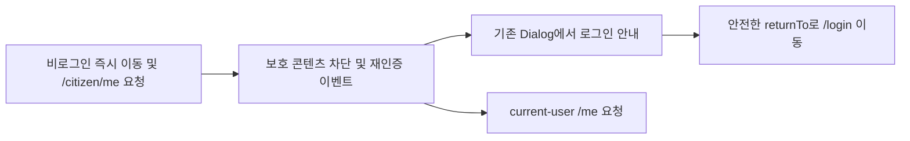

# 이력서·포트폴리오 기록

## 사례 1 — 로그인 안내 흐름과 current-user API 경로 수정

- 작업 유형: 버그 수정
- 관련 도메인/서비스: 시민참여 인증 경계 및 current-user 조회
- 문제 출처: 사용자 요구 | 사용자 피드백 | 런타임 확인

### 문제 상황

- 사용자가 제시한 요구·문제·변경 이유: 인증된 `/citizen/me` 요청의 404를 해소하고 비로그인 상세 진입 시 안내를 먼저 제공해야 한다.
- 테스트·런타임에서 관찰한 오류: 비로그인 상세 진입 시 모달 없이 `/login`으로 즉시 이동하며 상세 화면이 `/citizen/me`를 요청했다.
- 필요한 기술·구조·패턴이 없을 때 발생할 문제: 로그인 필요 이유를 알 수 없고 잘못된 endpoint로 current-user 조회가 실패한다.

### 고민과 선택

- 사용자 제안: 안내 모달 확인 후 로그인 화면으로 이동하고 current-user 조회를 `/me`로 변경한다.
- 에이전트 제안: 기존 전역 오류 큐와 Dialog 흐름을 재사용한다.
- 검토한 대안: 보호 경계 전용 신규 모달을 추가하는 방식.
- 최종 선택: 기존 `ApiErrorDialogBridge`와 `serverErrorQueue`를 재사용하고 `meApi.getMe()`만 `/me`로 분리한다.
- 선택 이유와 제외한 방식의 이유: 중복 UI와 인증 이동 로직을 만들지 않고 기존 접근성·`returnTo` 계약을 유지하기 위해 신규 모달을 제외했다.

### 적용

- 변경 경로: `src/app/providers`, `src/shared/api/error`, `src/features/citizen-participation/api`, `src/features/citizen-participation/mocks`.
- 구현·수정·리팩터링 내용: `AuthRouteBoundary`의 즉시 `<Navigate>`를 제거하고 재인증 이벤트를 발행하도록 바꿨다. 안내 문구와 current-user adapter·MSW handler를 각각 `로그인 후 이용해 주세요.`, `/me` 계약으로 맞췄다.
- 핵심 동작: 최초 비로그인 진입에서는 보호 콘텐츠를 차단하고 Dialog 확인 뒤 안전한 `returnTo`로 `/login`에 이동한다. 기존 인증 세션 만료 시에는 활성 재인증 Dialog 동안 콘텐츠를 유지하고, navigation 없는 종료 시 콘텐츠를 차단한다.

### 사용 기술과 구체적 목적

| 기술·구조·패턴 | 해결하려는 구체적 문제 | 적용 위치와 방식 |
| --- | --- | --- |
| React Router 보호 경계 | 비로그인 콘텐츠 노출과 설명 없는 즉시 이동 방지 | `AuthRouteBoundary`가 unauthenticated snapshot에서 `null`을 반환하고 재인증 이벤트 발행 |
| `useSyncExternalStore`·만료 timer | localStorage 인증 revision, token 만료, 오류 queue를 하나의 렌더 snapshot으로 조정 | 세 snapshot variant와 expiry subscription으로 만료 시점에 경계 재평가 |
| 전역 서버 오류 큐·공용 Dialog | 로그인 안내·세션 삭제·`returnTo` 이동 계약 중복 방지 | `serverErrorQueue`에 `reauthenticate`를 발행하고 기존 `ApiErrorDialogBridge`에 표시·이동 위임 |
| 생명주기 ref | Dialog acknowledge와 Router navigation 사이의 이벤트 재발행 경합 방지 | `hasRequestedReauthentication`으로 같은 경계에서 중복 enqueue 차단 |
| Axios adapter·MSW | production current-user 경로와 mock 계약의 불일치 방지 | `meApi.getMe()`와 handler를 `/me`로 동기화하고 활동 API는 유지 |
| Vitest·Playwright | 분기·경합·endpoint의 회귀와 실제 브라우저 요청 확인 | 7개 관련 파일 70테스트, 전체 62파일 457테스트, preview 수동 QA |

### 결과

- 적용 전: 비로그인 사용자는 안내 없이 이동했고 current-user 요청은 `/citizen/me`를 사용했다.
- 적용 후: 보호 콘텐츠 차단 → 로그인 안내 Dialog → 확인 → 안전한 원래 URL을 보존한 `/login` 이동 흐름으로 바뀌었고 current-user 요청은 `/me`를 사용한다.
- 검증 결과: 관련 Vitest 70개, 전체 Vitest 62개 파일 457개 테스트, Python governance hook 20개, lint, build가 통과했다. 브라우저에서 비로그인 콘텐츠 미렌더링과 `returnTo`를 확인했고 인증 상태에서 `/me` 2회, `/citizen/me` 0회를 관찰했다. 필수 Watcher 재검토도 차단 사항 없이 PASS했다.
- 사용자 후속 피드백: 없음
- 추가 요청 및 남은 제한: 실제 인증 자격 증명과 CORS 허용이 없어 `/me` 성공 payload는 확인하지 못했다. 시민참여 상태·페이지네이션 작업은 별도 범위로 남아 있다.

### 이력서·포트폴리오 문구

- 이력서 bullet: React Router 보호 경계와 기존 전역 Dialog queue를 조정해 비로그인 콘텐츠 차단·안내 후 원위치 복귀 흐름을 구현하고, current-user API를 `/me`로 교정해 Vitest 457개·lint·build 및 브라우저 요청 검증을 통과시켰다.
- 포트폴리오 서술: 비로그인 상세 진입이 이유 설명 없이 로그인으로 이동하고 current-user가 잘못된 `/citizen/me`를 호출하던 문제를 분석했다. 신규 모달 대신 기존 `serverErrorQueue`와 `ApiErrorDialogBridge`의 접근성·위치 정제 계약을 재사용하고, 최초 비로그인과 사용 중 만료를 구분하는 보호 경계 조정을 적용했다. 그 결과 모달 확인 전 콘텐츠 차단, 안전한 `returnTo`, `/me` endpoint를 회귀 테스트와 실제 production preview 요청으로 검증했다.
