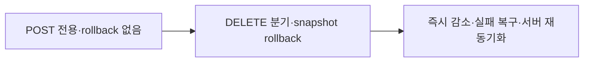

# 이력서·포트폴리오 기록

## 사례 1 — 투표 댓글 좋아요 취소의 낙관적 상태 동기화

- 작업 유형: 버그 수정 | 품질 개선
- 관련 도메인/서비스: 시민 참여 투표 댓글
- 문제 출처: 사용자 요구 | 구현 위험 | 테스트·런타임 실패

### 문제 상황

- 사용자가 제시한 요구·문제·변경 이유: 이미 좋아요한 투표 댓글을 다시 누르면 전용 DELETE API로 취소하고, 화면의 좋아요 수를 즉시 감소시키며 오류 시 복구해야 했다.
- 테스트·런타임에서 관찰한 오류: 테스트 우선 실행에서 댓글 응답의 좋아요 필드 누락, DELETE 메서드 부재, 취소 시 POST 호출, 404 상황의 잘못된 요청 경로를 관찰했다.
- 필요한 기술·구조·패턴이 없을 때 발생할 문제: UI가 현재 좋아요 상태를 잃고 잘못된 HTTP method를 선택하며, 실패한 optimistic 상태가 cache에 남아 서버와 화면이 불일치할 수 있었다.

### 고민과 선택

- 사용자 제안: 문서화된 DELETE endpoint를 연동하고 UI 변경이 필요하면 Claude Code 인계를 제공한다.
- 에이전트 제안: DTO부터 상태를 보존하고 TanStack Query snapshot·rollback·invalidation으로 실패 안전성을 확보한다.
- 검토한 대안: 서버 응답까지 화면 갱신을 기다리는 방식, 단일 query만 직접 수정하는 방식, production UI를 Logic Session에서 함께 수정하는 방식.
- 최종 선택: comment root의 전체 cache snapshot을 낙관적으로 갱신하고 오류 시 복원하며, UI 연결은 소유권 정책에 따라 인계한다.
- 선택 이유와 제외한 방식의 이유: 즉시 피드백과 최종 서버 일관성을 함께 확보하고, 여러 page cache와 병렬 UI 작업의 충돌을 피하기 위해서다.

### 적용

- 변경 경로: `src/features/citizen-participation/api/**`, `hook/useCitizenParticipationMutations*`, `mocks/**`
- 구현·수정·리팩터링 내용: 좋아요 상태 schema·parser, 인증 DELETE adapter, method 분기, optimistic snapshot·rollback·재조회, 상태형 MSW handler와 회귀 테스트를 추가했다.
- 핵심 동작: 사용자가 좋아요 취소를 선택하면 count와 `liked`가 즉시 바뀌고, DELETE 실패 시 모든 관련 cache가 이전 값으로 돌아가며, mutation 종료 후 서버 목록을 다시 조회한다.

### 사용 기술과 구체적 목적

| 기술·구조·패턴 | 해결하려는 구체적 문제 | 적용 위치와 방식 |
| --- | --- | --- |
| Zod schema | 서버 응답의 좋아요 상태 손실·오염 방지 | vote comment DTO에서 count와 boolean 검증 |
| Axios API adapter | 인증된 DELETE 경로 일관성 | 기존 `ApiClient`와 `customConfig` 재사용 |
| TanStack Query optimistic update | 서버 지연 중 즉시 사용자 피드백 | `onMutate`에서 matching cache 전체 갱신 |
| Snapshot rollback | 404 등 실패 후 잘못된 화면 상태 방지 | `onError`에서 query별 이전 데이터 복원 |
| Query invalidation | optimistic 결과와 서버 상태의 최종 정합성 | `onSettled`에서 comment root 재조회 |
| MSW stateful handler | 실제 transport·상태 전이를 로컬에서 재현 | DELETE 성공·미좋아요 오류·재조회 검증 |
| Vitest·React Testing Library | API와 hook 회귀 방지 | method, cache 중간 상태, rollback assertion |

### 결과

- 적용 전: 투표 댓글 좋아요 상태가 parser에서 사라지고 모든 클릭이 POST로 전송되며 rollback이 없었다.
- 적용 후: Logic 계층이 명시적 취소 상태에서 DELETE를 사용하고 즉시 감소·실패 복구·서버 재동기화를 수행한다.
- 검증 결과: 62개 테스트 파일의 460개 테스트와 governance 20개 테스트, lint, TypeScript build, Vite build가 통과했다. 대상 API·hook·MSW 테스트 14개가 성공·오류 경계를 검증했고, 일회성 Axios/MSW 드라이버에서 `true/3 → false/2`와 `404 LIKE_NOT_FOUND`를 직접 관찰했다.
- 사용자 후속 피드백: 없음.
- 추가 요청 및 남은 제한: Claude Code가 production `VoteDetailRoute`에서 기존 `nextLiked` 인자를 전달해야 전체 UI 흐름이 완료된다.

### 이력서·포트폴리오 문구

- 이력서 bullet: TanStack Query의 multi-query snapshot rollback과 Axios/MSW 계약 테스트를 적용해 투표 댓글 좋아요 취소를 DELETE 기반 optimistic update로 구현하고 460개 회귀 테스트와 정적 빌드로 검증.
- 포트폴리오 서술: 투표 댓글 응답에서 좋아요 상태가 소실되고 취소도 POST로 처리되던 문제를 DTO·parser·transport·cache 경계로 나눠 분석했다. 명시적 다음 상태를 기준으로 DELETE를 선택하고 관련 query snapshot 전체를 즉시 갱신한 뒤 404 시 복원하고 서버 목록을 재조회하도록 구성했다. 상태형 MSW와 hook 테스트로 성공·실패 중간 상태를 관찰했으며 production UI 연결은 파일 소유권 계약에 따라 Claude Code 인계로 분리했다.
