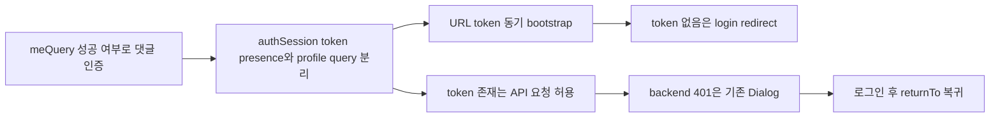

# 이력서·포트폴리오 기록

## 사례 1 — `/me` query 결합을 제거한 token-presence 인증 흐름

- 작업 유형: 버그 수정 | 리팩터링 | 보안·품질 개선
- 관련 도메인/서비스: 시민참여 댓글, 로그인 session, 전역 API 오류 처리
- 문제 출처: 사용자 요구 | 테스트·런타임 실패 | 검토 결과

### 문제 상황

- 사용자가 제시한 요구·문제·변경 이유: 로그인 사용자도 댓글 입력이 비활성화되고 로그인 안내가 표시됐다. 로그인 판정을 `/me` query에서 제거하고 localStorage·URL token presence와 backend 401 중심으로 통합하도록 요청했다.
- 테스트·런타임에서 관찰한 오류: 유효한 token이 있어도 `/me`가 pending/error이면 `meQuery.isSuccess === false`가 되어 세 상세 route의 댓글 작성기가 비활성화됐다. Watcher는 URL credential 제거가 `startMocks()` 완료까지 지연되는 추가 위험을 발견했다.
- 필요한 기술·구조·패턴이 없을 때 발생할 문제: profile API timing이 인증 권한처럼 동작하고, 서로 다른 화면이 중복 로그인 판정을 가지며, URL credential이 비동기 startup 동안 주소에 남을 수 있다.

### 고민과 선택

- 사용자 제안: localStorage token을 우선 확인하고 없으면 URL의 `access-token`, `refresh-token`을 사용하며, token 요청 401은 세션 만료 모달로 처리한다. Zustand 또는 custom hook으로 전역 상태를 둘 수 있다고 제안했다.
- 에이전트 제안: 기존 `authSession` external store와 전역 401 queue·Dialog·`returnTo`를 재사용하고, React 연결만 custom hook으로 제공한다.
- 검토한 대안: 별도 Zustand auth store, Axios interceptor의 두 번째 Dialog, 매 요청 전 access token 유효성 검사, `/me` 성공 상태 유지.
- 최종 선택: `useSyncExternalStore` 기반 `useAuthTokenPresence`와 동기 URL bootstrap을 추가하고 backend 401을 authoritative 신호로 유지했다.
- 선택 이유와 제외한 방식의 이유: 기존 상태 정본을 재사용해 동기화 비용을 줄이고, `/me`·interceptor·route별 중복 인증 시스템을 만들지 않기 위해서다.

### 적용

- 변경 경로: `src/features/auth/model/authSession.ts`, `src/features/auth/hook/useAuthTokenPresence.ts`, `src/main.tsx`, `src/app/providers/AuthRouteBoundary.tsx`, 시민참여 세 route 및 관련 테스트.
- 구현·수정·리팩터링 내용: access/refresh token presence selector, URL token 저장·query 정리, direct login redirect, expiry route 차단 제거, `/me` 인증 의존 제거, 401 확인·Escape 회귀 테스트를 적용했다.
- 핵심 동작: token 없음은 안전한 `returnTo`와 함께 `/login`, token 존재 요청의 401은 기존 Dialog 종료 후 session 삭제와 로그인 이동, 로그인 성공 후 원래 위치 복귀다.

### 사용 기술과 구체적 목적

| 기술·구조·패턴 | 해결하려는 구체적 문제 | 적용 위치와 방식 |
| --- | --- | --- |
| `useSyncExternalStore` | React 밖 session store와 화면 상태 동기화 | `useAuthTokenPresence.ts`에서 revision listener 구독 |
| URL API·History API | callback token 저장 후 credential URL 노출 제거 | `bootstrapAuthTokensFromLocation()`에서 token query만 삭제 |
| React Router `Navigate`·location state | 비로그인 보호 경로 차단과 원래 위치 복귀 | `AuthRouteBoundary.tsx`에서 기존 sanitizer 재사용 |
| TanStack Query global error reporter | 401마다 중복 모달 구현 방지 | 기존 `ApiFailureReporter → serverErrorQueue` 유지 |
| MSW·Vitest·React DOM | `/me` 오류, 401 Dialog, 세 route 사용자 결과 검증 | auth/UI integration tests |
| 역할 기반 UI 소유권 | 기능 논리와 production UI 충돌 방지 | Hephaestus logic, Claude Code route 연결, 사용자 UI_COMPLETE 확인 |

### 결과

- 적용 전: `/me` 요청 상태가 댓글 인증을 결정해 token이 있어도 작성기가 비활성화될 수 있었다.
- 적용 후: 세 댓글 route가 auth token presence를 구독하고, profile query와 무관하게 작성 가능 상태를 유지한다. token 없음과 backend 401 흐름이 명확히 분리됐다.
- 검증 결과: Vitest 63 files·469 tests, governance 20 tests, lint, build 통과. Watcher 초기 FAIL 수정 후 최종 PASS.
- 사용자 후속 피드백: 사용자가 Claude Code의 UI 작업 완료를 확인했다.
- 추가 요청 및 남은 제한: commit·merge는 별도 승인 대기. 다중 탭 storage 동기화와 bundle 경고는 현재 범위 밖이다.

### 이력서·포트폴리오 문구

- 이력서 bullet: React `useSyncExternalStore` 기반 token-presence 인증 경계를 도입해 시민참여 3개 댓글 route의 `/me` query 결합을 제거하고, URL credential bootstrap·401 세션 만료·로그인 복귀 흐름을 기존 전역 오류 시스템에 통합했으며 469개 Vitest와 build·lint로 회귀를 검증했다.
- 포트폴리오 서술: 로그인 사용자도 댓글을 작성할 수 없는 현상을 추적해 profile API 성공 상태가 인증 권한으로 사용된 구조적 원인을 확인했다. 별도 Zustand store나 중복 interceptor 대신 기존 authSession external store와 401 Dialog queue를 재사용하고, URL token을 비동기 startup 전에 저장·제거하도록 구성했다. 그 결과 댓글 인증과 `/me` 조회가 분리됐고 token 없음, 401, 로그인 복귀가 하나의 일관된 흐름으로 정리됐다.
