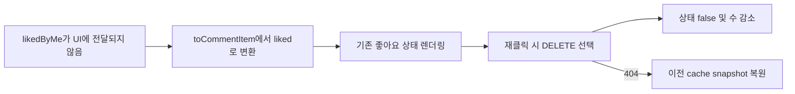

# 이력서·포트폴리오 기록

## 사례 1 — 투표 댓글 좋아요 취소의 낙관적 상태 복원

- 작업 유형: 버그 수정 | 품질 개선
- 관련 도메인/서비스: 시민참여 투표 댓글 좋아요
- 문제 출처: 사용자 요구 | 테스트·런타임 실패 | 구현 위험

### 문제 상황

- 사용자가 제시한 요구·문제·변경 이유: 기존 좋아요 상태인 투표 댓글을 다시 누르면 DELETE API를 호출하고 좋아요 상태와 수를 낙관적으로 갱신하며 404에서 rollback해야 했다.
- 테스트·런타임에서 관찰한 오류: 관련 테스트는 목록 댓글 fixture에 `likedByMe`가 없어 ZodError로 실패했고, `npm run build`는 `CommentDto`에 `liked`가 없다는 TypeScript 오류로 실패했다.
- 필요한 기술·구조·패턴이 없을 때 발생할 문제: API/cache의 `likedByMe`가 UI `liked`로 변환되지 않으면 이미 좋아요한 댓글도 미선택으로 렌더링되고 재클릭 시 DELETE가 아닌 POST를 선택할 수 있다.

### 고민과 선택

- 사용자 제안: DELETE 취소 호출, 낙관적 UI 감소, 404 rollback을 동작하게 한다.
- 에이전트 제안: 기존 mutation을 재작성하지 않고 DTO-to-UI presentation adapter의 명칭 드리프트를 수정하며 fixture를 실제 계약에 맞춘다.
- 검토한 대안: API DTO를 UI의 `liked`로 변경, UI를 `likedByMe`로 변경, 범용 댓글 fixture로 두 계약 통합, 기존 mutation 재구현.
- 최종 선택: API/cache와 UI의 계약을 유지하고 `toCommentItem()`에서 `likedByMe → liked`를 명시적으로 변환했다.
- 선택 이유와 제외한 방식의 이유: 영향 범위가 가장 작고 기존 parser·cache·UI 계약을 보존한다. 일반 댓글과 투표 댓글의 ID·필수 필드가 달라 범용 fixture 통합은 실제 계약을 흐릴 수 있으며, DELETE·rollback은 이미 구현되어 중복 재구현이 필요하지 않았다.

### 적용

- 변경 경로: `src/pages/citizen-participation/model/presentation.ts`와 대응 테스트, 투표 댓글 API·hook·MSW fixture 및 handler 테스트 8개.
- 구현·수정·리팩터링 내용: `toCommentItem()`이 `comment.likedByMe`를 UI `liked`로 변환하게 하고 목록 댓글 fixture를 `likedByMe` 계약으로 정렬했다.
- 핵심 동작: UI의 기존 좋아요 상태가 true로 전달되어 재클릭이 DELETE를 선택하고 cache에서 `likedByMe=false`, `likeCount-1`을 즉시 반영하며 오류 시 이전 snapshot을 복원한다.

### 사용 기술과 구체적 목적

| 기술·구조·패턴 | 해결하려는 구체적 문제 | 적용 위치와 방식 |
| --- | --- | --- |
| TypeScript DTO-to-UI adapter | API와 UI의 서로 다른 필드명을 경계에서 안전하게 변환 | `toCommentItem()`에서 `likedByMe`를 `liked`로 매핑 |
| TanStack Query optimistic update | 서버 응답 전 즉각적인 좋아요 취소 피드백 제공 | 기존 `onMutate` cache 갱신과 `onError` snapshot rollback 검증 |
| Zod parser contract | mock과 API wire가 실제 목록 DTO 형태를 따르도록 강제 | `likedByMe` 필수 필드가 없는 fixture의 failing-first 확인 |
| Vitest + MSW | DELETE method/URL, 성공 200 `data:null`, 404 `LIKE_NOT_FOUND` 및 UI 경로 검증 | API·handler·hook·route 테스트 7 files, 51 tests |
| Watcher 독립 검토 | 구현자가 놓친 계약·scope 회귀를 별도로 판정 | 실제 diff와 관련 호출 경로 검토 후 PASS |

### 결과

- 적용 전: `likedByMe` migration 이후 presentation adapter가 존재하지 않는 `liked`를 참조해 UI 좋아요 상태와 DELETE 선택이 끊겼다.
- 적용 후: 목록 DTO의 좋아요 상태가 UI까지 전달되고 기존 DELETE 낙관적 갱신·404 rollback 흐름이 다시 선택된다.
- 검증 결과: 관련 51 tests, 전체 469 tests, governance 20 tests, ESLint, TypeScript/Vite build, `git diff --check` 통과. Watcher PASS.
- 사용자 후속 피드백: 없음.
- 추가 요청 및 남은 제한: adapter 표 기반 계약 테스트, 댓글 fixture 소유권 분리, 대형 presentation/fixture 모듈 분할을 별도 후속 과제로 기록했다.

### 이력서·포트폴리오 문구

- 이력서 bullet: TypeScript DTO-to-UI adapter의 필드 명칭 드리프트를 수정해 투표 댓글 좋아요 취소의 DELETE 선택·낙관적 감소·404 rollback을 복원하고, Vitest 469개와 governance 20개, lint, build를 통과시켰다.
- 포트폴리오 서술: API/cache의 `likedByMe`가 UI의 `liked`로 변환되지 않아 이미 좋아요한 댓글이 POST 경로를 선택할 위험을 발견했다. 기존 mutation 재작성 대신 presentation adapter 경계를 복원하고 계약별 fixture를 정렬했으며, API·MSW·hook·route 테스트와 독립 Watcher 검토로 DELETE, 즉시 감소, 실패 복구를 검증했다.
