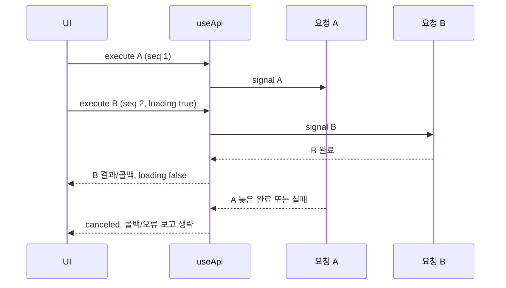

# user-ui / admin-ui API 연결 패턴 조사와 개선 방향

작성일: 2026-09-17. 역할: Logic/API 패턴 분석. 기준은 실제 저장소 소스이며, 실 backend 호출·운영 장애 재현은 수행하지 않았다. 사용자가 승인한 전수조사에 이어 상세 문서·스킬 정리·user-ui useApi 동시 요청 변경·세션 산출물 조사를 반영했다.

## 1. 결론과 범위

두 프로젝트의 신규 REST 구현은 **도메인 API factory + 공유 ApiClient + DTO/parser + TanStack Query**로 수렴하고 있다. 그러나 모든 도메인이 일관된 것은 아니다. admin-ui에는 직접 Axios를 호출하는 미연결 레거시가 많이 남아 있고, 신규 코드 안에서도 parser 위치·취소 변환·mutation 캐시 갱신 순서가 다르다. user-ui는 조회 패턴이 비교적 일관되지만 일부 mutation의 응답 검증과 useApi 동시 호출 의미를 보완해야 한다.

공통화할 대상은 API·검증·캐시·오류의 **책임과 계약**이다. 앱마다 다른 인증 규칙, 업무상 TTL, 반환 타입을 한 형태로 강제하거나 전체 API를 하나의 registry에 합치는 방식은 채택하지 않았다.

- [파일별 전수 목록](api-pattern-inventory-2026-09-17.md): API 고유 경로 60개, event 변경 버전 2개를 포함한 관찰 62행. URL·행 번호·전송·signal·연결 상태를 기록했다.
- [기계 판독 근거](operations/2026-09-17-api-pattern-inventory.json): 각 파일 SHA-256, 근거 행, worktree·HEAD·수집 시각.
- [실행 세션 산출물 조사](session-portfolio-audit-2026-09-17.md): 현재 작업 세션의 산출물 생산 여부와 정책상 원인.
- 이번 작업 산출물: `.codex/logs/sessions/api-pattern-standardization/`의 plan, exploration, implementation, review, final-summary, portfolio, handoff.

최초 조사에는 API 경로 59개가 있었다. 조사 중 admin-ui `admin-usage.api.ts`가 추가되어 최종 목록은 60개다. user-ui HEAD는 `71ba983e…`, admin-ui 기준본은 `604e4dc4…`, video worktree는 `57bbb3ce…`, event worktree는 `f3627abc…`에서 관찰했다. 전체 hash는 목록에 있다. 다른 세션의 동시 작업 때문에 HEAD와 미커밋 변경이 함께 존재한다. 이 문서의 관찰 결과를 이후 상태에 그대로 적용하지 말고 변경된 파일을 다시 확인한다.

## 2. 조사 방법과 한계

1. `projects/*.json`과 각 저장소의 branch/worktree/status, package.json, entry, 공유 전송·오류·QueryClient·useApi를 확인했다.
2. 모든 `*.api.ts`의 본문을 조사하고 도메인의 DTO/parser, key, query/mutation hook/options, 사용처와 mock을 대조했다. 파일명이 다른 fetch/SDK adapter와 DTO만 존재하는 VO 영역도 별도로 분류했다.
3. index.html의 실제 entry에서 TypeScript AST의 값 import/export 및 문자열 dynamic import를 따라 정적 연결을 검사했다. U는 14/14, A는 16/44 모듈에 도달한다. V의 추가 2개와 E의 변경 2개는 각 worktree의 entry에서 미도달이다. 이는 모듈 연결의 상한이며 실제 렌더링·HTTP 실행 검증이 아니다.
4. useApi 변경은 deferred promise로 두 완료 순서와 오래된 오류를 재현했다. 나머지 코드상 위험은 재현된 장애와 구분했다. admin의 모든 endpoint를 실 서버에서 실행한 것은 아니다.

package.json에 선언된 현재 기술은 두 앱 모두 React 19, TanStack Query 5, Zustand 5, Zod 4, TypeScript 6, Vite 8 계열이다. 정확한 설치 버전은 lockfile/실행 도구를 따른다. React 18·Jotai를 현재 스택으로 안내하는 항목은 레거시다.

## 3. 공유 기반의 비교

| 경계             | user-ui                                            | admin-ui                                          | 판단                                           |
| ---------------- | -------------------------------------------------- | ------------------------------------------------- | ---------------------------------------------- |
| 전송             | `shared/api/api-client.ts`의 get/post/patch/delete | 동일 구조 + put                                   | PUT 필요 시 확인 후 확장; 존재를 가정하지 않음 |
| 인증             | 저장된 token을 interceptor에서 부착                | customConfig의 authRequired에 따라 부착           | 명시적인 앱별 차이; 임의 통일 금지             |
| 성공/실패        | ApiResult 및 HTTP/network reject 병존              | 동일                                              | 실패가 전부 반환값이라고 가정하면 안 됨        |
| unwrap           | 시민참여와 예약 feature의 helper 중복              | shared ApiFailureError/unwrapApiResult 재사용     | user-ui 공유 후보                              |
| parser 위치      | Query에서 unwrap→parse, 일부 API에서 mapApiResult  | 대부분 API unknown→Query/options에서 unwrap→parse | 위치 하나보다 캐시 진입 전 검증 책임을 고정    |
| Query retry      | 오류 종류별 제한, 재시도 1회 정책                  | 오류 종류별 제한, 재시도 3회 정책                 | 업무·UX 선택; 숫자 차이 자체는 결함 아님       |
| 오류 표시        | Query meta와 공통 reporter, inline/modal/silent    | 공통 reporter와 기존 query/mutation 정책          | 중복 표시·401 처리 보존                        |
| useApi 수정 전   | 모든 동시 결과 반영, active count로 loading        | 마지막 요청만 반영, 마지막 완료 시 loading 종료   | 사용자 결정에 따라 user-ui 변경                |
| useApi 공개 결과 | completed/failed/canceled 판별 union               | ApiResult/raw/undefined/canceled 혼합             | 동시 요청 변경과 타입 일괄 변경을 분리         |

양쪽 `toApiResult`의 `data ?? undefined` 경로는 서버의 null을 undefined로 바꿀 수 있다. nullable 계약이 있는 parser는 이를 의도적으로 복원하는 경우가 있다. 공통 mapper를 바꾸면 모든 endpoint에 영향을 주므로 개별 parser와 서버 계약을 함께 확인해야 한다.

## 4. user-ui 도메인별 결과

기준 경로는 `src/features/`다. 아래 14개 API 파일은 모두 현재 entry의 값 import graph에서 도달한다. 상세 파일 링크는 전수 목록의 U 표에 있다.

| 서비스              | 전송·변환                                                            | Query / mutation / 주의점                                                                                                                |
| ------------------- | -------------------------------------------------------------------- | ---------------------------------------------------------------------------------------------------------------------------------------- |
| 시민참여 banner     | ApiClient + withAbortSignal, 목록 parser                             | 메인 배너 조회; 공통 query hook 경로                                                                                                     |
| notice              | 목록·상세 ApiClient                                                  | key에 상세 ID; parser로 공지 모델 변환                                                                                                   |
| me                  | 메인·내 정보·내 활동 ApiClient                                       | 여러 조회 계약을 같은 도메인에서 제공; 인증과 활동 filter 구분                                                                           |
| proposal            | 목록·상세·생성                                                       | 생성 location→ID 처리와 조회 parser 위치가 다름; ID 계약 보존 필요                                                                       |
| vote                | 목록·상세·투표/댓글 관련 요청                                        | 투표 응답 parse, 댓글/좋아요 낙관적 갱신의 snapshot·rollback·invalidate 경로 존재                                                        |
| discussion          | API 내부 mapApiResult·parser                                         | Query 단계에서 다른 시민참여 도메인과 같은 parse를 중복 적용하지 않음                                                                    |
| policy              | 목록·상세                                                            | Query에서 unwrap→parse                                                                                                                   |
| survey              | 목록·상세·답변 제출                                                  | 조회 parser 존재; 제출 응답은 MutationResponseDto 타입 선언 중심                                                                         |
| comment             | 공통 댓글·좋아요                                                     | like schema와 작성 mutation의 검증 강도가 다름; 신규 댓글 ID 사용 전 검증 필요                                                           |
| report              | 공통 신고                                                            | MutationResponseDto의 id/completed 타입만으로 런타임 검증을 대신할 수 없음                                                               |
| meeting-reservation | 예약 목록·상세·제한·취소·시간대·참가자·생성 7개 연산                 | 요청 schema + API 내부 mapApiResult, 취소 후 patch/invalidate. staleTime 0, 제한 조회 gcTime 0·mount 재조회는 예약 상태 특성에 따른 선택 |
| auth                | 직접 Axios, token schema, mutation·refresh 서비스                    | 인증 bootstrap 예외. 일반 Query/ApiResult로 기계적으로 치환하지 않음                                                                     |
| meeting HTTP        | fetch, signal, ApiFailureError, MeetingAccessService                 | RTC 회의 생성·초대코드 참여·token 갱신. 환경 URL·token lifecycle 포함                                                                    |
| meeting entry       | same-origin fetch `/api/meeting-entry`, 요청/응답 Zod, timeout/abort | useMeetingEntry가 입장 단계와 heartbeat를 소유. 임시 계약 주석이 있어 실제 backend 확정 계약과 구분                                      |

추가로 `meeting` 영역의 `/api/agora-temp-rtc-token` 호출은 `.api.ts` 목록 밖 전송이다. SDK 호출과 임시 token endpoint를 일반 REST 목록에서 누락하지 않도록 별도 예외로 기록한다. user-ui의 `useFetchAdapter`는 기존 useApi 소비처이나 정적 entry 연결과 별도로 재사용 후보 상태를 확인해야 한다.

핵심 근거는 `citizen-participation/hook/useCitizenParticipationQueries.ts`, `useCitizenParticipationMutations.ts`, `citizen-participation/model/apiResult.ts`, `meeting-reservation/model/apiResult.ts`, `meeting/hook/useMeetingEntry.ts`, `meeting/ui/MeetingPage.tsx`다. 실제 경로는 파일별 목록과 소스 검색으로 확인하며 API 검증 결과를 hook에서 재검증하는 복사를 피한다.

## 5. admin-ui 도메인별 결과

### 5.1 시민참여 CP 14개

`src/entities/cp-*/api`는 모두 ApiClient·signal·parser·Query 구조다. cp-notice만 현재 entry에서 미도달이고, 현재 공지 UI는 news 경로에 연결된다.

| 서비스              | 주요 책임                       | 차이·점검 사항                                                                                                                   |
| ------------------- | ------------------------------- | -------------------------------------------------------------------------------------------------------------------------------- |
| cp-activity-log     | 사용자 활동 목록·상세           | 지역 normalizeAbort 반복 중 하나                                                                                                 |
| cp-dashboard        | 시민참여 overview               | 기존 dashboard 직접 Axios와 구분                                                                                                 |
| cp-proposal         | 제안 목록·상세·처리             | `/citizen/proposals` 조회와 `/v1/cp/proposals/{id}/process` 처리 혼재는 endpoint 계약; mutation에서 cancel→set detail→invalidate |
| cp-vote             | 투표 목록·상세                  | `/citizen/votes` 계약을 CP URL로 추측 변경하면 안 됨                                                                             |
| cp-discussion       | 토론 목록·상세·처리             | proposal과 같은 캐시 취소 후 갱신 구조                                                                                           |
| cp-policy           | 정책 목록·상세·처리             | 성공 시 detail setQueryData 전 진행 중 detail 취소가 없음                                                                        |
| cp-survey           | 설문 목록·상세·처리             | policy와 동일한 detail 응답 역전 위험                                                                                            |
| cp-board            | 게시글 목록·상세·처리·일괄 숨김 | 목록/개수 직접 수정 + invalidate, detail 취소 누락 점검                                                                          |
| cp-report           | 신고 목록·상세·처리             | 목록 상태·개수 수정과 detail 갱신; 이전 조회 응답과 경합 가능                                                                    |
| cp-comment          | 댓글 목록·관리                  | 목록 count와 관련 detail 영향 key 확인 필요                                                                                      |
| cp-main-display     | 메인 노출 구성                  | singleton 응답 setQueryData, 지역 abort helper                                                                                   |
| cp-operation-policy | 운영 정책                       | singleton 캐시 교체, 지역 abort helper                                                                                           |
| cp-reward           | 보상 정책·대상                  | 정책 singleton과 대상 목록을 분리, 목록 count 갱신                                                                               |
| cp-notice           | 공지 조회·관리                  | 구조는 신규 패턴이지만 현재 UI 미연결; news와 기능 중복 가능성 확인 후 처리                                                      |

normalizeAbort 유사 함수는 activity-log·board·main-display·notice·operation-policy·report·reward·survey 8곳에 있다. 이미 shared 취소 도구가 있으므로 새 도메인에서는 복사하지 않고, 기존 동작·원인 정보를 보존하는지 확인한 뒤 공통화한다.

### 5.2 일반 관리 신규 계층

| 서비스                       | 확인된 패턴                                                                                                                  | 연결 상태와 근거                                                                                                   |
| ---------------------------- | ---------------------------------------------------------------------------------------------------------------------------- | ------------------------------------------------------------------------------------------------------------------ |
| news                         | 요청 schema, unknown 응답, shared unwrap, query/mutation options, 취소·invalidate·상세 제거                                  | 현재 공지 UI 연결. 재사용 예시로 적합                                                                              |
| items                        | 목록·상세·최신 ID·생성·수정·삭제; DTO/parser/options 분리                                                                    | API 계층 구현, 현재 entry에서는 미연결                                                                             |
| item-category                | nullable 목록·mutation 계약, category 변경 시 items.all 영향                                                                 | 관계 key를 함께 갱신하는 사례. 미연결                                                                              |
| admin-users                  | 관리자 목록/상세·변경·탈퇴 등 새 계층                                                                                        | 기존 users.api와 병존. postAuthorities는 현재 명시적 no-op 계약이며 실제 저장 API로 홍보하면 안 됨                 |
| inquiries                    | Query hook과 별도 mutation options, 응답 parser                                                                              | options 파일 개수를 맞추기 위한 재구성은 불필요. 미연결                                                            |
| admin-usage                  | `/admin/usage/point`, `/admin/usage/item`, query schema, `paramsSerializer: { indexes: null }`, shared unwrap/parser/options | 조사 중 추가·커밋됨. 기존 usage.api는 그대로 존재. 현재 entry 미연결                                               |
| video / playlist             | video 6·playlist 5개 연산, 요청 검증, multipart 공통 helper, query options 4·mutation options 7                              | video worktree의 구현. video 변경→playlist 상세 영향, 정확한 상세 제거. 기준본에 합쳐진 것으로 간주하지 않음       |
| attendance / roulette 변경본 | 각 API에 ApiClient·withAbortSignal·요청 schema·unknown 결과, 공통 event DTO/parser, query/mutation options                   | event worktree 미커밋 진행 중. 기존 mock fallback 제거 및 cancel→invalidate helper 추가. 기준본 레거시와 별도 평가 |

### 5.3 직접 Axios 레거시·기타

기준본의 직접 Axios 계열 파일은 auth 포함 23개다. auth 외 다수는 entry에서 미도달하며, 파일이 존재한다는 이유로 신규 표준 예시로 사용하면 안 된다.

| 분류          | 모든 조사 대상                                                                                                      | 문제 또는 예외                                                                                                                                        |
| ------------- | ------------------------------------------------------------------------------------------------------------------- | ----------------------------------------------------------------------------------------------------------------------------------------------------- |
| 일반 9개      | admin-settings, dashboard, faq, maintenance, maps, profile, sales, usage, users                                     | signal·parser 부재, data/void/unknown 반환 혼재. dashboard 집계 Object.assign, sales 합산 등 전송과 연산 결합                                         |
| event 2개     | attendance, roulette                                                                                                | 기준본 attendance는 DEV 실패 시 mock read·write 성공 fallback; 현재 별도 worktree가 개선 중                                                           |
| DAO 11개      | proposal, proposal-review, vote, discussion, main-board, banner, policy, report, voice-room, dao-logs, dao.api 집계 | factory 없이 instance 결합, signal 부재, spread registry. discussion 내부의 신규 client 위임도 혼재하며 파일 외형만으로 완전 표준화라고 판단하지 않음 |
| auth 1개      | auth.api                                                                                                            | 인증 lifecycle 예외. signal 존재; 일반 레거시와 일괄 제거 대상이 아님                                                                                 |
| meeting fetch | `features/meeting/api/meeting.api.ts`                                                                               | signal 없음, plain Error로 status 정보 손실, 화면이 요청/state를 직접 조정                                                                            |

VO dashboard·reservation·room schedule·live session·penalty·meeting history는 DTO·fixture 중심이며 실제 전송 계층이 없는 영역이다. UI가 보인다는 이유로 API 연결 완료라고 집계하지 않았다.

## 6. 문제점·근거·개선 우선순위

| ID / 우선순위    | 관찰·재현 근거                                                                                                                                                             | 사용자/개발 영향                                            | 개선과 완료 기준                                                                                   | 이번 처리                                                           |
| ---------------- | -------------------------------------------------------------------------------------------------------------------------------------------------------------------------- | ----------------------------------------------------------- | -------------------------------------------------------------------------------------------------- | ------------------------------------------------------------------- |
| API-01 / P1      | user useApi activeRequestCount, 모든 결과 callback; 새 테스트 5건 실패                                                                                                     | 오래된 응답/오류가 최신 화면 상태를 바꾸고 loading이 남음   | 최신 sequence만 결과·reporter·callback 반영, 최신 완료 시 loading 종료; 양쪽 완료 순서·오류 테스트 | 코드 수정, 직접 소비처 포함 36건 통과                               |
| API-02 / P1      | admin CP policy/survey/board/report의 setQueryData 앞에 cancelQueries 없음; proposal/discussion에는 있음                                                                   | mutation 후 늦은 상세 GET이 이전 상태로 덮을 가능성         | 실제 경합 테스트를 추가하고 해당 detail 취소→갱신→필요 key invalidate                              | 스킬 규칙화; 현장 장애로 단정하지 않음, 코드 미수정                 |
| API-03 / P1      | user comment/report/survey mutation의 타입 지정 중심 응답                                                                                                                  | 잘못된 id/completed 응답이 성공으로 통과할 위험             | 응답을 소비하는 필드 schema 검증 또는 no-content 계약 확정                                         | 문서·스킬 반영, endpoint별 후속 작업                                |
| API-04 / P1      | DAO policy L23, voice-room L16: `instance.post(url, { ...customConfig })`                                                                                                  | Axios 두 번째 인자는 body이므로 인증 config가 body로 전송됨 | body 없는 POST는 `post(url, undefined, config)` 계약 테스트. 현재 미연결이므로 운영 발생 주장 금지 | 잠재 결함 기록; 연결 전 우선 수정                                   |
| API-05 / P1      | 기준본 attendance DEV catch에서 mock fallback                                                                                                                              | API 실패가 성공/목록 존재로 보이며 연결 검증을 왜곡         | transport fallback 제거, 명시적인 MSW 성공/오류 시나리오로 이동                                    | 다른 event 세션에서 수정 중, 완료/통합 별도                         |
| API-06 / P2      | user 두 feature의 unwrap 중복; admin 8개 abort helper 반복                                                                                                                 | 실패·취소 정책 수정 시 동작 불일치                          | shared 함수의 의미·예외 정보를 확인해 하나의 계약으로 재사용                                       | 신규 복사 방지 스킬 반영                                            |
| API-07 / P2      | admin meeting fetch가 signal 없이 plain Error throw                                                                                                                        | unmount 취소 어려움, status 기반 retry/인증 처리 정보 손실  | meeting 특화 lifecycle 유지하며 signal·typed error 경계 보완                                       | 예외 기준 문서화                                                    |
| API-08 / P2      | admin 신규 도메인 다수가 entry 미연결, legacy와 새 파일 병존                                                                                                               | 구현 완료와 화면 연결 완료가 혼동되고 잘못된 예시 재사용    | 도메인별 UI 연결·계약 테스트·실 API 검증 상태를 따로 보고                                          | 전수 목록에 연결 열 추가                                            |
| API-09 / P2      | nullable 응답/boolean/string/void 혼재 + mapper null 변환                                                                                                                  | 범용 DTO 통일 시 허용 응답 거부 또는 오류 은폐              | endpoint별 null/undefined/empty 계약 검증                                                          | transport 참조에 명시                                               |
| API-10 / P2      | admin useApi 선언은 ApiResult 결과인데 throw/abort에서 undefined 반환                                                                                                      | 선언만 믿은 호출부가 success에 접근하면 예외 위험           | 반환 타입 정합성 개선은 별도 호출부 migration으로 수행                                             | 기존 제약 명시, admin 코드 미수정                                   |
| API-11 / P2      | 기존 use-api 스킬의 모든 API에 useApi 강제, onError만 호출, overload 순서, debounce 금지 설명이 현재 코드와 다름                                                           | Query 상태 이중 관리·reporter 중복·불필요한 요청량 증가     | 실제 조건부 타입·reporter·최신 요청 의미와 Query 분기 기준으로 갱신                                | 스킬 수정                                                           |
| API-12 / P2      | 전역 AGENTS.md에 React 18/Jotai 및 이전 빌드/라우터 버전 고정                                                                                                              | 실제 React 19/Query/Zustand 구조와 충돌                     | 고정 스택을 제거하고 현재 package/lockfile/source 확인 지시                                        | 전역 안내 수정, 활성 중앙 정책 검색 0건                             |
| API-13 / P1 검증 | vote.api.ts L87은 `/ballots`, citizenParticipation.api.test.ts L278은 `/responses`; 전체 테스트의 citizen MSW 통과/투표 endpoint 불일치, UI assertion/timeout 등 38건 실패 | 현재 전체 회귀 검증을 출시 근거로 쓸 수 없음                | MSW·실 요청 URL 일치와 테스트 자원/시간 경계를 별도 수정·재검증                                    | 실패 사실 기록; useApi와 직접 관련 없는 범위까지 임의 수정하지 않음 |

P1은 API 연결 또는 상태 정합성을 먼저 다룰 항목, P2는 계약·유지보수 정리를 뜻한다. 정적 위험과 실제 재현된 회귀를 구분한다. API-01은 사용자가 선택한 새 계약에 대한 변경이며, 과거의 모든 동시 요청을 유지하던 계약 자체를 근거 없이 운영 장애라고 부르지 않는다.

## 7. 공통 스킬에 반영한 설계

새 전역 API registry나 앱 사이 공통 런타임 패키지를 만들지 않고 기존 스킬을 확장했다.

| 원본                                                 | 반영 내용                                                            | 근거                                          |
| ---------------------------------------------------- | -------------------------------------------------------------------- | --------------------------------------------- |
| `policy/common/skills/recipe/api-authoring/SKILL.md` | 기존 FSD 위치·factory 명명 허용, 상황별 참조 routing, 실제 스택 확인 | 양 앱의 일관된 책임은 같지만 이름/폴더가 다름 |
| 같은 폴더 `references/transport-contracts.md`        | unknown/parser, envelope·null·인증·signal·multipart·fetch 예외       | API-03~09, 무조건 Axios 통합 방지             |
| 같은 폴더 `references/query-mutation.md`             | query key, cancel→cache→invalidate, 낙관적 갱신, useApi 최신 호출    | API-01~02,11                                  |
| `recipe/data-fetch/SKILL.md`                         | Query 상태 소유, useApi 중첩 금지, signal 전달                       | 이중 로딩 상태·취소 단절 방지                 |
| `recipe/data-dto/SKILL.md`                           | 런타임 검증·nullable·요청 mapper                                     | TS 타입과 서버 검증 구분                      |
| admin reference `custom-hooks/use-api/SKILL.md`      | 현재 admin 반환/오류/취소 의미, 알려진 타입 차이                     | 오래된 안내 제거                              |

새 references는 공통 정본에 포함되므로 두 앱·모든 host에 같은 내용으로 렌더된다. `adapters/`와 `projects/*.json`의 실행 경로·계약을 바꿀 필요는 없었다. admin 전용 reference 수정은 이미 승인된 재사용 자산 카탈로그 영역에 한정했다.

## 8. useApi 변경 의미와 성능

user-ui의 `src/shared/lib/hooks/use-api.tsx`에서 active count를 sequence로 바꾸고 resolve/catch/finally에 최신 호출 검사를 추가했다. 기존 `ExecuteResult` union, 오류 표시 옵션, controller 보관 및 unmount abort는 유지했다. 이전 네트워크 요청을 새 호출 시 강제 abort하지 않는다.

sequence는 ref에서 비교하므로 요청 수만큼 별도의 렌더 상태를 추가하지 않는다. 최신 요청 완료 이후 이전 요청이 오래 대기해도 로딩 UI가 붙잡히지 않는다. 다만 **독립적인 명령의 결과를 모두 처리해야 하면 같은 hook 인스턴스를 공유하면 안 된다.** 서버 mutation은 UI가 결과를 무시해도 서버에서 이미 실행될 수 있다. 회의 진입/생성 소비처의 기존 테스트까지 확인했으며, 모든 실제 네트워크 조합을 브라우저에서 검증한 것은 아니다.

## 9. 검증과 남은 작업

- 변경 전: useApi 19개 테스트 중 새 요구에 대한 5개 실패, 기존 단일 요청·오류·취소 등 14개 통과.
- 변경 후: useApi + useMeetingEntry + MeetingPage 3개 파일, **36개 통과**.
- user-ui 전체: **92개 파일 중 82 통과/10 실패, 758개 중 720 통과/38 실패**. 실패에는 MSW route/handler 불일치와 UI assertion·timeout이 포함된다. 변경 전 전체 suite와의 동일 조건 비교는 하지 않았으므로 모든 실패를 기존 결함이라고 확정하지 않는다.
- user-ui `npm run lint`, `npm run build` 통과. Vite의 500 kB chunk 경고는 남아 있다.
- 중앙 `python3 -m unittest discover -s tests -v`: **344개 통과**. `bin/agent-policy audit`: central-contract 및 admin-ui 276개/user-ui 206개 bundle 파일 검사 통과. 스킬 참조는 두 앱 렌더에 포함된다. API 계약을 실 서버에서 검증한 결과로 확대 해석하지 않는다.

후속 구현 순서는 CP 상세 캐시 경합 재현/수정 → 실제 응답을 사용하는 user mutation parser 보완 → DAO config 위치·event fallback을 연결 전 제거 → 중복 unwrap/abort helper 정리 → 미연결 신규 도메인의 UI 연결 검증이다. 동시에 발견된 전체 테스트 실패를 별도 결함 목록으로 다뤄야 한다. 삭제·전역 인증 통일·모든 API의 일괄 마이그레이션은 이번 범위가 아니다.

중앙 정책 수정은 이미 실행 중인 inject 세션의 bundle을 바꾸지 않는다. 기존 세션을 임의 종료·수정하거나 다른 세션의 누락 포트폴리오를 대신 꾸며 쓰지 않았다. [세션 조사](session-portfolio-audit-2026-09-17.md)의 인계 절차를 따른다.
