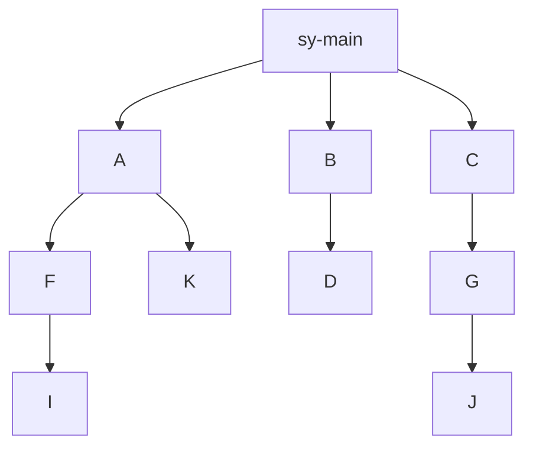

# 세션 독립 브랜치 관계와 완료 통합

## 목적과 승인 범위

사용자가 승인한 목적은 세션별 브랜치 권한을 되살리지 않고 부모·자식 통합 순서와 기존 작업을 보호하는 것이다. 중앙 정책·runtime·호스트 연결·테스트를 변경한다. 소비자 정책 사본이나 설정을 직접 배포하지 않으며, 소비자 작업을 대신 병합·정리하거나 세션을 재시작하지 않는다.

작업 전에 AGENTS.md, 현재 V4 원본, guards, launcher/rendering/session, 세 host adapter, projects와 관련 테스트를 다시 조사했다. 구현은 사용자의 Proceed 이후 시작했다. V3 `child_completion`의 assignment claim·integrator·완료 상태 검사를 재활성화하지 않는다.

현재 Git 공유 접근, 프로젝트 경계, 다른 host·세션 로그 보호를 유지한다. branch 기록에는 owner·assignment·허용 파일 목록이 없다. 승인 예약의 host/assignment는 해당 도구 실행을 식별하기 위한 값이며, branch나 worktree의 독점 실행 권한으로 쓰지 않는다.

## 현재 동작

| 구분 | 동작 |
| --- | --- |
| 허용 | 같은 프로젝트의 모든 branch·linked worktree 조회와 작업 계속, 과거 CLOSED/claim과 무관한 Git 작업 준비 |
| 승인 | Git 생성·수정·삭제, 관계 등록·생성·이름 변경·부모 변경·취소, 실제 완료 통합 |
| 경고 | 다른 기능 계열 이동, 형제의 계약 위험·검증 실패·미확인 부분 |
| 차단 | 다른 프로젝트 명령, 다른 host·세션 로그의 직접 변경, 직접 부모 건너뛰기, 미처리 자식이 있는 부모 완료 |
| 재검토 | 승인 후 관련 HEAD/index/파일·형제 변경·새 자식·관계가 바뀜 |
| 정리만 보류 | 검증·로그 보존 실패, 새 source commit, 미커밋/미보존 ignored 파일, 실행 중·미확인 변경 도구, 안전하지 않은 삭제 위치 |

Git 조회와 일반 lint/test/build는 별도 Git 승인이 필요 없다. source 구현 승인과 Git 승인은 별개다. Codex·OpenCode의 `진행`·`Proceed`가 대기 중인 다른 Git 작업을 승인하지 않는다.



| 완료 요청 | 판정 |
| --- | --- |
| I → F → A → sy-main | 각 직접 부모 단계에서 하위 작업 완료·검토·승인 후 가능 |
| I가 남은 F → A | 차단 |
| F 또는 K가 남은 A → sy-main | 차단 |
| I → A / I → sy-main | 직접 부모를 건너뛰므로 차단 |
| I가 작업 중인 K → A | K의 미처리 자식이 없으면 형제 검토·승인 후 가능 |
| D → B → sy-main, J → G → C → sy-main | 각 계열 내부 순서를 지켜 가능 |
| A/F에서 C worktree로 이동 | 안내만 제공. 같은 위치의 후속 도구마다 반복하지 않음 |
| A → K 동기화 | 승인된 일반 Git 작업. A의 완료·삭제를 기록하지 않음 |

형제는 같은 직접 부모의 자식이다. A/B/C도 형제이며 전역 생성 역순은 강제하지 않는다. 자식의 HEAD가 부모와 같거나 이미 포함돼 있어도 명시적 완료·취소 기록이 없으면 미처리 작업이다. 완료 후 새 commit·작업 변경·자식이 생기면 이전 통합 사실은 보존하고 다시 처리해야 할 작업으로 판단한다.

## 구현과 재사용

| 파일 | 책임 |
| --- | --- |
| `policy/guards/branch_relations.py` | UUID 관계, 직접 부모·미처리 자식, Git ref 식별, 이름/부모 변경, 기능 계열 안내 |
| `policy/guards/integration_review.py` | 형제·삭제 이력·하위 branch·부모·미커밋 변경 근거와 diff/참조 후보 수집 |
| `policy/guards/git_operations.py` | 불변 작업 준비, 실제 실행 직전 재검사, 짧은 Git lock, merge/검증/보존/정리·복구 |
| `shared_git.py`, `approval_policy.py` | raw 명령과 보호 실행기 연결, 정확한 승인, 경로 지정 stage/commit/restore의 로그 보호 |
| `managed_policy_guard.py`, `event_protocol.py` | 실제 도구 결과와 실행 중 쓰기 기록, 차단과 안내 형식 |
| `adapters/opencode/.../agent-policy.js` | 허용된 계열 이동 안내를 toast·log로 표시 |
| `lib/agent_policy/{injection,sessions,cli}.py` | 기존 bundle을 바꾸지 않고 현재 정책과 차이를 보고 |
| 공통 runtime 계약·AGENT_POLICY·두 운영 스킬 | 같은 사용자 흐름과 강제 조건, 현재/과거 정책의 구분 |

기존 `branch_guard`의 Git 명령·cwd 해석, HEAD·ancestor·common directory·staged/dirty 검사를 재사용한다. `runtime_state`의 원자적 JSON 저장·flock, 중앙 `collect_project_logs`의 추가/변경만 반영하는 로그 수집을 재사용한다. V3의 승인된 source/target에 대한 merge 결과 불변식을 세션 권한 없이 적용하고, 실행 중단 시 journal을 대조하는 복구 방식을 분리했다.

Codex·Claude의 생성된 native hook과 OpenCode의 실제 plugin/guard 경로에서 같은 검사가 실행된다. Codex의 도구 입력 자동 교체 기능을 가정하지 않는다. raw Git 변경은 보호 실행 명령을 제시하고, 실제 실행은 공통 runner가 담당한다.

## 저장 구조

저장소 식별 기준은 실제 Git common directory다. launcher가 지정한 runtime state의 해당 repository 아래에 저장한다.

```text
state/repositories/<common-directory-hash>/branch-relations/v1/
  graph.json                 # branch UUID/name/parent/fork/purpose/history
  reviews/<id>.json          # 비교 commit·staged/unstaged/untracked·검토 digest
  operations/<id>.json       # 승인 대상·실제 merge/검증/보존/정리 결과
  operations/<id>.grant.json # 해당 도구 실행을 위한 일회 예약
  archives/<id>/objects/     # 정리·취소 전 필요한 파일의 검증 가능한 사본
  writes/<id>.json           # 실행 중 또는 결과 미확인 쓰기
  locks/                     # 실행 프로세스 동안만 유지하는 advisory lock
```

삭제한 branch도 graph의 UUID와 통합 기록을 남긴다. fork·source·target·실제 결과 commit은 `refs/asan-policy/integrations/<operation-id>/...`로 보존하므로 Git GC 이후의 형제 비교 근거도 유지한다. 이름을 다시 사용하면 새 UUID를 등록한다. 이름/부모 변경 이력과 순환 검사를 유지한다.

보존한 branch에서 추가 작업을 완료할 때는 새 검토·승인으로 다음 통합을 기록한다. 이전 결과는 `integrations` 이력에 남기며 과거 작업의 복구가 새 결과를 덮어쓸 수 없다. 부모를 변경해도 이전 부모에 통합했던 변경 근거는 그 부모의 형제 검토에서 찾을 수 있다.

reflog의 최초 기록이 바뀌거나 ref가 사라지면 기존 branch와 동일하다고 추측하지 않는다. 외부 터미널의 이름 변경·삭제/재생성·reflog 만료로 식별이 불명확한 경우 관계를 확인해야 한다. 관리되는 이름 변경은 아래 `rename`을 사용한다. V3 metadata는 새 관계나 세션 권한으로 자동 가져오지 않는다.

## 사용 절차

호스트에 주입된 현재 bundle의 `runtime/git_operations.py` 절대 경로를 사용한다. 아래 `<runtime>`은 소비자 저장소 안의 정책 사본이 아니다. 명령은 같은 프로젝트 workdir에서 `python3 -I <runtime>/git_operations.py ...`로 실행한다.

1. 기존 작업은 실제 worktree/branch/HEAD와 dirty·staged 변경부터 확인한다. 알 수 없는 관계 때문에 조회·일반 작업·세션 시작을 막지 않는다.
2. 완료할 branch의 직접 부모와 실제 분기 commit을 사용자 요청·현재 Git 이력으로 확인한다. 이미 명시된 관계를 다시 질문하지 않되 이름·upstream·오래된 assignment만으로 확정하지 않는다.
3. `relation --action register --name sy-main --fork <commit> --purpose <목적>`으로 기준 branch를 등록한다. 자식은 `--parent <부모>`를 함께 지정한다. 준비된 `execute <id>`에 구체적인 관계와 Git 상태를 보고하고 승인받는다.
4. 새 병렬 작업은 `relation --action create --name <이름> --parent <부모> --fork <부모 HEAD> --purpose <목적> --worktree <새 경로>`로 준비한다. branch만 바꾸면 같은 worktree의 파일/index가 격리되지 않는다.
5. 일반 Git은 `prepare --host <host> --command <명령>` 또는 raw 명령에 대한 guard의 안내로 준비한다. `git add -- <선택 경로> && git commit -m <메시지>`를 한 번에 승인할 수 있다.
6. 완료는 `review --source <자식> --target <부모> --strategy ff-only|merge --verify-command <프로젝트 검증> [--cleanup]`으로 비교 근거를 수집한다.
7. 에이전트가 자기 세션의 JSON 보고를 작성하고 `complete --review <id> --report <보고 경로>`로 준비한다. 형제 검토와 병합 승인을 한 보고로 묶는다.
8. 같은 workdir의 `execute <id>`를 Claude native 권한 요청 또는 Codex·OpenCode의 `명령 실행 승인`으로 승인한다. 승인은 실제 repository, 실행 위치, 명령, source/target, 검토한 변경에 결합한다.

검토 보고의 필드는 `evidence_digest`, `comparisons`, `text_conflicts`, `contract_risks`, `validation`, `unknowns`, `recommendation`이다. 같은 파일뿐 아니라 함수·타입·props·호출부·상태·API 계약의 영향을 검토한다. 텍스트 충돌 여부와 기능상 위험을 구분하고 실행하지 않은 검증을 통과로 쓰지 않는다. 위험의 존재 자체로 자동 차단하지 않는다.

`graph`로 사실 관계를 조회한다. `relation --action rename --name <기존> --new-name <새 이름>`은 UUID를 유지한다. `reparent`는 새 부모·fork를 명시하며 순환을 차단한다. `cancel`은 commit·변경을 보존하고 dependency에서 제외하되 branch/worktree 접근은 유지한다. 하위 작업은 먼저 취소·완료·부모 변경으로 처리한다. `retire`는 완료·취소한 branch의 외부 삭제를 확인해 이름을 퇴역 처리한다.

## 정리와 복구

완료 순서는 **비교 → 승인 → 병합 → 결과 확인·검증 → 로그 보존 → 안전한 로컬 정리**다. `--cleanup`이 승인에 포함됐다면 정상 정리에서 다시 승인받지 않는다. 원격 branch 삭제는 포함하지 않는다.

정리 직전에 승인한 source가 target에 통합됐는지, 승인한 검증이 성공했는지, source에 새 commit·미커밋 변경·미처리 자식·실행 중 변경이 없는지 확인한다. source의 정확한 linked 경로만 처리한다. 기본 worktree와 현재 실행 위치·세션 시작 위치를 삭제하지 않는다.

ignored 파일은 Git clean 상태만으로 안전하다고 판단하지 않는다. `.env.local` 같은 미보존 로컬 파일이 있으면 정리만 보류한다. 재생성 가능한 루트 `node_modules/`·`dist/`는 승인 보고에 명시한 범위 안에서만 처리한다. 다른 host의 dirty 로그를 자동 stage·commit·restore하지 않는다.

실패 시 merge를 rollback하지 않는다. `show <id>`로 결과와 이유를 확인한다. 완료 작업의 `recover <id>`는 같은 source/target/결과를 대조한 뒤 검증·보존·정리만 재시도한다. 새로운 commit을 자동 병합하거나 다른 경로를 지우지 않는다. 일반 Git/관계 작업이 중단되면 실행 기록과 실제 refs/index를 대조하고 다음 조치를 별도로 준비한다.

결과 미확인 도구는 실행 기록과 실제 프로세스 종료를 확인한 뒤 `write-recovery --id <기록 ID> --reason <종료 확인 근거>`를 승인한다. 시간 경과만으로 살아 있는 실행을 해제하지 않는다. Git의 native lock을 제거하지 않는다. 이 상태가 다른 작업 시작·조회·세션 이동의 권한 제한이 되지는 않는다.

## 성능과 한계

- 일반 조회는 관계와 작업 맥락을 읽는다. 완료 준비·승인에는 해당 부모의 형제·하위 작업과 변경 상태를 비교하므로 작업 수·diff 크기에 비례한 비용이 든다. 큰 저장소에서는 검토가 오래 걸릴 수 있다.
- Git 실행 lock은 승인 대기 동안 잡지 않는다. 검증 중에는 repository Git lock을 해제하고, 같은 operation의 중복 실행만 별도로 막는다. 실행 중 도구 기록은 cleanup과 관련 Git 작업이 겹치는 것을 확인하기 위한 값이며 session 소유권이 아니다.
- 텍스트 병합 미리보기는 임시 object directory를 사용해 승인 전 실제 저장소의 objects/index/refs를 수정하지 않는다. 함수 문맥과 문자열 참조는 검토 후보이며 AST·타입·API 의미 검증을 대신하지 않는다. 수집 제한·실패는 근거에 남긴다.
- 초기 완료 경로는 원본 commit의 통합을 증명하는 ff-only/일반 merge다. squash/rebase/cherry-pick 완료 인정에는 원본↔결과 대응, 누락/중복 검증, fork/부모 재확인, 다시 계산한 형제 영향·승인이 추가로 필요하다. 현재 자동 인정하지 않는다.
- 외부 터미널·원격 변경·임의 프로그램 내부 실행은 하네스 lock에 참여하지 않는다. 일반 Git와 실제 host hook 경로를 보호하지만 OS 수준의 모든 실행 통제를 주장하지 않는다.
- 원래 bundle의 resume은 최신 정책 적용이 아니다. 비교 결과를 보여 주되 원래 bundle을 교체하지 않는다.

## 확인한 기존 소비자 상태와 적용 계획

2026-09-10 읽기 전용 확인에서 admin-ui의 assignment 이력은 15개, user-ui는 17개였다. 모두 현재 중앙 source digest와 달랐다. 이는 **세션 이력 수**이며 현재 실행 중인 프로세스 수가 아니다.

- admin-ui 기본 worktree: `task/news-management-ui`, HEAD `25c3ade2...`. logic linked worktree: `/private/tmp/asan-metaverse-admin-ui-news-management-logic-14a3b5c5`, `task/news-management-logic`, HEAD `6f1d322c...`.
- user-ui 기본 worktree: `task/meeting-reserve-ui`, HEAD `fee6a172...`. citizen-discussion 작업 2개, reservation-detail-followup/detail-ui/mock-logic, sy-main의 reservation-restricted-popup 경로 등 총 7개 worktree가 등록돼 있었다.
- 예약 detail-ui/mock-logic/followup의 HEAD가 모두 `2184467e...`인 사실만으로 완료나 삭제를 결정하지 않는다.

적용 시점에 현재 HEAD·dirty/index·진행 중 도구를 다시 확인한다. 기존 세션은 자기 handoff를 남기고 작업을 멈춘 뒤 중앙 launcher의 **새 start**로 시작한다. 같은 branch/worktree를 이어갈 수 있으며 Git 소유권 반납·CLOSED 전환은 필요 없다. 현재 작업의 부모/fork만 확인해서 등록하고 완료 검토를 수행한다. 승인한 정리 조건을 충족하는 개별 worktree만 정리한다. 기존 bundle·branch·worktree·중앙 로그를 일괄 삭제하지 않는다.

조회는 `bin/agent-policy sessions --project <project> --json`, 새 시작은 `bin/agent-policy start --project <project> --host <host> --role <role> --worktree <확인한 경로>`를 사용한다. 현재 상태 확인과 재개되는 bundle의 차이를 확인한 뒤 실제 적용한다.

## 후속 기능 — 문서화만 수행

이번 구현은 사용자의 요청 의미를 자동 분류해 branch를 만들거나 우선순위를 지정하지 않는다.

- 기존 branch와 별개인 요청은 sy-main에서 별도 기능 branch를 제안하고 새 세션을 선택지로 안내한다.
- A와 관련되지만 독립 작업인 요청은 A에서 Z를 분기하는 방안을 제안한다. 새 세션을 권고할 수 있으나 의무로 만들지 않는다.
- branch 생성 시 실제 관계도를 보여 주고 형제 간 병합 우선순위를 사용자와 정하는 UX를 후속 설계한다. 직접 부모 완료 순서를 건너뛰는 승인은 아니다.
- 별도 우선순위·요청 분류 결과를 session의 파일/branch 접근 권한으로 저장하지 않는다.

## 검증 기록

최종 검증은 다음과 같다. 이 결과는 중앙 정책과 테스트 fixture에 대한 검증이며 실제 소비자 기능의 lint/build 성공을 뜻하지 않는다.

| 명령 | 결과 |
| --- | --- |
| `python3 -m unittest discover -s tests -v` | 285개 통과, 1255.952초 |
| `bin/agent-policy audit` | central-contract PASS, admin-ui 267 bundle files PASS, user-ui 197 bundle files PASS |
| `git diff --check` | 통과 |

수정 전 현재 코드에서 직접 부모·미처리 자식 검사 누락, 구현 진행 문구의 Git 승인 소비, push refspec source 변경 누락, `restore`/경로 지정 `commit`의 로그 보호 누락을 재현했다. 실제 테스트 저장소의 ignored 파일이 자동 정리에서 사라지는 결함도 실패 테스트로 확인한 뒤 수정했다.

추가 검사에서 완료·삭제한 부모 아래 보존된 자식의 새 작업 누락, 보존한 branch의 두 번째 완료 기록 거부, 부모 변경 후 이전 형제의 병합 근거 누락도 각각 실패를 확인하고 수정했다. launcher 비교 필드 추가에 따른 기존 테스트 대역 2건도 실제 기본값에 맞춰 보완했다.

병합 이후 target worktree가 다른 branch로 전환됐을 때 그 위치의 검증을 원래 병합 결과의 성공으로 기록하는 문제도 재현했다. 검증 시작 전에 실제 checkout branch와 HEAD가 승인한 target·결과 commit인지 확인하고, 다르면 병합을 보존한 채 검증·정리를 보류한다.

자동 회귀는 임시 실제 Git 저장소에서 commit·merge·worktree 정리, 실패·재시도, 삭제된 형제 비교, 같은 HEAD의 미처리 자식, 새 자식에 의한 승인 무효화, 부모 동기화, 계열 안내, 다른 host·세션의 연속 작업을 검사한다. 생성된 세 host의 native hook에서 직접 부모 차단과 승인된 runner의 실제 commit까지 실행한다.

전체 검증 결과와 원본 로그 해시는 `operations/2026-09-10-branch-relations-validation.json`에 기록한다. 이전 V3 회귀도 유지하되 현재 V4 기대 동작을 덮어쓰는 정책 정본으로 사용하지 않는다.

### 요구사항·코드·회귀 사례 연결

아래 테스트는 `tests/test_relation_operations.py`에 있으며 host 공유 접근과 실제 inject 연결은 `tests/test_shared_git_access.py`도 함께 검사한다.

| 요구사항 또는 문제 | 코드의 해결 방식 | 자동 회귀 사례 |
| --- | --- | --- |
| Logic은 target 소유권, UI는 source 담당자 때문에 서로 병합 불가 | V4 공유 Git 경로에서 V3 claim을 읽지 않고 실행 직전 Git 상태와 관계를 검사 | `test_all_hosts_ask_for_git_on_any_worktree_without_contract_or_readiness`, `test_retained_branch_can_complete_new_work_without_losing_prior_results` |
| I가 남은 F → A, F/K가 남은 A → sy-main, I → A | `completion_check`의 직접 부모 검사와 `unfinished`의 명시적 미처리 자식 검사 | `test_raw_merge_cannot_skip_parent_or_unfinished_equal_head_child` |
| I 진행 중에도 독립적인 K → A 가능 | source의 하위 의존성만 강제하고 형제 작업은 비교 근거로 수집 | `test_pending_children_do_not_block_an_independent_sibling` |
| 삭제한 형제·형제의 하위 작업·미커밋 변경 누락 | 보존 ref와 UUID 관계, diff·index·untracked 스냅샷을 함께 수집 | `test_real_completion_cleanup_and_deleted_sibling_history`, `test_review_includes_sibling_descendants_and_dirty_untracked` |
| 형제 병합 뒤 ff-only 실패를 코드 충돌로 오판 | ancestry와 임시 merge-tree의 결과를 분리. 실패한 전략은 자동 변경하지 않음 | `test_diverged_ff_failure_preserves_both_and_approved_merge_succeeds` |
| 부모 동기화가 부모 완료로 오인됨 | 직접 부모 → 자식은 일반 승인된 Git 동기화이며 완료 journal을 생성하지 않음 | `test_parent_sync_never_records_completion` |
| 승인 후 다른 작업이 stage하거나 새 자식을 만듦 | 실제 실행 lock 안에서 fingerprint·검토 snapshot·의존성을 다시 검사 | `test_executor_rechecks_index_after_approval`, `test_new_child_between_approval_and_merge_is_not_integrated` |
| 구현 Proceed가 다른 Git 승인으로 소비됨 | 구현 승인과 명령 실행 승인 문구·예약을 분리 | `test_implementation_proceed_does_not_approve_pending_git` |
| push refspec source, restore/경로 commit의 로그 보호 누락 | source commit과 실제 pathspec 대상을 승인·보호 검사에 포함 | `test_push_refspec_tracks_the_source_branch`, `test_restore_without_separator_and_path_commit_protect_foreign_logs`, `test_subdirectory_pathspec_cannot_stage_foreign_logs` |
| reset 구분자와 붙여 쓴 강제 생성 옵션으로 ref 관계 검사 우회 | `--` 앞의 reset commit을 검사하고 force 옵션의 붙임 형식도 분류 | `test_reset_separator_and_attached_force_options_cannot_bypass_relations` |
| close/cleanup 모순 또는 실패 때문에 완료 전체가 막힘 | source·target 경로를 분리하고 결과 journal에서 검증·정리만 재시도 | `test_cleanup_failure_and_retry_never_remerge_or_lose_source`, `test_verification_failure_and_log_failure_preserve_merge` |
| 병합 후 다른 branch로 바뀐 worktree에서 원래 결과를 검증했다고 기록 | 검증 시작 시 target의 실제 checkout branch·HEAD를 승인 결과와 대조 | `test_recovery_never_validates_a_different_branch_in_the_target_worktree` |
| Git clean 상태지만 ignored 로컬 데이터가 삭제됨 | ignored 파일 목록을 별도로 확인하고 미보존 데이터가 있으면 삭제 보류 | `test_cleanup_preserves_ignored_local_work` |
| 완료했던 branch에서 새 작업을 이어갈 수 없음 | 최신 검토가 포함한 이전 결과와 새 결과를 구분해 누적. 과거 recover는 새 결과를 덮어쓰지 못함 | `test_retained_branch_can_complete_new_work_without_losing_prior_results` |
| 삭제한 부모 아래 보존한 자식의 새 작업, 부모 변경 후 과거 병합 누락 | tombstone에도 하위 의존성을 검사하고 과거 target UUID별 통합 이력을 검토에 포함 | `test_resolved_parent_cannot_hide_new_work_in_retained_descendants`, `test_reparented_completed_sibling_keeps_evidence_at_its_original_parent` |
| 기능 계열 이동 안내가 접근 제한으로 변함 | 현재 계열은 안내용 별도 context에만 저장하고 이동 시 한 번 안내 | `test_family_movement_is_only_a_single_notice` |
| 재개 bundle이 최신 정책으로 바뀌었다고 오인 | immutable bundle을 유지하며 현재 source digest·integration 계약의 차이를 보고 | `test_bundle_policy_difference_is_reported_without_replacement` |

텍스트·호출 계약 검토의 품질을 테스트가 자동 보증하지 않는다. 실제 UI props·API 의미 검토와 프로젝트 lint/build 결과는 각 소비자 완료 보고에서 수행하고 기록해야 한다. 외부 터미널이 실행 lock을 따르지 않는 한계도 그대로 남는다.
