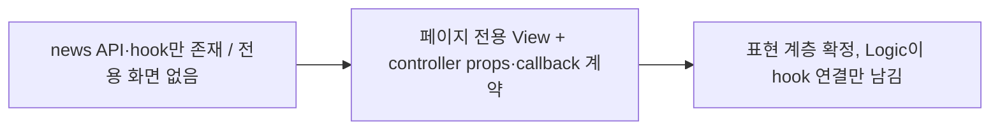

# 이력서·포트폴리오 기록

## 사례 1 — 공지사항 전용 관리 화면의 UI 계층과 역할 간 계약 신설

- 작업 유형: 프로젝트 구현
- 관련 도메인/서비스: 아산 메타버스 시민참여 관리자(admin-ui) / 공지사항(news)
- 문제 출처: 사용자 요구

### 문제 상황

- 사용자가 제시한 요구·문제·변경 이유: "현재 news 관련 공지사항 페이지에 ui 작업이 필요해. handoff 문서 확인한 후에 작업 진행해"
- 테스트·런타임에서 관찰한 오류: 없음. 기능 부재가 문제였다. `/admin/news` 5개 API와 query·mutation hook은 구현되어 있었지만 이를 사용하는 화면이 없었다.
- 필요한 기술·구조·패턴이 없을 때 발생할 문제: 운영자가 공지를 등록·삭제할 수 없고, 기존 `/cp/boards/notices/:noticeId/edit` 폼은 news 계약에 없는 노출 기간·메인 노출을 저장 가능한 것처럼 보여주면서 정작 유형·상단고정은 저장하지 못한다.

### 고민과 선택

- 사용자 제안: 기존 게시판(`/cp/boards`)은 유지하면서 공지 전용 관리 화면을 추가하는 방향(직전 Logic 세션에서 승인).
- 에이전트 제안: UI가 View와 controller props/callback 계약을 먼저 확정해 Logic에 인계하는 순서. 목록 필터는 인접 관리 화면과 같은 `FilterBar` 방식.
- 검토한 대안: ① 기존 `CpNoticeFormView` 확장 ② `SearchStateBar`(상태 탭 + 등록 버튼) 기반 목록 ③ `ToggleSwitch`로 상단고정 표현.
- 최종 선택: 전용 페이지 신설 + `FilterBar` 방식 + `ChoiceChipGroup`으로 상단고정 표현.
- 선택 이유와 제외한 방식의 이유: ①은 mock 기반 cp-board DTO와 news DTO가 달라 필드 의미가 충돌한다. ②는 유형·상태·검색 범위 3개 필터 구성과 맞지 않고 인접 관리 화면의 일관성을 깬다. ③은 `ToggleSwitch`가 접근 가능한 이름을 받을 수 없고 shared 수정이 승인된 scope 밖이었다.

### 적용

- 변경 경로: `src/pages/cp-news/` 신규 8개 파일(`model/cp-news-list.config.ts`, `model/cp-news-list.types.ts`, `ui/cp-news-list-view.tsx`, `model/cp-news-form.config.ts`, `model/cp-news-form.types.ts`, `ui/cp-news-form-view.tsx`, `ui/cp-news-delete-popup.tsx`, `index.ts`)
- 구현·수정·리팩터링 내용: 목록·등록/수정·삭제 확인 View와 두 controller 인터페이스를 작성했다. API 호출·검증·페이지 상태는 포함하지 않고 callback 경계로 위임했다.
- 핵심 동작: 필터·검색 입력과 적용, 서버 집계 기반 페이지 이동, 숫자 newsId로 수정 진입, 제목·본문·유형·상단고정 입력, 임시 저장·게시 분리, 삭제 확인 팝업, 조회 실패·저장 실패·삭제 실패의 분리 표시.

### 사용 기술과 구체적 목적

| 기술·구조·패턴 | 해결하려는 구체적 문제 | 적용 위치와 방식 |
| --- | --- | --- |
| controller props/callback 계약 | UI와 Logic이 같은 파일을 동시에 수정하지 않고 순차 인계하기 위해 | `model/*.types.ts`에 인터페이스만 정의하고 View는 이 타입에만 의존 |
| 페이지 로컬 표기 상수 | entities의 label이 번역 키(`_news_*`)라 화면에 그대로 노출되는 문제 | `cp-news-list.config.ts`에 `Record<NewsType, string>` 형태로 한국어 표기 정의 |
| 서버 집계 그대로 전달 | 클라이언트가 고정 공지를 재정렬하거나 `totalPages`를 재계산해 서버와 어긋나는 문제 | `Table`의 `itemCount`/`pageCount`에 controller 값을 그대로 전달 |
| 실패 상태 분리 | 조회 실패가 "결과 없음"으로 보여 운영자가 오판하는 문제 | `error.isVisible`이면 표 대신 오류 영역과 재시도 버튼을 렌더 |
| `ChoiceChipGroup` + `ariaLabel` | 상단고정 조작 요소에 접근 가능한 이름이 없는 문제 | `PINNED`/`NORMAL` 값과 boolean을 View에서 변환 |
| index↔값 변환 | `Dropdown`의 index 계약과 값 기반 controller 계약의 불일치 | `resolveIndex` 보조 함수와 해제(-1) 시 "전체" 복귀 매핑 |

### 결과

- 적용 전: news API와 hook만 존재하고 공지 전용 화면이 없었다. 공지 수정은 필드 의미가 다른 기존 게시판 폼에서만 가능했다.
- 적용 후: 목록·등록/수정·삭제 표현 계층과 두 controller 계약이 확정되어 Logic 담당이 hook 연결만으로 기능을 완성할 수 있다.
- 검증 결과: `tsc --noEmit` 신규 경로 오류 0건, `eslint src/pages/cp-news` PASS, 기존 news 테스트 28/28 PASS. 라우트 미연결 상태라 브라우저 동작은 확인하지 않았다.
- 사용자 후속 피드백: 없음(작성 시점 기준).
- 추가 요청 및 남은 제한: 라우트·메뉴 연결과 기존 공지 진입점 정리는 Logic 통합 이후 과제로 남았다.

### 이력서·포트폴리오 문구

- 이력서 bullet: 공지사항 관리 화면의 UI 계층과 역할 간 인터페이스 계약을 설계해, API 계층과 화면 구현을 병행 가능한 순차 인계 구조로 분리했다.
- 포트폴리오 서술: news API는 구현되어 있었지만 화면이 없었고, 기존 게시판 폼은 API 계약에 없는 필드를 저장 가능한 것처럼 노출하는 상태였다. 기존 폼 확장 대신 전용 페이지를 신설하기로 하고, UI 역할 경계를 지키기 위해 View는 표현과 이벤트만 담당하고 API·검증·페이지 상태는 controller 인터페이스로 위임했다. 화면 표기는 번역 키 노출을 막기 위해 페이지 config로 분리했고, 목록 집계는 서버 값을 재계산 없이 그대로 표시하도록 계약에 명시했다. 결과적으로 정적 검사와 기존 API 회귀를 통과한 표현 계층을 확보했고, Logic 담당은 공개 hook 연결에만 집중할 수 있게 되었다.
