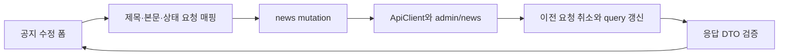

# 이력서·포트폴리오 기록

현재 실행 근거를 기록한 초안이다. 빌드와 전체 검증은 미완료이며 완료 성과로 단정하지 않는다.

## 사례 1 — 공지사항 실 API 계약과 수정 폼 연결

- 작업 유형: 프로젝트 구현
- 관련 도메인/서비스: 관리자 공지사항
- 문제 출처: 사용자 API 명세와 작업 재개 요청

### 문제 상황

사용자는 공지사항 백엔드 명세 5개를 제공하고 기존 실 API 패턴과 일관된 DTO·연결 구현을 요청했다. 기존 news 모듈은 /v1/news와 translations를 사용하고 공지 폼은 mock의 노출 기간·메인 노출 필드를 저장했다. 이 계약을 그대로 보내면 실제 서버 필드와 일치하지 않는다.

### 고민과 선택

- 사용자 제안: 제공한 명세로 DTO를 구성하고 기존 API 연결 패턴을 따른다.
- 에이전트 제안: inquiries의 ApiClient·Zod·TanStack Query 패턴을 적용하고 기존 폼에서 지원되는 필드만 연결한다.
- 검토한 대안: URL만 교체하는 방식은 DTO 불일치를 해결하지 못한다. 전체 UI 개편은 현재 Logic 계약을 벗어난다.
- 최종 선택: 기존 승인에 따라 도메인 계약부터 교체하고 UI 후속 범위를 handoff로 분리했다. mainExposure와 isPinned 사이의 정의되지 않은 의미를 만들어내지 않았다.

### 적용

src/entities/news에 목록·상세·등록·수정·삭제 전송 함수와 DTO/parser, query/mutation hook을 추가했다. 기존 폼은 숫자 newsId로 조회하고 title/content/status를 PATCH한다. 변경 성공 시 이전 목록·상세 요청을 취소한 뒤 재조회하며 삭제한 상세는 캐시에서 제거한다. 서버 집계·순서와 PATCH의 false/미입력을 보존한다.

### 사용 기술과 구체적 목적

| 기술·구조 | 해결하려는 문제 | 적용 위치·방식 |
| --- | --- | --- |
| ApiClient·Axios | 인증·오류·취소 처리 중복 | 공통 전송 경계를 재사용 |
| Zod·TypeScript DTO | 외부 응답과 폼 필드 불일치 | 요청 허용 필드와 unknown 응답 검증 |
| TanStack Query | 변경 후 오래된 데이터·삭제 캐시 복원 | 의존값별 key, 취소 후 최소 무효화 |
| Node test·MSW | 실제 HTTP·캐시 계약의 회귀 | Axios 요청, 상태 변경, 오류·취소 테스트 |

### 결과

- 적용 전: 사용하지 않는 legacy API와 mock 폼 계약.
- 적용 후: 5개 API와 기존 수정 폼의 지원 필드 연결, 미지원 필드 표시.
- 검증: 대상 28개·전체 134개 테스트 PASS, 변경 파일 lint PASS. 전체 lint는 다른 경로의 오류 68개·경고 5개로 실패했고 빌드는 사용자 명령 승인 후에도 중앙 훅이 재차단했다.
- 사용자 후속 피드백: 없음.
- 로컬 보존: `79d31f8bf5e5cb0d72e609e76c14b1fd069b198e` 커밋 생성, 작업 폴더 clean.
- 남은 제한: 타입/build 검증, 전체 lint, 공지 목록·등록·유형·상단고정 UI, 실서버·브라우저 검증, sy-main 미병합·원격 미반영.

### 이력서·포트폴리오 문구

- 이력서 초안: 관리자 공지사항 5개 REST API와 DTO·수정 폼을 연결하고 요청 취소·캐시 갱신·부분 수정 계약을 검증하는 28개 테스트를 작성했다.
- 서술 초안: mock 폼과 실제 백엔드의 계약 차이를 확인하고 기존 공용 전송 계층과 도메인 query 구조를 적용했다. 미지원 필드는 전송에서 제외하고 서버 값의 의미를 보존했다. Axios·MSW와 QueryClient 테스트로 변경 흐름을 확인했으며 전체 빌드와 UI 후속 연결은 남아 있다.
