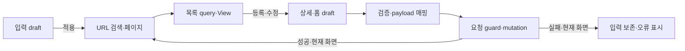

# 포트폴리오 기록

## 사례 1 — 공지사항 API와 관리 화면의 controller 연결

- 작업 유형: 프로젝트 구현
- 관련 도메인/서비스: asan-metaverse-admin-ui 공지사항(news) 관리
- 문제 출처: 사용자 요구, UI handoff의 미구현 controller 계약

### 문제 상황

2026-09-09, asan-metaverse-admin-ui, Logic 역할. news API와 전용 View는 있었지만 목록·폼 controller가 없었다. 기존 board는 작성자·노출 기간·fixture ID 등 계약이 달라 그대로 재사용할 수 없었다. 구현·대상 자동 검증을 마쳤으며 전체 검증·독립 검토·병합은 대기 중이다.

### 고민과 선택

- 사용자 제안: news handoff를 읽고 작업을 진행하라는 요구. 구체적인 상태 구조나 프레임워크 지정은 없었다.
- 에이전트 제안: 기존 공개 API·View를 재사용하고 page-local model·hook·page entry로 연결한다.
- 검토한 대안: controller에 요청 매핑까지 포함하는 안, 공용 store·추상 controller 도입, 페이지 내부에서 책임을 나누는 안.
- 최종 선택: 승인된 계획의 page-local model·hook·page entry.

하나의 controller에 요청 매핑까지 넣는 안은 상태와 검증을 섞고, 공용 store·추상 controller는 필요 이상의 계약을 늘린다. page-local 순수 model·hook·page entry를 선택해 API 전송·캐시·UI 표현의 기존 경계를 유지했다.

### 적용

- 변경 경로: src/pages/cp-news의 hook 2개·lib 3개·page entry 2개·index export, controller 테스트 2개.
- 구현 내용: 목록 조회·검색·페이지 이동, 폼 초기화·검증·부분 수정, 등록·임시 저장·게시·삭제, 요청 중 상태와 실패 처리.

입력 draft와 적용 URL query를 분리해 검색·페이지를 복귀까지 보존한다. 서버 집계로 페이지를 보정하며 편집한 필드만 PATCH해 미입력과 false를 구분한다. 저장·삭제 잠금과 생명주기 판별로 동시 요청·이전 화면 callback을 막는다.

### 사용 기술과 구체적 목적

| 기술·구조·패턴 | 해결하려는 구체적 문제 | 적용 위치와 방식 |
| --- | --- | --- |
| TypeScript DTO·Partial draft | 필수값·변경 필드·false의 의미 구분 | cp-news-form.model.ts의 POST/PATCH 매핑 |
| TanStack Query 공개 hook | 기존 캐시 취소·무효화 재사용 | 목록·폼 controller에서 entities public hook 소비 |
| React hook·URLSearchParams | 입력·검색 적용·페이지 복귀 연결 | 목록 draft와 적용 query 분리 |
| page-local request guard | mutation 경합·늦은 callback 차단 | cp-news-form-request.ts의 잠금·generation |
| Node·Vite SSR·MSW·QueryClient | 추가 프레임워크 없이 규칙·HTTP·hook 상태 검증 | 신규 controller 테스트 2개 파일 |

### 결과

- 적용 전: API와 View·controller 타입은 존재했으나 상태·요청·이동 구현이 없었다.
- 적용 후: controller·페이지 export를 구현하고 6f1d322로 커밋했다. UI 진입점 연결은 후속 범위다.
- 사용자 후속 피드백: 기능 사용 피드백은 없음. controller 구현 위치를 확인한 뒤 커밋·병합 진행을 요청했다.
- 추가 요청 및 남은 제한: 부모 브랜치 병합 요청을 처리 중이며 Git 소유권 인계 도구의 host·role 제약을 확인했다.

신규 테스트 18개를 포함한 46개 테스트·대상 린트·프로젝트 빌드가 통과했다. 전체 린트는 기존 68개 오류·5개 경고, 별도 tsconfig.app.json 타입 검사는 기존 14개 오류로 실패했다. 빌드는 검사 옵션이 다른 tsconfig.json을 사용하므로 app 검사 실패가 해결된 것은 아니다. 새 패키지는 없다. 라우트·메뉴 연결·실제 DOM·실 API 확인은 후속이다. 성능 개선량·운영 효과·사용자 만족도를 측정하지 않았으며 기능 피드백도 아직 없다.

### 이력서·포트폴리오 문구

- 기존 news API·UI를 controller로 연결하고 검색 상태 보존, 부분 수정, 중복 요청·이전 화면 응답 방지 로직을 구현했다.
- Node/Vite/MSW 테스트 18개를 추가해 기존 테스트 포함 46개 검증을 통과하고 기존 프로젝트 오류와 변경 영역 결과를 구분해 기록했다.
- 포트폴리오 서술: news API와 UI 사이의 미구현 controller를 연결하기 위해 공용 추상화 비용과 단일 controller의 결합도를 비교했다. 페이지 내부 model·hook을 선택해 요청 매핑·상태·표현을 분리했고 테스트·빌드를 통과했다. 전체 린트·추가 타입 검사와 실제 화면 연결의 남은 제한은 별도로 기록했다.
