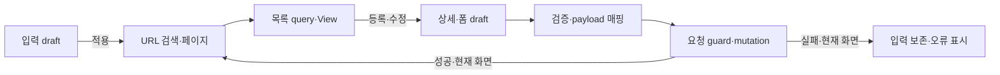

# 포트폴리오 기록

## 사례

2026-09-09, asan-metaverse-admin-ui, Logic 역할. news API와 전용 View는 있었지만 목록·폼 controller가 없었다. 기존 board는 작성자·노출 기간·fixture ID 등 계약이 달라 그대로 재사용할 수 없었다. 구현·대상 자동 검증을 마쳤으며 전체 검증·독립 검토·병합은 대기 중이다.

## 선택과 적용

하나의 controller에 요청 매핑까지 넣는 안은 상태와 검증을 섞고, 공용 store·추상 controller는 필요 이상의 계약을 늘린다. page-local 순수 model·hook·page entry를 선택해 API 전송·캐시·UI 표현의 기존 경계를 유지했다.

입력 draft와 적용 URL query를 분리해 검색·페이지를 복귀까지 보존한다. 서버 집계로 페이지를 보정하며 편집한 필드만 PATCH해 미입력과 false를 구분한다. 저장·삭제 잠금과 생명주기 판별로 동시 요청·이전 화면 callback을 막는다.

| 기술 | 구체적 목적 |
| --- | --- |
| TypeScript DTO·Partial draft | 필수값·변경 필드·false의 의미 구분 |
| TanStack Query 공개 hook | 기존 캐시 취소·무효화 재사용 |
| React hook·URLSearchParams | 입력·검색 적용·페이지 복귀 연결 |
| page-local request guard | mutation 경합·늦은 callback 차단 |
| Node·Vite SSR·MSW·QueryClient | 추가 프레임워크 없이 규칙·HTTP·hook 상태 검증 |

## 결과·제한·피드백

신규 테스트 18개를 포함한 46개 테스트·대상 린트·프로젝트 빌드가 통과했다. 전체 린트는 기존 68개 오류·5개 경고, 별도 tsconfig.app.json 타입 검사는 기존 14개 오류로 실패했다. 빌드는 검사 옵션이 다른 tsconfig.json을 사용하므로 app 검사 실패가 해결된 것은 아니다. 새 패키지는 없다. 라우트·메뉴 연결·실제 DOM·실 API 확인은 후속이다. 성능 개선량·운영 효과·사용자 만족도를 측정하지 않았으며 기능 피드백도 아직 없다.

## 이력서 문구 초안

- 기존 news API·UI를 controller로 연결하고 검색 상태 보존, 부분 수정, 중복 요청·이전 화면 응답 방지 로직을 구현했다.
- Node/Vite/MSW 테스트 18개를 추가해 기존 테스트 포함 46개 검증을 통과하고 기존 프로젝트 오류와 변경 영역 결과를 구분해 기록했다.
