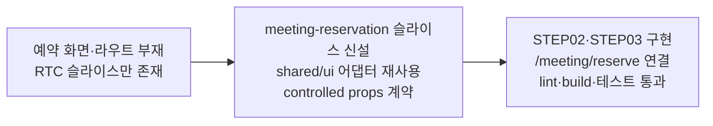

# 이력서·포트폴리오 기록

## 사례 1 — 회의 예약 서비스의 첫 두 화면을 신규 UI 슬라이스로 구현

- 작업 유형: 프로젝트 구현
- 관련 도메인/서비스: 아산 메타버스 가상오피스 — 회의 예약(Meeting Reservation)
- 문제 출처: 사용자 요구

### 문제 상황

- 사용자가 제시한 요구·문제·변경 이유: "현재 프로젝트에서 meeting 관련 서비스 프로젝트 내용 찾고, 그거에 대한 구체적인 ui 구현 및 기능 구현 작업이 들어갈꺼야. 그 전에 너가 각 화면별 ui 작업만 진행해주면 돼." 화면정의서 `VO_V2_STEP02_M01_VO_MEETING_RESERVE_MOBILE`(회의 예약 모바일)과 `VO_V2_STEP03_P01_VO_RESERVE_COMPLETE_POPUP`(예약 신청 완료 팝업) 2건을 먼저 지정했다. 이후 라우트는 "최소 연결로", 브랜치는 "sy-main에서 분기"로 확정했다.
- 테스트·런타임에서 관찰한 오류: 구현 중 `tsc -b`에서 TS2375 3건(`exactOptionalPropertyTypes: true` 아래 Dropdown `label`에 `string | undefined` 전달), `eslint`에서 `@typescript-eslint/no-misused-promises` 1건(`navigate(-1)`의 Promise 반환)이 발생했다.
- 필요한 기술·구조·패턴이 없을 때 발생할 문제: 저장소 조사 결과 `src/features/meeting/**`은 Agora RTC 회의 **진행** 기능이고 예약에 해당하는 화면·라우트·컴포넌트가 전혀 없었다. 라우트도 `appRoutes.meeting = "/meeting"` 하나뿐이었다. 예약 화면을 RTC 슬라이스에 그대로 얹으면 세션 수명주기 코드와 폼 코드가 같은 `ui/`를 공유하게 되고, 남은 화면정의서 15종(STEP04~STEP24)이 모두 그 위에 누적된다.

### 고민과 선택

- 사용자 제안: 화면정의서 2건의 UI만 먼저 구현, 라우트는 최소 연결, `sy-main`에서 분기.
- 에이전트 제안: 예약 전용 신규 슬라이스 `src/features/meeting-reservation` 신설, `shared/ui` 어댑터 최대 재사용, 예약 API·검증 로직은 Logic 역할로 분리.
- 검토한 대안:
  - 슬라이스 배치 — (a) 기존 `src/features/meeting` 하위 (b) 신규 슬라이스
  - 레이아웃 — (a) `citizen-participation` 레이아웃 직접 import (b) 즉시 `shared/ui` 승격 (c) 같은 구조를 예약 슬라이스에 재구성
  - 날짜 입력 — (a) `shared/ui/date-range-picker` (b) `shared/ui/dropdown`
  - 상태 표현 — (a) `shared/ui/status/status-badge` Chip (b) tint 카드 내 강조 텍스트
  - 색상 — (a) `src/index.css`에 tint 토큰 추가 (b) `color-mix`로 `--accent` 파생
- 최종 선택: 신규 슬라이스 / 구조 재구성(c) / 드롭다운(b) / tint 카드(b) / `color-mix`(b)
- 선택 이유와 제외한 방식의 이유: 예약은 승인 대기·시간 슬롯 점유·초대코드라는 별도 도메인이며 후속 화면이 15개 더 있어 슬라이스를 분리했다. CP 레이아웃 직접 import는 FSD상 feature 간 의존이 되고, 즉시 `shared/ui` 승격은 승인 scope 밖인 CP 파일 수정을 동반한다. range picker는 범위 선택 컴포넌트라 단일 날짜 `2026.09.03 ▾` 표기와 맞지 않았다. 화면정의서의 "현재 상태 / 승인대기"는 배지가 아니라 카드 블록이었다. `src/index.css`가 승인 scope 밖이었고 `src/features/meeting/ui/meeting.css`에 이미 `color-mix` 선례가 있었다.

### 적용

- 변경 경로: `src/features/meeting-reservation/**`(신규 15파일), `src/pages/meeting-reservation/**`(신규 2파일), `src/shared/config/meetingReservationRoutes.ts`(신규), `src/app/routing.ts`(수정) — 커밋 `bd3c35a`, 19 files / +958.
- 구현·수정·리팩터링 내용:
  - `MeetingReservePage` — 뒤로가기 헤더, 이용유형 세그먼트(개인·팀·기업), 팀/기업명, 테마·예약 날짜·1시간 시간 슬롯 드롭다운, 지정 참여자 검색·추가·요약, 회의명, Agenda, 이용안내 박스, sticky "예약 신청" CTA
  - `ReserveCompletePopup` — 체크 아이콘, 완료 제목·보조문구, 현재 상태(승인대기) tint 카드, 초대코드 안내 outline 카드, 각주, "확인" 버튼
  - 지원 컴포넌트 7종(`ReservationScreen`, `ReservationHeader`, `BottomActionBar`, `ReservationField`, `SegmentedChoice`, `ParticipantPicker`, `NoticeBox`)과 CSS 2종
  - `/meeting/reserve` 라우트 최소 연결
- 핵심 동작: 모든 화면 컴포넌트가 controlled props와 optional callback으로만 동작하고 기본값이 있어 단독 렌더가 가능하다. API 호출·검증·도메인 상태 전이를 포함하지 않는다.

### 사용 기술과 구체적 목적

| 기술·구조·패턴 | 해결하려는 구체적 문제 | 적용 위치와 방식 |
| --- | --- | --- |
| `control="input" \| "group"` 이중 라벨 전략 | HeroUI Select·세그먼트·복합 참여자 선택은 `<label htmlFor>`로 컨트롤을 직접 가리킬 수 없어 라벨이 접근성 트리에서 끊긴다 | `ui/parts/ReservationField.tsx` — `group`일 때 `` + `role="group" aria-labelledby`로 감싼다 |
| `role="radiogroup"` + roving `tabIndex` | 3분할 세그먼트에서 Tab이 항목마다 멈추면 키보드 이동이 길어지고 라디오 의미도 사라진다 | `ui/parts/SegmentedChoice.tsx` — 선택된 항목만 `tabIndex={0}`, 나머지는 `-1` |
| `findIndex`/`findLabel` 지역 상수 + 조건부 스프레드 | `shared/ui/dropdown`이 index 기반 API이고 프로젝트가 `exactOptionalPropertyTypes: true`라 `string \| undefined` 직접 전달 시 TS2375가 난다 | `ui/MeetingReservePage.tsx` — 라벨을 지역 상수로 좁힌 뒤 `{...(label === undefined ? {} : { label })}` |
| `color-mix(in srgb, var(--accent) 6~7%, var(--surface))` | 승인 scope 밖인 `src/index.css`를 건드리지 않고 안내 박스·참여자 요약의 tint 배경을 만들어야 한다 | `ui/parts/meeting-reservation-parts.css` — `.vo-notice--tint`, `.vo-participant__summary` |
| 고정 모바일 셸 + `prefers-reduced-motion` | `DESIGN.md`가 뷰포트 분기를 금지하고 모션 감소 존중을 요구한다 | `ui/layout/meeting-reservation.css` — `--app-mobile-max` 참조, 기능·선호 쿼리만 사용 |
| `<dialog>` 기반 shared Popup 재사용 | 팝업의 backdrop 클릭·ESC·포커스 처리를 새로 구현하면 기존 팝업들과 동작이 갈라진다 | `ui/ReserveCompletePopup.tsx` — `~/shared/ui/popup` 위에 콘텐츠만 구성, `aria-labelledby`로 제목 연결 |

### 결과

- 적용 전: 예약 화면·라우트·컴포넌트가 저장소에 존재하지 않았고 라우트는 `/meeting` 하나였다.
- 적용 후: 화면정의서 2건이 동작하는 UI로 구현되었고 `/meeting/reserve`에서 확인 가능하다. 예약 API가 붙을 props/callback 계약이 확정되었다.
- 검증 결과: `npx vitest run src/features/meeting-reservation` 2 files / 7 tests 통과. `npm run build`(`tsc -b && vite build`) 통과 — 초기 TS2375 3건은 지역 상수 도입으로 해소. `npm run lint` 통과 — 초기 `no-misused-promises` 1건은 `void navigate(-1)`로 수정. `npm run test` 전체는 500 passed / 6 failed이며 실패는 전부 `citizen-participation` 투표 API·MSW 테스트로 변경 파일과 import 연결이 없음을 grep으로 확인했다.
- 사용자 후속 피드백: 아직 없음(구현 보고 직후).
- 추가 요청 및 남은 제한: ① 화면정의서에 없는 참여자 "제외" 버튼의 유지 여부 확인 필요 ② `npm run test` 기존 실패 6건의 `sy-main` 기준선 재현 미확인(사용자 전용 Git 명령 필요) ③ `MeetingReserveRoute.tsx`의 TEMPORARY 옵션 상수·로컬 상태는 Logic 역할이 교체해야 함 ④ 브라우저 렌더 미확인(정책상 시각 QA는 사용자 요청 시에만 수행) ⑤ 남은 화면정의서 15종 미구현.

### 이력서·포트폴리오 문구

- 이력서 bullet: 가상오피스 회의 예약 서비스의 신규 UI 슬라이스를 설계·구현해 화면정의서 2종(예약 폼·완료 팝업)을 전달하고, 공용 UI 어댑터 5종을 재사용하면서 접근성(radiogroup·aria-labelledby·role=alert)과 고정 모바일 셸 디자인 계약을 충족했다.
- 포트폴리오 서술: 예약 화면이 전혀 없는 저장소에서 기존 `meeting` 슬라이스가 Agora RTC 진행 전용임을 먼저 확인하고(문제 상황), 후속 화면 15종이 누적될 것을 근거로 슬라이스 분리와 CP 레이아웃 재구성을 선택했으며(고민과 선택), controlled props 계약만으로 동작하는 화면 2종과 지원 컴포넌트 7종을 구현해 `/meeting/reserve`에 최소 연결하고(적용), lint·build·신규 테스트 7건을 통과시키되 미검증 범위(전체 테스트 기존 실패 6건의 기준선, 브라우저 렌더)를 명시적으로 남겼다(결과).
