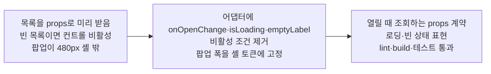

# 이력서·포트폴리오 기록

## 사례 1 — 예약 옵션 지연 로딩을 위한 공용 드롭다운 계약 확장

- 작업 유형: 프로젝트 구현
- 관련 도메인/서비스: 아산 메타버스 가상오피스 — 회의 예약(Meeting Reservation)
- 문제 출처: 사용자 요구

### 문제 상황

- 사용자가 제시한 요구·문제·변경 이유: 2026-09-04 "예약 옵션 지연 로딩 작업 진행". 원 요구는 직전 세션에 기록된 "사용자가 해당 입력폼에 입력을 원할 때(select라면 select 목록이 뜰 때, 1시간 슬롯인 경우 슬롯들이 나타날 때) API 요청으로 현재 사용 가능한 데이터들이 뜨게끔 할 것"이다. 승인 범위는 팝업 폭, 드롭다운 어댑터 계약, 페이지 props, 미리보기 라우트까지이며 실제 API 연결은 Logic 역할로 분리했다.
- 테스트·런타임에서 관찰한 오류: 구현 중 `tsc -b`에서 TS2375 1건(`exactOptionalPropertyTypes: true` 아래 `isDisabled`에 `boolean | undefined` 전달)이 발생했다. 테스트에서 `Select.Trigger`에 전달한 `aria-busy`가 DOM에 렌더되지 않아 `null`로 관찰됐다.
- 필요한 기술·구조·패턴이 없을 때 발생할 문제: 공용 `Dropdown`이 HeroUI `Select`를 감싸면서 열림 이벤트를 노출하지 않아 화면이 "목록이 열리는 시점"을 알 수 없었고, `isDisabled={disabled || items.length === 0}` 때문에 목록이 비면 컨트롤이 열리지도 않았다. 지연 로딩에서는 첫 열림 전 목록이 항상 비므로 이 조건 하나가 요구를 원천 차단한다. 또한 `dialog`는 top layer에 그려져 `#root`의 480px 고정 모바일 셸(`src/index.css:57`) 밖에 놓이므로 팝업 폭 `min(600px, …)`이 셸을 벗어난다.

### 고민과 선택

- 사용자 제안: 지연 로딩 작업 진행. 미리보기 라우트 전환(D) 포함 여부를 물었고 조정 없이 승인됐다. 이후 빈 목록 UX 변화와 전역 팝업 폭 변경을 각각 "유지"로 확정했다.
- 에이전트 제안: 열림·로딩·빈 목록을 공용 어댑터의 계약으로 올리고, 데이터 취득은 UI 밖 props 계약으로 남긴다.
- 검토한 대안:
  - 수정 계층 — (a) 화면에서 HeroUI 직접 사용 (b) 공용 어댑터 확장
  - 열림 감지 — (a) 새 상태 관리·라이브러리 도입 (b) 하위 의존성이 이미 제공하는 prop 전달
  - 빈 목록 표현 — (a) 비활성 컨트롤 유지 (b) 열리는 빈 목록 + 필드별 문구
  - 조회 중 목록 — (a) 이전 목록 유지 (b) 비우고 로딩 문구
  - 팝업 폭 — (a) 예약 팝업만 우회 수정 (b) 전역 수정
  - 조회 상태 노출 — (a) 트리거 버튼 `aria-busy` (b) 래퍼 요소 `aria-busy`
- 최종 선택: 어댑터 확장(b) / prop 전달(b) / 열리는 빈 목록(b) / 비우고 로딩(b) / 전역 수정(b) / 래퍼(b)
- 선택 이유와 제외한 방식의 이유: 정책이 `@heroui/react` 직접 import를 `src/shared/ui` 내부로 제한하고 예약 화면 15종이 같은 조회 패턴을 반복하므로 어댑터에서 고쳤다. 하위 의존성 확인 결과 react-stately가 `onOpenChange`를(`react-stately/dist/types/src/select/useSelectState.d.ts:39`), RAC `ListBox`가 `renderEmptyState`를(`react-aria-components/dist/types/src/ListBox.d.ts:72`) 이미 제공해 새 라이브러리가 필요 없었다. 비활성 유지는 지연 로딩과 양립할 수 없다. 이전 목록 유지는 날짜 변경 후 없는 슬롯을 선택하게 만든다. 팝업 폭은 원인이 `dialog`의 top layer 렌더라 모든 팝업에 해당하고 `DESIGN.md:98`이 기능별 픽셀값 대신 `--app-mobile-max` 참조를 요구한다. 트리거 `aria-busy`는 실제로 시도했으나 RAC의 `filterDOMProps`가 걸러 렌더되지 않는 것을 테스트로 확인해 래퍼로 옮겼다.

### 적용

- 변경 경로: `src/shared/ui/dropdown/dropdown.tsx`(수정), `src/shared/ui/dropdown/dropdown.css`(신규), `src/shared/ui/popup/popup.css`(수정), `src/features/meeting-reservation/model/types.ts`·`ui/MeetingReservePage.tsx`·`ui/MeetingReservePage.test.tsx`(수정), `src/pages/meeting-reservation/ui/MeetingReserveRoute.tsx`(수정) — 커밋 `fee6a17`, 7 files / +173 −29.
- 구현·수정·리팩터링 내용:
  - `Dropdown`에 `onOpenChange`·`isLoading`·`emptyLabel` 계약 추가, 빈 목록 자동 비활성 제거, 조회 중 목록 비우기, 래퍼 `aria-busy`, 빈 상태 문구 렌더
  - `MeetingReservePage`에 `loadingFields`와 `onThemeOptionsOpen`/`onDateOptionsOpen`/`onTimeSlotOptionsOpen` 추가, 필드별 빈 문구 상수와 `openTrigger` 헬퍼로 3곳 배선 통일
  - 전역 팝업 폭을 `min(var(--app-mobile-max), calc(100% - 2rem))`로 변경
  - 미리보기 라우트를 "빈 목록으로 시작 → 열릴 때 채움 → 날짜 변경 시 슬롯·선택 무효화"로 전환
  - 테스트 2건 추가(빈 목록에서도 열림, 조회 중 `aria-busy`)
- 핵심 동작: 어댑터는 열림 사실만 통지하고 데이터 취득에 관여하지 않는다. 화면은 `isOpen === true`에서만 콜백을 호출하고, 조회 여부는 `loadingFields`로 표현한다. 조회 자체는 UI 밖(hook·query 계층)에 남는다.

### 사용 기술과 구체적 목적

| 기술·구조·패턴 | 해결하려는 구체적 문제 | 적용 위치와 방식 |
| --- | --- | --- |
| react-stately `onOpenChange` 전달 | 화면이 "목록이 열리는 시점"을 알 수 없어 조회 트리거를 만들 수 없다 | `shared/ui/dropdown/dropdown.tsx` — HeroUI `Select`에 조건부 스프레드로 전달, 소비자에는 열림만 통지하는 `openTrigger`로 감쌈 |
| RAC `ListBox`의 `renderEmptyState` | "선택 가능한 항목 없음"을 비활성 컨트롤로 표현하면 이유를 전달하지 못하고 지연 로딩도 막힌다 | `dropdown.tsx` — 로딩 중이면 "불러오는 중...", 아니면 필드별 `emptyLabel` 렌더 |
| `isLoading` 기반 `visibleItems` 분기 | 예약 날짜를 바꾼 직후 이전 날짜의 시간 슬롯이 남아 선택될 수 있다 | `dropdown.tsx` — `const visibleItems = isLoading ? [] : items;` |
| 래퍼 요소 `aria-busy` | HeroUI/RAC가 트리거로 전달한 `aria-busy`를 DOM에 렌더하지 않는다 | `dropdown.tsx` — `div.dropdown-field`에 표시, `dropdown.css`는 `width: 100%`만 부여 |
| `Readonly<Record<ReservationOptionField, string>>` 문구 매핑 | 필드별 빈 목록 문구가 화면 곳곳에 흩어지면 표기가 갈라진다 | `ui/MeetingReservePage.tsx` — `EMPTY_OPTION_LABELS` 한 곳에서 정의, 타입은 `model/types.ts`가 소유 |
| `min(var(--app-mobile-max), …)` | `dialog`가 top layer에 그려져 고정 모바일 셸을 벗어난다 | `shared/ui/popup/popup.css` — 셸 토큰을 폭 상한으로 직접 참조 |
| TEMPORARY 미리보기의 타이머 기반 조회 | Logic이 붙기 전에는 열림·로딩·빈 상태 계약이 실제로 동작하는지 확인할 수 없다 | `pages/meeting-reservation/ui/MeetingReserveRoute.tsx` — `useRef` 타이머 정리 포함, 상단 주석으로 교체 대상 명시 |

### 결과

- 적용 전: 옵션 목록을 props로 미리 받아야 했고, 목록이 비면 드롭다운이 비활성이라 조회 트리거 자체가 발생할 수 없었다. 팝업이 480px 셸보다 넓게 정의돼 있었다.
- 적용 후: 목록이 열릴 때 조회하는 props 계약(`onOpenChange` → 필드별 열림 콜백)과 로딩·빈 상태 표현이 확정됐고, 미리보기 라우트에서 동작을 확인할 수 있다. 팝업 폭이 앱 셸 토큰을 따른다.
- 검증 결과: `npx vitest run src/features/meeting-reservation` 2 files / 10 tests 통과(신규 2건 포함). `npm run lint` 통과. `npm run build`(`tsc -b && vite build`) 통과 — 초기 TS2375 1건은 `disabled ?? false`로 해소. `npm run test` 전체는 503 passed / 6 failed이며 실패는 전부 `citizen-participation` 투표 API·MSW·라우트 테스트로 직전 세션과 동일 목록이고 변경 파일과 import 연결이 없다. 검증 과정에서 트리거 `aria-busy` 미렌더와 빈 상태 live region 중첩 2건을 발견해 수정했다.
- 사용자 후속 피드백: 빈 목록 UX 변화와 전역 팝업 폭 변경을 각각 "유지"로 확정했다. 세션 산출물은 branch scope 밖이라 커밋하지 않고 작업 트리에 두는 쪽을 선택했다.
- 추가 요청 및 남은 제한: ① `npm run test` 기존 실패 6건의 `sy-main` 기준선 재현 미확인(사용자 전용 Git 명령 필요) ② 브라우저 렌더 미확인(정책상 시각 QA는 사용자 요청 시에만 수행) ③ 미리보기의 `setTimeout` 조회는 취소·경합 미처리로 실제 hook의 책임 ④ 시간 슬롯 응답이 점유 슬롯을 포함하는지 API 계약 미확정 — 포함이면 항목 단위 `disabled`가 추가로 필요 ⑤ 세션 산출물 8종이 Git 이력에 남지 않음.

### 이력서·포트폴리오 문구

- 이력서 bullet: 공용 드롭다운 어댑터에 열림·로딩·빈 목록 계약을 추가해 예약 옵션의 지연 로딩을 가능하게 하고, 데이터 취득은 UI 밖 props 계약으로 분리해 UI와 Logic의 작업 경계를 유지했다.
- 포트폴리오 서술: "목록이 열릴 때 조회"라는 요구가 왜 막혀 있는지부터 코드에서 확인해 열림 이벤트 미노출과 빈 목록 자동 비활성이라는 두 제약을 특정했고(문제 상황), 새 라이브러리 대신 하위 의존성이 이미 제공하던 `onOpenChange`·`renderEmptyState`를 공용 어댑터로 끌어올리는 방식을 선택했으며(고민과 선택), 열림 콜백·조회 중 표시·필드별 빈 문구를 계약으로 정의하고 미리보기 라우트에서 동작을 확인할 수 있게 했다(적용). lint·build·신규 테스트를 통과시키고 트리거의 `aria-busy` 미렌더와 빈 상태 live region 중첩을 검증 과정에서 잡아 고쳤으며, 미검증 범위를 명시적으로 남겼다(결과).
