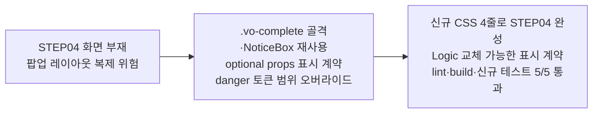

# 이력서·포트폴리오 기록

## 사례 1 — 회의 예약 제한 안내 팝업을 기존 팝업 골격 재사용으로 구현

- 작업 유형: 프로젝트 구현
- 관련 도메인/서비스: 가상오피스 회의 예약 (asan-metaverse-user-ui)
- 문제 출처: 사용자 요구

### 문제 상황

- 사용자가 제시한 요구·문제·변경 이유: Figma MCP 채널(`05j3cbcu`)로 디자인 문서에 연결한 뒤, 이미 구현된 STEP02·STEP03 다음 프레임인 STEP04 `VO_RESERVATION_RESTRICTED_POPUP`의 UI 구현을 요청했다.
- 테스트·런타임에서 관찰한 오류: 없음(신규 화면).
- 필요한 기술·구조·패턴이 없을 때 발생할 문제: STEP04~STEP31에 팝업 화면이 5개 이상 더 예정되어 있다. 팝업마다 마크업·CSS를 새로 짜면 같은 레이아웃이 파일 수만큼 복제되고, 접근성 처리(모달 이름 연결, 장식 아이콘 숨김)가 파일마다 달라질 위험이 있다.

### 고민과 선택

- 사용자 제안: 다음 프레임 UI 작업, 격리 worktree에서 작업.
- 에이전트 제안: 제한 상태 사전 검사(API·168시간 계산)는 UI 역할 경계 밖이므로 이번 범위에서 제외하고, 표시 계약만 props로 노출한다.
- 검토한 대안:
  - (A) 팝업 전용 마크업·CSS를 새로 작성
  - (B) STEP03 `ReserveCompletePopup`의 `.vo-complete` 골격과 `NoticeBox`를 재사용하고 강조색만 오버라이드
  - (C) 지금 공용 팝업 컴포넌트를 추출한 뒤 STEP03·STEP04를 함께 이관
- 최종 선택: (B).
- 선택 이유와 제외한 방식의 이유: (A)는 동일 레이아웃을 복제해 유지비를 늘린다. (C)는 승인 범위(STEP04 구현)를 넘는 기존 파일 리팩터링이라 이번 변경의 위험을 키운다. (B)는 재사용 이익을 즉시 얻으면서 기존 화면의 동작을 건드리지 않는다. 공용 골격 추출은 팝업이 3개째가 되는 시점의 backlog로 `evaluation-log.md`에 남겼다.

### 적용

- 변경 경로:
  - `src/features/meeting-reservation/ui/ReservationRestrictedPopup.tsx` (신규)
  - `src/features/meeting-reservation/ui/ReservationRestrictedPopup.test.tsx` (신규)
  - `src/features/meeting-reservation/ui/parts/meeting-reservation-parts.css` (4줄)
  - `src/features/meeting-reservation/index.ts` (1줄)
- 구현·수정·리팩터링 내용: `Popup` + `NoticeBox` 2개 + `Button`으로 팝업을 구성하고, `.vo-complete` 골격에 `.vo-restricted`를 덧붙여 아이콘 배경과 안내 박스 강조색만 danger 토큰으로 바꿨다. Figma 문구 4종은 optional props의 기본값으로 넣었다.
- 핵심 동작: 컴포넌트가 상태를 갖지 않는다. `open`/`close`는 호출부 소유, 확인 버튼은 `onConfirm ?? close`를 호출해 팝업만 닫는다.

### 사용 기술과 구체적 목적

| 기술·구조·패턴 | 해결하려는 구체적 문제 | 적용 위치와 방식 |
| --- | --- | --- |
| controlled props + callback | 제한 상태 판단(API·기간 계산)이 UI 파일로 새어드는 것을 막는다 | 문구 4종을 optional props로 노출, 판단은 호출부에 남김 |
| 기존 CSS 골격 재사용 + 범위 한정 오버라이드 | 동일 레이아웃 복제를 피하면서 기존 팝업의 표현을 바꾸지 않는다 | `.vo-complete`에 `.vo-restricted`를 덧붙여 하위 선택자에서만 색 오버라이드 |
| 기존 디자인 토큰(`--danger`, `--danger-bg`) | 새 색상 도입 없이 경고 톤을 표현한다 | `.vo-restricted__icon`, `.vo-restricted .vo-notice--tint` |
| `aria-labelledby` + `aria-hidden` | 모달 이름이 스크린리더에 전달되고 장식 아이콘이 읽히지 않게 한다 | `Popup`에 `aria-labelledby`, 제목 `h2`에 동일 id, 아이콘 `span`에 `aria-hidden` |
| 기본값/대체값 회귀 테스트 | 향후 Logic이 계산값을 넘길 때 계약이 깨지지 않게 고정한다 | `reason`·`restrictionScope` 대체 시 기본 문구가 사라지는지 검증 |
| `onConfirm ?? close` 폴백 | 호출부가 콜백을 생략해도 확인 버튼이 무동작이 되지 않게 한다 | 폴백과 이를 검증하는 테스트 |

### 결과

- 적용 전: STEP04 화면 없음. 제한 상태 사용자에게 보여줄 UI가 없었다.
- 적용 후: `ReservationRestrictedPopup`이 feature public API로 노출되어, 제한 상태 분기가 준비되면 바로 연결 가능하다. 신규 CSS는 4줄이고 기존 화면 동작은 변하지 않는다.
- 검증 결과: `npm run lint` 통과, `npm run build` 통과, 신규 테스트 5/5 통과, 전체 524/530 통과(실패 6건은 `citizen-participation` MSW 관련 사전 존재 실패).
- 사용자 후속 피드백: 아직 없음.
- 추가 요청 및 남은 제한: 진입 화면 STEP01이 미구현이라 실사용 검증은 이후로 미뤄졌다. `168시간`은 정적 문구이며 실제 남은 시간은 호출부 계산이 필요하다.

### 이력서·포트폴리오 문구

- 이력서 bullet: Figma MCP로 디자인 계약을 직접 조회해 신규 예약 제한 안내 팝업을 구현하면서, 기존 팝업 골격과 안내 박스 컴포넌트를 재사용해 신규 CSS를 4줄로 제한하고 접근성 계약과 props 대체 동작을 회귀 테스트 5건으로 고정했다.
- 포트폴리오 서술: 회의 예약 도메인에 팝업 화면이 5개 이상 추가될 예정이라, STEP04를 새로 짜는 대신 직전 화면의 팝업 골격과 `NoticeBox`를 재사용하고 강조색만 기존 danger 토큰으로 오버라이드하는 방식을 택했다. 공용 컴포넌트 추출은 승인 범위를 넘고 기존 화면까지 건드리므로 팝업 3개 시점의 backlog로 분리했다. 제한 상태 판단은 UI 역할 경계 밖이라 문구를 optional props로만 노출해 Logic 계층 교체에 열어 두었고, 기본값과 대체값 동작·모달 접근 가능한 이름·확인 콜백 폴백을 테스트로 고정했다.
