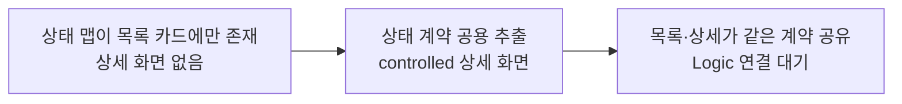
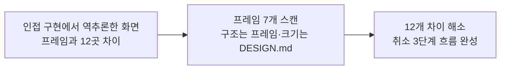
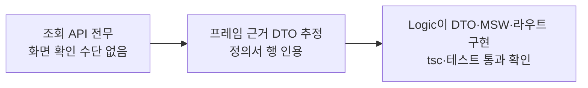

# 이력서·포트폴리오 기록

## 사례 1 — 예약 상세 화면을 디자인 프레임과 계층 경계에 맞춰 구현

- 작업 유형: 프로젝트 구현
- 관련 도메인/서비스: 아산 메타버스 가상오피스 회의 예약(STEP06 예약 상세 Mobile)
- 문제 출처: 사용자 요구

### 문제 상황

- 사용자가 제시한 요구·문제·변경 이유: STEP06 예약 상세 모바일 화면을 신규 구현한다. 취소 권한 판정·승인만료 전이·코드 발급은 Logic 경계이므로 UI는 `canCancel: boolean`과 표시 문자열만 받는다.
- 테스트·런타임에서 관찰한 오류: 없음. 다만 전체 `npm run test`가 `citizen-participation`의 MSW `onUnhandledRequest` 문제로 이미 6건 실패 중이라 새 회귀 신호가 묻히는 상태였다.
- 필요한 기술·구조·패턴이 없을 때 발생할 문제: 예약 상태 6종의 배지 톤·라벨 맵이 목록 카드 파일 안에 있어, 상세가 같은 정의를 복제하면 두 화면의 상태 표시가 시간이 지나며 어긋난다.

### 고민과 선택

- 사용자 제안: 상태 맵 추출 → 표시 파츠 → 상세 페이지 → CSS → export → 테스트 순서, controlled 컴포넌트, Logic 경계 유지.
- 에이전트 제안: `ReservationListStatus`를 별칭으로 re-export해 목록의 import 경로를 건드리지 않는 방식.
- 검토한 대안: (a) 상세에서 상태 정의 복제 (b) `model/reservation.ts`로 이전 (c) UI 공용 모듈로 추출.
- 최종 선택: (c) UI 공용 모듈 추출.
- 선택 이유와 제외한 방식의 이유: (a)는 두 화면이 어긋나는 원인을 그대로 둔다. (b)는 model이 4종만 정의해 `REJECTED`·`COMPLETED` 추가가 필요한데 이는 Logic 경계라 UI 역할 범위를 넘는다. (c)는 표시 계약만 한곳에 모으면서 기존 공개 타입명을 유지해 호출부 변경을 0으로 만든다.

### 적용

- 변경 경로: `src/features/meeting-reservation/ui/parts/reservationStatus.ts`, `parts/ReservationDetailSection.tsx`, `ui/MeetingReservationDetailPage.tsx`, `parts/ReservationCard.tsx`, `parts/meeting-reservation-parts.css`, `index.ts`, 테스트 1종
- 구현·수정·리팩터링 내용: 상태 6종 유니온과 tone·label 맵을 공용 모듈로 추출하고, 제목 + `<dl>` 표시 파츠와 controlled 상세 화면을 신규 작성했다.
- 핵심 동작: 값이 빈 항목은 `<dl>` 줄을 만들지 않고, 섹션 항목이 전부 비면 섹션 제목도 그리지 않는다. 취소 버튼은 `canCancel`이 true이고 로딩·오류가 아닐 때만 하단 고정 바에 나타난다.

### 사용 기술과 구체적 목적

| 기술·구조·패턴 | 해결하려는 구체적 문제 | 적용 위치와 방식 |
| --- | --- | --- |
| 타입 별칭 re-export | 정의를 옮기면서 기존 import 경로가 깨지는 문제 | `ReservationCard.tsx`에서 `ReservationListStatus = ReservationStatus`로 재노출 |
| controlled props + 콜백 | UI가 취소 정책·상태 전이를 복제하는 문제 | `canCancel: boolean`과 표시 문자열만 수신, 실행은 `onCancel`로 위임 |
| `useId` | 같은 화면 다중 렌더 시 `aria-labelledby` id 충돌 | `ReservationDetailSection`과 입장 코드 섹션 제목 |
| `dl/dt/dd` 시맨틱 | 용어-값 쌍의 낭독 순서와 의미 전달 | 상세 정보 목록. 그리드 정렬을 위해 `dl > div > dt/dd` |
| `overflow-wrap: anywhere` | 긴 Agenda·참여자 목록이 480px 고정 셸에서 가로 스크롤을 만드는 문제 | `.vo-detail-list__description` |

### 결과

- 적용 전: 상세 화면이 없어 목록 카드의 `onSelect` 이동 대상이 비어 있었고, 상태 표시 규칙이 목록 카드 파일에만 존재했다.
- 적용 후: 목록과 상세가 같은 상태 계약을 공유하고, 상세가 controlled 컴포넌트로 Logic 연결을 기다리는 상태가 됐다.
- 검증 결과: 신규 테스트 9케이스 통과, `npm run lint`·`tsc -b`·`npm run build` 통과. 전체 테스트의 6건 실패는 `citizen-participation` MSW 기존 문제로 변경 파일과 무관함을 실패 목록으로 확인했다.
- 사용자 후속 피드백: 데이터·라우트가 없어 화면을 띄울 수 없다는 점을 지적받아 목 데이터 현황을 조사하고 Logic 인계 문서를 작성했다.
- 추가 요청 및 남은 제한: 디자인 대조 요청으로 사례 2가 이어졌다.

### 이력서·포트폴리오 문구

- 이력서 bullet: 예약 상세 화면을 controlled 컴포넌트로 구현하고 목록과 중복되던 상태 표시 계약을 공용 모듈로 추출해, 공개 타입명을 유지한 채 호출부 변경 없이 두 화면의 표시 규칙을 일원화했다.
- 포트폴리오 서술: 상태 표시 규칙이 목록 카드 안에만 있어 상세가 정의를 복제해야 하는 상황에서, model 이전(Logic 경계 침범)과 복제(불일치 누적)를 모두 배제하고 UI 공용 모듈 추출을 택했다. 기존 공개 타입을 별칭으로 재노출해 호출부 변경 없이 적용했고, 취소 권한 판정은 boolean 수신으로 계층 경계를 지켰다. 신규 테스트 9케이스와 lint·build로 검증했다.

## 사례 2 — Figma 프레임 대조로 구현과 디자인의 12개 차이를 찾아 정렬

- 작업 유형: 기획 변경
- 관련 도메인/서비스: 회의 예약 STEP02~STEP08 프레임
- 문제 출처: 사용자 피드백

### 문제 상황

- 사용자가 제시한 요구·문제·변경 이유: "Connected to server in channel: hgkguilr, 이걸로 연결이 안돼?" — 이전 handoff에 "채널은 세션마다 바뀐다"고 적혀 있어 만료로 단정하고 시도조차 하지 않은 것을 사용자가 지적했다. 이후 "프레임 기준으로 다시 맞추고, DESIGN.md와 다르면 DESIGN.md 기준으로" 수정을 지시했다.
- 테스트·런타임에서 관찰한 오류: 없음. 테스트는 통과하지만 화면이 디자인과 다른 상태였다.
- 필요한 기술·구조·패턴이 없을 때 발생할 문제: 디자인 근거 없이 인접 구현에서 역추론한 화면 구성이 그대로 굳고, Logic이 잘못된 props 계약에 맞춰 DTO를 만들어 계약을 두 번 고쳐야 한다.

### 고민과 선택

- 사용자 제안: 프레임 기준 정렬, 충돌 시 DESIGN.md 우선.
- 에이전트 제안: 차이를 12개 표로 먼저 제시하고, props·API 계약이 바뀌는 항목(참여 예정 인원, 취소 팝업)은 Logic 착수 전에 결정할 것을 권고.
- 검토한 대안: 프레임 값을 그대로 따르기 / DESIGN.md를 그대로 따르기 / 항목은 프레임, 크기·색은 DESIGN.md.
- 최종 선택: 항목·구조·문구는 프레임, 글자 크기·색 토큰은 DESIGN.md.
- 선택 이유와 제외한 방식의 이유: 프레임의 11px·13px 본문을 그대로 쓰면 "본문 14px 미만 신규 도입 금지" 규칙을 깨고 가독성 하한이 무너진다. 반대로 DESIGN.md만 따르면 화면 구성 자체가 디자인과 달라진다. 두 문서의 관할이 다르다는 점을 근거로 분리했다.

### 적용

- 변경 경로: `ui/MeetingReservationDetailPage.tsx`, `parts/meeting-reservation-parts.css`, `ui/MeetingReservationDetailPage.test.tsx`, `ui/ReservationCancelConfirmPopup.tsx`, `ui/ReservationCancelCompletePopup.tsx`, `parts/reservationMeta.ts`
- 구현·수정·리팩터링 내용: 헤더를 `‹ 예약 목록` 링크로 바꾸고 메타를 한 줄로 합쳤다. 섹션을 `예약 정보`(이용유형·팀명·Agenda)와 `참여자`(예약자·지정 참여자·참여 예정)로 재편하고, 입장 코드 안내·입장 가능시간·승인만료 문구를 추가했으며 디자인에 없는 복사 버튼을 제거했다. 취소 확인·완료 팝업 2종을 신규 구현했다.
- 핵심 동작: 이용유형 enum에서 표시 라벨과 소속 용어(`팀명`/`기업명`)를 UI가 파생하고, 개인 이용은 소속 줄을 만들지 않는다. 취소된 예약은 코드 자리에 `취소된 예약`과 폐기 안내를 남긴다.

### 사용 기술과 구체적 목적

| 기술·구조·패턴 | 해결하려는 구체적 문제 | 적용 위치와 방식 |
| --- | --- | --- |
| Figma MCP `scan_text_nodes` | 프레임의 실제 문구·정의서를 근거로 확보 | STEP02~STEP08 7개 프레임 스캔, 우측 「상세 정의 및 동작」 표를 DTO·동작 근거로 사용 |
| enum → 표시 라벨 파생 | Logic이 라벨 문자열을 조립해 넘기는 중복 | `usageType`만 받아 `USAGE_TYPE_LABEL`·`ORGANIZATION_TERM`으로 UI가 파생 |
| 조건부 안내 문구 | 승인대기 취소에 없는 코드의 폐기 문구가 뜨는 오표시 | 완료 팝업의 `inviteCodeRevoked` 분기 |
| 시각적 숨김 클래스 | 시각적 제목 없이도 접근 가능한 이름 유지 | `.vo-sr-only` + `h1` |
| 공용 문자열 조합 util | 카드·상세·팝업 4곳에 흩어진 ` · ` 조합 중복 | `parts/reservationMeta.ts` |

### 결과

- 적용 전: 화면 구성이 프레임과 6곳 다르고, 안내 문구 3종이 빠져 있었으며, 디자인에 없는 복사 버튼이 있었다. 취소 확인·완료 단계가 없어 버튼을 누르면 즉시 취소가 실행되는 구조였다.
- 적용 후: 12개 차이 중 12개 해소. 취소 흐름이 확인 → 실행 → 완료 3단계가 됐다.
- 검증 결과: feature 테스트 52 passed(상세 14, 팝업 6 신규), `npm run lint`·`npm run build` 통과.
- 사용자 후속 피드백: 취소 팝업 구현과 페이지네이션 위치 유지를 지시받아 반영했고, 이어서 요청·응답 DTO 문서화를 요구받아 프레임 근거로 재작성했다.
- 추가 요청 및 남은 제한: 목록 프레임에 페이지네이션 UI가 없었으나 사용자가 목록 아래 유지로 확정했다. 반려 사유 안내(`noticeTitle`/`noticeDescription`)는 Logic 연결에서 아직 채워지지 않았다.

### 이력서·포트폴리오 문구

- 이력서 bullet: Figma MCP로 화면 정의 프레임 7개를 직접 스캔해 구현과 디자인의 차이 12건을 표로 도출하고, 디자인 시스템 규칙과 충돌하는 4건은 시스템 기준으로 조정해 전량 정렬했다.
- 포트폴리오 서술: 디자인 채널이 만료됐다는 이전 기록을 검증 없이 믿고 인접 구현에서 화면을 역추론한 것이 문제의 출발점이었다. 채널 재연결 후 프레임과 정의서를 근거로 차이를 12건 표로 정리해 먼저 합의하고, 프레임과 디자인 시스템의 관할을 구조 대 타이포로 분리해 정렬했다. props 계약이 바뀌는 항목은 Logic 착수 전에 결정하도록 순서를 제안해 계약 재작업을 막았다.

## 사례 3 — 화면 근거 기반 API 계약 추정과 Logic 인계

- 작업 유형: 기획 변경
- 관련 도메인/서비스: 회의 예약 목록·상세·취소·신규 예약 제한 API
- 문제 출처: 사용자 요구

### 문제 상황

- 사용자가 제시한 요구·문제·변경 이유: "각 프레임에 들어가는 데이터들을 API 요청/응답 데이터라 가정하고 문서화" — 이번 작업 프레임뿐 아니라 이전 커밋의 화면까지 포함해 정리하도록 요구받았다.
- 테스트·런타임에서 관찰한 오류: 없음. 다만 목록·상세·취소·제한 API가 전부 없어 화면을 브라우저로 확인할 수단이 없었다.
- 필요한 기술·구조·패턴이 없을 때 발생할 문제: Logic이 서버 계약 없이 착수하면 필드명·nullable 여부·서식 책임이 화면마다 달라지고, UI가 기대하는 표시 문자열과 어긋난다.

### 고민과 선택

- 사용자 제안: 프레임 데이터를 요청/응답 DTO key로 추론해 문서화.
- 에이전트 제안: 기구현 DTO에서 명명 규칙을 먼저 뽑아 추정의 일관성을 확보하고, 각 필드에 프레임 정의서 행 번호를 근거로 붙이기.
- 검토한 대안: 화면 항목만 나열 / 필드명까지 추정 / 필드명 + 근거 + 판단 필요 지점 표기.
- 최종 선택: 필드명 + 정의서 근거 + 판단 필요 지점.
- 선택 이유와 제외한 방식의 이유: 항목만 나열하면 Logic이 다시 추론해야 하고, 필드명만 주면 근거가 없어 서버 스펙과 충돌할 때 판단 기준이 없다. 근거를 함께 두면 실제 스펙과 대조해 어느 쪽이 맞는지 판별할 수 있다.

### 적용

- 변경 경로: `.claude/logs/sessions/2026-09-09-reservation-detail-ui/handoff.md`
- 구현·수정·리팩터링 내용: 화면 6종(신청 폼·완료 팝업·제한 팝업·목록·상세·취소)의 요청/응답 DTO를 표와 JSON 예시로 작성하고, 공통 명명 규칙과 개인정보 제약을 앞에 뒀다.
- 핵심 동작: 각 필드에 프레임 정의서 행 번호를 근거로 달고, 서버가 조합할지 클라이언트가 조합할지 판단이 필요한 지점을 권장안과 함께 표시했다.

### 사용 기술과 구체적 목적

| 기술·구조·패턴 | 해결하려는 구체적 문제 | 적용 위치와 방식 |
| --- | --- | --- |
| 기구현 DTO에서 규칙 역추출 | 추정 필드가 기존 계약과 다른 스타일이 되는 문제 | `items` 래핑, `<대상>Id`, ISO date/datetime, optional 대신 nullable, `z.strictObject` |
| 정의서 행 번호 인용 | 추정과 사실을 구분하지 못하는 문제 | 각 필드 행에 "STEP06 05행" 형태로 근거 표기 |
| 판단 대기 항목 분리 | 에이전트가 임의로 정한 값이 계약으로 굳는 문제 | `restrictionScope` 조합 주체, `note` 생성 위치, 페이지네이션 존재 여부를 권장안과 함께 사용자 결정으로 남김 |

### 결과

- 적용 전: 조회 API가 전무하고, 상세 화면을 실제 데이터로 확인할 수단이 없었다.
- 적용 후: Logic 세션이 이 문서를 근거로 DTO·parser·MSW·라우트를 구현했다. 추정 필드명과 구현이 대부분 일치했고, `inviteCode` 10자리 정규식과 1시간 슬롯 검증까지 반영됐다.
- 검증 결과: Logic 워크트리에서 `npx tsc --noEmit` 통과, 예약 관련 테스트 13 files / 72 tests 통과를 직접 확인했다.
- 사용자 후속 피드백: "logic 연결했다는데 확인해봐" 요청으로 연결 상태를 검증했고, 반려 사유 안내가 연결되지 않은 점을 보고했다.
- 추가 요청 및 남은 제한: 상세 응답의 `inviteCodeRevoked` 누락을 뒤늦게 발견해 문서를 보강했다. 반려 사유(`noticeTitle`/`noticeDescription`)는 아직 DTO에 없다.

### 이력서·포트폴리오 문구

- 이력서 bullet: 서버 명세가 없는 상태에서 화면 정의 프레임을 근거로 조회·취소·제한 API의 요청/응답 계약을 추정해 문서화하고, 후속 Logic 구현이 이를 그대로 채택하도록 인계했다.
- 포트폴리오 서술: 기구현 DTO에서 명명·nullable·서식 책임 규칙을 먼저 역추출해 추정의 일관성을 확보하고, 각 필드에 화면 정의서의 행 번호를 근거로 달아 추정과 사실을 구분했다. 서버·클라이언트 중 어디가 문구를 조합할지처럼 판단이 필요한 지점은 권장안과 함께 사용자 결정 사항으로 남겨, 에이전트의 임의 선택이 계약으로 굳지 않게 했다.
