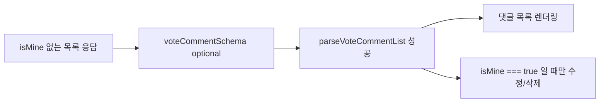

# 이력서·포트폴리오 기록

## 사례 1 — 미배포 소유권 필드로 인한 댓글 목록 파싱 실패 완화

- 작업 유형: 버그 수정 | 기획 변경
- 관련 도메인/서비스: 시민참여 투표 댓글 목록
- 문제 출처: 사용자 요구 | 테스트·런타임 실패

### 문제 상황

- 사용자가 제시한 요구·문제·변경 이유: 실제 댓글 목록 API에 `isMine`이 아직 없는데 클라이언트가 필수로 검사해 댓글이 화면에 렌더링되지 않았다. 필드는 곧 필수가 될 예정이지만 지금은 백엔드 추가가 보류다.
- 테스트·런타임에서 관찰한 오류: 개발 콘솔 `[api-failure]`가 `kind: "client-contract"`, `reason: "zod"`, `expected: "boolean"` 이슈 2개를 남겼다. 항목 2개의 필수 `isMine` 누락과 일치한다.
- 필요한 기술·구조·패턴이 없을 때 발생할 문제: 목록 전체를 한 번에 parse하면 신규 필드 하나가 없어도 query가 error가 되어 댓글 UI가 통째로 사라진다.

### 고민과 선택

- 사용자 제안: `isMine` Zod 검사를 optional로 두고 연관 코드를 수정한다. 백엔드 필드 추가는 보류다.
- 에이전트 제안: 스키마만 완화하고, hook은 `isMine === true` 비교를 유지하며 진단 로그 마스킹은 별도 작업으로 둔다.
- 검토한 대안: 스키마를 필수로 유지하고 백엔드를 기다림, `default(false)`로 채움, parser/hook/UI까지 소유권 우회 구현.
- 최종 선택: `voteCommentSchema.isMine`을 `z.boolean().optional()`로 두고, 거절 테스트를 성공 계약으로 바꿨다.
- 선택 이유와 제외한 방식의 이유: 사용자는 목록이 보여야 한다고 명시했다. `false` 기본값은 서버가 소유권을 모른다는 사실과 섞인다. hook을 바꾸면 필드 없는 댓글의 수정/삭제가 열릴 수 있다.

### 적용

- 변경 경로: `src/features/citizen-participation/api/vote/vote.dto.ts`, `src/features/citizen-participation/api/http/voteComments.api.test.ts`
- 구현·수정·리팩터링 내용: 필수 boolean을 optional로 완화하고, `isMine` 없는 목록이 문자열 `id`와 페이지 필드로 정규화되는지 `toEqual`로 고정했다.
- 핵심 동작: `parseVoteCommentList`가 현재 백엔드 응답을 통과한다. `isMine`이 없으면 목록은 그리고 수정/삭제는 열리지 않는다.

### 사용 기술과 구체적 목적

| 기술·구조·패턴 | 해결하려는 구체적 문제 | 적용 위치와 방식 |
| --- | --- | --- |
| Zod optional 응답 계약 | 미배포 필드 때문에 목록 전체가 실패하지 않게 함 | `voteCommentSchema.isMine` |
| Parser 경계 유지 | UI/hook에 임시 우회 로직을 넣지 않음 | 기존 `parseVoteCommentList`가 optional 값을 그대로 전달 |
| Vitest 계약 테스트 | `isMine` 부재가 다시 거절로 되돌아가지 않게 고정 | `voteComments.api.test.ts` 성공 단언 |

### 결과

- 적용 전: `isMine` 없는 목록 응답이 ZodError로 query를 실패시켜 댓글이 렌더링되지 않았다.
- 적용 후: 같은 응답이 parse되고, 소유권 필드는 있을 때만 수정/삭제 대상이 된다.
- 검증 결과: 대상 테스트 11개, governance 20개, lint, `tsc -b`/Vite build, `git diff --check` 통과. Watcher PASS. 전체 스위트 6실패는 vote ballot·결과 라우트이며 이번 diff 밖이다.
- 사용자 후속 피드백: 없음
- 추가 요청 및 남은 제한: 백엔드 `isMine` 배포 후 필수 전환, 진단 로그 필드명 노출, 브라우저 실화면 확인은 남아 있다.

### 이력서·포트폴리오 문구

- 이력서 bullet: 백엔드 미배포 필드 `isMine` 때문에 투표 댓글 목록 전체가 Zod 파싱 실패하던 계약을 optional로 완화하고, Vitest 계약 테스트와 `tsc`/lint로 목록 복원을 검증했다.
- 포트폴리오 서술: 신규 소유권 필드를 클라이언트에서 필수로 고정한 뒤 백엔드 배포가 미뤄지자 댓글 UI가 사라졌다. 목록 파싱과 소유권 동작을 분리해 응답 부재는 optional로 통과시키고, `isMine === true`일 때만 수정/삭제를 열어 임시 우회 UI 없이 장애를 막았다.
