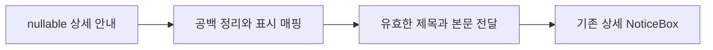
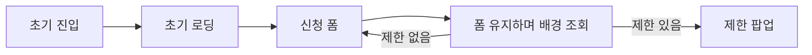

# 이력서·포트폴리오 기록

## 사례 1 — 예약 반려 사유의 데이터·화면 연결

- 작업 유형: 버그 수정
- 관련 도메인/서비스: 회의 예약 상세
- 문제 출처: 인계 검토 결과와 현재 회귀 테스트 실패

### 문제 상황

- 사용자가 제시한 요구·문제·변경 이유: 인계 문서의 Logic 후속 조치를 수행하도록 요청했다.
- 테스트·런타임에서 관찰한 오류: 반려 배지는 있으나 상세 안내가 없고, 추가 안내 필드는 기존 strict DTO에서 거부됐다.
- 필요한 기술·구조·패턴이 없을 때 발생할 문제: UI props만으로는 예약별 사유 데이터를 전달할 수 없다.

### 고민과 선택

- 사용자 제안: 지정 handoff의 작업 수행.
- 에이전트 제안: nullable DTO와 parser·MSW·기존 UI props 연결.
- 검토한 대안: 고정 클라이언트 문구 또는 UI 구조 변경.
- 최종 선택: DTO·표시 매핑·호출부 연결.
- 선택 이유와 제외한 방식의 이유: 예약별 사유를 표현하고 기존 controlled UI를 재사용할 수 있다. 새 UI는 필요하지 않았다.

### 적용

- 변경 경로: `api/meetingReservationRead.dto.ts`, `.parser.ts`, `mocks/fixtures.ts`, `mocks/handlers.ts`, `pages/meeting-reservation/ui/MeetingReservationRoutes.tsx`와 테스트.
- 구현·수정·리팩터링 내용: nullable 제목·본문을 정의하고 공백·null을 정리한 표시 값으로 매핑한다.
- 핵심 동작: 제목과 본문이 모두 유효할 때만 반려 사유 안내를 표시한다.

### 사용 기술과 구체적 목적

| 기술·구조·패턴 | 해결하려는 구체적 문제 | 적용 위치와 방식 |
| --- | --- | --- |
| Zod·TypeScript | 추정 응답 경계와 빈 값 의미를 명시 | nullable 상세 DTO와 신규 생성 기본값 |
| parser·controlled props | 서버 필드명과 화면 표시 계약 연결 | noticeMessage → noticeDescription |
| MSW·Vitest | 실제 HTTP부터 렌더까지 누락 검증 | 반려 상세·빈 값 경계 테스트 |

### 결과

- 적용 전: 반려 사유 데이터와 화면 연결 누락.
- 적용 후: 반려 안내 표시, 불완전·빈 안내 상자 생략.
- 검증 결과: 관련 수정 전 실패를 확인했다. 세 수정 통합 후 예약 테스트 81개·lint·build 통과.
- 사용자 후속 피드백: 없음.
- 추가 요청 및 남은 제한: 서버 계약 미확정으로 추후 실제 명세 대조 필요.

### 이력서·포트폴리오 문구

- 이력서 bullet: 예약 상세 DTO·parser·MSW와 controlled UI를 연결해 반려 사유 누락을 수정하고 빈 값 경계까지 검증했다.
- 포트폴리오 서술: 반려 상태만 표시되던 경로에서 응답 필드와 UI props의 누락을 확인했다. nullable 계약과 표시 매핑을 추가해 기존 UI를 재사용했고 HTTP·라우트 테스트로 실제 사유 전달을 확인했다.

## 사례 2 — 배경 조회 중 예약 폼 입력 보존

- 작업 유형: 버그 수정
- 관련 도메인/서비스: 회의 예약 신청 폼
- 문제 출처: 인계 검토 결과와 input 소멸 회귀 테스트

### 문제 상황

- 사용자가 제시한 요구·문제·변경 이유: 인계의 폼 언마운트 결함 수정 계획을 승인했다.
- 테스트·런타임에서 관찰한 오류: 입력 후 제한 쿼리를 무효화하면 폼 input이 DOM에서 사라졌다.
- 필요한 기술·구조·패턴이 없을 때 발생할 문제: 서버 상태의 배경 조회가 폼 로컬 상태를 초기화한다.

### 고민과 선택

- 사용자 제안: 인계의 후속 수정 수행.
- 에이전트 제안: 초기 로딩 조건과 배경 갱신을 구분.
- 검토한 대안: 폼 상태를 별도 저장소로 옮기는 구조 변경.
- 최종 선택: 로딩 분기에 isPending만 사용.
- 선택 이유와 제외한 방식의 이유: 직접적인 언마운트 원인을 제거할 수 있어 상태 저장소 확대가 필요하지 않았다.

### 적용

- 변경 경로: `pages/meeting-reservation/ui/MeetingReserveRoute.tsx`, `MeetingReservationRoutes.test.tsx`.
- 구현·수정·리팩터링 내용: isFetching 조건을 제거하고 실제 제한 결과 분기는 유지한다.
- 핵심 동작: 조회 중 같은 input·값 유지, 제한 해제 결과 후 유지, 제한 결과 확정 시 팝업 전환.

### 사용 기술과 구체적 목적

| 기술·구조·패턴 | 해결하려는 구체적 문제 | 적용 위치와 방식 |
| --- | --- | --- |
| TanStack Query | 초기 조회와 배경 갱신의 구분 | isPending 로딩 분기 |
| React act·MSW | 입력 및 비동기 렌더의 관찰 | 실제 input 이벤트와 invalidation, 지연 응답 |

### 결과

- 적용 전: 배경 조회 중 폼 제거를 재현했다.
- 적용 후: 입력을 유지하고 제한 상태 전환도 반영한다.
- 검증 결과: false·true 제한 결과 테스트 및 통합 예약 테스트 81개·lint·build 통과.
- 사용자 후속 피드백: 없음.
- 추가 요청 및 남은 제한: 다른 화면의 동일 결함 여부는 조사하지 않았다.

### 이력서·포트폴리오 문구

- 이력서 bullet: 초기 로딩과 배경 조회를 구분해 예약 폼 입력 소멸을 수정하고 제한 상태 전환까지 회귀 테스트로 검증했다.
- 포트폴리오 서술: 쿼리 무효화 시 입력 필드가 사라지는 상황을 재현했다. 화면의 로딩 조건을 좁혀 로컬 상태를 유지하면서 최신 제한 결과를 반영하도록 수정했다.

## 사례 3 — 제한 팝업 닫기 목적지 확정

- 작업 유형: 기획 동작 확정·버그 수정
- 관련 도메인/서비스: 신규 예약 제한 안내
- 문제 출처: 인계 명세 불일치와 사용자 결정

### 문제 상황

- 사용자가 제시한 요구·문제·변경 이유: 팝업을 닫으면 `/meeting`으로 가도록 지정했다.
- 테스트·런타임에서 관찰한 오류: 기존 라우트는 `/meeting/reservations`로 이동했다.
- 필요한 기술·구조·패턴이 없을 때 발생할 문제: 미결정 UX를 임의로 구현하거나 사용자가 지정한 진입 지점과 다른 화면으로 이동한다.

### 고민과 선택

- 사용자 제안: `/meeting` 이동.
- 에이전트 제안: 인계의 로비 복귀 권장안을 설명하고 목적지를 질문했다.
- 검토한 대안: 문서에 남아 있던 예약 목록 이동 유지.
- 최종 선택: 사용자 지정 목적지.
- 선택 이유와 제외한 방식의 이유: 사용자 확정에 따르며 목록 이동 기대값은 더 이상 맞지 않는다.

### 적용

- 변경 경로: `pages/meeting-reservation/ui/MeetingReserveRoute.tsx`, `MeetingReservationRoutes.test.tsx`.
- 구현·수정·리팩터링 내용: close callback의 목적지와 memory router 기대값을 변경했다.
- 핵심 동작: 제한 팝업 닫기 후 로비 이동, 예약 재진입 시 제한 상태 재검사.

### 사용 기술과 구체적 목적

| 기술·구조·패턴 | 해결하려는 구체적 문제 | 적용 위치와 방식 |
| --- | --- | --- |
| React Router | 사용자 지정 목적지로 이동 | close callback의 navigate |
| memory router·MSW | 이동과 재진입 데이터 조회의 검증 | 로비 route와 제한 상태 변경 테스트 |

### 결과

- 적용 전: 예약 목록으로 이동.
- 적용 후: `/meeting` 이동 및 기존 재진입 검사 유지.
- 검증 결과: 수정 전 목적지 불일치 실패 확인. 수정 후 통합 예약 테스트 81개·lint·build 통과.
- 사용자 후속 피드백: 없음.
- 추가 요청 및 남은 제한: 부모 브랜치 통합은 별도 담당자와 승인 절차로 진행한다.

### 이력서·포트폴리오 문구

- 이력서 bullet: 인계에 남은 라우팅 결정을 사용자와 확정하고 예약 제한 팝업의 로비 복귀 및 재진입 검사를 검증했다.
- 포트폴리오 서술: 닫기 목적지의 명세 불일치를 확인하고 사용자 결정을 받은 후 라우트 연결을 수정했다. 기존 제한 재검사 테스트를 유지하면서 실제 이동 목적지를 검증했다.
